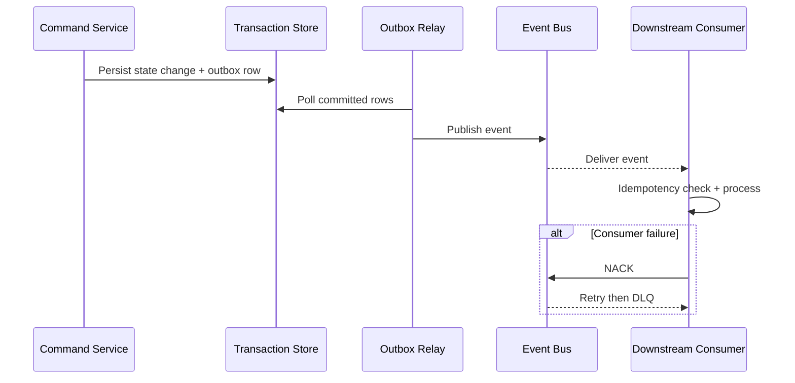
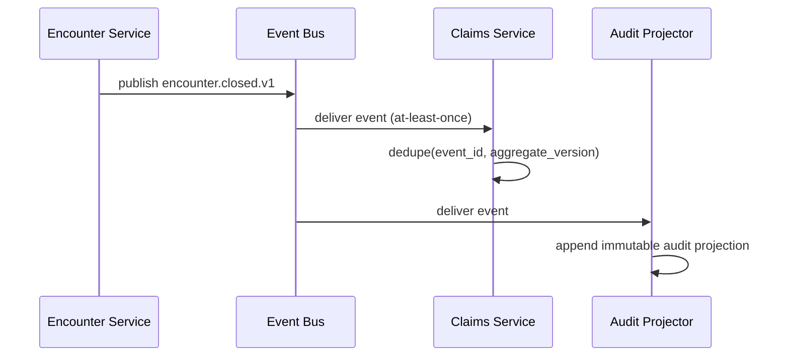
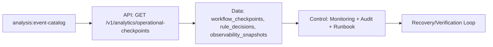

# Event Catalog

This catalog defines stable event contracts for **Hospital Information System** to support event-driven integrations, auditability, and analytics across hospital information workflows.

## Contract Conventions
- Event naming: `<domain>.<aggregate>.<action>.v1`.
- Required metadata: `event_id`, `occurred_at`, `correlation_id`, `producer`, `schema_version`, `tenant_context`.
- Delivery mode: at-least-once with mandatory consumer idempotency.
- Ordering guarantee: per aggregate key; no global ordering assumption.

## Domain Events
| Event Name | Payload Highlights | Typical Consumers |
|---|---|---|
| `domain.record.created.v1` | record_id, actor_id, initial_state, occurred_at | orchestration, analytics |
| `domain.record.state_changed.v1` | record_id, old_state, new_state, reason_code | notifications, reporting |
| `domain.record.validation_failed.v1` | record_id, violated_rules, correlation_id | operations, quality dashboards |
| `domain.record.override_applied.v1` | record_id, override_type, approver_id, expires_at | compliance, audit |
| `domain.record.closed.v1` | record_id, terminal_state, closed_at | billing/settlement, archives |

## Publish and Consumption Sequence

## Operational SLOs
- P95 commit-to-publish latency below 5 seconds for tier-1 events.
- DLQ triage acknowledgement within 15 minutes for production incidents.
- Schema changes remain backward compatible within the same major version.

---

## Implementation-Ready Eventing Guidance
### Versioning and Compatibility
- Producers may add optional fields only; removing or changing semantics requires major event version bump.
- Consumers must tolerate unknown fields and process by schema version contract.
- Correlation metadata is mandatory in headers and payload envelope for replay investigations.

### Event Contract Example

### Replay Controls
- Replay starts from signed checkpoint offsets with operator + approver identity.
- During replay windows, side-effecting consumers run in dry-run unless explicitly promoted.
- Post-replay reconciliation report is mandatory for incident closure.

## File-Specific Implementation Boundaries
This artifact is implementation-focused on **event contracts, versioning guarantees, and replay safety controls**. The boundaries below are specific to `analysis/event-catalog.md` and are intentionally not reused as generic filler text.

| Boundary Slice | In Scope for this File | Out of Scope for this File | Implementation Consequence |
|---|---|---|---|
| Intake & Identity Analysis | Entry validation checkpoints and mismatch heuristics | UI widget design details | Data-quality metrics and EMPI false-positive rate |
| Clinical Flow Analysis | Encounter/order sequence timing and critical path dependencies | Persistence implementation details | Throughput, wait-time, and bottleneck reporting |
| Governance Analysis | Rule conformance and audit evidence completeness | Runtime policy engine internals | Compliance scorecards and control effectiveness trends |

## Business Rules to API/Data/Operational Controls (File-Specific)
| Rule Focus | API Enforcement Touchpoint | Data Model/Contract Tie-In | Operational Control |
|---|---|---|---|
| Preconditions for `event-catalog` workflows must be validated before state mutation. | `GET /v1/analytics/operational-checkpoints` with explicit error taxonomy and correlation IDs. | `workflow_checkpoints, rule_decisions, observability_snapshots` with strict timestamp, actor, and tenant context fields. | Alert on rule-violation rate and route to owner with SLA-backed response. |
| Mutations must be replay-safe and duplicate-proof. | Idempotency checks on mutation endpoints and async consumers. | Uniqueness keys + immutable evidence rows for side-effect tracking. | Replay runbook with pre/post reconciliation and sign-off checklist. |
| Access to sensitive operations must include least-privilege and evidence. | AuthN/AuthZ middleware + policy decision point reason codes. | Audit/event envelopes include policy version and decision outcome. | Quarterly control review and continuous SIEM correlation for anomalies. |

## Interoperability Assumptions for `event-catalog.md`
- Contract versions are explicitly pinned; backward compatibility is managed per versioned API/event schema.
- External dependencies are treated as failure-prone; timeout/retry budgets and fallback states are documented in this file's scenarios.
- Observability correlation (`tenant_id`, `actor_id`, `correlation_id`) is required for all critical-path operations in this document scope.

### Interoperability and Control Flow

## Compliance and Security Posture for this Artifact
- Evidence produced by this workflow/design artifact is audit-consumable (who/what/when/why) and linked to incident/postmortem records.
- Sensitive data exposure is minimized using role-scoped access and redaction guidance relevant to `event-catalog.md`.
- Operational controls for this file include detection, containment, recovery, and verification steps with named ownership.
