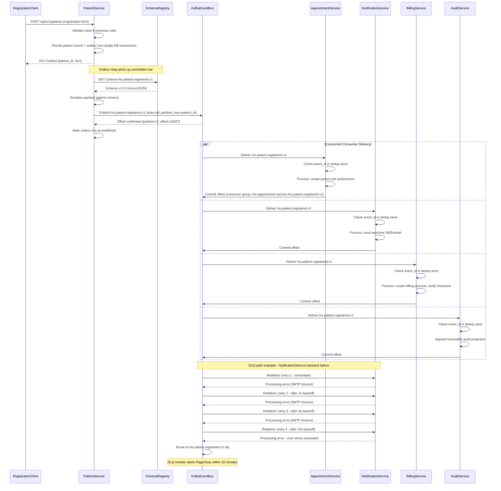

# Event Catalog — Hospital Information System

**Version:** 1.0  
**Status:** Approved  
**Date:** 2025-07-14  
**Owner:** Platform Engineering & Integration Team

---

## Table of Contents

1. [Overview](#1-overview)
2. [Contract Conventions](#contract-conventions)
   - 2.1 [Event Naming Pattern](#21-event-naming-pattern)
   - 2.2 [Required Envelope Fields](#22-required-envelope-fields)
   - 2.3 [Delivery Guarantees](#23-delivery-guarantees)
   - 2.4 [Consumer Groups and Offset Management](#24-consumer-groups-and-offset-management)
   - 2.5 [Schema Registry](#25-schema-registry)
   - 2.6 [Dead Letter Queue Policy](#26-dead-letter-queue-policy)
3. [Domain Events](#domain-events)
   - 3.1 [Event Master Table](#31-event-master-table)
   - 3.2 [Detailed Event Schemas](#32-detailed-event-schemas)
4. [Publish and Consumption Sequence](#publish-and-consumption-sequence)
5. [Operational SLOs](#operational-slos)
6. [Replay and Recovery Procedures](#6-replay-and-recovery-procedures)
7. [Schema Versioning Strategy](#7-schema-versioning-strategy)

---

## 1. Overview

The Hospital Information System (HIS) adopts an **event-driven architecture (EDA)** as the primary integration pattern across all clinical, administrative, and financial microservices. Rather than relying on synchronous HTTP calls between bounded contexts — which introduces tight coupling, availability dependencies, and cascading failures — the HIS emits domain events whenever significant state transitions occur. These events serve as the authoritative record of what happened, when it happened, and who caused it. Downstream services subscribe to the events they need, process them independently, and maintain their own read models, enabling each service to evolve and scale without coordination ceremonies.

**Apache Kafka** serves as the event backbone. Kafka's durable, partitioned, replicated log provides the durability guarantees required for healthcare workloads: events are retained for a configurable period (minimum 90 days for operational needs, 7 years for HIPAA audit requirements on clinical events, and 7 years for billing events to satisfy CMS regulations), consumers can replay from any offset, and throughput scales horizontally across broker clusters. All events conform to the **CloudEvents 1.0 specification** envelope, extended with HIS-specific metadata fields (correlation chain, actor context, tenant isolation) to support distributed tracing, HIPAA audit trails, and multi-facility deployments.

**Event sourcing** is applied to selected aggregates — Patient, AdmissionRecord, Claim — where a complete reconstruction of state from the ordered event log is both required for regulatory compliance and operationally valuable for debugging. For these aggregates, the event store is the system of record; projections (read models) are derived views. For less critical aggregates, events serve as notifications of state changes persisted in authoritative relational stores. All events, regardless of sourcing strategy, are treated as immutable facts once published; corrections are expressed as new compensating events, never as log mutations.

---

## Contract Conventions

### 2.1 Event Naming Pattern

All events follow the naming convention:

```
his.{domain}.{aggregate}.{action}.v{n}
```

| Segment | Description | Example |
|---|---|---|
| `his` | System namespace prefix, always literal | `his` |
| `{domain}` | Bounded context / service domain | `patient`, `pharmacy`, `billing` |
| `{aggregate}` | Root aggregate entity name (snake_case) | `patient`, `medication_order`, `claim` |
| `{action}` | Past-tense verb describing what happened | `registered`, `discharged`, `approved` |
| `v{n}` | Integer major version (bumped on breaking change) | `v1`, `v2` |

**Examples:**

```
his.patient.patient.registered.v1
his.appointment.appointment.scheduled.v1
his.admission.admission_record.patient_admitted.v1
his.pharmacy.medication_order.medication_administered.v1
his.lab.lab_result.critical_value_alerted.v1
his.billing.claim.claim_submitted.v1
```

> **Kafka Topic Mapping:** Each event maps to a dedicated Kafka topic named identically to the event name, e.g., `his.patient.patient.registered.v1`. This one-event-per-topic model enables independent retention policies, ACL management, and consumer group isolation per event type.

---

### 2.2 Required Envelope Fields

Every event published to the HIS event bus MUST include the following envelope fields at the top level, before the `payload` object:

| Field | Type | Required | Description |
|---|---|---|---|
| event_id | UUID v4 | Yes | Globally unique event identifier |
| occurred_at | TIMESTAMPTZ | Yes | ISO 8601 UTC timestamp when event occurred |
| correlation_id | UUID v4 | Yes | Traces a business transaction across services |
| causation_id | UUID v4 | Yes | ID of the event or command that caused this event |
| producer | string | Yes | Fully-qualified service name (e.g., his-patient-service) |
| schema_version | string | Yes | Semantic version of the event schema (e.g., "1.0.0") |
| aggregate_id | UUID | Yes | ID of the root aggregate entity |
| aggregate_type | string | Yes | Type of aggregate (e.g., "Patient", "Appointment") |
| actor_id | UUID | Yes | ID of the user or system actor that triggered the event |
| actor_role | string | Yes | Role of the actor (e.g., "physician", "system") |
| environment | string | Yes | Deployment environment (production/staging/dev) |
| tenant_id | UUID | No | Hospital/facility identifier for multi-tenant deployments |

> **PHI / PII Notice:** The envelope MUST NOT contain Protected Health Information (PHI) or Personally Identifiable Information (PII) directly. All PHI/PII lives exclusively inside the `payload` object, which is encrypted at rest using field-level encryption before publishing, and decrypted only by authorized consumers with appropriate key access.

---

### 2.3 Delivery Guarantees

**At-Least-Once Delivery:** The HIS event bus guarantees at-least-once delivery for all published events. Producers use Kafka's `acks=all` configuration combined with synchronous confirmation from the in-sync replica set before acknowledging publication to the calling service. Consumers MUST be idempotent.

**Idempotency via `event_id` Deduplication:** Each consumer maintains a deduplication store (Redis sorted set with TTL of 48 hours) keyed on `event_id`. Before processing any event, the consumer checks whether this `event_id` has already been processed. If found, the event is acknowledged and discarded without side effects. This guards against both Kafka at-least-once redelivery and replay-driven reprocessing.

**Ordering Guarantee:** Events are ordered **per aggregate** within a Kafka partition. The Kafka partition key is set to `aggregate_id`. This ensures all events for a given patient, appointment, or claim are processed in order by any single consumer instance. There is no global ordering guarantee across different aggregates. Consumers requiring cross-aggregate ordering must implement logical clocks or version-vector comparisons.

**Transactional Outbox Pattern:** Producers use the transactional outbox pattern — the state mutation and the outbox record are written in the same ACID database transaction. A Debezium CDC connector streams outbox records to Kafka, ensuring no event is lost if the producing service crashes after committing state but before publishing.

---

### 2.4 Consumer Groups and Offset Management

- Each consuming service creates a **dedicated consumer group** per event type it subscribes to, named `{service-name}.{event-name}` (e.g., `his-billing-service.his.patient.patient.registered.v1`).
- Consumer group offsets are committed **after successful processing** (manual commit), not on receipt. This prevents data loss if the consumer crashes mid-processing.
- Consumer groups MUST NOT be shared between logically independent processing pipelines within the same service. Use separate consumer groups for independent concerns (e.g., billing calculation vs. audit logging) to allow independent lag monitoring and replay.
- **Lag Monitoring:** Kafka consumer group lag is scraped by Prometheus via the `kafka-consumer-lag-exporter`. Alert thresholds: **>1,000 messages = WARNING**, **>5,000 messages = CRITICAL**. On-call engineers are paged for CRITICAL lag on any CRITICAL or HIGH priority event topic.
- **Offset Reset Policy:** Manual consumer group offset resets require approval from two on-call engineers and are performed via the `his-kafka-admin` CLI tool with a mandatory reason code and ticket reference. Resets are logged to the `his.platform.ops.offset_reset.v1` audit event.

---

### 2.5 Schema Registry

All event schemas are registered in **Confluent Schema Registry** using either **Apache Avro** (preferred for high-throughput clinical events) or **JSON Schema** (used for integration events consumed by external systems).

- **Subject naming:** `{topic-name}-value` (e.g., `his.pharmacy.medication_order.medication_administered.v1-value`).
- **Compatibility mode:** `BACKWARD` is required for all subjects. A new schema version must be readable by consumers using the previous schema version. New fields must always have defaults; no field may be removed or have its type changed in a backward-incompatible way.
- **Schema promotion:** Schemas are promoted through environments (`dev -> staging -> production`) by the Platform Engineering team. Promotion requires passing automated compatibility checks and a sign-off from the owning service team.
- **Producer enforcement:** All producers use the Confluent Kafka client with `auto.register.schemas=false`. Schemas must be pre-registered by the owning team; producers cannot self-register in staging or production. This prevents accidental schema mutations.

---

### 2.6 Dead Letter Queue Policy

Events that fail processing after exhausting all retry attempts are routed to a **Dead Letter Queue (DLQ)** topic named `{original-topic}.dlq` (e.g., `his.patient.patient.registered.v1.dlq`).

**Retry Policy:**

| Attempt | Delay Before Retry | Action on Failure |
|---|---|---|
| 1st attempt | — (immediate) | Retry |
| 2nd attempt | 1 second (exponential backoff) | Retry |
| 3rd attempt | 4 seconds (exponential backoff) | Retry |
| 4th attempt | 16 seconds (exponential backoff) | Route to DLQ |

- After 3 retry attempts with exponential backoff (1s, 4s, 16s), the event is published to the DLQ with an enriched envelope including `dlq_reason`, `failed_consumer_group`, `last_error_message`, `last_error_timestamp`, and `retry_count`.
- **DLQ Monitoring:** A dedicated DLQ monitor service alerts PagerDuty on any message arrival in a CRITICAL-priority event DLQ within 2 minutes. HIGH-priority DLQ messages trigger alerts within 15 minutes.
- **DLQ Reprocessing:** Engineers investigate the root cause before reprocessing. Reprocessing is performed via `his-dlq-replayer` CLI with explicit `--dry-run` validation first. See [Section 6](#6-replay-and-recovery-procedures) for the full runbook.

---

## Domain Events

### 3.1 Event Master Table

The following table enumerates all 26 domain events in the HIS event catalog. Events marked **CRITICAL** must meet the strictest SLO targets and trigger immediate alerting if delivery is delayed or DLQ'd.

| Event Name | Domain | Aggregate | Trigger | Key Payload Fields | Typical Consumers | Priority |
|---|---|---|---|---|---|---|
| his.patient.registered.v1 | Patient | Patient | New patient registration completed | patient_id, mrn, national_id, full_name, date_of_birth, gender, registration_facility_id | AppointmentService, BillingService, NotificationService, AuditService | HIGH |
| his.patient.demographics_updated.v1 | Patient | Patient | Patient demographic data changed | patient_id, mrn, changed_fields[], previous_values{}, new_values{} | AppointmentService, InsuranceService, NotificationService, AuditService | MEDIUM |
| his.patient.merged.v1 | Patient | Patient | Duplicate patient records merged | surviving_patient_id, merged_patient_id, merge_reason, merged_by | AllServices (broadcast), AuditService | HIGH |
| his.appointment.scheduled.v1 | Scheduling | Appointment | New appointment booked | appointment_id, patient_id, doctor_id, department_id, scheduled_datetime, appointment_type, duration_minutes | NotificationService, ReminderService, BillingService, AuditService | HIGH |
| his.appointment.confirmed.v1 | Scheduling | Appointment | Appointment confirmed by patient or staff | appointment_id, patient_id, confirmed_by, confirmation_method | NotificationService, BillingService | MEDIUM |
| his.appointment.cancelled.v1 | Scheduling | Appointment | Appointment cancelled | appointment_id, patient_id, doctor_id, cancellation_reason, cancelled_by, notice_hours | NotificationService, BillingService, SchedulingService, AuditService | HIGH |
| his.appointment.no_show.v1 | Scheduling | Appointment | Patient did not attend appointment | appointment_id, patient_id, doctor_id, scheduled_datetime | NotificationService, BillingService, CareManagementService | MEDIUM |
| his.admission.patient_admitted.v1 | Admission | AdmissionRecord | Patient admitted to hospital | admission_id, patient_id, encounter_id, admission_type, ward_id, bed_id, admitting_physician_id, primary_diagnosis_code | BedManagementService, NotificationService, BillingService, PharmacyService, AuditService | CRITICAL |
| his.admission.bed_assigned.v1 | Admission | AdmissionRecord | Bed assigned to patient | admission_id, patient_id, ward_id, bed_id, bed_type, assigned_by | BedManagementService, HousekeepingService, NotificationService | HIGH |
| his.admission.patient_transferred.v1 | Admission | AdmissionRecord | Patient transferred between wards | admission_id, patient_id, from_ward_id, from_bed_id, to_ward_id, to_bed_id, transfer_reason, transferred_by | BedManagementService, NotificationService, NursingService, AuditService | HIGH |
| his.clinical.note_created.v1 | Clinical | ClinicalNote | Clinical note created (draft) | note_id, encounter_id, patient_id, author_id, note_type, created_at | AuditService, ComplianceService | MEDIUM |
| his.clinical.note_signed.v1 | Clinical | ClinicalNote | Clinical note signed by author | note_id, encounter_id, patient_id, author_id, signed_at, note_type, requires_cosign | NotificationService (if cosign needed), AuditService, ComplianceService | HIGH |
| his.clinical.vital_signs_recorded.v1 | Clinical | VitalSigns | Vital signs entered for patient | vital_id, encounter_id, patient_id, recorded_by, systolic_bp, diastolic_bp, heart_rate, spo2, temperature, pain_score | AlertService (for abnormal values), NursingService, AuditService | HIGH |
| his.pharmacy.prescription_created.v1 | Pharmacy | Prescription | New prescription created by physician | prescription_id, encounter_id, patient_id, prescriber_id, medication_items[], controlled_substances_flag | PharmacyService, DrugInteractionService, NotificationService, AuditService | HIGH |
| his.pharmacy.medication_administered.v1 | Pharmacy | MedicationOrder | Medication administered to patient | order_id, patient_id, encounter_id, drug_id, drug_name, dose, route, administered_by, administered_at, bar_code_verified | ClinicalService, AuditService, BillingService | CRITICAL |
| his.pharmacy.allergy_alert_triggered.v1 | Pharmacy | MedicationOrder | Allergy conflict detected during medication order | alert_id, patient_id, drug_id, allergen_name, severity, cross_reactivity_flag, triggered_by_order_id | PharmacyService, NotificationService, ClinicalService, AuditService | CRITICAL |
| his.lab.order_created.v1 | Laboratory | LabOrder | Laboratory test ordered | lab_order_id, encounter_id, patient_id, ordering_physician_id, loinc_code, test_name, priority, specimen_type | LaboratoryService, NotificationService, AuditService | HIGH |
| his.lab.result_ready.v1 | Laboratory | LabResult | Lab result finalized and available | result_id, lab_order_id, patient_id, loinc_code, test_name, result_value, result_unit, abnormal_flag, reference_range, verified_by | ClinicalService, NotificationService, BillingService, AuditService | HIGH |
| his.lab.critical_value_alerted.v1 | Laboratory | LabResult | Critical lab value detected | result_id, patient_id, lab_order_id, ordering_physician_id, test_name, critical_value, critical_threshold, notification_deadline | NotificationService (URGENT), ClinicalService, AuditService, ComplianceService | CRITICAL |
| his.radiology.order_created.v1 | Radiology | RadiologyOrder | Radiology study ordered | radiology_order_id, encounter_id, patient_id, ordering_physician_id, modality, body_part, cpt_code, contrast_required, clinical_indication, priority | RadiologyService, SchedulingService, AuditService | HIGH |
| his.radiology.report_verified.v1 | Radiology | RadiologyOrder | Radiologist verifies and signs report | radiology_order_id, patient_id, report_id, radiologist_id, modality, findings_summary, critical_finding_flag, verified_at | ClinicalService, NotificationService, BillingService, AuditService | HIGH |
| his.discharge.patient_discharged.v1 | Discharge | AdmissionRecord | Patient formally discharged | admission_id, patient_id, encounter_id, discharge_date, discharge_type[home/AMA/transferred/expired], discharge_diagnosis_codes[], discharge_summary_id, bed_id | BedManagementService, BillingService, PharmacyService, FollowUpService, AuditService | CRITICAL |
| his.billing.claim_submitted.v1 | Billing | Claim | Insurance claim submitted to payer | claim_id, encounter_id, patient_id, insurance_policy_id, claim_number, claim_type, total_billed, cpt_codes[], icd10_codes[], submitted_at | InsuranceService, AuditService, FinanceService | HIGH |
| his.billing.claim_approved.v1 | Billing | Claim | Insurance claim approved by payer | claim_id, patient_id, claim_number, total_allowed, total_paid, patient_responsibility, eob_date, payer_reference_number | BillingService, NotificationService, FinanceService, AuditService | HIGH |
| his.billing.claim_rejected.v1 | Billing | Claim | Insurance claim rejected by payer | claim_id, patient_id, claim_number, rejection_code, rejection_reason, appeal_deadline | BillingService, NotificationService, FinanceService, AuditService | HIGH |
| his.billing.payment_received.v1 | Billing | Claim | Payment received and posted | payment_id, claim_id, patient_id, payment_amount, payment_date, payment_method, payer_id, check_number | FinanceService, BillingService, NotificationService, AuditService | HIGH |

---

### 3.2 Detailed Event Schemas

#### Event: `his.patient.registered.v1`

**Topic:** `his.patient.registered.v1`  
**Partition Key:** `aggregate_id` (patient UUID)  
**Kafka Retention:** 7 years (HIPAA)

```json
{
  "event_id": "a3f7c821-4e2b-4f3d-9c1a-8b2d6f4e7a03",
  "occurred_at": "2025-07-14T09:23:45.123Z",
  "correlation_id": "c9d2e814-7a3f-4b8c-a1d2-3e4f5a6b7c8d",
  "causation_id": "cmd-reg-88f2a441-1b3c-4d5e-a6f7-8b9c0d1e2f3a",
  "producer": "his-patient-service",
  "schema_version": "1.0.0",
  "aggregate_id": "b5f1d2c3-e4a5-6b7c-8d9e-0f1a2b3c4d5e",
  "aggregate_type": "Patient",
  "actor_id": "usr-4e5f6a7b-8c9d-0e1f-2a3b-4c5d6e7f8a9b",
  "actor_role": "registration_clerk",
  "environment": "production",
  "tenant_id": "fac-1a2b3c4d-5e6f-7a8b-9c0d-1e2f3a4b5c6d",
  "payload": {
    "patient_id": "b5f1d2c3-e4a5-6b7c-8d9e-0f1a2b3c4d5e",
    "mrn": "MRN-2025-00847",
    "national_id_type": "SSN",
    "national_id_hash": "e3b0c44298fc1c149afbf4c8996fb92427ae41e4649b934ca495991b7852b855",
    "last_name": "Thompson",
    "first_name": "Margaret",
    "middle_name": "Anne",
    "date_of_birth": "1968-03-22",
    "gender": "female",
    "blood_type": "A+",
    "preferred_language": "en-US",
    "registration_facility_id": "fac-1a2b3c4d-5e6f-7a8b-9c0d-1e2f3a4b5c6d",
    "address": {
      "street": "[REDACTED]",
      "city": "Boston",
      "state": "MA",
      "postal_code": "02101",
      "country": "US"
    },
    "contact": {
      "primary_phone_last4": "4782",
      "email_domain": "gmail.com"
    },
    "insurance_verified": true,
    "primary_insurance_id": "ins-9f8e7d6c-5b4a-3c2d-1e0f-a9b8c7d6e5f4",
    "consent_obtained": true,
    "consent_timestamp": "2025-07-14T09:22:11.000Z",
    "referring_physician_id": null,
    "advance_directive_on_file": false
  }
}
```

---

#### Event: `his.appointment.scheduled.v1`

**Topic:** `his.appointment.scheduled.v1`  
**Partition Key:** `aggregate_id` (appointment UUID)  
**Kafka Retention:** 2 years

```json
{
  "event_id": "f2e1d0c9-b8a7-4f6e-5d4c-3b2a1f0e9d8c",
  "occurred_at": "2025-07-14T10:05:33.456Z",
  "correlation_id": "c9d2e814-7a3f-4b8c-a1d2-3e4f5a6b7c8d",
  "causation_id": "cmd-sched-a1b2c3d4-e5f6-7a8b-9c0d-1e2f3a4b5c6d",
  "producer": "his-scheduling-service",
  "schema_version": "1.0.0",
  "aggregate_id": "appt-7c8d9e0f-1a2b-3c4d-5e6f-7a8b9c0d1e2f",
  "aggregate_type": "Appointment",
  "actor_id": "usr-4e5f6a7b-8c9d-0e1f-2a3b-4c5d6e7f8a9b",
  "actor_role": "scheduling_coordinator",
  "environment": "production",
  "tenant_id": "fac-1a2b3c4d-5e6f-7a8b-9c0d-1e2f3a4b5c6d",
  "payload": {
    "appointment_id": "appt-7c8d9e0f-1a2b-3c4d-5e6f-7a8b9c0d1e2f",
    "patient_id": "b5f1d2c3-e4a5-6b7c-8d9e-0f1a2b3c4d5e",
    "doctor_id": "dr-2a3b4c5d-6e7f-8a9b-0c1d-2e3f4a5b6c7d",
    "department_id": "dept-cardiology-01",
    "scheduled_datetime": "2025-07-21T14:30:00.000Z",
    "appointment_type": "follow_up",
    "duration_minutes": 30,
    "chief_complaint": "chest_pain_monitoring",
    "insurance_policy_id": "ins-9f8e7d6c-5b4a-3c2d-1e0f-a9b8c7d6e5f4",
    "authorization_number": "AUTH-20250714-88472",
    "location": {
      "facility_id": "fac-1a2b3c4d-5e6f-7a8b-9c0d-1e2f3a4b5c6d",
      "building": "Cardiology Center",
      "room": "CC-204"
    },
    "created_by": "usr-4e5f6a7b-8c9d-0e1f-2a3b-4c5d6e7f8a9b",
    "patient_instructions": "Please arrive 15 minutes early. Bring medication list.",
    "telehealth": false,
    "reminder_preferences": ["sms", "email"]
  }
}
```

---

#### Event: `his.admission.patient_admitted.v1`

**Topic:** `his.admission.patient_admitted.v1`  
**Partition Key:** `aggregate_id` (admission UUID)  
**Kafka Retention:** 7 years (HIPAA)

```json
{
  "event_id": "d4c3b2a1-0f9e-8d7c-6b5a-4e3f2d1c0b9a",
  "occurred_at": "2025-07-14T22:47:18.789Z",
  "correlation_id": "e5d4c3b2-a1f0-9e8d-7c6b-5a4e3f2d1c0b",
  "causation_id": "cmd-admit-b1c2d3e4-f5a6-b7c8-d9e0-f1a2b3c4d5e6",
  "producer": "his-admission-service",
  "schema_version": "1.0.0",
  "aggregate_id": "adm-3e4f5a6b-7c8d-9e0f-1a2b-3c4d5e6f7a8b",
  "aggregate_type": "AdmissionRecord",
  "actor_id": "usr-5f6a7b8c-9d0e-1f2a-3b4c-5d6e7f8a9b0c",
  "actor_role": "admitting_nurse",
  "environment": "production",
  "tenant_id": "fac-1a2b3c4d-5e6f-7a8b-9c0d-1e2f3a4b5c6d",
  "payload": {
    "admission_id": "adm-3e4f5a6b-7c8d-9e0f-1a2b-3c4d5e6f7a8b",
    "patient_id": "b5f1d2c3-e4a5-6b7c-8d9e-0f1a2b3c4d5e",
    "encounter_id": "enc-8a9b0c1d-2e3f-4a5b-6c7d-8e9f0a1b2c3d",
    "admission_type": "emergency",
    "admission_source": "emergency_department",
    "ward_id": "ward-icu-north-02",
    "bed_id": "bed-ICU-N-204B",
    "bed_type": "icu",
    "admitting_physician_id": "dr-2a3b4c5d-6e7f-8a9b-0c1d-2e3f4a5b6c7d",
    "attending_physician_id": "dr-9a0b1c2d-3e4f-5a6b-7c8d-9e0f1a2b3c4d",
    "primary_diagnosis_code": "I21.9",
    "primary_diagnosis_description": "Acute myocardial infarction, unspecified",
    "secondary_diagnoses": ["I10", "E11.65"],
    "insurance_policy_id": "ins-9f8e7d6c-5b4a-3c2d-1e0f-a9b8c7d6e5f4",
    "precertification_number": "PRECERT-2025-447821",
    "diet_order": "cardiac_diet",
    "fall_risk_level": "high",
    "isolation_precautions": null,
    "code_status": "full_code",
    "allergies_verified": true,
    "medication_reconciliation_complete": false,
    "estimated_los_days": 5
  }
}
```

---

#### Event: `his.pharmacy.medication_administered.v1`

**Topic:** `his.pharmacy.medication_administered.v1`  
**Partition Key:** `aggregate_id` (medication order UUID)  
**Kafka Retention:** 7 years (HIPAA / medication safety regulation)

```json
{
  "event_id": "c5b4a3f2-e1d0-9c8b-7a6f-5e4d3c2b1a0f",
  "occurred_at": "2025-07-14T23:15:04.321Z",
  "correlation_id": "b6c5d4e3-f2a1-0b9c-8d7e-6f5a4b3c2d1e",
  "causation_id": "cmd-admin-c3d4e5f6-a7b8-c9d0-e1f2-a3b4c5d6e7f8",
  "producer": "his-pharmacy-service",
  "schema_version": "1.0.0",
  "aggregate_id": "order-4d5e6f7a-8b9c-0d1e-2f3a-4b5c6d7e8f9a",
  "aggregate_type": "MedicationOrder",
  "actor_id": "usr-6a7b8c9d-0e1f-2a3b-4c5d-6e7f8a9b0c1d",
  "actor_role": "registered_nurse",
  "environment": "production",
  "tenant_id": "fac-1a2b3c4d-5e6f-7a8b-9c0d-1e2f3a4b5c6d",
  "payload": {
    "order_id": "order-4d5e6f7a-8b9c-0d1e-2f3a-4b5c6d7e8f9a",
    "patient_id": "b5f1d2c3-e4a5-6b7c-8d9e-0f1a2b3c4d5e",
    "encounter_id": "enc-8a9b0c1d-2e3f-4a5b-6c7d-8e9f0a1b2c3d",
    "admission_id": "adm-3e4f5a6b-7c8d-9e0f-1a2b-3c4d5e6f7a8b",
    "drug_id": "ndc-00069-0315-83",
    "drug_name": "Metoprolol Succinate",
    "generic_name": "metoprolol succinate",
    "drug_class": "beta_blocker",
    "dose": 50.0,
    "dose_unit": "mg",
    "route": "oral",
    "frequency": "once_daily",
    "administered_by": "usr-6a7b8c9d-0e1f-2a3b-4c5d-6e7f8a9b0c1d",
    "administered_at": "2025-07-14T23:14:50.000Z",
    "bar_code_verified": true,
    "scan_timestamp": "2025-07-14T23:14:47.000Z",
    "patient_wristband_scanned": true,
    "weight_based_dose_kg": null,
    "patient_weight_kg": 74.5,
    "controlled_substance": false,
    "schedule_dea": null,
    "witness_id": null,
    "lot_number": "LOT-2024-B44892",
    "expiry_date": "2026-03-31",
    "manufacturer": "AstraZeneca",
    "administration_site": null,
    "infusion_rate_ml_hr": null,
    "refused_by_patient": false,
    "hold_reason": null,
    "scheduled_time": "2025-07-14T23:00:00.000Z",
    "administered_on_time": true,
    "mar_id": "mar-5e6f7a8b-9c0d-1e2f-3a4b-5c6d7e8f9a0b"
  }
}
```

---

#### Event: `his.lab.critical_value_alerted.v1`

**Topic:** `his.lab.critical_value_alerted.v1`  
**Partition Key:** `aggregate_id` (lab result UUID)  
**Kafka Retention:** 7 years  
**SLA:** Notification to ordering physician within 30 minutes of event publication (JCAHO requirement)

```json
{
  "event_id": "e6f5a4b3-c2d1-0e9f-8a7b-6c5d4e3f2a1b",
  "occurred_at": "2025-07-14T23:52:11.654Z",
  "correlation_id": "a7b6c5d4-e3f2-1a0b-9c8d-7e6f5a4b3c2d",
  "causation_id": "evt-result-d4e5f6a7-b8c9-d0e1-f2a3-b4c5d6e7f8a9",
  "producer": "his-laboratory-service",
  "schema_version": "1.0.0",
  "aggregate_id": "result-5e6f7a8b-9c0d-1e2f-3a4b-5c6d7e8f9a0b",
  "aggregate_type": "LabResult",
  "actor_id": "sys-lab-auto-verifier",
  "actor_role": "system",
  "environment": "production",
  "tenant_id": "fac-1a2b3c4d-5e6f-7a8b-9c0d-1e2f3a4b5c6d",
  "payload": {
    "result_id": "result-5e6f7a8b-9c0d-1e2f-3a4b-5c6d7e8f9a0b",
    "patient_id": "b5f1d2c3-e4a5-6b7c-8d9e-0f1a2b3c4d5e",
    "encounter_id": "enc-8a9b0c1d-2e3f-4a5b-6c7d-8e9f0a1b2c3d",
    "lab_order_id": "order-6f7a8b9c-0d1e-2f3a-4b5c-6d7e8f9a0b1c",
    "ordering_physician_id": "dr-2a3b4c5d-6e7f-8a9b-0c1d-2e3f4a5b6c7d",
    "test_name": "Serum Potassium",
    "loinc_code": "2823-3",
    "critical_value": 2.9,
    "unit": "mEq/L",
    "critical_threshold_low": 3.0,
    "critical_threshold_high": 6.0,
    "normal_range_low": 3.5,
    "normal_range_high": 5.0,
    "notification_deadline": "2025-07-15T00:22:11.654Z",
    "patient_location": {
      "ward_id": "ward-icu-north-02",
      "bed_id": "bed-ICU-N-204B",
      "facility_id": "fac-1a2b3c4d-5e6f-7a8b-9c0d-1e2f3a4b5c6d"
    },
    "escalation_chain": [
      {
        "step": 1,
        "role": "ordering_physician",
        "contact_id": "dr-2a3b4c5d-6e7f-8a9b-0c1d-2e3f4a5b6c7d",
        "notify_by": "2025-07-15T00:07:11.654Z",
        "notify_via": ["pager", "phone"]
      },
      {
        "step": 2,
        "role": "charge_nurse",
        "contact_id": "usr-7b8c9d0e-1f2a-3b4c-5d6e-7f8a9b0c1d2e",
        "notify_by": "2025-07-15T00:12:11.654Z",
        "notify_via": ["phone"]
      },
      {
        "step": 3,
        "role": "department_head",
        "contact_id": "dr-3c4d5e6f-7a8b-9c0d-1e2f-3a4b5c6d7e8f",
        "notify_by": "2025-07-15T00:22:11.654Z",
        "notify_via": ["phone", "sms"]
      }
    ],
    "acknowledgement_required": true,
    "acknowledged_by": null,
    "acknowledged_at": null,
    "specimen_collected_at": "2025-07-14T22:30:00.000Z",
    "resulted_at": "2025-07-14T23:51:44.000Z"
  }
}
```

---

#### Event: `his.discharge.patient_discharged.v1`

**Topic:** `his.discharge.patient_discharged.v1`  
**Partition Key:** `aggregate_id` (admission UUID)  
**Kafka Retention:** 7 years (HIPAA)

```json
{
  "event_id": "f7a6b5c4-d3e2-1f0a-9b8c-7d6e5f4a3b2c",
  "occurred_at": "2025-07-19T11:30:22.000Z",
  "correlation_id": "b8c7d6e5-f4a3-2b1c-0d9e-8f7a6b5c4d3e",
  "causation_id": "cmd-discharge-e5f6a7b8-c9d0-e1f2-a3b4-c5d6e7f8a9b0",
  "producer": "his-discharge-service",
  "schema_version": "1.0.0",
  "aggregate_id": "adm-3e4f5a6b-7c8d-9e0f-1a2b-3c4d5e6f7a8b",
  "aggregate_type": "AdmissionRecord",
  "actor_id": "usr-5f6a7b8c-9d0e-1f2a-3b4c-5d6e7f8a9b0c",
  "actor_role": "attending_physician",
  "environment": "production",
  "tenant_id": "fac-1a2b3c4d-5e6f-7a8b-9c0d-1e2f3a4b5c6d",
  "payload": {
    "admission_id": "adm-3e4f5a6b-7c8d-9e0f-1a2b-3c4d5e6f7a8b",
    "patient_id": "b5f1d2c3-e4a5-6b7c-8d9e-0f1a2b3c4d5e",
    "encounter_id": "enc-8a9b0c1d-2e3f-4a5b-6c7d-8e9f0a1b2c3d",
    "discharge_date": "2025-07-19",
    "discharge_time": "2025-07-19T11:28:00.000Z",
    "discharge_type": "home",
    "discharge_disposition": "home_with_self_care",
    "discharge_diagnosis_codes": ["I21.9", "I10", "E11.65"],
    "discharge_diagnosis_descriptions": [
      "Acute myocardial infarction, unspecified",
      "Essential hypertension",
      "Type 2 diabetes mellitus with hyperglycemia"
    ],
    "discharge_summary_id": "note-7a8b9c0d-1e2f-3a4b-5c6d-7e8f9a0b1c2d",
    "discharge_summary_signed": true,
    "bed_id": "bed-ICU-N-204B",
    "ward_id": "ward-icu-north-02",
    "los_days": 5,
    "admitting_physician_id": "dr-2a3b4c5d-6e7f-8a9b-0c1d-2e3f4a5b6c7d",
    "attending_physician_id": "dr-9a0b1c2d-3e4f-5a6b-7c8d-9e0f1a2b3c4d",
    "discharge_medications_reconciled": true,
    "discharge_prescriptions": [
      "rx-1a2b3c4d-5e6f-7a8b-9c0d-1e2f3a4b5c6d",
      "rx-2b3c4d5e-6f7a-8b9c-0d1e-2f3a4b5c6d7e"
    ],
    "follow_up_appointments": [
      {
        "appointment_id": "appt-follow-3c4d5e6f-7a8b-9c0d-1e2f-3a4b5c6d7e8f",
        "specialty": "cardiology",
        "scheduled_date": "2025-07-26T14:00:00.000Z"
      }
    ],
    "patient_education_provided": true,
    "transport_arranged": false,
    "readmission_risk_score": 0.34,
    "readmission_risk_level": "moderate",
    "care_management_referral": true,
    "condition_at_discharge": "stable",
    "drg_code": "DRG-280",
    "drg_description": "Acute Myocardial Infarction, Discharged Alive w/ MCC"
  }
}
```

---

#### Event: `his.billing.claim_submitted.v1`

**Topic:** `his.billing.claim_submitted.v1`  
**Partition Key:** `aggregate_id` (claim UUID)  
**Kafka Retention:** 7 years (billing regulation)

```json
{
  "event_id": "a8b7c6d5-e4f3-2a1b-0c9d-8e7f6a5b4c3d",
  "occurred_at": "2025-07-19T14:05:00.000Z",
  "correlation_id": "c9d8e7f6-a5b4-3c2d-1e0f-9a8b7c6d5e4f",
  "causation_id": "cmd-submit-f6a7b8c9-d0e1-f2a3-b4c5-d6e7f8a9b0c1",
  "producer": "his-billing-service",
  "schema_version": "1.0.0",
  "aggregate_id": "claim-6a7b8c9d-0e1f-2a3b-4c5d-6e7f8a9b0c1d",
  "aggregate_type": "Claim",
  "actor_id": "sys-billing-auto-submitter",
  "actor_role": "system",
  "environment": "production",
  "tenant_id": "fac-1a2b3c4d-5e6f-7a8b-9c0d-1e2f3a4b5c6d",
  "payload": {
    "claim_id": "claim-6a7b8c9d-0e1f-2a3b-4c5d-6e7f8a9b0c1d",
    "encounter_id": "enc-8a9b0c1d-2e3f-4a5b-6c7d-8e9f0a1b2c3d",
    "patient_id": "b5f1d2c3-e4a5-6b7c-8d9e-0f1a2b3c4d5e",
    "insurance_policy_id": "ins-9f8e7d6c-5b4a-3c2d-1e0f-a9b8c7d6e5f4",
    "claim_number": "CLM-2025-0714-00984",
    "claim_type": "institutional",
    "claim_form": "UB-04",
    "payer_id": "BCBS-MA-001",
    "payer_name": "Blue Cross Blue Shield of Massachusetts",
    "total_billed": 48250.00,
    "currency": "USD",
    "service_from_date": "2025-07-14",
    "service_to_date": "2025-07-19",
    "admission_type": "emergency",
    "drg_code": "DRG-280",
    "cpt_codes": [
      { "code": "99291", "description": "Critical care, first 30-74 minutes", "units": 1, "charge": 1850.00 },
      { "code": "93010", "description": "Electrocardiogram, routine ECG, interpretation and report", "units": 3, "charge": 450.00 },
      { "code": "71046", "description": "Radiologic examination, chest; 2 views", "units": 2, "charge": 600.00 },
      { "code": "36415", "description": "Collection of venous blood by venipuncture", "units": 6, "charge": 180.00 }
    ],
    "icd10_codes": [
      { "code": "I21.9", "type": "principal_diagnosis" },
      { "code": "I10", "type": "secondary_diagnosis" },
      { "code": "E11.65", "type": "secondary_diagnosis" }
    ],
    "revenue_codes": ["0120", "0250", "0301", "0730"],
    "attending_physician_npi": "1234567890",
    "facility_npi": "9876543210",
    "place_of_service": "21",
    "authorization_number": "AUTH-20250714-88472",
    "submitted_at": "2025-07-19T14:04:58.000Z",
    "submission_method": "electronic_edi_837i",
    "clearinghouse_id": "CH-CHANGE-HEALTHCARE"
  }
}
```

---

#### Event: `his.pharmacy.allergy_alert_triggered.v1`

**Topic:** `his.pharmacy.allergy_alert_triggered.v1`  
**Partition Key:** `aggregate_id` (medication order UUID)  
**Kafka Retention:** 7 years  
**Processing Requirement:** Must halt medication order workflow synchronously; event also published asynchronously for audit/compliance.

```json
{
  "event_id": "b9c8d7e6-f5a4-3b2c-1d0e-9f8a7b6c5d4e",
  "occurred_at": "2025-07-14T23:10:33.987Z",
  "correlation_id": "d0e9f8a7-b6c5-4d3e-2f1a-0b9c8d7e6f5a",
  "causation_id": "cmd-order-a8b9c0d1-e2f3-a4b5-c6d7-e8f9a0b1c2d3",
  "producer": "his-pharmacy-service",
  "schema_version": "1.0.0",
  "aggregate_id": "order-b2c3d4e5-f6a7-b8c9-d0e1-f2a3b4c5d6e7",
  "aggregate_type": "MedicationOrder",
  "actor_id": "sys-drug-interaction-engine",
  "actor_role": "system",
  "environment": "production",
  "tenant_id": "fac-1a2b3c4d-5e6f-7a8b-9c0d-1e2f3a4b5c6d",
  "payload": {
    "alert_id": "alert-c3d4e5f6-a7b8-c9d0-e1f2-a3b4c5d6e7f8",
    "patient_id": "b5f1d2c3-e4a5-6b7c-8d9e-0f1a2b3c4d5e",
    "triggered_by_order_id": "order-b2c3d4e5-f6a7-b8c9-d0e1-f2a3b4c5d6e7",
    "drug_id": "ndc-00069-0105-20",
    "drug_name": "Penicillin G Potassium",
    "drug_class": "penicillin_antibiotic",
    "allergen_name": "Penicillin",
    "allergen_id": "allergy-d4e5f6a7-b8c9-d0e1-f2a3-b4c5d6e7f8a9",
    "allergy_documented_date": "2019-04-15",
    "reaction_type": "anaphylaxis",
    "severity": "CRITICAL",
    "cross_reactivity_flag": true,
    "cross_reactive_drug_classes": ["cephalosporins", "carbapenems"],
    "alert_type": "documented_allergy",
    "alert_source": "allergy_registry",
    "clinical_decision_support_rule": "CDR-ALLERGY-001",
    "order_blocked": true,
    "override_options": [
      {
        "option": "override_with_justification",
        "requires_role": "attending_physician",
        "requires_justification": true,
        "requires_witness": true,
        "audit_logged": true
      },
      {
        "option": "cancel_order",
        "requires_role": "any",
        "requires_justification": false,
        "requires_witness": false,
        "audit_logged": true
      },
      {
        "option": "substitute_drug",
        "requires_role": "pharmacist",
        "suggested_alternatives": ["Vancomycin", "Azithromycin"],
        "requires_justification": false,
        "requires_witness": false,
        "audit_logged": true
      }
    ],
    "prescriber_id": "dr-2a3b4c5d-6e7f-8a9b-0c1d-2e3f4a5b6c7d",
    "pharmacist_on_duty_id": "pharm-e5f6a7b8-c9d0-e1f2-a3b4-c5d6e7f8a9b0",
    "encounter_id": "enc-8a9b0c1d-2e3f-4a5b-6c7d-8e9f0a1b2c3d"
  }
}
```

---

## Publish and Consumption Sequence

The following sequence diagram illustrates the complete event flow for patient registration, from data entry through to all downstream consumers, including schema validation, Kafka publishing, idempotency checks, successful consumption, offset commits, and the DLQ failure path.



---

## Operational SLOs

All SLOs are measured end-to-end: from the moment `occurred_at` is stamped in the event envelope to the moment the event is committed as processed by the last required consumer. Kafka producer-side publish latency (P95) is measured from serialize-to-acknowledged-offset.

| Event Name | P95 Publish Latency | Max Delivery Latency | Retry Policy | DLQ Threshold | Kafka Retention |
|---|---|---|---|---|---|
| his.admission.patient_admitted.v1 | < 100ms | < 500ms | 3 retries (1s/4s/16s) | 3 failures | 7 years |
| his.pharmacy.medication_administered.v1 | < 100ms | < 500ms | 3 retries (1s/4s/16s) | 3 failures | 7 years |
| his.pharmacy.allergy_alert_triggered.v1 | < 100ms | < 500ms | 3 retries (1s/4s/16s) | 3 failures | 7 years |
| his.lab.critical_value_alerted.v1 | < 100ms | < 500ms | 3 retries (1s/4s/16s) | 3 failures | 7 years |
| his.discharge.patient_discharged.v1 | < 100ms | < 500ms | 3 retries (1s/4s/16s) | 3 failures | 7 years |
| his.patient.registered.v1 | < 500ms | < 2s | 3 retries (1s/4s/16s) | 3 failures | 7 years |
| his.patient.merged.v1 | < 500ms | < 2s | 3 retries (1s/4s/16s) | 3 failures | 7 years |
| his.appointment.scheduled.v1 | < 500ms | < 2s | 3 retries (1s/4s/16s) | 3 failures | 2 years |
| his.appointment.cancelled.v1 | < 500ms | < 2s | 3 retries (1s/4s/16s) | 3 failures | 2 years |
| his.admission.bed_assigned.v1 | < 500ms | < 2s | 3 retries (1s/4s/16s) | 3 failures | 3 years |
| his.admission.patient_transferred.v1 | < 500ms | < 2s | 3 retries (1s/4s/16s) | 3 failures | 7 years |
| his.clinical.note_signed.v1 | < 500ms | < 2s | 3 retries (1s/4s/16s) | 3 failures | 7 years |
| his.clinical.vital_signs_recorded.v1 | < 500ms | < 2s | 3 retries (1s/4s/16s) | 3 failures | 7 years |
| his.pharmacy.prescription_created.v1 | < 500ms | < 2s | 3 retries (1s/4s/16s) | 3 failures | 7 years |
| his.lab.order_created.v1 | < 500ms | < 2s | 3 retries (1s/4s/16s) | 3 failures | 7 years |
| his.lab.result_ready.v1 | < 500ms | < 2s | 3 retries (1s/4s/16s) | 3 failures | 7 years |
| his.radiology.order_created.v1 | < 500ms | < 2s | 3 retries (1s/4s/16s) | 3 failures | 7 years |
| his.radiology.report_verified.v1 | < 500ms | < 2s | 3 retries (1s/4s/16s) | 3 failures | 7 years |
| his.billing.claim_submitted.v1 | < 500ms | < 2s | 3 retries (1s/4s/16s) | 3 failures | 7 years |
| his.billing.claim_approved.v1 | < 500ms | < 2s | 3 retries (1s/4s/16s) | 3 failures | 7 years |
| his.billing.claim_rejected.v1 | < 500ms | < 2s | 3 retries (1s/4s/16s) | 3 failures | 7 years |
| his.billing.payment_received.v1 | < 500ms | < 2s | 3 retries (1s/4s/16s) | 3 failures | 7 years |
| his.patient.demographics_updated.v1 | < 1s | < 5s | 3 retries (1s/4s/16s) | 3 failures | 7 years |
| his.appointment.confirmed.v1 | < 1s | < 5s | 3 retries (1s/4s/16s) | 3 failures | 2 years |
| his.appointment.no_show.v1 | < 1s | < 5s | 3 retries (1s/4s/16s) | 3 failures | 2 years |
| his.clinical.note_created.v1 | < 1s | < 5s | 3 retries (1s/4s/16s) | 3 failures | 7 years |

**SLO Breach Response:**
- **CRITICAL events:** Immediate PagerDuty page to on-call Platform Engineer and Service Owner. Incident bridge opened within 5 minutes.
- **HIGH events:** PagerDuty alert within 15 minutes. Incident ticket created with P2 severity.
- **MEDIUM events:** Slack alert to `#his-platform-alerts` channel. Ticket created with P3 severity for next business day.

---

## 6. Replay and Recovery Procedures

### 6.1 Offset Reset Procedures

Consumer group offset resets are required when:
- A consumer has processed events incorrectly due to a bug (requires re-processing)
- A new consumer service needs to backfill historical events
- An incident recovery requires re-driving side effects

**Reset Authorization:** All offset resets in `staging` and `production` require:
1. A JIRA incident or change ticket number
2. Approval from two on-call engineers (recorded in the `#his-kafka-ops` Slack channel)
3. Dry-run execution with `--dry-run` flag first

**Reset Command:**
```bash
his-kafka-admin consumer-group reset \
  --group his-billing-service.his.patient.registered.v1 \
  --topic his.patient.registered.v1 \
  --to-datetime "2025-07-14T00:00:00Z" \
  --ticket JIRA-HIS-4892 \
  --approved-by "alice.smith,bob.jones" \
  --environment production
```

> Warning: Resetting to an earlier offset will cause re-delivery of events. All consumers in the target group MUST be idempotent (verified via `event_id` deduplication) before executing a reset.

---

### 6.2 Event Replay from Specific Timestamp

For targeted replay scenarios (e.g., replaying billing events for a specific encounter), use the HIS Replay Service:

```bash
his-replay-service replay \
  --topic his.billing.claim_submitted.v1 \
  --filter "payload.encounter_id=enc-8a9b0c1d-2e3f-4a5b-6c7d-8e9f0a1b2c3d" \
  --target-consumer-group his-finance-service.his.billing.claim_submitted.v1 \
  --from "2025-07-19T00:00:00Z" \
  --to "2025-07-19T23:59:59Z" \
  --dry-run
```

**Replay Modes:**
- `--dry-run`: Validates events match filter and counts without re-publishing. Always run first.
- `--live`: Executes replay. Events are re-published with `replay: true` and `original_event_id` fields added to the envelope.
- `--side-effect-mode suppress`: Replayed events carry a header `his-replay: true`; consumers configured in suppressed mode will skip side effects (e.g., no SMS/email during replay, audit-only).

---

### 6.3 DLQ Monitoring and Reprocessing

**DLQ Monitoring Dashboard:** Available at `https://grafana.his.internal/d/dlq-monitor`

**DLQ Reprocessing Runbook:**

1. **Investigate:** Read DLQ message metadata — check `dlq_reason`, `last_error_message`, and `retry_count`.
   ```bash
   his-kafka-admin dlq inspect \
     --topic his.patient.registered.v1.dlq \
     --limit 50 \
     --format json
   ```
2. **Diagnose:** Identify whether the failure is transient (network timeout, downstream service restart) or persistent (schema incompatibility, data corruption, missing dependency).
3. **Fix:** Deploy the consumer fix for persistent failures. Verify fix in staging by manually producing a test event.
4. **Dry-run replay:**
   ```bash
   his-dlq-replayer replay \
     --dlq-topic his.patient.registered.v1.dlq \
     --target-topic his.patient.registered.v1 \
     --filter "envelope.producer=his-patient-service" \
     --dry-run
   ```
5. **Live replay** (after dry-run passes):
   ```bash
   his-dlq-replayer replay \
     --dlq-topic his.patient.registered.v1.dlq \
     --target-topic his.patient.registered.v1 \
     --ticket JIRA-HIS-4901 \
     --approved-by "alice.smith,bob.jones"
   ```
6. **Verify:** Confirm consumer lag returns to 0 and target downstream state is correct.
7. **Post-Incident:** File post-mortem within 48 hours for any CRITICAL event DLQ occurrence.

---

### 6.4 Consumer Group Lag Alerts

| Lag Level | Threshold | Alert Channel | Response SLA |
|---|---|---|---|
| WARNING | > 1,000 messages | Slack `#his-platform-alerts` | Investigate within 30 minutes |
| CRITICAL | > 5,000 messages | PagerDuty (on-call engineer) | Respond within 5 minutes |
| DATA LOSS RISK | > 50,000 messages or approaching retention boundary | PagerDuty + VP Engineering page | Immediate incident bridge |

Lag metrics are collected by `kafka-consumer-lag-exporter` and stored in Prometheus. Grafana alerts are configured per consumer group per topic for all CRITICAL and HIGH priority events.

---

### 6.5 Data Reconciliation After Replay

After any significant replay operation, run the HIS reconciliation toolkit to verify downstream state consistency:

```bash
his-reconcile run \
  --domain patient \
  --from "2025-07-14T00:00:00Z" \
  --to "2025-07-14T23:59:59Z" \
  --compare-event-log-vs-read-models \
  --output-format html \
  --report-path ./reconciliation-reports/2025-07-14-patient-replay.html
```

The reconciliation report must be reviewed by the owning service team and attached to the incident/change ticket before the incident is closed. Reconciliation covers:

- **Event count vs. projection count:** Ensures every event produced a corresponding read-model mutation.
- **Aggregate version gaps:** Detects missing events in the ordered sequence per aggregate.
- **Cross-domain consistency:** Spot-checks that derived read models in dependent services (e.g., BillingService patient accounts) reflect the replayed events.
- **Idempotency verification:** Confirms no duplicate records were created despite event re-delivery.

---

## 7. Schema Versioning Strategy

### 7.1 Semantic Versioning for Schemas

All event schemas follow **Semantic Versioning 2.0.0** (`MAJOR.MINOR.PATCH`) stored in the `schema_version` envelope field and in the Confluent Schema Registry subject version metadata.

| Version Segment | When to Bump | Example |
|---|---|---|
| PATCH | Documentation fix, description change, no structural change | `1.0.0` -> `1.0.1` |
| MINOR | Adding new optional field with a default value | `1.0.0` -> `1.1.0` |
| MAJOR | Any breaking change (field removal, type change, field rename) | `1.0.0` -> `2.0.0` (new topic) |

The `schema_version` field in the event envelope reflects the schema version used when the event was serialized. Consumers must use this field when version-conditional processing is required during transition periods.

---

### 7.2 Backward Compatibility Requirements

All schema changes MUST maintain **BACKWARD compatibility** as enforced by Confluent Schema Registry's `BACKWARD` compatibility mode. Consumers using schema version `N-1` must be able to deserialize messages produced with schema version `N`.

This means:
- **New fields** added to `payload` MUST have a default value (Avro) or be marked optional (JSON Schema).
- **Existing field names** MUST NOT be changed (field rename = breaking change).
- **Existing field types** MUST NOT be changed incompatibly (e.g., `string` to `integer` is breaking).
- **Enum values** may be added but MUST NOT be removed from existing fields.

---

### 7.3 Schema Evolution Rules

| Rule | Allowed | Not Allowed |
|---|---|---|
| Add field to payload | Yes (must have default/be optional) | Adding required field without default |
| Remove field from payload | Never (breaking change) | — |
| Rename field | Never (breaking change) | — |
| Change field type | Never (breaking change) | — |
| Add enum value | Yes | — |
| Remove enum value | Never | — |
| Add new optional object | Yes | — |
| Change field from required to optional | Yes (backward safe) | — |
| Change field from optional to required | Never | — |
| Add field to envelope | Never without Platform Engineering approval | — |

---

### 7.4 Breaking Change Process

When a breaking change is unavoidable (e.g., a regulatory requirement forces a field type change):

1. **Create new topic version:** The new event version is published on a new topic (e.g., `his.patient.registered.v2`). The old topic (`v1`) remains active.
2. **Dual-publish transition period:** Producers publish to **both** `v1` and `v2` topics simultaneously for a minimum of **90 days** (or until all consumers have migrated, whichever is longer).
3. **Consumer migration:** Each consuming service team migrates their consumer group from the `v1` topic to the `v2` topic at their own pace within the transition window.
4. **Deprecation notice:** The `v1` topic is marked deprecated in the Schema Registry and in this catalog with a `[DEPRECATED - migrate to v2 by {date}]` annotation.
5. **Decommission:** After all consumers have migrated and the transition window has elapsed, the `v1` producer publish is removed. The `v1` topic is set to read-only with a 1-year retention for audit replay only.
6. **Announcement:** Breaking changes must be communicated via the HIS Architecture Decision Record (ADR) process, with a minimum 60-day advance notice to all consuming service teams.

---

### 7.5 Schema Registry Governance

- **Schema Registration:** Only CI/CD pipelines (running as `his-ci-service-account`) may register new schemas or promote existing schemas in `staging` and `production`. Manual registrations are blocked by Schema Registry ACLs.
- **Schema Ownership:** Each schema subject has a declared owner (service team) in the Schema Registry metadata. Only the owner team's CI pipeline may register new versions.
- **Schema Review:** All new schemas and schema changes require a pull request review by at least one member of the Platform Engineering & Integration Team before merging to `main`.
- **Schema Linting:** The `his-schema-linter` tool runs in CI and enforces naming conventions, required field presence, field documentation (every field must have a `doc` annotation), and compatibility checks.
- **Schema Catalog Sync:** This event catalog document (`event-catalog.md`) is automatically updated by a CI job (`sync-schema-catalog`) that runs after every successful schema promotion to production. Manual edits to the schema tables in this document are overwritten by the sync job.

---

*This document is owned by the Platform Engineering & Integration Team. For questions, schema registration requests, or replay authorizations, contact `#his-platform-integrations` in Slack or open a ticket in the `HIS-PLATFORM` JIRA project.*
