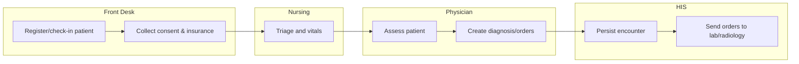
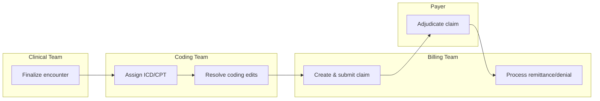

# Swimlane Diagrams

## Outpatient Visit Swimlane

```mermaid
flowchart LR
    subgraph FrontDesk[Front Desk]
      A[Register/check-in patient]
      B[Collect consent & insurance]
    end

    subgraph Nursing[Nursing]
      C[Triage and vitals]
    end

    subgraph Physician[Physician]
      D[Assess patient]
      E[Create diagnosis/orders]
    end

    subgraph HIS[HIS]
      F[Persist encounter]
      G[Send orders to lab/radiology]
    end

    A --> B --> C --> D --> E --> F --> G
```

## Billing Swimlane

```mermaid
flowchart LR
    subgraph Clinical[Clinical Team]
      A[Finalize encounter]
    end

    subgraph Coding[Coding Team]
      B[Assign ICD/CPT]
      C[Resolve coding edits]
    end

    subgraph Billing[Billing Team]
      D[Create & submit claim]
      E[Process remittance/denial]
    end

    subgraph Payer[Payer]
      F[Adjudicate claim]
    end

    A --> B --> C --> D --> F --> E
```
