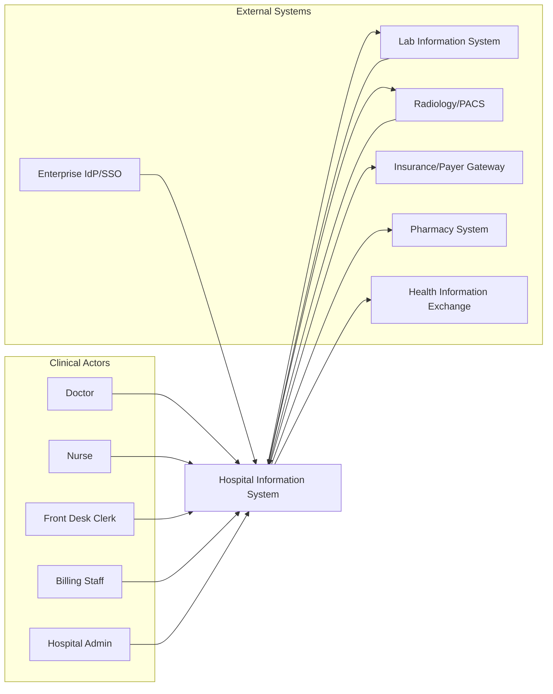

# System Context Diagram

This diagram shows the Hospital Information System (HIS) boundary and external actors/systems.

```mermaid
flowchart LR
    subgraph ClinicalActors[Clinical Actors]
      Doc[Doctor]
      Nurse[Nurse]
      Clerk[Front Desk Clerk]
      Billing[Billing Staff]
      Admin[Hospital Admin]
    end

    HIS[Hospital Information System]

    subgraph ExternalSystems[External Systems]
      LIS[Lab Information System]
      PACS[Radiology/PACS]
      Payer[Insurance/Payer Gateway]
      Pharm[Pharmacy System]
      HIE[Health Information Exchange]
      IdP[Enterprise IdP/SSO]
    end

    Doc --> HIS
    Nurse --> HIS
    Clerk --> HIS
    Billing --> HIS
    Admin --> HIS

    HIS --> LIS
    LIS --> HIS
    HIS --> PACS
    PACS --> HIS
    HIS --> Payer
    HIS --> Pharm
    HIS --> HIE
    IdP --> HIS
```
