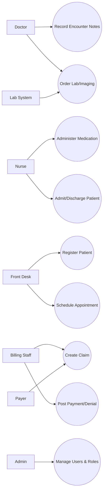
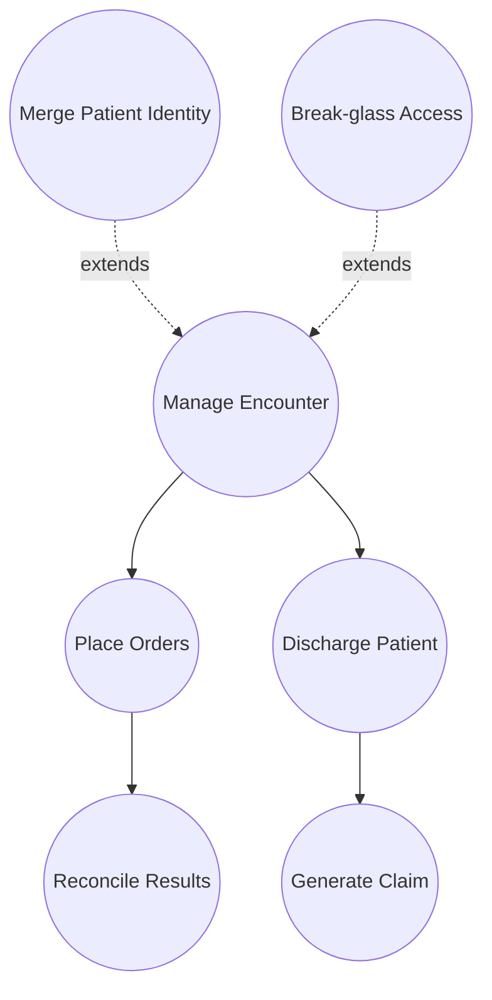
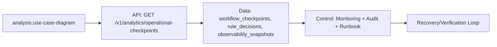

# Use Case Diagram

---

## Implementation-Ready Use-Case Coverage
### Included System Functions
- Identity resolution and patient merge governance.
- Encounter lifecycle from check-in through discharge.
- Closed-loop medication, diagnostics, and results acknowledgement.
- Claim generation, remittance posting, and denial rework loop.

### Include/Extend Relationship Diagram

## File-Specific Implementation Boundaries
This artifact is implementation-focused on **capability coverage and include/extend behavior between use cases**. The boundaries below are specific to `analysis/use-case-diagram.md` and are intentionally not reused as generic filler text.

| Boundary Slice | In Scope for this File | Out of Scope for this File | Implementation Consequence |
|---|---|---|---|
| Intake & Identity Analysis | Entry validation checkpoints and mismatch heuristics | UI widget design details | Data-quality metrics and EMPI false-positive rate |
| Clinical Flow Analysis | Encounter/order sequence timing and critical path dependencies | Persistence implementation details | Throughput, wait-time, and bottleneck reporting |
| Governance Analysis | Rule conformance and audit evidence completeness | Runtime policy engine internals | Compliance scorecards and control effectiveness trends |

## Business Rules to API/Data/Operational Controls (File-Specific)
| Rule Focus | API Enforcement Touchpoint | Data Model/Contract Tie-In | Operational Control |
|---|---|---|---|
| Preconditions for `use-case-diagram` workflows must be validated before state mutation. | `GET /v1/analytics/operational-checkpoints` with explicit error taxonomy and correlation IDs. | `workflow_checkpoints, rule_decisions, observability_snapshots` with strict timestamp, actor, and tenant context fields. | Alert on rule-violation rate and route to owner with SLA-backed response. |
| Mutations must be replay-safe and duplicate-proof. | Idempotency checks on mutation endpoints and async consumers. | Uniqueness keys + immutable evidence rows for side-effect tracking. | Replay runbook with pre/post reconciliation and sign-off checklist. |
| Access to sensitive operations must include least-privilege and evidence. | AuthN/AuthZ middleware + policy decision point reason codes. | Audit/event envelopes include policy version and decision outcome. | Quarterly control review and continuous SIEM correlation for anomalies. |

## Interoperability Assumptions for `use-case-diagram.md`
- Contract versions are explicitly pinned; backward compatibility is managed per versioned API/event schema.
- External dependencies are treated as failure-prone; timeout/retry budgets and fallback states are documented in this file's scenarios.
- Observability correlation (`tenant_id`, `actor_id`, `correlation_id`) is required for all critical-path operations in this document scope.

### Interoperability and Control Flow

## Compliance and Security Posture for this Artifact
- Evidence produced by this workflow/design artifact is audit-consumable (who/what/when/why) and linked to incident/postmortem records.
- Sensitive data exposure is minimized using role-scoped access and redaction guidance relevant to `use-case-diagram.md`.
- Operational controls for this file include detection, containment, recovery, and verification steps with named ownership.
