# Use Case Diagram — Hospital Information System

**Version:** 2.0  
**Status:** Approved  
**Date:** 2025-01-15  
**Author:** Systems Analysis Team  
**Last Reviewed:** 2025-01-15  

---

## 1. Overview

This document presents the complete use case model for the Hospital Information
System (HIS). It identifies all actors — human and system — that interact with
the HIS, enumerates the use cases grouped by functional domain, and provides
visual diagrams, summary tables, and actor-to-use-case mappings to support
requirements traceability, system design, and acceptance testing.

The HIS spans ten functional modules: Patient Management, Appointment
Scheduling, Clinical Records, Pharmacy, Laboratory, Radiology, ADT
(Admission-Discharge-Transfer), Billing & Revenue Cycle, Insurance & Claims,
and Staff Management. Each module contains a set of discrete, testable use
cases that collectively define the functional boundary of the system.

Scope boundaries:
- **In scope:** All workflows executed within the hospital campus network, the
  patient portal, and machine-to-machine integrations with listed external
  systems.
- **Out of scope:** National-level payer adjudication logic, third-party EHR
  vendor internals, and consumer wearable device data ingestion (deferred to
  Phase 2).

---

## 2. Actors

| Actor Name | Type | Description |
|---|---|---|
| Patient | Primary | Individual receiving medical care; interacts via patient portal, kiosk, or with staff assistance for registration, appointments, bills, and access to personal health records |
| Doctor / Physician | Primary | Licensed medical practitioner who diagnoses conditions, orders investigations and procedures, prescribes medications, and manages the overall clinical care plan for assigned patients |
| Nurse | Primary | Registered nurse responsible for recording vital signs, administering medications, executing physician orders, performing nursing assessments, and documenting care in the clinical record |
| Pharmacist | Primary | Licensed pharmacist who verifies and dispenses prescribed medications, reviews prescriptions for clinical accuracy and appropriateness, checks for drug-drug and drug-allergy interactions, and manages pharmacy inventory |
| Lab Technician | Primary | Clinical laboratory professional who collects specimens, processes and analyzes tests on laboratory analyzers, enters results, and escalates critical values to the ordering clinician |
| Radiologist | Primary | Physician specializing in medical imaging who reads diagnostic images, dictates and signs radiology reports, and communicates urgent findings to referring clinicians |
| Billing Clerk | Primary | Revenue cycle staff responsible for generating itemized invoices, submitting insurance claims, posting payments and adjustments, and managing billing exceptions and denials |
| Insurance Coordinator | Primary | Staff member who verifies patient insurance eligibility, obtains pre-authorizations for procedures, submits claims to payers, and manages the explanation-of-benefits (EOB) adjudication cycle |
| Hospital Administrator | Primary | Senior management staff responsible for operational oversight, staff management, resource allocation, compliance monitoring, and performance reporting across all hospital departments |
| IT Administrator | Secondary | Technical staff who manages system configuration, user account provisioning, third-party integrations, security policies, role-based access control, and audit log review |
| External Lab System | Secondary | Third-party reference laboratory system (e.g., Quest Diagnostics, LabCorp) that receives electronic orders via HL7 OML messages and returns results via HL7 ORU or FHIR DiagnosticReport resources |
| Insurance Network | Secondary | External payer network systems (e.g., BCBS, Aetna, Cigna, Medicare) that provide real-time eligibility verification (270/271), receive ANSI X12 837 claims, and return remittance advice (835 ERA) |
| PACS System | Secondary | Picture Archiving and Communication System (e.g., Philips IntelliSpace, GE Centricity) that stores, archives, retrieves, and renders medical imaging studies using the DICOM protocol |
| HL7 FHIR Gateway | Secondary | Middleware integration layer (e.g., Mirth Connect, Azure API for FHIR) that translates between internal HIS data formats and external HL7 v2.x / FHIR R4 messages for nationwide interoperability |
| SMS / Email Gateway | Secondary | Cloud communication platform (e.g., Twilio, AWS SNS, SendGrid) that delivers appointment reminders, OTP authentication codes, discharge summaries, and clinical alert notifications to patients and staff |
| Payment Gateway | Secondary | Financial transaction processor (e.g., Stripe, Razorpay, PayU) that handles secure online bill payments from patients via the portal or kiosk using PCI-DSS compliant tokenized card transactions |

---

## 3. Use Case Diagram

```mermaid
flowchart TD
    %% ── ACTOR NODES ──
    PAT([👤 Patient])
    DOC([🩺 Doctor/Physician])
    NRS([💉 Nurse])
    PHR([💊 Pharmacist])
    LAB([🔬 Lab Technician])
    RAD([🔭 Radiologist])
    BLK([💳 Billing Clerk])
    INS([📋 Insurance Coordinator])
    ADM([🏥 Hospital Administrator])
    ITA([🖥️ IT Administrator])
    ELS([🧪 External Lab System])
    INW([🏦 Insurance Network])
    PACS([📷 PACS System])
    FHR([🔗 HL7 FHIR Gateway])
    SMS([📱 SMS/Email Gateway])
    PAY([💰 Payment Gateway])

    %% ── PATIENT MANAGEMENT ──
    subgraph PM["📋 Patient Management"]
        UC_REG[Register Patient]
        UC_SRC[Search Patient]
        UC_UPD[Update Demographics]
        UC_MRG[Merge Patient Records]
        UC_ALG[Manage Allergies]
    end

    %% ── APPOINTMENT SCHEDULING ──
    subgraph AS["📅 Appointment Scheduling"]
        UC_BOK[Book Appointment]
        UC_CAN[Cancel Appointment]
        UC_RSC[Reschedule Appointment]
        UC_CHK[Check Doctor Availability]
        UC_REM[Send Reminder]
    end

    %% ── CLINICAL RECORDS ──
    subgraph CR["🩺 Clinical Records"]
        UC_SOP[Enter SOAP Note]
        UC_VIT[Record Vital Signs]
        UC_DIA[Add Diagnosis - ICD-10]
        UC_ORD[Order Procedure - CPT]
        UC_HST[View Patient History]
    end

    %% ── PHARMACY ──
    subgraph PH["💊 Pharmacy"]
        UC_PRX[Create Prescription]
        UC_VRX[Verify Prescription]
        UC_DSP[Dispense Medication]
        UC_MAR[Record MAR]
        UC_DRG[Check Drug Interactions]
    end

    %% ── LABORATORY ──
    subgraph LB["🔬 Laboratory"]
        UC_LOR[Order Lab Test]
        UC_CSP[Collect Specimen]
        UC_LRS[Enter Lab Result]
        UC_CRV[Alert Critical Value]
        UC_LRP[View Lab Report]
    end

    %% ── RADIOLOGY ──
    subgraph RD["🔭 Radiology"]
        UC_ROR[Order Radiology Study]
        UC_SIM[Schedule Imaging]
        UC_RRP[Record Radiology Report]
        UC_VPI[View PACS Images]
    end

    %% ── ADT MANAGEMENT ──
    subgraph AT["🏥 ADT Management"]
        UC_ADM[Admit Patient]
        UC_BED[Assign Bed]
        UC_TRF[Transfer Patient]
        UC_IDC[Initiate Discharge]
        UC_CDC[Complete Discharge]
    end

    %% ── BILLING ──
    subgraph BL["💰 Billing"]
        UC_INV[Generate Invoice]
        UC_CLM[Submit Claim]
        UC_PMT[Process Payment]
        UC_DEN[Handle Claim Denial]
        UC_RPT[Generate Reports]
    end

    %% ── INSURANCE ──
    subgraph IC["📄 Insurance"]
        UC_ELG[Verify Insurance Eligibility]
        UC_PRE[Request Pre-authorization]
        UC_EOB[Process EOB]
        UC_POL[Manage Policy]
    end

    %% ── STAFF MANAGEMENT ──
    subgraph SM["👥 Staff Management"]
        UC_STP[Manage Staff Profiles]
        UC_SCH[Create Schedule]
        UC_SHF[Assign Shifts]
        UC_OTS[Manage OT Schedule]
    end

    %% ── PATIENT ACTOR CONNECTIONS ──
    PAT --> UC_REG
    PAT --> UC_BOK
    PAT --> UC_CAN
    PAT --> UC_RSC
    PAT --> UC_PMT

    %% ── DOCTOR ACTOR CONNECTIONS ──
    DOC --> UC_SOP
    DOC --> UC_DIA
    DOC --> UC_ORD
    DOC --> UC_HST
    DOC --> UC_PRX
    DOC --> UC_LOR
    DOC --> UC_LRP
    DOC --> UC_ROR
    DOC --> UC_VPI
    DOC --> UC_ADM
    DOC --> UC_IDC
    DOC --> UC_ALG

    %% ── NURSE ACTOR CONNECTIONS ──
    NRS --> UC_VIT
    NRS --> UC_MAR
    NRS --> UC_CSP
    NRS --> UC_BED
    NRS --> UC_TRF
    NRS --> UC_HST

    %% ── PHARMACIST ACTOR CONNECTIONS ──
    PHR --> UC_VRX
    PHR --> UC_DSP
    PHR --> UC_DRG
    PHR --> UC_ALG

    %% ── LAB TECHNICIAN ACTOR CONNECTIONS ──
    LAB --> UC_CSP
    LAB --> UC_LRS
    LAB --> UC_CRV

    %% ── RADIOLOGIST ACTOR CONNECTIONS ──
    RAD --> UC_RRP
    RAD --> UC_VPI
    RAD --> UC_SIM

    %% ── BILLING CLERK ACTOR CONNECTIONS ──
    BLK --> UC_INV
    BLK --> UC_CLM
    BLK --> UC_PMT
    BLK --> UC_DEN
    BLK --> UC_RPT

    %% ── INSURANCE COORDINATOR ACTOR CONNECTIONS ──
    INS --> UC_ELG
    INS --> UC_PRE
    INS --> UC_EOB
    INS --> UC_POL

    %% ── HOSPITAL ADMIN ACTOR CONNECTIONS ──
    ADM --> UC_STP
    ADM --> UC_SCH
    ADM --> UC_SHF
    ADM --> UC_OTS
    ADM --> UC_RPT
    ADM --> UC_MRG

    %% ── IT ADMIN ACTOR CONNECTIONS ──
    ITA --> UC_SRC
    ITA --> UC_UPD
    ITA --> UC_MRG

    %% ── SYSTEM ACTOR CONNECTIONS ──
    ELS --> UC_LRS
    INW --> UC_ELG
    INW --> UC_EOB
    INW --> UC_CLM
    PACS --> UC_VPI
    PACS --> UC_SIM
    FHR --> UC_REG
    FHR --> UC_LRS
    SMS --> UC_REM
    PAY --> UC_PMT
```

---

## 4. Use Case Summary Table

| UC-ID | Use Case Name | Primary Actor | Module | Priority |
|---|---|---|---|---|
| UC-001 | Register Patient | Patient Access Clerk | Patient Management | Must Have |
| UC-002 | Search Patient | All Clinical Staff | Patient Management | Must Have |
| UC-003 | Update Demographics | Patient Access Clerk | Patient Management | Must Have |
| UC-004 | Merge Patient Records | IT Administrator | Patient Management | Should Have |
| UC-005 | Manage Allergies | Doctor / Nurse | Patient Management | Must Have |
| UC-006 | Book Appointment | Patient / Receptionist | Appointment Scheduling | Must Have |
| UC-007 | Cancel Appointment | Patient / Receptionist | Appointment Scheduling | Must Have |
| UC-008 | Reschedule Appointment | Patient / Receptionist | Appointment Scheduling | Must Have |
| UC-009 | Check Doctor Availability | Receptionist | Appointment Scheduling | Must Have |
| UC-010 | Send Reminder | SMS/Email Gateway | Appointment Scheduling | Should Have |
| UC-011 | Enter SOAP Note | Doctor | Clinical Records | Must Have |
| UC-012 | Record Vital Signs | Nurse | Clinical Records | Must Have |
| UC-013 | Add Diagnosis (ICD-10) | Doctor | Clinical Records | Must Have |
| UC-014 | Order Procedure (CPT) | Doctor | Clinical Records | Must Have |
| UC-015 | View Patient History | Doctor / Nurse | Clinical Records | Must Have |
| UC-016 | Create Prescription | Doctor | Pharmacy | Must Have |
| UC-017 | Verify Prescription | Pharmacist | Pharmacy | Must Have |
| UC-018 | Dispense Medication | Pharmacist | Pharmacy | Must Have |
| UC-019 | Record MAR | Nurse | Pharmacy | Must Have |
| UC-020 | Check Drug Interactions | Pharmacist | Pharmacy | Must Have |
| UC-021 | Order Lab Test | Doctor | Laboratory | Must Have |
| UC-022 | Collect Specimen | Lab Technician / Nurse | Laboratory | Must Have |
| UC-023 | Enter Lab Result | Lab Technician | Laboratory | Must Have |
| UC-024 | Alert Critical Value | Lab Technician | Laboratory | Must Have |
| UC-025 | View Lab Report | Doctor / Nurse | Laboratory | Must Have |
| UC-026 | Order Radiology Study | Doctor | Radiology | Must Have |
| UC-027 | Schedule Imaging | Radiology Staff | Radiology | Must Have |
| UC-028 | Record Radiology Report | Radiologist | Radiology | Must Have |
| UC-029 | View PACS Images | Radiologist / Doctor | Radiology | Must Have |
| UC-030 | Admit Patient | Admissions Staff / Doctor | ADT Management | Must Have |
| UC-031 | Assign Bed | Ward Clerk / Nurse | ADT Management | Must Have |
| UC-032 | Transfer Patient | Nurse / Doctor | ADT Management | Must Have |
| UC-033 | Initiate Discharge | Doctor | ADT Management | Must Have |
| UC-034 | Complete Discharge | Admissions Staff | ADT Management | Must Have |
| UC-035 | Generate Invoice | Billing Clerk | Billing | Must Have |
| UC-036 | Submit Claim | Billing Clerk | Billing | Must Have |
| UC-037 | Process Payment | Billing Clerk / Patient | Billing | Must Have |
| UC-038 | Handle Claim Denial | Billing Clerk | Billing | Must Have |
| UC-039 | Generate Reports | Billing Clerk / Admin | Billing | Should Have |
| UC-040 | Verify Insurance Eligibility | Insurance Coordinator | Insurance | Must Have |
| UC-041 | Request Pre-authorization | Insurance Coordinator | Insurance | Must Have |
| UC-042 | Process EOB | Insurance Coordinator | Insurance | Must Have |
| UC-043 | Manage Policy | Insurance Coordinator | Insurance | Should Have |
| UC-044 | Manage Staff Profiles | HR Administrator | Staff Management | Must Have |
| UC-045 | Create Schedule | Department Head | Staff Management | Must Have |
| UC-046 | Assign Shifts | Department Head | Staff Management | Must Have |
| UC-047 | Manage OT Schedule | OT Manager | Staff Management | Must Have |

---

## 5. Actor-Use Case Mapping Table

| Actor | Primary Use Cases | Secondary / Supporting Use Cases |
|---|---|---|
| Patient | UC-001, UC-006, UC-007, UC-008, UC-037 | UC-010 (receives reminder) |
| Doctor / Physician | UC-011, UC-013, UC-014, UC-016, UC-021, UC-026, UC-030, UC-033 | UC-002, UC-005, UC-015, UC-025, UC-029 |
| Nurse | UC-012, UC-019, UC-031, UC-032 | UC-005, UC-015, UC-022 |
| Pharmacist | UC-017, UC-018, UC-020 | UC-005, UC-016 (reviews) |
| Lab Technician | UC-022, UC-023, UC-024 | UC-021 (receives order) |
| Radiologist | UC-028, UC-029 | UC-026 (receives order), UC-027 |
| Billing Clerk | UC-035, UC-036, UC-037, UC-038, UC-039 | — |
| Insurance Coordinator | UC-040, UC-041, UC-042, UC-043 | UC-036 (assists) |
| Hospital Administrator | UC-044, UC-045, UC-046, UC-047, UC-039 | UC-004 (approves merge) |
| IT Administrator | UC-003, UC-004 | UC-002, UC-009 |
| External Lab System | UC-023 (sends results) | UC-021 (receives order) |
| Insurance Network | UC-040 (responds to eligibility check), UC-042 (sends EOB) | UC-036 (receives claim) |
| PACS System | UC-027 (accepts modality worklist), UC-029 (serves images) | — |
| HL7 FHIR Gateway | UC-001 (EMPI sync), UC-023 (result forwarding) | UC-013, UC-016 |
| SMS / Email Gateway | UC-010 (delivers reminder), UC-024 (critical alert) | — |
| Payment Gateway | UC-037 (processes transaction) | — |
