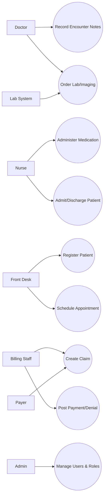

# Use Case Diagram

```mermaid
flowchart LR
    Doc[Doctor]
    Nurse[Nurse]
    Clerk[Front Desk]
    Billing[Billing Staff]
    Admin[Admin]
    Lab[Lab System]
    Payer[Payer]

    UC1((Register Patient))
    UC2((Schedule Appointment))
    UC3((Record Encounter Notes))
    UC4((Order Lab/Imaging))
    UC5((Admit/Discharge Patient))
    UC6((Administer Medication))
    UC7((Create Claim))
    UC8((Post Payment/Denial))
    UC9((Manage Users & Roles))

    Clerk --> UC1
    Clerk --> UC2
    Doc --> UC3
    Doc --> UC4
    Nurse --> UC6
    Nurse --> UC5
    Billing --> UC7
    Billing --> UC8
    Admin --> UC9
    Lab --> UC4
    Payer --> UC7
```
