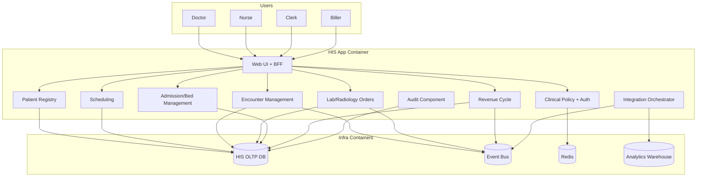

# C4 Component Diagram

## HIS Application Container - Components

```mermaid
flowchart TB
    subgraph Users[Users]
      Doctor
      Nurse
      Clerk
      Biller
    end

    subgraph HIS[HIS App Container]
      UIBFF[Web UI + BFF]
      PatientCmp[Patient Registry]
      ScheduleCmp[Scheduling]
      EncounterCmp[Encounter Management]
      OrdersCmp[Lab/Radiology Orders]
      AdmissionCmp[Admission/Bed Management]
      BillingCmp[Revenue Cycle]
      PolicyCmp[Clinical Policy + Auth]
      AuditCmp[Audit Component]
      IntegrCmp[Integration Orchestrator]
    end

    subgraph Infra[Infra Containers]
      OLTP[(HIS OLTP DB)]
      Bus[(Event Bus)]
      Cache[(Redis)]
      DWH[(Analytics Warehouse)]
    end

    Doctor --> UIBFF
    Nurse --> UIBFF
    Clerk --> UIBFF
    Biller --> UIBFF

    UIBFF --> PatientCmp
    UIBFF --> ScheduleCmp
    UIBFF --> EncounterCmp
    UIBFF --> OrdersCmp
    UIBFF --> AdmissionCmp
    UIBFF --> BillingCmp
    UIBFF --> PolicyCmp

    PatientCmp --> OLTP
    ScheduleCmp --> OLTP
    EncounterCmp --> OLTP
    OrdersCmp --> OLTP
    AdmissionCmp --> OLTP
    BillingCmp --> OLTP

    EncounterCmp --> Bus
    OrdersCmp --> Bus
    BillingCmp --> Bus

    IntegrCmp --> Bus
    IntegrCmp --> DWH
    PolicyCmp --> Cache
    AuditCmp --> OLTP
```
