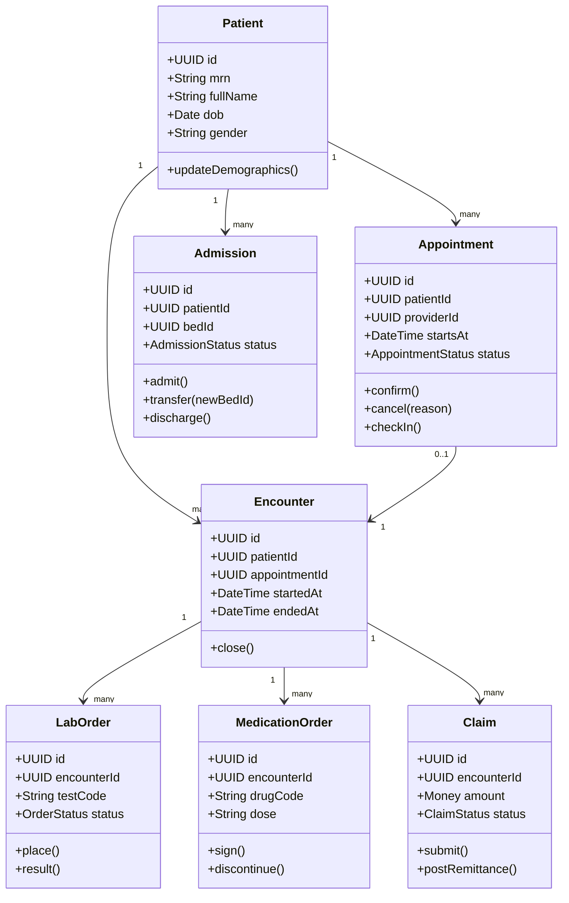

# Class Diagrams

```mermaid
classDiagram
    class Patient {
      +UUID id
      +String mrn
      +String fullName
      +Date dob
      +String gender
      +updateDemographics()
    }

    class Appointment {
      +UUID id
      +UUID patientId
      +UUID providerId
      +DateTime startsAt
      +AppointmentStatus status
      +confirm()
      +cancel(reason)
      +checkIn()
    }

    class Encounter {
      +UUID id
      +UUID patientId
      +UUID appointmentId
      +DateTime startedAt
      +DateTime endedAt
      +close()
    }

    class Admission {
      +UUID id
      +UUID patientId
      +UUID bedId
      +AdmissionStatus status
      +admit()
      +transfer(newBedId)
      +discharge()
    }

    class LabOrder {
      +UUID id
      +UUID encounterId
      +String testCode
      +OrderStatus status
      +place()
      +result()
    }

    class Claim {
      +UUID id
      +UUID encounterId
      +Money amount
      +ClaimStatus status
      +submit()
      +postRemittance()
    }

    class MedicationOrder {
      +UUID id
      +UUID encounterId
      +String drugCode
      +String dose
      +sign()
      +discontinue()
    }

    Patient "1" --> "many" Appointment
    Patient "1" --> "many" Encounter
    Patient "1" --> "many" Admission
    Appointment "0..1" --> "1" Encounter
    Encounter "1" --> "many" LabOrder
    Encounter "1" --> "many" MedicationOrder
    Encounter "1" --> "many" Claim
```
