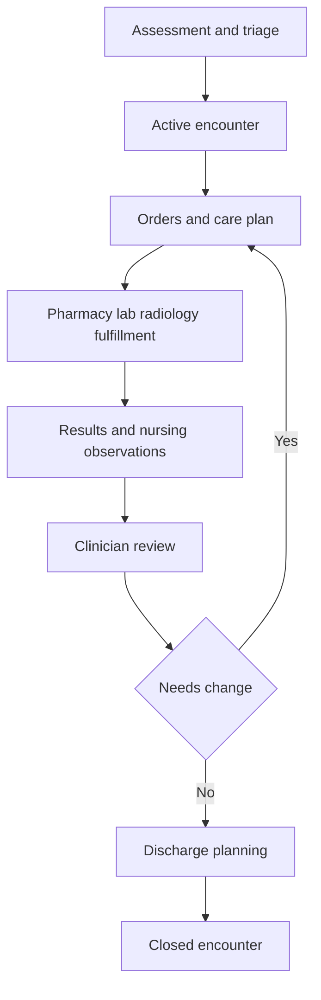

# Clinical Records and Care Workflows

## Purpose
Describe the internal design for clinical records, encounters, orders, results, medication administration, and discharge coordination in the **Hospital Information System**.

## Clinical Record Model
- The encounter is the organizing aggregate for notes, diagnoses, care team assignments, problem list references, and clinician-facing orders.
- Departmental execution data remains in owning services but is linked back to the encounter timeline through immutable events.
- Signed clinical content is immutable. Corrections appear as addenda, superseding orders, or amended results.
- Each timeline event includes actor, role, location, patient, encounter, and correlation metadata.

## Encounter Lifecycle

| State | Allowed Entry | Exit Conditions |
|---|---|---|
| `planned` | appointment conversion or pre-admission | patient arrives or encounter canceled |
| `arrived` | check-in or ED arrival | roomed or canceled |
| `active` | physician or nurse begins care | discharged, transferred to another encounter type, or left without treatment |
| `handoff_pending` | unit or provider handoff initiated | receiving provider accepts |
| `discharge_pending` | discharge order entered | summary signed and discharge tasks complete |
| `closed` | discharge completed or encounter administratively closed | addendum only |

## Closed-Loop Care Workflow

## Order Lifecycle

| State | Owner | Key Rules |
|---|---|---|
| `draft` | Clinical | editable by author before signature |
| `pending_signature` | Clinical | blocked until required co-sign or verbal order authentication |
| `active` | Clinical and departmental consumer | published to departmental service |
| `in_progress` | Departmental service | specimen collected, medication dispensed, imaging underway |
| `completed` | Departmental service | final result or completion note returned |
| `discontinued` | Clinical | stops future execution but preserves history |
| `canceled` | Clinical | allowed before execution starts |
| `corrected` | Clinical | superseded by corrected order |
| `entered_in_error` | Clinical | wrong-patient or other invalid order, requires incident evidence |

## Medication Administration Workflow
1. Pharmacy verifies medication order and may modify fulfillment metadata without changing signed order intent.
2. Nurse retrieves active due doses from the MAR projection.
3. Barcode scan validates patient wristband and medication package.
4. Administration event records outcome such as given, refused, held, wasted, or partial dose.
5. Event updates clinical timeline, charge capture, and controlled substance inventory where relevant.

## Result Management Rules
- Lab and radiology results store version number, status, author or instrument source, normal or abnormal flag, and correction linkage.
- Corrected results do not replace the prior fact. The chart shows the latest result with access to prior versions.
- Critical results remain unreviewed until a qualified clinician or delegated nurse acknowledges them.
- Pending results at discharge are attached to discharge instructions or follow-up tasks.

## Clinical Documentation Rules
- Nursing assessments may update within configured grace period before sign-off. Signed entries require addendum after that window.
- Physician notes support `draft`, `in_review`, `signed`, and `addendum` states.
- Problem list updates, allergies, and code status changes create discrete timeline events separate from free-text notes.
- Verbal orders require authentication within policy SLA and remain visibly un-authenticated until signed.

## Interactions with Other Domains

| Domain | Interaction |
|---|---|
| Patient Identity | retrieves demographics, aliases, consent flags, allergies, and merge notifications |
| ADT | provides current location, attending context, and discharge completion |
| Pharmacy | executes medication verification, dispense, and MAR events |
| Lab | executes specimen and result workflow |
| Radiology | executes accession, modality, and report workflow |
| Billing | consumes documented procedures, administrations, and discharge events for charge generation |
| Insurance | provides pre-auth status and payer constraints surfaced during ordering or discharge planning |

## Safety and Audit Invariants
- No signed note, result, or order may be deleted.
- All corrections require reason code and actor attribution.
- Encounter closure is blocked when unresolved critical alerts or unsigned required documentation remain.
- Every PHI access from chart views records actor, purpose-of-use, patient, encounter, section viewed, and outcome.

## Downtime and Reconciliation Notes
- Downtime entries are stored with source `paper`, `local_cache`, or `interface_backlog` and require reconciliation status.
- Back-entered medication administrations require dual verification when the original administration happened outside online validation.
- Reconciled records preserve original occurrence time and data-entry time separately.

