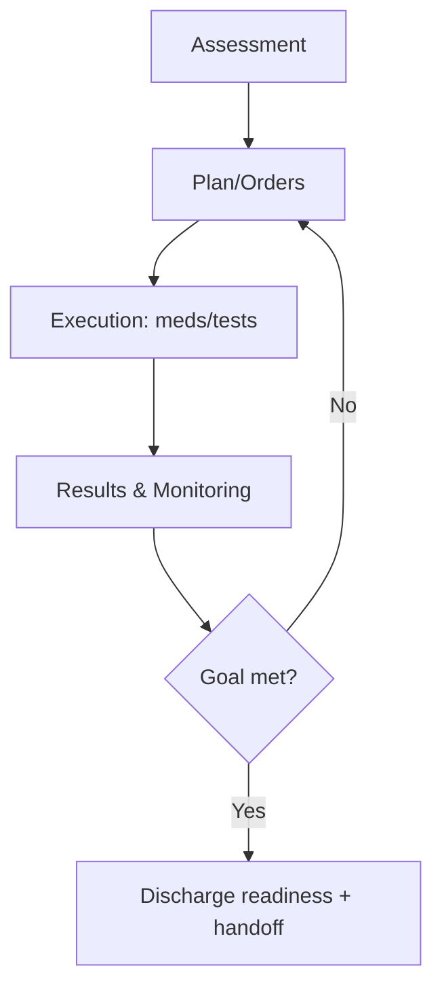

# Clinical Records and Care Workflows

## Problem Scope
This document details architecture and operational controls for **clinical records and care workflows** in the **Hospital Information System**.

## Core Invariants
- Critical mutations are idempotent and traceable through correlation IDs.
- Reconciliation can recompute canonical state from immutable source events.
- User-visible state transitions remain monotonic and auditable.

## Workflow Design
1. Validate request shape, policy, and actor permissions.
2. Execute transactional write(s) with optimistic concurrency protections.
3. Emit durable events for downstream projections and side effects.
4. Run compensating actions when asynchronous steps fail.

## Data and API Considerations
- Enumerate lifecycle statuses and forbidden transitions.
- Define read model projections for dashboards and operations tooling.
- Include API idempotency keys, pagination, filtering, and cursor semantics.

## Failure Handling
- Timeout handling with bounded retries and dead-letter workflows.
- Human-in-the-loop escalation path for unrecoverable conflicts.
- Post-incident replay/backfill procedure with verification checklist.

---

## Implementation-Ready Care Workflow Details
### Charting and Documentation States
- Draft -> In Review -> Signed -> Addendum; signed notes are immutable with addendum linkage.
- Late entries require mandatory reason and supervising clinician attestation.
- Shared notes support role-scoped sections with conflict detection and merge guidance.

### Closed-Loop Care Workflow

## File-Specific Implementation Boundaries
This artifact is implementation-focused on **care documentation progression and closed-loop order/result governance**. The boundaries below are specific to `detailed-design/clinical-records-and-care-workflows.md` and are intentionally not reused as generic filler text.

| Boundary Slice | In Scope for this File | Out of Scope for this File | Implementation Consequence |
|---|---|---|---|
| Application Service Layer | Command validation, transaction demarcation, event emission | Direct infrastructure adapter logic | Deterministic command behavior and retry safety |
| Domain Model Layer | Aggregate invariants, lifecycle transitions, and business calculations | API transport concerns | Strong consistency inside aggregate boundaries |
| Integration Adapter Layer | HL7/FHIR/payer translation and delivery receipts | Domain state mutation logic | Isolation from external protocol drift |

## Business Rules to API/Data/Operational Controls (File-Specific)
| Rule Focus | API Enforcement Touchpoint | Data Model/Contract Tie-In | Operational Control |
|---|---|---|---|
| Preconditions for `clinical-records-and-care-workflows` workflows must be validated before state mutation. | `PATCH /v1/{resource}/{id}/state` with explicit error taxonomy and correlation IDs. | `aggregate_versions, outbox_messages, integration_receipts` with strict timestamp, actor, and tenant context fields. | Alert on rule-violation rate and route to owner with SLA-backed response. |
| Mutations must be replay-safe and duplicate-proof. | Idempotency checks on mutation endpoints and async consumers. | Uniqueness keys + immutable evidence rows for side-effect tracking. | Replay runbook with pre/post reconciliation and sign-off checklist. |
| Access to sensitive operations must include least-privilege and evidence. | AuthN/AuthZ middleware + policy decision point reason codes. | Audit/event envelopes include policy version and decision outcome. | Quarterly control review and continuous SIEM correlation for anomalies. |

## Interoperability Assumptions for `clinical-records-and-care-workflows.md`
- Contract versions are explicitly pinned; backward compatibility is managed per versioned API/event schema.
- External dependencies are treated as failure-prone; timeout/retry budgets and fallback states are documented in this file's scenarios.
- Observability correlation (`tenant_id`, `actor_id`, `correlation_id`) is required for all critical-path operations in this document scope.

## Compliance and Security Posture for this Artifact
- Evidence produced by this workflow/design artifact is audit-consumable (who/what/when/why) and linked to incident/postmortem records.
- Sensitive data exposure is minimized using role-scoped access and redaction guidance relevant to `clinical-records-and-care-workflows.md`.
- Operational controls for this file include detection, containment, recovery, and verification steps with named ownership.
