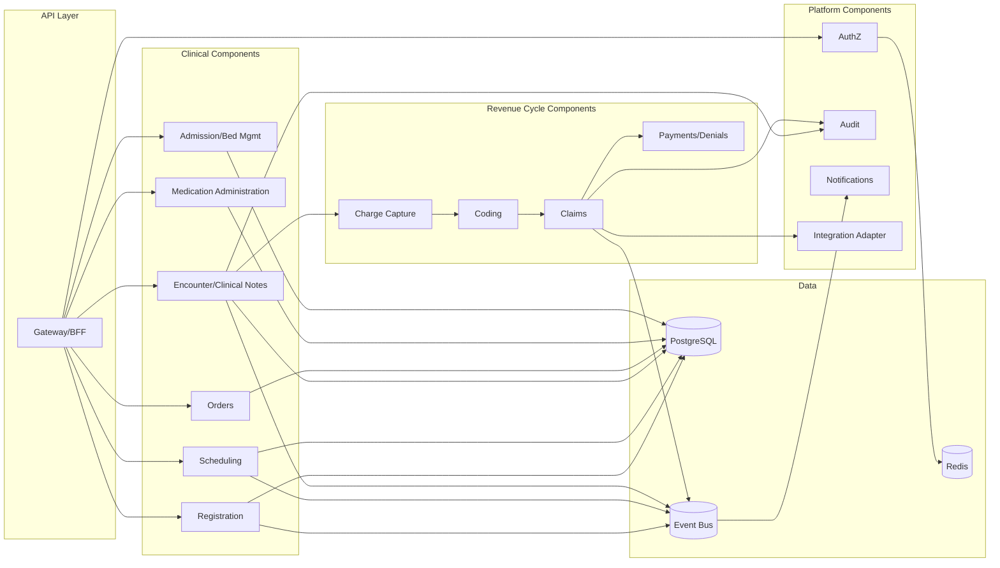

# Component Diagrams

```mermaid
flowchart LR
    subgraph API[API Layer]
      Gateway[Gateway/BFF]
    end

    subgraph Clinical[Clinical Components]
      Reg[Registration]
      Sched[Scheduling]
      EHR[Encounter/Clinical Notes]
      Orders[Orders]
      Meds[Medication Administration]
      Admit[Admission/Bed Mgmt]
    end

    subgraph Revenue[Revenue Cycle Components]
      Charge[Charge Capture]
      Coding[Coding]
      Claims[Claims]
      Payments[Payments/Denials]
    end

    subgraph Platform[Platform Components]
      Auth[AuthZ]
      Audit[Audit]
      Notify[Notifications]
      Int[Integration Adapter]
    end

    subgraph Data[Data]
      DB[(PostgreSQL)]
      Bus[(Event Bus)]
      Cache[(Redis)]
    end

    Gateway --> Reg --> DB
    Gateway --> Sched --> DB
    Gateway --> EHR --> DB
    Gateway --> Orders --> DB
    Gateway --> Meds --> DB
    Gateway --> Admit --> DB

    EHR --> Charge --> Coding --> Claims --> Payments
    Claims --> Int

    Reg --> Bus
    Sched --> Bus
    EHR --> Bus
    Claims --> Bus

    Gateway --> Auth
    EHR --> Audit
    Claims --> Audit
    Bus --> Notify
    Auth --> Cache
```
