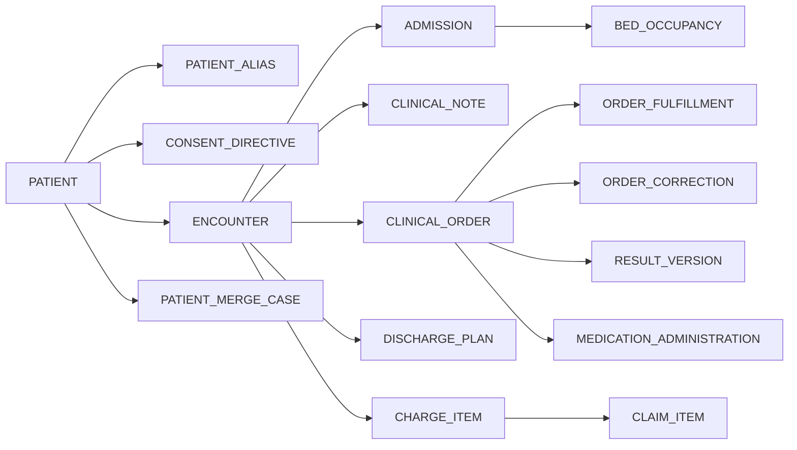

# Erd Database Schema

## Purpose
Define the core relational schema patterns for the **Hospital Information System** with emphasis on patient identity, ADT, encounters, orders, results, medication administration, consent, and billing touchpoints.

## Canonical ERD

## Service Ownership

| Service | Primary Tables |
|---|---|
| Patient Service | `patient`, `patient_alias`, `consent_directive`, `patient_merge_case`, `patient_merge_snapshot` |
| ADT Service | `admission`, `bed_occupancy`, `bed`, `ward`, `transfer_request`, `discharge_disposition` |
| Clinical Service | `encounter`, `clinical_note`, `clinical_order`, `order_correction`, `problem_list_entry`, `care_team_assignment` |
| Pharmacy Service | `order_fulfillment`, `medication_administration`, `dispense`, `controlled_substance_ledger` |
| Lab Service | `order_fulfillment`, `specimen`, `result_version`, `critical_result_alert` |
| Radiology Service | `order_fulfillment`, `accession`, `result_version`, `image_reference` |
| Billing Service | `charge_item`, `claim`, `claim_item`, `remittance`, `denial_work_item` |

## Key Constraints
- `patient.enterprise_id` is globally unique and never reused.
- Alias values may be reused only when `alias_type` and `issuing_authority` differ or a previous alias is inactive and archived.
- `bed_occupancy` has exclusion constraint on `bed_id` plus active time range to prevent overlap.
- `clinical_order.state` transitions are enforced by state machine rules and version column.
- `result_version` requires monotonic `version_number` per `order_id`.
- `order_correction.replacement_order_id` must reference a distinct order that supersedes the original.
- `claim_item` rows remain even if a charge is voided. Status reflects reversal instead of delete.

## Indexing and Query Guidance
- Patient search uses btree indexes on enterprise ID and MRN aliases plus trigram or phonetic indexes on names.
- Active census queries index `admission.status`, `bed_occupancy.occupancy_status`, and `ward_id`.
- Chart timeline queries index `encounter_id`, `occurred_at`, and `event_type` in derived projection tables.
- Critical result queues index `critical_flag`, `ack_status`, and `ordering_provider_id`.
- Claim work queues index payer, status, denial code, and transmission time.

## Merge and Unmerge Persistence Model
- `patient_merge_case` stores reviewer, confidence score, contraindications, approvals, and final decision.
- A separate snapshot table stores pre-merge foreign-key mapping so unmerge can restore prior state.
- Downstream services record merge reconciliation status keyed by merge case ID and service name.
- External identifiers are not deleted during merge. They are re-pointed through alias or lineage records with audit evidence.

## Migration Rules
- Schema migrations must be additive first. Destructive changes require one release of compatibility shims.
- Large backfills for timeline or billing projections run as resumable jobs with checkpoint table.
- Historical medico-legal tables are append-only and may not be rewritten except through signed correction rows.
