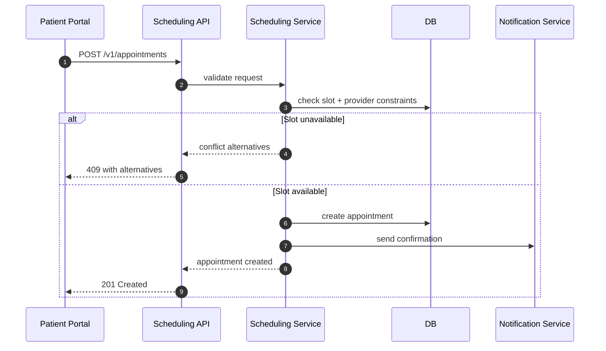
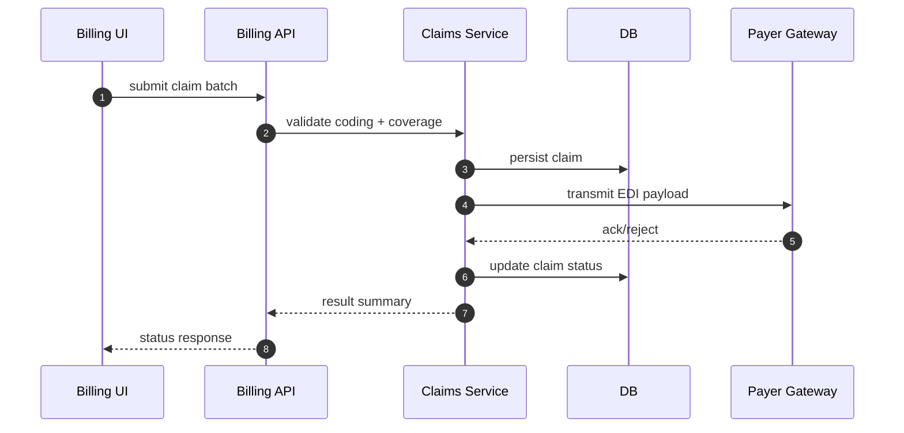
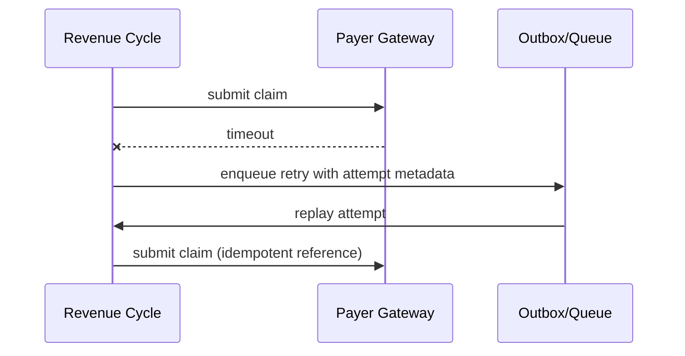

# Sequence Diagrams

## Appointment Booking


## Claim Submission


---


## Sequence Reliability Extensions
### Timeout and Retry Semantics
- Client retries require same idempotency key for up to 24 hours.
- Service-to-service calls use exponential backoff with max retry budget of 3 attempts.
- Async completion statuses are queryable through `GET /v1/operations/{operation_id}`.

### Compensating Flow: Claim Submission Failure


## File-Specific Implementation Boundaries
This artifact is implementation-focused on **synchronous/asynchronous handoff timing, retries, and compensation behavior**. The boundaries below are specific to `detailed-design/sequence-diagrams.md` and are intentionally not reused as generic filler text.

| Boundary Slice | In Scope for this File | Out of Scope for this File | Implementation Consequence |
|---|---|---|---|
| Application Service Layer | Command validation, transaction demarcation, event emission | Direct infrastructure adapter logic | Deterministic command behavior and retry safety |
| Domain Model Layer | Aggregate invariants, lifecycle transitions, and business calculations | API transport concerns | Strong consistency inside aggregate boundaries |
| Integration Adapter Layer | HL7/FHIR/payer translation and delivery receipts | Domain state mutation logic | Isolation from external protocol drift |

## Business Rules to API/Data/Operational Controls (File-Specific)
| Rule Focus | API Enforcement Touchpoint | Data Model/Contract Tie-In | Operational Control |
|---|---|---|---|
| Preconditions for `sequence-diagrams` workflows must be validated before state mutation. | `PATCH /v1/{resource}/{id}/state` with explicit error taxonomy and correlation IDs. | `aggregate_versions, outbox_messages, integration_receipts` with strict timestamp, actor, and tenant context fields. | Alert on rule-violation rate and route to owner with SLA-backed response. |
| Mutations must be replay-safe and duplicate-proof. | Idempotency checks on mutation endpoints and async consumers. | Uniqueness keys + immutable evidence rows for side-effect tracking. | Replay runbook with pre/post reconciliation and sign-off checklist. |
| Access to sensitive operations must include least-privilege and evidence. | AuthN/AuthZ middleware + policy decision point reason codes. | Audit/event envelopes include policy version and decision outcome. | Quarterly control review and continuous SIEM correlation for anomalies. |

## Interoperability Assumptions for `sequence-diagrams.md`
- Contract versions are explicitly pinned; backward compatibility is managed per versioned API/event schema.
- External dependencies are treated as failure-prone; timeout/retry budgets and fallback states are documented in this file's scenarios.
- Observability correlation (`tenant_id`, `actor_id`, `correlation_id`) is required for all critical-path operations in this document scope.

### Interoperability and Control Flow
```mermaid
flowchart LR
    A[detailed-design:sequence-diagrams] --> B[API: PATCH /v1/{resource}/{id}/state]
    B --> C[Data: aggregate_versions, outbox_messages, integration_receipts]
    C --> D[Control: Monitoring + Audit + Runbook]
    D --> E[Recovery/Verification Loop]
```

## Compliance and Security Posture for this Artifact
- Evidence produced by this workflow/design artifact is audit-consumable (who/what/when/why) and linked to incident/postmortem records.
- Sensitive data exposure is minimized using role-scoped access and redaction guidance relevant to `sequence-diagrams.md`.
- Operational controls for this file include detection, containment, recovery, and verification steps with named ownership.
