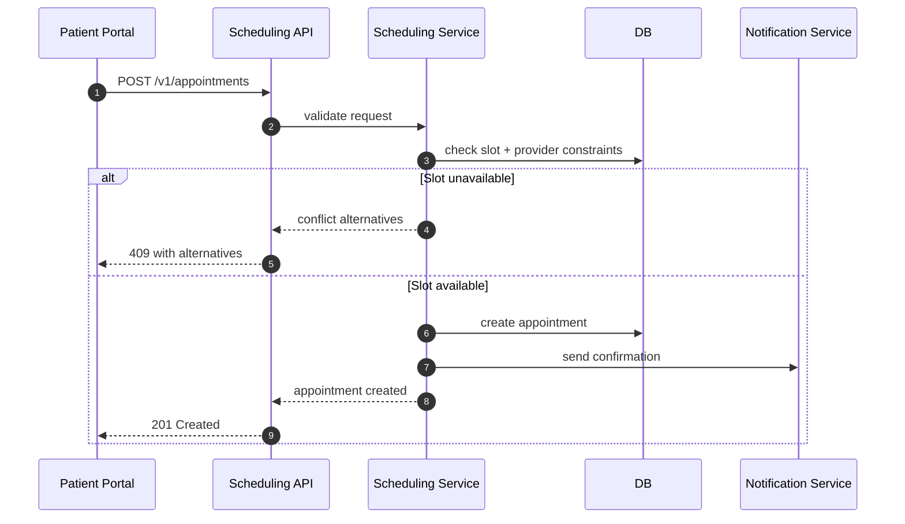
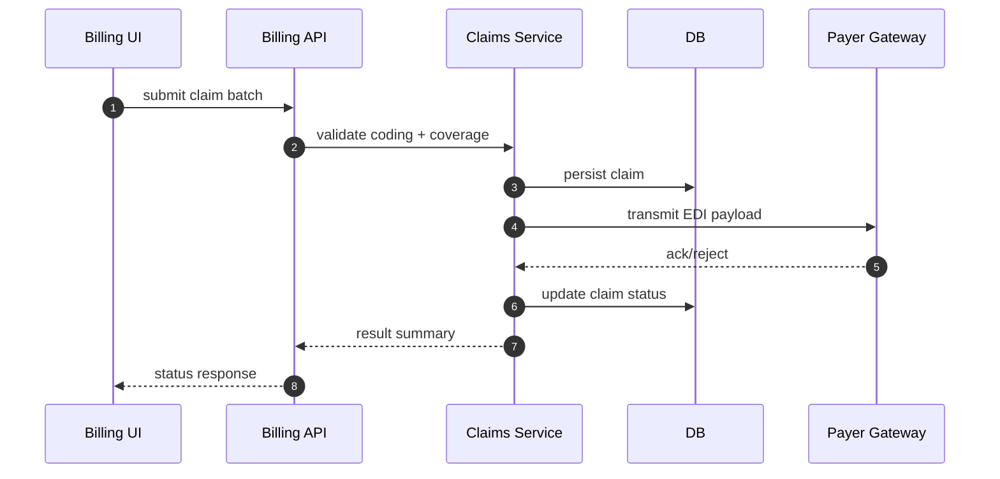

# Sequence Diagrams

## Appointment Booking

```mermaid
sequenceDiagram
    autonumber
    participant P as Patient Portal
    participant API as Scheduling API
    participant SCH as Scheduling Service
    participant DB as DB
    participant N as Notification Service

    P->>API: POST /v1/appointments
    API->>SCH: validate request
    SCH->>DB: check slot + provider constraints
    alt Slot unavailable
      SCH-->>API: conflict alternatives
      API-->>P: 409 with alternatives
    else Slot available
      SCH->>DB: create appointment
      SCH->>N: send confirmation
      SCH-->>API: appointment created
      API-->>P: 201 Created
    end
```

## Claim Submission

```mermaid
sequenceDiagram
    autonumber
    participant Bill as Billing UI
    participant API as Billing API
    participant CLM as Claims Service
    participant DB as DB
    participant PAY as Payer Gateway

    Bill->>API: submit claim batch
    API->>CLM: validate coding + coverage
    CLM->>DB: persist claim
    CLM->>PAY: transmit EDI payload
    PAY-->>CLM: ack/reject
    CLM->>DB: update claim status
    CLM-->>API: result summary
    API-->>Bill: status response
```
