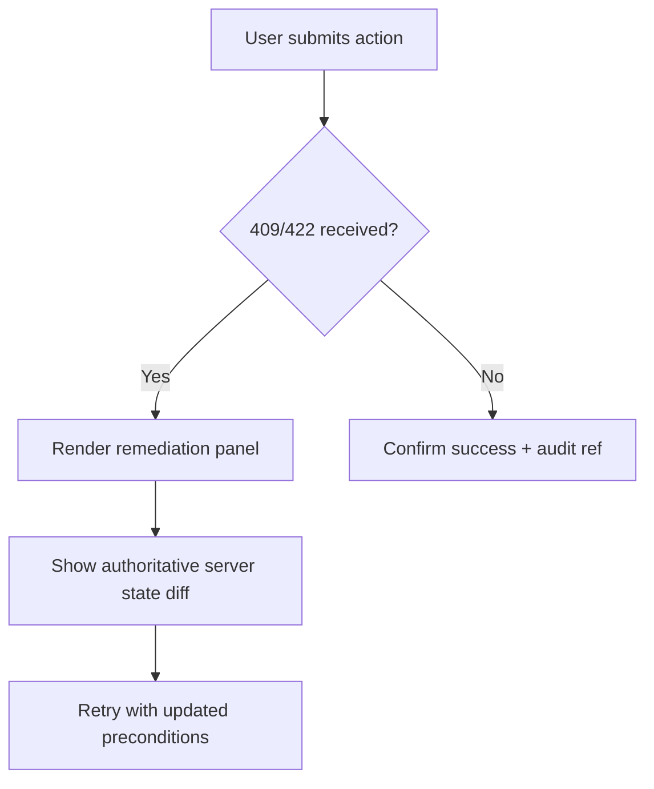

# API And Ui

## API Reliability Risks
- Duplicate client retries without stable idempotency keys.
- Pagination drift during concurrent writes.
- Partial-success composite operations lacking clear error contracts.

## UI/UX Risks
- Stale optimistic views conflicting with authoritative backend state.
- Ambiguous validation and remediation guidance for operators.

## Guardrails
- Standardized error taxonomy and retryability hints.
- ETag/version preconditions for concurrent edits.
- Correlated request IDs visible in UI and support tooling.

---

## API/UI Hardening Details
### Contract Resilience Patterns
- UI uses server-issued form schemas to reduce drift between validation layers.
- API returns machine-actionable remediation hints for operator workflows.
- Conflict handling uses ETags and conflict payload with stale field diffs.

### Operator UX for Failures

## File-Specific Implementation Boundaries
This artifact is implementation-focused on **operator UX behavior under API conflicts, retries, and stale state**. The boundaries below are specific to `edge-cases/api-and-ui.md` and are intentionally not reused as generic filler text.

| Boundary Slice | In Scope for this File | Out of Scope for this File | Implementation Consequence |
|---|---|---|---|
| Detection Plane | Signals, anomaly thresholds, and incident trigger criteria | Permanent remediation features | Early detection with low alert noise |
| Containment Plane | Blast-radius limiting actions and operator approvals | Long-term optimization work | Safe short-term control while preserving evidence |
| Recovery Plane | Replay/backfill/unwind sequencing and verification | Product roadmap changes | Deterministic restoration and closure evidence |

## Business Rules to API/Data/Operational Controls (File-Specific)
| Rule Focus | API Enforcement Touchpoint | Data Model/Contract Tie-In | Operational Control |
|---|---|---|---|
| Preconditions for `api-and-ui` workflows must be validated before state mutation. | `POST /v1/operations/incidents/{id}/actions` with explicit error taxonomy and correlation IDs. | `incident_timeline, containment_actions, reconciliation_jobs` with strict timestamp, actor, and tenant context fields. | Alert on rule-violation rate and route to owner with SLA-backed response. |
| Mutations must be replay-safe and duplicate-proof. | Idempotency checks on mutation endpoints and async consumers. | Uniqueness keys + immutable evidence rows for side-effect tracking. | Replay runbook with pre/post reconciliation and sign-off checklist. |
| Access to sensitive operations must include least-privilege and evidence. | AuthN/AuthZ middleware + policy decision point reason codes. | Audit/event envelopes include policy version and decision outcome. | Quarterly control review and continuous SIEM correlation for anomalies. |

## Interoperability Assumptions for `api-and-ui.md`
- Contract versions are explicitly pinned; backward compatibility is managed per versioned API/event schema.
- External dependencies are treated as failure-prone; timeout/retry budgets and fallback states are documented in this file's scenarios.
- Observability correlation (`tenant_id`, `actor_id`, `correlation_id`) is required for all critical-path operations in this document scope.

## Compliance and Security Posture for this Artifact
- Evidence produced by this workflow/design artifact is audit-consumable (who/what/when/why) and linked to incident/postmortem records.
- Sensitive data exposure is minimized using role-scoped access and redaction guidance relevant to `api-and-ui.md`.
- Operational controls for this file include detection, containment, recovery, and verification steps with named ownership.
