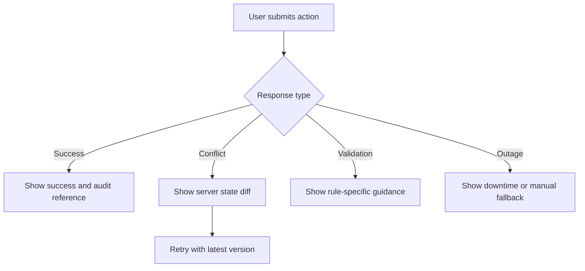

# API And Ui

## Purpose
Document API and user-interface failure modes that matter most in a hospital setting where stale state, duplicate submissions, and poor remediation guidance can create patient-safety issues.

## High-Risk API and UI Scenarios

| Scenario | API Risk | UI Risk | Required Behavior |
|---|---|---|---|
| Duplicate registration submit | repeated create request issues second MRN | clerk thinks first click failed | idempotency key returns original response and UI shows saved patient identity |
| Concurrent bed assignment | two staff assign same bed | stale bed board display | optimistic locking returns conflict with current bed holder and queue options |
| Corrected order after user opened chart | old order appears valid in cached view | nurse administers based on stale list | UI forces refresh banner and highlights superseded order |
| Critical result acknowledgement race | two clinicians acknowledge same alert | one user sees cleared alert late | first acknowledgement wins, second gets informative stale response |
| Payer timeout during discharge | claim readiness unknown | discharging team thinks discharge failed | discharge completes, billing panel shows deferred payer verification |
| External outage | partner call blocks user workflow | generic error without next step | UI displays outage-specific fallback instructions and support code |

## Error Contract Standard
- HTTP error body must include `code`, `message`, `retryable`, `user_action`, `correlation_id`, and optional `current_version`.
- `409` conflicts are used for stale edits, occupied beds, and already-acknowledged alerts.
- `422` is used for business-rule validation such as missing consent or incompatible bed type.
- `503` is used only for temporary dependency outages where retry or fallback is appropriate.
- UI must always show correlation ID to support staff.

## Operator Failure Remediation Flow

## UI Design Rules for Hospital Safety
- Never hide the authoritative patient banner. Include name, DOB, age, sex, enterprise ID, current location, allergy status, and privacy flag on every clinical screen.
- Highlight temporary trauma identities and merged identities with explicit status ribbons.
- When an order or result is corrected, visually distinguish the original, the correction reason, and the active replacement.
- Use modal confirmation for break-glass, merge, unmerge, discontinue, cancel, and entered-in-error actions.
- Show countdown timers for critical result acknowledgement and verbal order authentication.

## API Edge Cases to Implement
1. Idempotent create endpoints for patient registration, admission, transfer, and claim submission.
2. Cursor pagination for large chart timelines so new events do not reorder existing pages.
3. ETag support for editable resources such as notes, care plans, and bed board actions.
4. Partial success envelope for batch downtime import with per-row disposition and remediation reasons.
5. Redaction-aware search results for sensitive charts so unauthorized users see existence only when policy allows.

## Observability and Support Requirements
- Every UI error event must include route, feature flag state, browser or device info, user role, facility, and correlation ID.
- Support dashboards should link UI error telemetry to backend traces and audit records.
- API metrics require labels for business operation such as `admit_patient`, `merge_patient`, `ack_critical_result`, and `submit_claim`.
- Synthetic monitoring must cover login, patient search, admission, chart open, medication administration, discharge, and payer connectivity.

