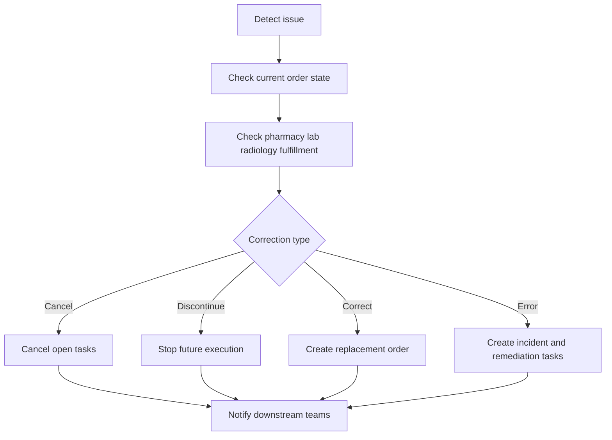

# Clinical Order Correction

## Purpose
Define the safety model for correcting, discontinuing, canceling, or marking orders entered in error in the **Hospital Information System**.

## Correction Taxonomy

| Action | When Used | Allowed Order States | Core Requirement |
|---|---|---|---|
| Cancel | order should never start | `draft`, `pending_signature`, `active` with no fulfillment | downstream tasks removed before execution |
| Discontinue | future execution should stop | `active`, `in_progress` | performed work remains in history |
| Correct | details need replacement | `active`, `in_progress`, `completed` if result or dispense not yet final | replacement order linked to original |
| Entered in error | wrong patient or invalid order | any state with governance approval | incident evidence and remediation workflow required |

## Safety Decision Flow

## Required Workflow
1. Retrieve current order state, version, fulfillment records, and outstanding tasks.
2. Require actor role and reason code appropriate to the correction type.
3. Create correction record before changing order state.
4. Publish correction event to all subscribed departmental services.
5. Create remediation tasks when fulfillment already occurred.
6. Update bedside and clinician-facing projections with clear supersession messaging.

## Downstream Remediation Rules

| Order Domain | If Fulfillment Started | Remediation Task |
|---|---|---|
| Medication | dispensed but not administered | pharmacy return or waste workflow |
| Medication | administered | adverse event or physician follow-up review if clinically needed |
| Lab | specimen collected | specimen disposal or annotate as canceled after collection |
| Lab | result finalized | result amendment review and clinician notification |
| Radiology | accession created | cancel slot and update modality worklist |
| Radiology | report finalized | corrected report workflow and chart notification |

## Audit and Governance Requirements
- Original order remains immutable and visible.
- `entered_in_error` requires explicit reason, free-text narrative, and elevated approval when fulfillment started.
- Wrong-patient corrections open a patient safety incident and require chart access review for all impacted users.
- The system stores which users already viewed or acted on the order so remediation notifications are targeted.

## Integration Considerations
- HL7 ORM cancellation messages or FHIR Task status updates must be sent for impacted departmental integrations.
- Retries are safe because the correction event includes the correction ID and original order version.
- If a downstream system is offline, the order source-of-truth status still changes while the integration engine queues replay.

## Verification Checklist
- Replacement order references original order and carries copied clinical context plus corrected fields.
- MAR, specimen queue, modality worklist, and charge projections reflect the new order status.
- Notifications sent to ordering provider, active bedside staff, and impacted department.
- Audit report shows who corrected the order, why, when, and what downstream actions completed.

