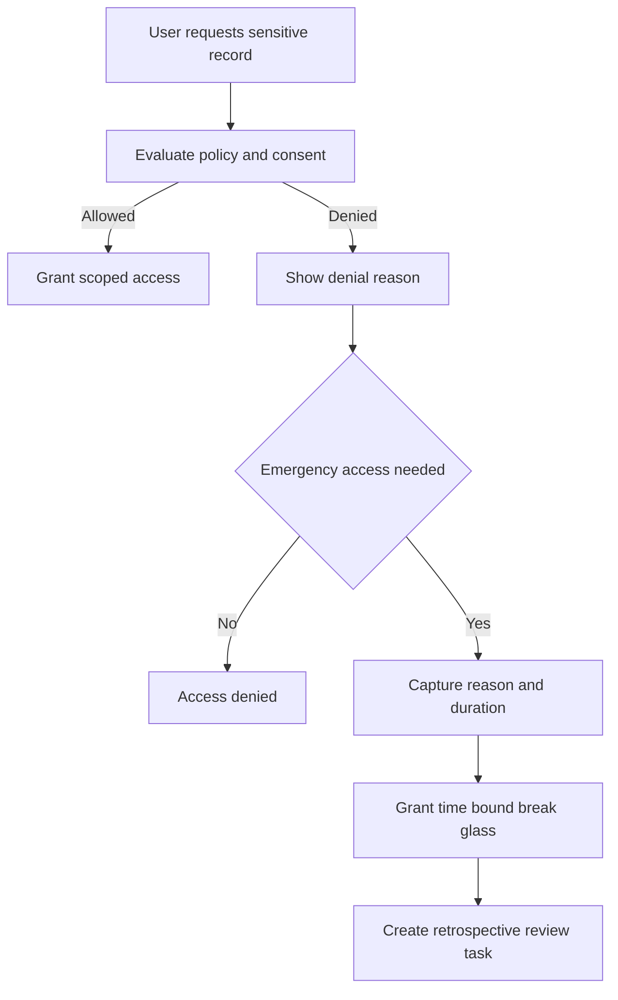

# Consent Sensitive Data Access

## Purpose
Define how the **Hospital Information System** handles sensitive chart compartments, patient consent directives, break-glass access, and retrospective privacy review.

## Sensitive Data Categories
- Behavioral health and substance use treatment notes.
- HIV and sexually transmitted infection related results where local policy requires segmentation.
- Reproductive health records and restricted imaging or lab results.
- Research participation data and records covered by study-specific consent.
- VIP and confidential encounter flags.

## Consent Evaluation Inputs

| Input | Example |
|---|---|
| Actor role | attending physician, charge nurse, registrar, biller |
| Purpose of use | treatment, payment, operations, legal, emergency, research |
| Relationship | assigned care team, consulting service, none |
| Location | same facility, external affiliate, remote support session |
| Consent status | active, revoked, expired, emergency override |
| Data segment | behavioral health, HIV, reproductive care, VIP chart |

## Break-Glass Flow

## Implementation Rules
1. Sensitive compartments are tagged at record and field level where necessary.
2. Search results return masked existence or no-hit depending on policy. They never leak sensitive diagnosis text to unauthorized users.
3. Break-glass grants only the minimum data compartments requested and expires automatically.
4. Break-glass cannot be used for bulk export or non-care workflow actions unless separately approved.
5. Consent revocation invalidates cached decisions and future access immediately.

## Audit Evidence Requirements
- Record actor, role, patient, compartment, purpose-of-use, policy version, decision, workstation, IP, and correlation ID.
- For break-glass, also record justification text, approving policy path, duration, records viewed, and retrospective reviewer.
- Provide daily report of break-glass events and repeated denied-access attempts.
- Allow auditors to reconstruct the exact consent document and policy version used at access time.

## External Integration Considerations
- FHIR responses must enforce compartment filters before resource serialization.
- HL7 interfaces only send sensitive data to approved destinations with data-sharing consent and allowlisted endpoints.
- Research exports must use de-identification or limited-data-set logic unless an IRB-approved exception exists.

## Operational Edge Cases
- If Consent Service is unavailable, the platform fails closed for sensitive compartments and opens downtime guidance for emergency access.
- If a patient merge occurs, consent directives must be reconciled carefully. Conflicting directives require manual privacy review.
- VIP flags propagate to read models and notification channels so support staff do not inadvertently expose sensitive patient identity.

