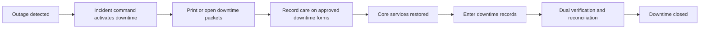

# Downtime Mode

## Purpose
Define planned and unplanned downtime procedures for the **Hospital Information System** so clinical care can continue safely and records can later be reconciled to the electronic source of truth.

## Downtime Activation Criteria
- Tier 1 clinical workflows unavailable beyond five minutes.
- Campus network isolation from cloud platform.
- Identity provider outage that blocks most clinical logins.
- Major external integration outage combined with unsafe manual workaround risk.

## Downtime Workflow

## Planned Downtime Requirements
- Publish maintenance window, impacted workflows, and fallback instructions at least 72 hours ahead unless emergency change is approved.
- Print or stage downtime packets for registration, admission, medication administration, orders, and results review.
- Freeze non-essential integrations and queue outbound traffic to avoid split-brain data.
- Capture pre-downtime snapshots for active census, active orders, MAR due list, pending critical results, and unsent claims.

## Unplanned Downtime Requirements
- Activate downtime banner and on-unit communication tree.
- Use local downtime identifiers for new patients or encounters when online search is not possible.
- Record administration times, order times, and result receipt times on downtime forms with author initials.
- Manual verbal result escalation remains in effect for critical values.

## Back-Entry and Reconciliation Rules

| Record Type | Reconciliation Requirement |
|---|---|
| New patient registration | MPI search rerun before final create, temporary downtime ID retained as alias |
| Admission or transfer | compare downtime census with ADT occupancy before commit |
| Medication administration | dual verification against MAR, downtime form, and witness when required |
| Lab and radiology orders | preserve original occurrence time and ordering provider |
| Results received during downtime | mark as downtime-imported and re-run critical result alert logic if acknowledgement absent |
| Discharge | ensure summary, disposition, and charge capture are all represented before closing encounter |

## Source-of-Truth and Provenance Rules
- Online services remain the authoritative record once restored.
- Downtime entries must carry original occurrence timestamp, entry timestamp, source document reference, and reconciler identity.
- Rejected downtime entries remain in the reconciliation queue with reason and supervisor assignment.
- No downtime record is deleted after import. Errors are corrected through standard amendment workflows.

## Drill and Verification Expectations
- Run downtime drill at least twice per year covering admissions, medication administration, and critical result escalation.
- Measure time to activate downtime, time to back-enter, percent of records reconciled without exception, and unresolved variance count.
- Keep printable and offline-access instructions versioned and linked to current forms.

