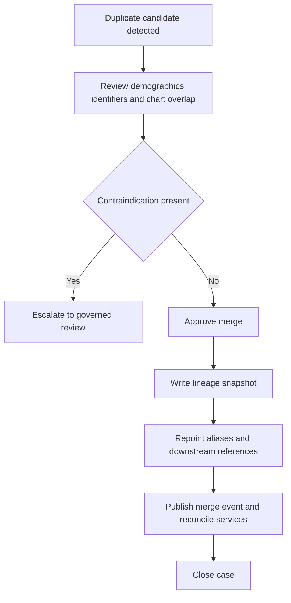

# Patient Identity Merge

## Purpose
Define the governance and technical workflow for duplicate patient detection, merge, and unmerge in the **Hospital Information System**.

## Merge Risk Categories

| Category | Example | Handling |
|---|---|---|
| Low risk duplicate | same legal name, DOB, phone, and national ID | MPI analyst review with single approval |
| Medium risk duplicate | partial demographic mismatch but strong historical linkage | dual review by MPI analyst and registrar |
| High risk duplicate | neonatal twins, trauma aliases, deceased mismatch, legal hold | mandatory dual approval plus physician validation |
| Prohibited auto-merge | conflicting sex, incompatible age, active legal hold conflict | no merge until manual adjudication |

## Merge Workflow

## Merge Preconditions
- Source and target patients must be active or explicitly restorable.
- Any conflicting deceased status, legal hold, VIP status, or consent directive requires manual review.
- Merge cannot proceed while an unmerge case is open for either patient.
- Target patient must be selected according to hospital policy, usually the chart with most complete history or earliest enterprise identity.

## Technical Merge Steps
1. Freeze new merge-sensitive updates on both patient charts for the duration of merge transaction.
2. Persist merge case, approvals, contraindication review, and pre-merge snapshots.
3. Repoint aliases, encounters, admissions, orders, results, medications, billing references, and consent directives according to lineage rules.
4. Publish `patient_merged` event with source and target IDs, merge case ID, and downstream reconciliation requirements.
5. Mark source chart as inactive merged alias, never hard-delete.
6. Track downstream service reconciliation until all required services report complete.

## Unmerge Requirements
- Unmerge is allowed only when a merge case has intact pre-merge snapshot and governance approval.
- Downstream reconciliation must reverse foreign-key reassignments using stored snapshot mappings.
- Orders, results, claims, and audit evidence created after merge require manual adjudication if ownership is now ambiguous.
- Unmerge always creates a new review task for consent, billing, and interface replay verification.

## External System Considerations
- FHIR patient resources must continue to resolve old identifiers through alias mapping after merge.
- HL7 ADT merge messages must be replayable and idempotent for downstream systems.
- External payer or HIE references may require manual partner notification when identifiers cannot be updated automatically.

## Monitoring and Evidence
- Monitor duplicate rate, merge backlog, unmerge count, and downstream reconciliation lag.
- Every merge package includes candidate rationale, approvers, impacted services, snapshot ID, and post-merge verification results.
- High-risk merges require retrospective chart review to ensure allergies, active orders, and billing accounts remain correct.

