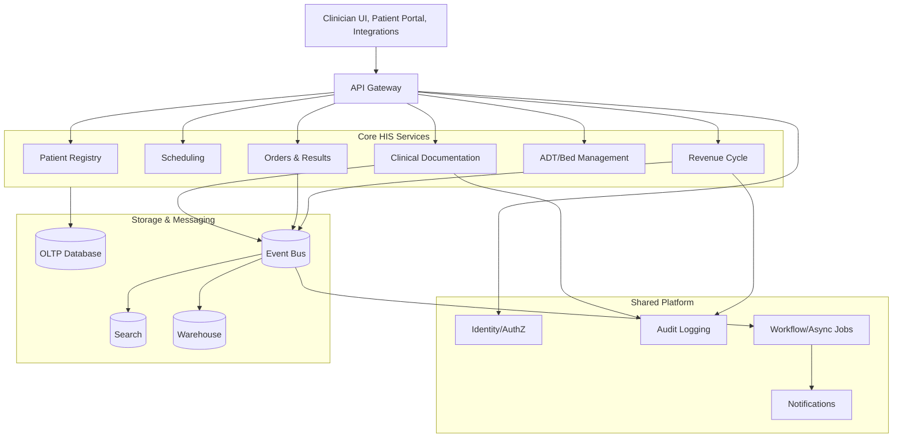

# Architecture Diagram

```mermaid
flowchart TB
    Channels[Clinician UI, Patient Portal, Integrations] --> Edge[API Gateway]

    subgraph Services[Core HIS Services]
      Patient[Patient Registry]
      Scheduling[Scheduling]
      Clinical[Clinical Documentation]
      Orders[Orders & Results]
      Admission[ADT/Bed Management]
      Billing[Revenue Cycle]
    end

    Edge --> Patient
    Edge --> Scheduling
    Edge --> Clinical
    Edge --> Orders
    Edge --> Admission
    Edge --> Billing

    subgraph Shared[Shared Platform]
      Auth[Identity/AuthZ]
      Audit[Audit Logging]
      Jobs[Workflow/Async Jobs]
      Notify[Notifications]
    end

    Edge --> Auth
    Clinical --> Audit
    Billing --> Audit

    subgraph Storage[Storage & Messaging]
      DB[(OLTP Database)]
      MQ[(Event Bus)]
      Search[(Search)]
      WH[(Warehouse)]
    end

    Services --> DB
    Clinical --> MQ
    Orders --> MQ
    Billing --> MQ
    MQ --> Jobs
    MQ --> Search
    MQ --> WH
    Jobs --> Notify
```
