# Architecture Diagram — Hospital Information System

| Field   | Value                                      |
|---------|--------------------------------------------|
| Version | 1.0.0                                      |
| Status  | Approved                                   |
| Date    | 2025-01-30                                 |
| Authors | HIS Architecture Team                      |

---

## Table of Contents

1. [Overview](#1-overview)
2. [High-Level Architecture Diagram](#2-high-level-architecture-diagram)
3. [Microservices Description](#3-microservices-description)
4. [Technology Stack](#4-technology-stack)
5. [Communication Patterns](#5-communication-patterns)
6. [Security Architecture](#6-security-architecture)
7. [Data Architecture](#7-data-architecture)
8. [Scalability Design](#8-scalability-design)

---

## 1. Overview

The Hospital Information System (HIS) is built on a **microservices architecture** aligned with **Domain-Driven Design (DDD)** principles. Each microservice corresponds to a distinct bounded context within the hospital domain — encapsulating its own data model, business logic, and persistence layer. Services communicate asynchronously via a central event bus for workflows and synchronously via REST/gRPC for real-time queries.

Key architectural principles:

- **Bounded Context Isolation** — each service owns its schema; no shared databases across services.
- **Event-Driven Workflows** — clinical events (orders, results, admissions) propagate via Kafka topics, decoupling producers from consumers.
- **CQRS + Event Sourcing** — command and query sides are separated for high-throughput domains (Billing, Clinical). Full audit trails are maintained via an immutable event store.
- **Zero-Trust Security** — all inter-service calls are authenticated via mTLS through Istio; external calls authenticate via Keycloak-issued JWTs.
- **Observability-First** — distributed tracing (Jaeger), structured logging (ELK), and metrics (Prometheus/Grafana) are mandatory for every service.
- **FHIR Compliance** — an HL7 FHIR adapter layer exposes standardized interfaces for external EHR/HIE integrations.

---

## 2. High-Level Architecture Diagram

```mermaid
flowchart TD
    subgraph CLIENTS["Client Layer"]
        WEB["Web Portal\n(React SPA)"]
        MOB["Mobile App\n(React Native)"]
        EXT["External Systems\n(HL7 / FHIR)"]
    end

    subgraph EDGE["Edge & API Layer"]
        GW["API Gateway\n(Kong)"]
        AUTH["Auth Service\n(Keycloak)"]
        FHIR["HL7 FHIR Adapter\n(HAPI FHIR / Java)"]
    end

    subgraph CORE["Core Microservices"]
        PAT["Patient Service"]
        APT["Appointment Service"]
        CLI["Clinical Service"]
        ADT["ADT Service"]
        STA["Staff Service"]
        OT["OT Service"]
        PHA["Pharmacy Service"]
        LAB["Lab Service"]
        RAD["Radiology Service"]
        BIL["Billing Service"]
        INS["Insurance Service"]
        NOT["Notification Service"]
        ANA["Analytics Service"]
    end

    subgraph INFRA["Shared Infrastructure"]
        BUS["Event Bus\n(Apache Kafka 3.5)"]
        REG["Service Registry\n(Consul)"]
        CFG["Config Service\n(Vault + Spring Cloud Config)"]
        MESH["Service Mesh\n(Istio 1.18)"]
    end

    subgraph DATA["Data Layer"]
        PG_PAT[("Patient DB\nPostgreSQL 15")]
        PG_CLI[("Clinical DB\nPostgreSQL 15")]
        PG_BIL[("Billing DB\nPostgreSQL 15")]
        PG_PHA[("Pharmacy DB\nPostgreSQL 15")]
        PG_LAB[("Lab DB\nPostgreSQL 15")]
        PG_RAD[("Radiology DB\nPostgreSQL 15")]
        PG_ADT[("ADT DB\nPostgreSQL 15")]
        REDIS[("Redis 7\nCache / Sessions")]
        ES[("Elasticsearch 8\nSearch / Logs")]
        S3[("Object Storage\nS3 / MinIO")]
    end

    subgraph EXTERNAL["External Integrations"]
        PAYGW["Payment Gateway\n(Stripe / Razorpay)"]
        INSNET["Insurance Network\n(TPA / Payer APIs)"]
        PACS["PACS Server\n(Radiology Images)"]
        SMSEM["SMS & Email\n(Twilio / SendGrid)"]
        GOVT["Government HIE\n(ABDM / FHIR)"]
    end

    WEB --> GW
    MOB --> GW
    EXT --> FHIR --> GW

    GW --> AUTH
    GW --> PAT
    GW --> APT
    GW --> CLI
    GW --> ADT
    GW --> STA
    GW --> OT
    GW --> PHA
    GW --> LAB
    GW --> RAD
    GW --> BIL
    GW --> INS
    GW --> ANA

    PAT --> PG_PAT
    CLI --> PG_CLI
    BIL --> PG_BIL
    PHA --> PG_PHA
    LAB --> PG_LAB
    RAD --> PG_RAD
    ADT --> PG_ADT

    PAT --> REDIS
    APT --> REDIS
    BIL --> REDIS

    PAT --> ES
    CLI --> ES
    LAB --> ES

    RAD --> S3
    CLI --> S3

    PAT --> BUS
    CLI --> BUS
    ADT --> BUS
    APT --> BUS
    PHA --> BUS
    LAB --> BUS
    BIL --> BUS
    INS --> BUS

    BUS --> NOT
    BUS --> ANA
    BUS --> BIL
    BUS --> CLI

    BIL --> PAYGW
    INS --> INSNET
    RAD --> PACS
    NOT --> SMSEM
    FHIR --> GOVT
```



---

## 3. Microservices Description

| Service | Responsibility | Key APIs | Data Store | Events Published |
|---|---|---|---|---|
| **Patient Service** | Master patient record, EMPI, demographics, allergies, immunizations | `POST /patients`, `GET /patients/{mrn}`, `PUT /patients/{id}/demographics` | PostgreSQL (patient_db) | `PatientRegistered`, `PatientUpdated`, `DuplicateFlagged` |
| **Appointment Service** | Scheduling, slot management, calendar, reminders | `GET /slots`, `POST /appointments`, `PUT /appointments/{id}/cancel` | PostgreSQL (appointment_db) | `AppointmentBooked`, `AppointmentCancelled`, `ReminderTriggered` |
| **Clinical Service** | Encounters, notes, diagnoses, orders, vitals, procedures | `POST /encounters`, `POST /orders`, `GET /encounters/{id}/notes` | PostgreSQL (clinical_db) | `EncounterOpened`, `OrderPlaced`, `DiagnosisRecorded`, `EncounterClosed` |
| **ADT Service** | Admissions, discharges, transfers, bed management | `POST /admissions`, `PUT /admissions/{id}/transfer`, `POST /discharges` | PostgreSQL (adt_db) | `PatientAdmitted`, `PatientTransferred`, `PatientDischarged` |
| **Pharmacy Service** | Medication orders, formulary, dispensing, MAR | `POST /prescriptions`, `GET /formulary`, `PUT /orders/{id}/dispense` | PostgreSQL (pharmacy_db) | `MedicationOrdered`, `MedicationDispensed`, `MedicationAdministered` |
| **Lab Service** | Lab orders, specimen tracking, result entry, critical values | `POST /lab-orders`, `PUT /lab-orders/{id}/results`, `GET /results/{id}` | PostgreSQL (lab_db) | `LabOrderPlaced`, `SpecimenCollected`, `ResultPosted`, `CriticalValueAlert` |
| **Radiology Service** | Radiology orders, DICOM integration, reports, PACS link | `POST /radiology-orders`, `GET /reports/{id}`, `PUT /orders/{id}/report` | PostgreSQL (radiology_db), S3 | `RadiologyOrdered`, `ImageAcquired`, `ReportFinalized` |
| **Billing Service** | Charge capture, invoicing, payment, revenue cycle management | `POST /charges`, `POST /invoices`, `GET /invoices/{id}` | PostgreSQL (billing_db) | `ChargePosted`, `InvoiceGenerated`, `PaymentReceived`, `ClaimSubmitted` |
| **Insurance Service** | Eligibility checks, pre-authorization, claims, denial management | `POST /eligibility`, `POST /claims`, `GET /claims/{id}/status` | PostgreSQL (insurance_db) | `EligibilityVerified`, `PreAuthApproved`, `ClaimAdjudicated`, `DenialReceived` |
| **Notification Service** | SMS, email, push alerts, in-app messages | `POST /notifications`, `GET /notifications/{patientId}` | Redis (queue), PostgreSQL (log) | _(consumer only)_ |
| **Analytics Service** | Reporting, dashboards, population health analytics, KPIs | `GET /reports/{type}`, `POST /queries` | Elasticsearch, ClickHouse | _(consumer only)_ |
| **Staff Service** | Employee records, departments, rosters, credentials, licensing | `GET /staff/{id}`, `POST /departments`, `GET /rosters` | PostgreSQL (staff_db) | `StaffOnboarded`, `SchedulePublished` |
| **OT Service** | OT scheduling, surgical notes, instrument tracking, post-op care | `POST /ot-bookings`, `PUT /ot-bookings/{id}/notes`, `GET /ot/schedule` | PostgreSQL (ot_db) | `OTBooked`, `SurgeryStarted`, `SurgeryCompleted` |

---

## 4. Technology Stack

| Layer | Technology | Version | Purpose | Notes |
|---|---|---|---|---|
| **API Runtime** | Node.js + TypeScript | 20 LTS | REST microservices | Fastify framework; OpenAPI 3.1 specs |
| **Analytics Runtime** | Python | 3.12 | ML, reporting, ETL pipelines | FastAPI, Pandas, scikit-learn |
| **FHIR Adapter** | Java + HAPI FHIR | JDK 21 | HL7 FHIR R4 interoperability | Spring Boot 3.2 |
| **Primary Database** | PostgreSQL | 15 | Per-service relational data store | TimescaleDB extension for vitals/time-series |
| **Cache & Sessions** | Redis | 7 | Token cache, session store, rate limiting | Redis Cluster mode; Sentinel for HA |
| **Search** | Elasticsearch | 8 | Full-text patient search, audit log queries | ELK stack; ILM policies per index |
| **Event Bus** | Apache Kafka | 3.5 | Async inter-service domain events | Confluent Schema Registry (Avro schemas) |
| **Object Storage** | MinIO / AWS S3 | — | DICOM images, documents, scanned reports | WORM bucket policy; AES-256 SSE |
| **API Gateway** | Kong | 3.4 | Rate limiting, auth, routing, WAF | Declarative DB-less config via Kubernetes CRDs |
| **Identity & Access** | Keycloak | 22 | OAuth 2.0 / OIDC, RBAC, SSO, MFA | Realm per hospital tenant; LDAP integration |
| **Container Runtime** | Docker | 24 | Service packaging and distribution | Multi-stage builds; distroless base images |
| **Orchestration** | Kubernetes | 1.28 | Scheduling, scaling, self-healing | EKS / GKE / on-prem via kubeadm |
| **Service Mesh** | Istio | 1.18 | mTLS, traffic management, circuit breaking | Envoy sidecar proxy; Kiali dashboard |
| **Metrics** | Prometheus + Grafana | 2.47 / 10 | Service metrics, SLO alerting | 28 pre-built dashboards per domain |
| **Distributed Tracing** | Jaeger | 1.50 | End-to-end request trace correlation | OpenTelemetry SDK in all services |
| **Log Aggregation** | Fluentd + Kibana | — | Centralized structured log search | 90 days hot; 7 years cold (compliance) |
| **CI/CD** | GitHub Actions + ArgoCD | — | GitOps continuous delivery | Helm charts per service; canary rollouts |
| **Secrets Management** | HashiCorp Vault | 1.14 | DB credentials, API keys, TLS certs | Dynamic secrets for PostgreSQL (TTL 1h) |
| **Config Management** | Spring Cloud Config | — | Externalized runtime configuration | Git-backed config repository |
| **Service Registry** | Consul | 1.16 | Service discovery, health checks | DNS interface for Kubernetes service mesh |

---

## 5. Communication Patterns

### 5.1 Synchronous REST (Queries and User-Facing Commands)
Used when the client requires an immediate response. All external-facing APIs use REST over HTTPS routed through the API Gateway. Inter-service REST calls are routed through Istio with mTLS enforcement.

- **Patient lookup** — `GET /patients/{mrn}` returns demographics in < 150 ms.
- **Slot availability** — `GET /slots?doctorId=&date=` queries the Appointment Service directly.
- **Drug formulary check** — `GET /formulary?drugId=` returns formulary status synchronously during order entry.

### 5.2 Asynchronous Domain Events (Workflows and Side Effects)
Domain events are published to Kafka topics. Consumers subscribe and react independently, ensuring loose coupling, backpressure handling, and resilience to downstream failures.

| Event | Producer | Consumers | Kafka Topic |
|---|---|---|---|
| `PatientRegistered` | Patient Service | Notification, Analytics | `his.patient.patient.registered` |
| `OrderPlaced` | Clinical Service | Pharmacy, Lab, Radiology | `his.clinical.order.placed` |
| `ResultPosted` | Lab Service | Clinical, Notification | `his.lab.result.posted` |
| `CriticalValueAlert` | Lab Service | Notification, Clinical | `his.lab.result.critical` |
| `InvoiceGenerated` | Billing Service | Insurance, Notification | `his.billing.invoice.generated` |
| `PatientAdmitted` | ADT Service | Billing, Notification | `his.adt.admission.created` |
| `PatientDischarged` | ADT Service | Billing, Clinical | `his.adt.discharge.completed` |

### 5.3 gRPC (Internal High-Throughput Calls)
Used for latency-sensitive internal calls where HTTP/1.1 overhead is undesirable.

- **Clinical → Drug Safety Service**: real-time interaction/allergy check during order entry (SLA: < 50 ms).
- **ADT → Patient Service**: demographic validation during admission (SLA: < 80 ms).
- **Billing → Insurance Service**: real-time eligibility check at check-in (SLA: < 200 ms).

### 5.4 Event Topic Naming Convention

```
his.<domain>.<aggregate>.<event-verb>
Examples:
  his.patient.patient.registered
  his.clinical.order.placed
  his.lab.result.posted
  his.billing.invoice.generated
  his.adt.admission.created
```

---

## 6. Security Architecture

### 6.1 Authentication and Authorization
- All clients authenticate via **Keycloak** (OAuth 2.0 / OIDC). Access tokens (JWT) include role and department claims.
- **RBAC roles**: `patient`, `registrar`, `nurse`, `physician`, `pharmacist`, `lab_tech`, `radiologist`, `billing_staff`, `admin`, `super_admin`.
- Fine-grained authorization (attribute-based access control) is enforced at service level via **OPA (Open Policy Agent)**.
- Multi-factor authentication (TOTP) is mandatory for clinical roles accessing PHI.

### 6.2 Network Security
- **API Gateway** (Kong): request/response validation, rate limiting (per IP and per user), WAF plugin, IP allowlists for administrative APIs.
- **Istio mTLS**: all pod-to-pod communication is encrypted. `PeerAuthentication` policies set to `STRICT` mode across all namespaces.
- **Kubernetes NetworkPolicy**: pods can only receive traffic from explicitly allowed sources.
- **Egress control**: external network calls are routed through Istio `ServiceEntry` with allowlisted hostnames only.

### 6.3 Data Security
- **Encryption at rest**: LUKS disk encryption at node level; PostgreSQL column-level encryption for SSN, DOB using `pgcrypto`.
- **Encryption in transit**: TLS 1.3 minimum; certificate rotation every 90 days via cert-manager + Vault PKI.
- **PHI field masking**: a logging middleware strips/masks fields (`ssn`, `dob`, `phone`, `address`) from all structured logs before emission.
- **Vault dynamic secrets**: services receive short-lived PostgreSQL credentials (TTL: 1 hour) and rotate them automatically.

### 6.4 Audit and Compliance
- Every state-changing API call (POST, PUT, PATCH, DELETE) is recorded in an immutable Elasticsearch audit index with actor, resource, action, timestamp, and IP.
- Kafka event store retains all domain events for 7 years (HIPAA §164.312, HITECH compliance).
- DPDP Act compliance: patient consent records managed in Patient Service with granular consent tracking per data category.
- Quarterly penetration testing; VAPT findings tracked to closure before major releases.

---

## 7. Data Architecture

### 7.1 Per-Service Database Pattern
Each microservice exclusively owns its database schema. Cross-service data access is achieved only via published APIs or event consumption — never via direct DB queries across service boundaries. This enables independent schema migrations, technology choice per service, and prevents cascading failures.

### 7.2 CQRS (Command Query Responsibility Segregation)
Applied to Billing and Clinical services where write and read patterns diverge significantly:
- **Command side**: transactional PostgreSQL, normalized schema, strict ACID consistency.
- **Query side**: denormalized read projections in Elasticsearch/Redis, updated by Kafka consumer projectors.

### 7.3 Event Sourcing for Audit Trail
Clinical encounters and billing transactions are persisted as immutable event sequences. Current state is derived by replaying events from the event store. Benefits:
- Complete audit trail without soft-delete patterns.
- Ability to reconstruct any past state for legal or compliance review.
- Natural integration with the event-driven architecture.

### 7.4 Data Retention Policy

| Data Category | Hot Storage | Warm Storage | Cold Archive |
|---|---|---|---|
| Patient records | Lifetime in PostgreSQL | — | Encrypted offsite backup |
| Clinical notes | 10 years active | S3 Infrequent Access | S3 Glacier |
| Billing records | 7 years active | S3 Infrequent Access | S3 Glacier |
| Lab results | 5 years active | S3 Infrequent Access | S3 Glacier |
| Audit logs | 90 days Elasticsearch | PostgreSQL archive | S3 Glacier (7 years) |
| DICOM images | 5 years PACS | S3 Infrequent Access | S3 Glacier |
| Kafka events | 30 days broker | — | S3 (7 years) |

---

## 8. Scalability Design

### 8.1 Horizontal Pod Autoscaling
Each microservice is deployed as a Kubernetes Deployment with HPA configured on:
- **CPU utilization**: scale up when average CPU > 60%.
- **Custom Kafka consumer lag metric**: for event-driven services (Notification, Analytics), scale when lag > 5,000 messages.
- **HTTP request rate**: for Patient and Appointment services during peak OPD hours (8 AM – 12 PM).

Minimum replicas per service in production: 2. Maximum: 10 (adjustable per domain).

### 8.2 Database Scaling

| Technique | Applied To | Description |
|---|---|---|
| Read replicas | All PostgreSQL clusters | At least 1 replica per cluster; read APIs routed to replica |
| PgBouncer connection pooling | All clusters | Transaction pooling; max 100 DB connections per service |
| Date-range partitioning | lab_results, vitals, audit_logs | Monthly partitions; old partitions moved to S3 |
| Sharding (future) | Patient DB (> 5M records) | Hash sharding by `patient_id` using Citus extension |

### 8.3 Caching Strategy

| Cache Layer | Technology | TTL | Use Case |
|---|---|---|---|
| API response cache | Redis | 5 minutes | Patient demographics, formulary data |
| Session tokens | Redis | 8 hours | Authenticated clinician sessions |
| Slot availability | Redis | 30 seconds | Real-time scheduling grid |
| FHIR resource bundles | Redis | 10 minutes | External HIE query responses |
| Bed occupancy map | Redis | 15 seconds | ADT dashboard real-time view |

### 8.4 Production Load Targets

| Service | Peak RPS | P99 Latency Target | Availability SLA |
|---|---|---|---|
| Patient Service | 2,000 | 150 ms | 99.9% |
| Appointment Service | 1,500 | 200 ms | 99.9% |
| Clinical Service | 3,000 | 300 ms | 99.95% |
| Billing Service | 1,000 | 500 ms | 99.9% |
| Lab Service | 2,500 | 200 ms | 99.95% |
| Pharmacy Service | 1,500 | 250 ms | 99.95% |
| Notification Service | 5,000 | 1,000 ms | 99.5% |
| Analytics Service | 200 | 2,000 ms | 99.0% |
