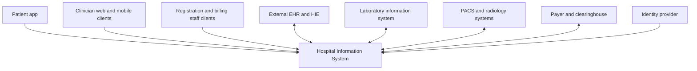
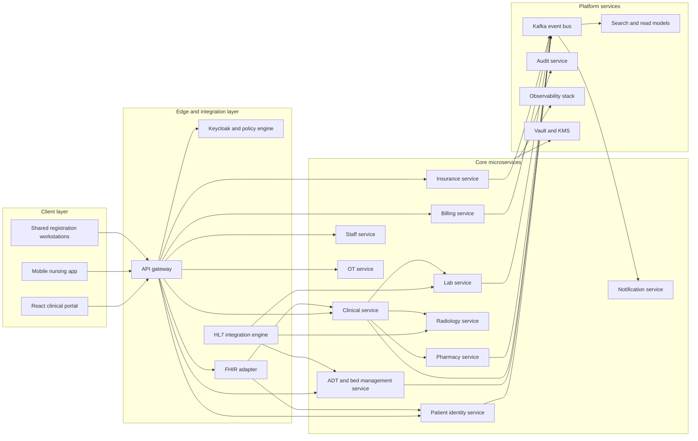
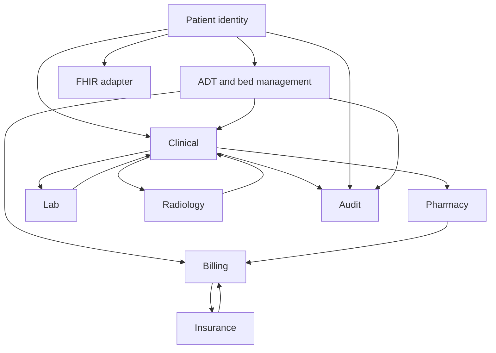

# C4 Diagrams

## Purpose
Describe the C4 context, container, and service-boundary views for the **Hospital Information System** in a way that aligns with the approved microservices architecture and interoperability model.

## C1 Context Diagram

### Context Responsibilities
- The HIS is the system of record for patient identity, ADT, encounters, orders, medication administration, discharge, and charge capture.
- External EHR and HIE systems consume or supply normalized FHIR resources through the FHIR adapter.
- LIS and PACS exchange order, result, accession, and imaging metadata through HL7 or vendor connectors.
- Payer networks handle eligibility, pre-auth, claims, and remittance. They are never the source of truth for hospital clinical state.

## C2 Container Diagram

### Container Responsibilities

| Container | Responsibility | Data Ownership |
|---|---|---|
| API gateway | Authenticated ingress, rate limiting, routing, correlation ID propagation | No PHI persistence |
| Auth and policy | OIDC tokens, RBAC, ABAC, break-glass policy, service identity | Identity metadata and policy bundles |
| FHIR adapter | Resource translation between internal models and FHIR R4 | Adapter cache only |
| HL7 integration engine | HL7 v2 MLLP routing, ACK handling, replay, mapping | Message journal |
| Core microservices | Domain workflows and authoritative state | Each service owns its schema |
| Kafka | Domain event transport and durable replay log | Event topics and archive |
| Audit service | Immutable access and mutation evidence | Audit store |
| Search and read models | Bed board, chart timeline, MPI search, operational dashboards | Derived projections only |
| Observability | Metrics, logs, traces, alerting | Telemetry only |

## C3 Service Collaboration Diagram

## Architectural Constraints
- Each domain service owns its database and publishes events instead of allowing direct cross-service table access.
- Patient identity is the source for enterprise patient ID, alias lineage, consent flags, and merge decisions.
- ADT owns admission segments, bed occupancy, transfer history, and discharge disposition.
- Clinical owns encounter timeline, notes, diagnoses, and non-departmental order orchestration.
- Pharmacy, lab, and radiology each own fulfillment state for their orderable domains while Clinical retains the clinician-facing order shell.
- Billing and insurance are downstream consumers of clinical and ADT events. They must tolerate late or corrected clinical data.
- All inter-service traffic uses mTLS and zero-trust policy enforcement.

## Cross-Cutting Control Services
- **Audit service** records PHI reads, merge actions, break-glass events, order corrections, and release promotions.
- **Notification service** handles critical results, order verification prompts, patient communications, and outage notices.
- **Observability stack** exposes SLO dashboards for registration, ADT, medication administration, and interface delivery.
- **Search and read models** build denormalized dashboards such as MPI work queue, bed board, and discharge task list.

## Design Decisions for Implementation
1. The FHIR adapter is read-through and command-gateway only. It does not own patient state.
2. HL7 adapters translate message formats but leave business rules to the target domain service.
3. MPI merge workflow remains isolated in Patient Service with event-driven reconciliation tasks to downstream services.
4. Critical result escalation is handled by Lab or Radiology services plus Notification service, not by the general API gateway.
5. Bed management is part of ADT because census, transfer rules, and billing class changes must remain transactionally aligned.

