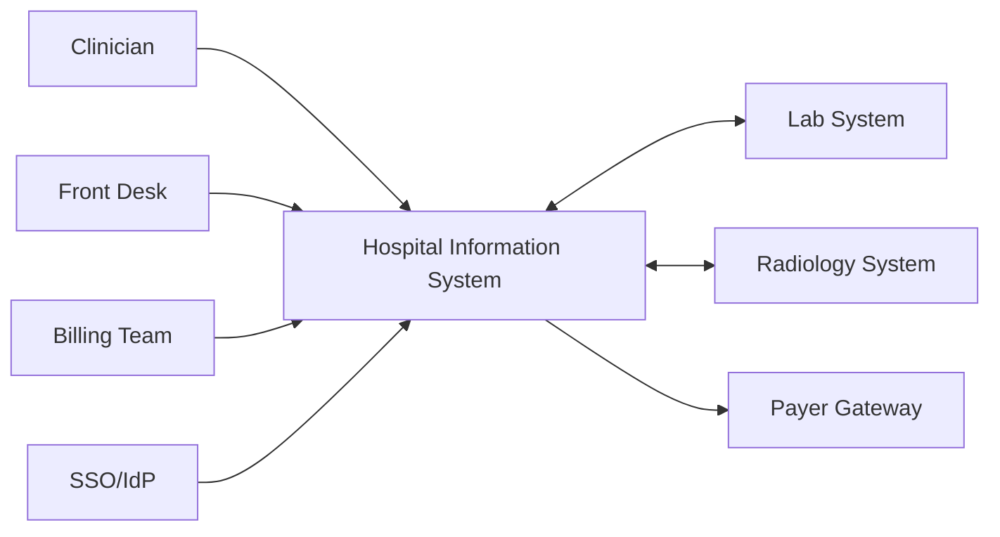
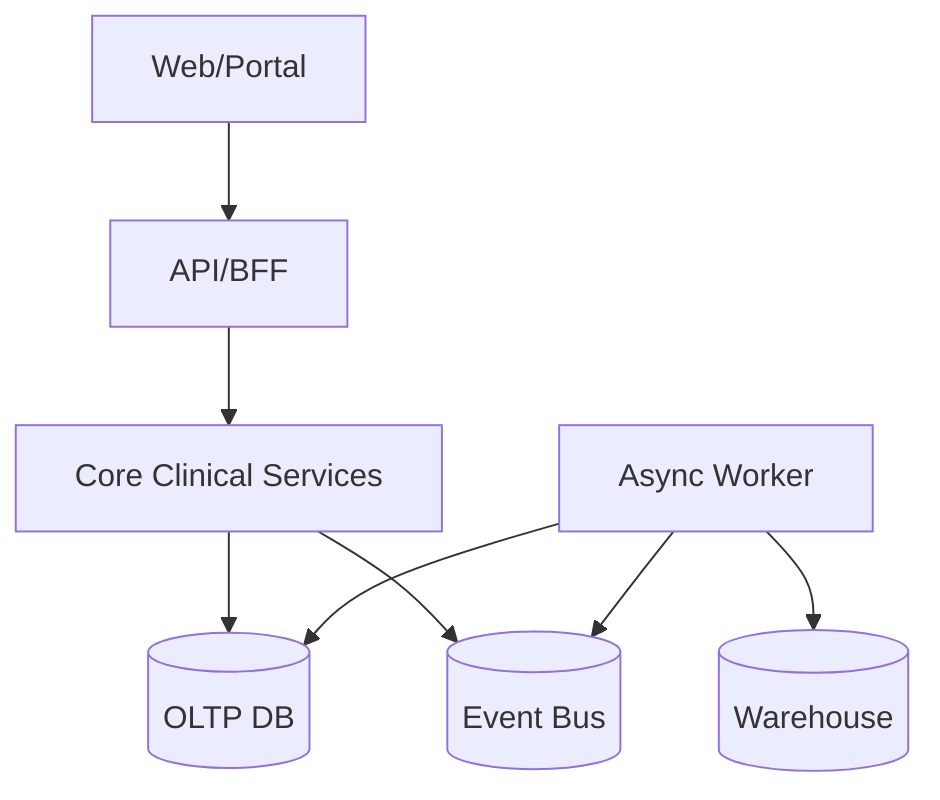
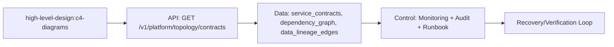

# C4 Diagrams

## C1: Context

## C2: Containers

---

## C4 Narrative and Constraints
### Container Contracts
- UI/BFF is stateless, no PHI persistence, and relies on token-bound session context.
- Core services own transactional boundaries; integration service owns protocol translation.
- Analytics/warehouse are downstream projections, never synchronous dependencies for care workflows.

## File-Specific Implementation Boundaries
This artifact is implementation-focused on **context/container boundaries and constrained dependencies**. The boundaries below are specific to `high-level-design/c4-diagrams.md` and are intentionally not reused as generic filler text.

| Boundary Slice | In Scope for this File | Out of Scope for this File | Implementation Consequence |
|---|---|---|---|
| Channel Boundary | UI/portal/integration ingress and trust establishment | Internal transaction details | Stable ingress contracts and auth context propagation |
| Core Domain Boundary | Patient/ADT/clinical/orders/billing service partitioning | External SLA ownership | Clear ownership and bounded failure domains |
| Platform Boundary | Eventing, observability, identity, and audit services | Domain-specific policy logic | Shared resilience and security foundations |

## Business Rules to API/Data/Operational Controls (File-Specific)
| Rule Focus | API Enforcement Touchpoint | Data Model/Contract Tie-In | Operational Control |
|---|---|---|---|
| Preconditions for `c4-diagrams` workflows must be validated before state mutation. | `GET /v1/platform/topology/contracts` with explicit error taxonomy and correlation IDs. | `service_contracts, dependency_graph, data_lineage_edges` with strict timestamp, actor, and tenant context fields. | Alert on rule-violation rate and route to owner with SLA-backed response. |
| Mutations must be replay-safe and duplicate-proof. | Idempotency checks on mutation endpoints and async consumers. | Uniqueness keys + immutable evidence rows for side-effect tracking. | Replay runbook with pre/post reconciliation and sign-off checklist. |
| Access to sensitive operations must include least-privilege and evidence. | AuthN/AuthZ middleware + policy decision point reason codes. | Audit/event envelopes include policy version and decision outcome. | Quarterly control review and continuous SIEM correlation for anomalies. |

## Interoperability Assumptions for `c4-diagrams.md`
- Contract versions are explicitly pinned; backward compatibility is managed per versioned API/event schema.
- External dependencies are treated as failure-prone; timeout/retry budgets and fallback states are documented in this file's scenarios.
- Observability correlation (`tenant_id`, `actor_id`, `correlation_id`) is required for all critical-path operations in this document scope.

### Interoperability and Control Flow

## Compliance and Security Posture for this Artifact
- Evidence produced by this workflow/design artifact is audit-consumable (who/what/when/why) and linked to incident/postmortem records.
- Sensitive data exposure is minimized using role-scoped access and redaction guidance relevant to `c4-diagrams.md`.
- Operational controls for this file include detection, containment, recovery, and verification steps with named ownership.
