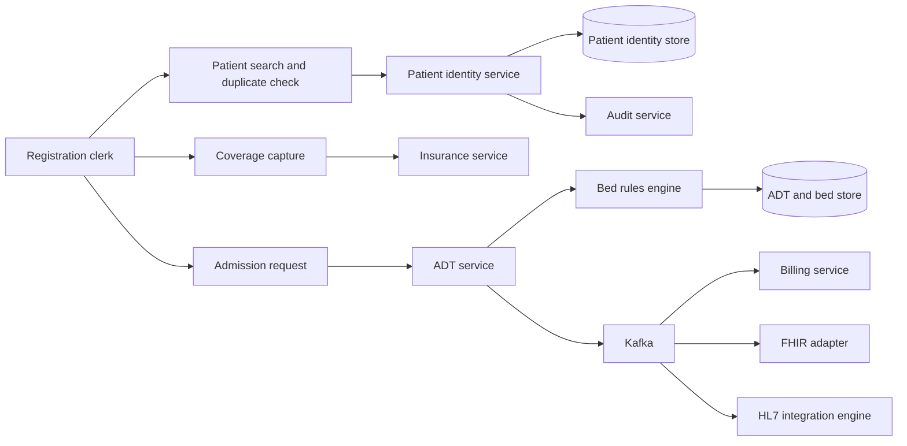
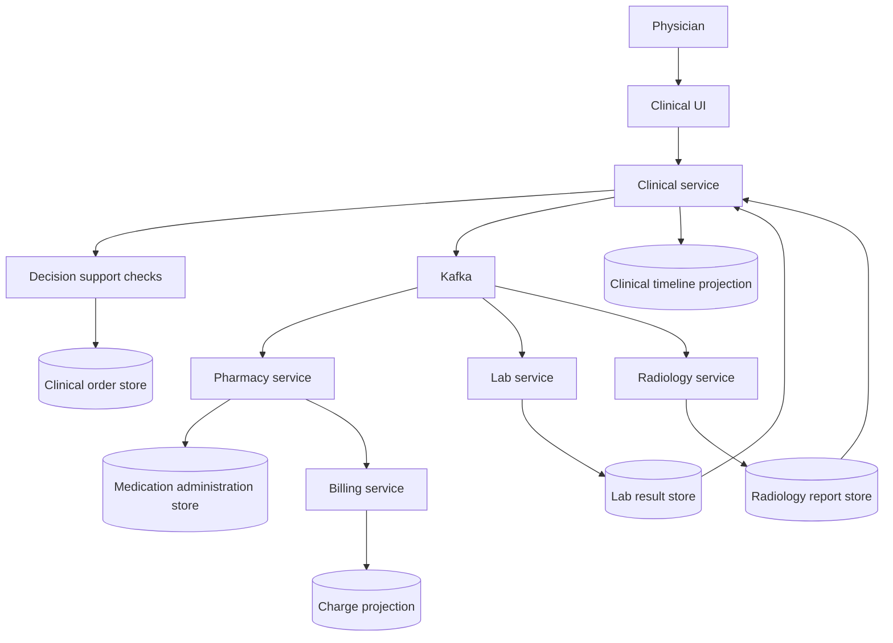
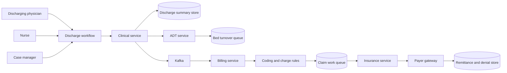
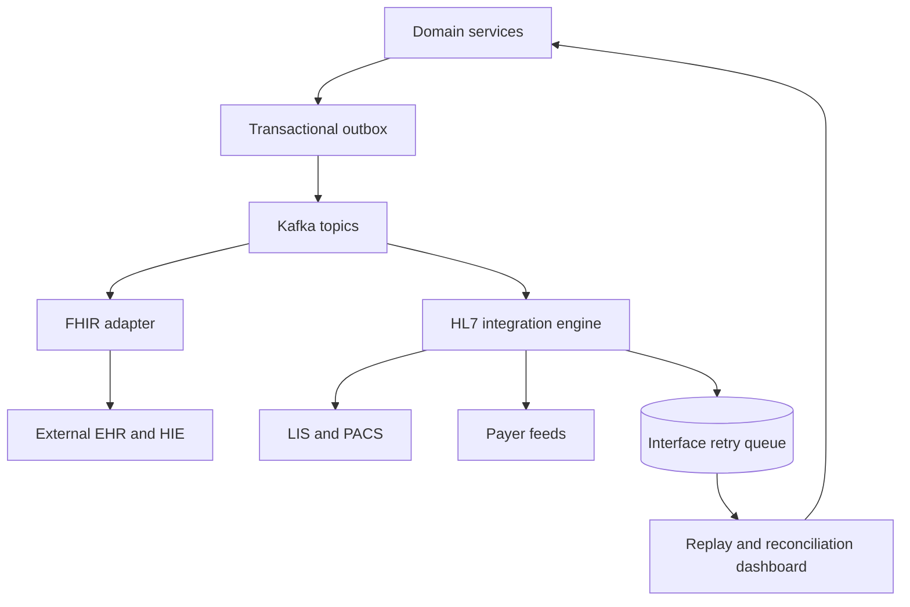

# Data Flow Diagrams

## Purpose
Describe how PHI, operational data, and interoperability payloads move through the **Hospital Information System** for the workflows most critical to patient safety and hospital operations.

## DFD-1 Registration to Admission

**Notes**
- Search-before-create is mandatory. Duplicate review can interrupt the flow before a new MRN is issued.
- Coverage data is copied into the encounter and admission context so later eligibility changes do not rewrite historical facts.
- ADT commits admission and bed occupancy in the same transaction and publishes downstream events via an outbox.

## DFD-2 Clinical Order to Result to Medication Administration

**Notes**
- Clinical Service owns the signed order request and departmental services own execution details.
- Result corrections and order corrections publish new domain events instead of destructive updates.
- Medication administration events feed both the clinical timeline and charge capture projections.

## DFD-3 Discharge to Claim Submission

**Notes**
- Discharge summary sign-off and ADT discharge timestamp are separate records but must be correlated.
- Billing cannot finalize a claim until discharge status, coded diagnoses, and charge completeness all pass validation.
- Payer or clearinghouse failures create retry work items without changing the discharge source of truth.

## DFD-4 External Interoperability and Outage Buffering

## Data Classification and Persistence Rules

| Data Class | Examples | System of Record | Derived Copies |
|---|---|---|---|
| Patient identity | names, aliases, identifiers, demographics, privacy flags | Patient Service | FHIR cache, read models |
| Clinical record | notes, diagnoses, care plans, order shells, consent references | Clinical Service | chart timeline, analytics |
| Department execution | specimen status, dispense status, radiology accession, MAR outcome | owning departmental service | dashboards and billing projection |
| ADT and occupancy | admission segments, transfers, bed status, discharge disposition | ADT Service | bed board, billing projection |
| Revenue cycle | charges, claims, remittance, denials | Billing and Insurance services | finance reports |
| Audit evidence | PHI reads, break-glass, merges, corrections, replay actions | Audit Service | SIEM and compliance exports |

## Flow Control Rules
- All mutating workflows write to the service database and outbox in one local transaction.
- Kafka consumers must be idempotent using message key plus domain version or natural business key.
- Read models may lag temporarily but cannot become authoritative for clinical actions.
- Downtime entry batches are tagged with downtime source, operator, and reconciliation status.
- Sensitive data exports require purpose-of-use, recipient, and retention metadata.

