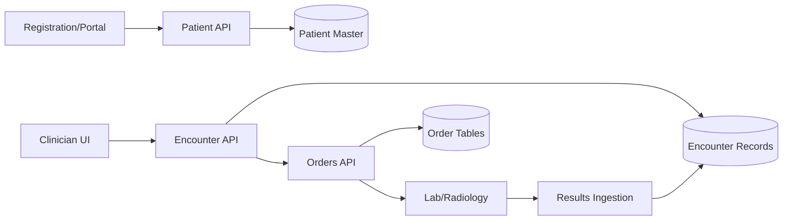
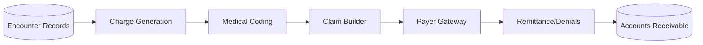

# Data Flow Diagrams

## Clinical Data Flow

```mermaid
flowchart LR
    Intake[Registration/Portal] --> PatientAPI[Patient API]
    PatientAPI --> PatientStore[(Patient Master)]

    ClinicalUI[Clinician UI] --> EncounterAPI[Encounter API]
    EncounterAPI --> EncounterStore[(Encounter Records)]
    EncounterAPI --> OrdersAPI[Orders API]
    OrdersAPI --> OrderStore[(Order Tables)]
    OrdersAPI --> ExternalLab[Lab/Radiology]
    ExternalLab --> ResultsIngest[Results Ingestion]
    ResultsIngest --> EncounterStore
```

## Revenue Cycle Data Flow

```mermaid
flowchart LR
    EncounterStore[(Encounter Records)] --> ChargeEngine[Charge Generation]
    ChargeEngine --> Coding[Medical Coding]
    Coding --> Claims[Claim Builder]
    Claims --> PayerGateway[Payer Gateway]
    PayerGateway --> Remit[Remittance/Denials]
    Remit --> AR[(Accounts Receivable)]
```
