# Domain Model — Hospital Information System

| Field   | Value                                      |
|---------|--------------------------------------------|
| Version | 1.0.0                                      |
| Status  | Approved                                   |
| Date    | 2025-01-30                                 |
| Authors | HIS Domain Architecture Team               |

---

## Table of Contents

1. [Overview](#1-overview)
2. [Bounded Contexts](#2-bounded-contexts)
3. [Domain Model Class Diagram](#3-domain-model-class-diagram)
4. [Aggregate Roots Description](#4-aggregate-roots-description)
5. [Domain Services](#5-domain-services)
6. [Domain Events Summary](#6-domain-events-summary)

---

## 1. Overview

The HIS domain model is structured using **Domain-Driven Design (DDD)** principles. The domain is partitioned into **bounded contexts**, each representing a cohesive subdomain of hospital operations with its own ubiquitous language, models, and team ownership.

Key DDD constructs used:

- **Aggregate Roots** — entry points for all state changes within a cluster of related entities. Invariants are enforced at aggregate boundaries.
- **Entities** — objects with identity that persists through state changes (e.g., `Patient`, `Encounter`).
- **Value Objects** — immutable descriptors with no identity (e.g., `Address`, `ContactInfo`, `DiagnosisCode`).
- **Domain Events** — records of significant facts that happened in the domain, used for cross-context integration.
- **Domain Services** — stateless operations that span multiple aggregates or enforce cross-aggregate business rules.
- **Repositories** — abstraction over persistence for each aggregate root.

Context map relationships:
- **Patient Identity Context** is upstream of almost all other contexts (Shared Kernel: patient MRN).
- **Clinical Context** consumes from Scheduling, ADT, Patient Identity, Pharmacy, Lab, Radiology.
- **Billing Context** is downstream of Clinical, ADT, Insurance.

---

## 2. Bounded Contexts

| Bounded Context | Subdomain Type | Core Concepts | Team Ownership |
|---|---|---|---|
| **Patient Identity Context** | Core Domain | Patient demographics, EMPI, MRN, de-duplication, consent, allergies, immunizations | Patient Platform Team |
| **Clinical Context** | Core Domain | Encounters, SOAP notes, diagnoses (ICD-10), procedures (CPT), vitals, orders, clinical decision support | Clinical Engineering Team |
| **Pharmacy Context** | Core Domain | Medication orders, formulary, drug interaction/allergy safety checks, dispensing, MAR | Pharmacy Platform Team |
| **Laboratory Context** | Core Domain | Lab orders, panels, specimen tracking, result entry, reference ranges, critical value alerts | Lab Engineering Team |
| **Radiology Context** | Core Domain | Radiology orders, modality worklists, DICOM image management, reporting, PACS integration | Radiology Platform Team |
| **Billing Context** | Core Domain | Charge capture, CDM, invoicing, payment plans, revenue cycle management | Revenue Cycle Team |
| **Insurance Context** | Supporting Domain | Eligibility verification, pre-authorization, claim submission, adjudication, denial management, TPA integration | Insurance Integration Team |
| **Scheduling Context** | Supporting Domain | Doctor schedules, slot management, appointment lifecycle, waitlists, OPD/IPD differentiation | Scheduling Team |
| **ADT Context** | Core Domain | Admissions, bed assignments, transfers, discharges, census management, bed board | ADT Platform Team |
| **Staff Context** | Generic Subdomain | Employee records, departments, wards, credentials, licensing, rosters, shifts | HR Platform Team |
| **OT Context** | Core Domain | OT booking, surgical team assignment, instrument tracking, surgical safety checklist, post-op notes | OT Platform Team |

---

## 3. Domain Model Class Diagram

```mermaid
classDiagram
    class Patient {
        +String mrn
        +String firstName
        +String lastName
        +Date dateOfBirth
        +String gender
        +Address address
        +ContactInfo contactInfo
        +String nationalId
        +String bloodGroup
        +Boolean isActive
        +register()
        +updateDemographics()
        +addAllergy()
        +addImmunization()
        +mergeRecord()
    }

    class PatientAlias {
        +String aliasType
        +String aliasValue
        +String issuingAuthority
    }

    class Guardian {
        +String name
        +String relationship
        +ContactInfo contact
    }

    class EmergencyContact {
        +String name
        +String relationship
        +String phone
    }

    class Allergy {
        +String allergen
        +String allergenType
        +String reactionType
        +String severity
        +Date recordedDate
        +String recordedBy
    }

    class Immunization {
        +String vaccineName
        +String lotNumber
        +Date administeredDate
        +String administeredBy
        +String site
    }

    class Encounter {
        +String encounterId
        +String mrn
        +String encounterType
        +DateTime startTime
        +DateTime endTime
        +String chiefComplaint
        +String status
        +open()
        +addNote()
        +recordVitals()
        +addDiagnosis()
        +addProcedure()
        +placeOrder()
        +close()
    }

    class ClinicalNote {
        +String noteId
        +String noteType
        +String content
        +String authorId
        +DateTime createdAt
        +Boolean isSigned
        +sign()
        +amend()
    }

    class VitalSigns {
        +Float temperature
        +String bpSystolic
        +String bpDiastolic
        +Integer heartRate
        +Integer respiratoryRate
        +Float oxygenSaturation
        +Float weight
        +Float height
        +DateTime recordedAt
        +String recordedBy
    }

    class Diagnosis {
        +String icd10Code
        +String description
        +String diagnosisType
        +String clinicalStatus
        +Date onsetDate
        +String recordedBy
    }

    class Procedure {
        +String cptCode
        +String description
        +DateTime performedAt
        +String performedBy
        +String status
    }

    class Appointment {
        +String appointmentId
        +String mrn
        +String doctorId
        +String departmentId
        +DateTime scheduledAt
        +Integer durationMinutes
        +String appointmentType
        +String status
        +book()
        +confirm()
        +cancel()
        +complete()
        +reschedule()
    }

    class Schedule {
        +String scheduleId
        +String doctorId
        +Date scheduleDate
        +String departmentId
        +Boolean isPublished
        +publish()
        +block()
    }

    class Slot {
        +String slotId
        +DateTime startTime
        +DateTime endTime
        +String status
        +Integer maxBookings
        +reserve()
        +release()
    }

    class AdmissionRecord {
        +String admissionId
        +String mrn
        +DateTime admitDateTime
        +String admitType
        +String admittingPhysicianId
        +String diagnosisAtAdmit
        +String status
        +admit()
        +transfer()
        +discharge()
    }

    class BedAssignment {
        +String bedId
        +String wardId
        +DateTime assignedAt
        +DateTime releasedAt
        +String assignedBy
    }

    class Transfer {
        +String transferId
        +String fromWardId
        +String toWardId
        +DateTime transferDateTime
        +String reason
        +String authorizedBy
    }

    class DischargeRecord {
        +String dischargeId
        +DateTime dischargeDateTime
        +String dischargeType
        +String dischargeSummary
        +String followUpInstructions
        +String dischargedBy
    }

    class Prescription {
        +String prescriptionId
        +String mrn
        +String encounterId
        +String prescriberId
        +DateTime prescribedAt
        +String status
        +prescribe()
        +cancel()
        +verify()
    }

    class MedicationOrder {
        +String orderId
        +String drugId
        +String drugName
        +Float dose
        +String doseUnit
        +String route
        +String frequency
        +Integer durationDays
        +String status
        +dispense()
        +hold()
        +discontinue()
    }

    class MedicationAdministration {
        +String administrationId
        +DateTime administeredAt
        +String administeredBy
        +String barcodeScanned
        +String result
        +String notes
    }

    class LabOrder {
        +String labOrderId
        +String mrn
        +String encounterId
        +String orderedBy
        +DateTime orderedAt
        +String priority
        +String status
        +collect()
        +process()
        +postResult()
    }

    class LabResult {
        +String resultId
        +String testCode
        +String testName
        +String resultValue
        +String unit
        +String referenceRange
        +String abnormalFlag
        +Boolean isCritical
        +DateTime resultedAt
        +String resultedBy
    }

    class RadiologyOrder {
        +String radiologyOrderId
        +String mrn
        +String encounterId
        +String modalityType
        +String bodyPart
        +String clinicalIndication
        +String orderedBy
        +DateTime orderedAt
        +String status
        +schedule()
        +imageAcquired()
        +finalize()
    }

    class RadiologyReport {
        +String reportId
        +String findings
        +String impression
        +String reportedBy
        +DateTime reportedAt
        +Boolean isCritical
        +String pacsStudyId
        +finalize()
        +amend()
    }

    class Claim {
        +String claimId
        +String mrn
        +String admissionId
        +String insurancePolicyId
        +Float totalChargedAmount
        +Float approvedAmount
        +String status
        +submit()
        +adjudicate()
        +appeal()
    }

    class ClaimLine {
        +String lineId
        +String serviceCode
        +String serviceDescription
        +Float unitCharge
        +Integer quantity
        +Float lineTotal
        +String diagnosisCode
    }

    class Payment {
        +String paymentId
        +Float amount
        +String paymentMethod
        +DateTime paidAt
        +String referenceNumber
        +String paidBy
    }

    class Invoice {
        +String invoiceId
        +Float grossAmount
        +Float discountAmount
        +Float netAmount
        +String invoiceStatus
        +DateTime dueDate
        +generate()
        +markPaid()
        +writeOff()
    }

    class Staff {
        +String staffId
        +String employeeCode
        +String firstName
        +String lastName
        +String role
        +String specialization
        +String departmentId
        +String registrationNumber
        +Date joinDate
        +Boolean isActive
    }

    class Department {
        +String departmentId
        +String name
        +String type
        +String headOfDeptId
        +String location
    }

    class Ward {
        +String wardId
        +String name
        +String departmentId
        +Integer totalBeds
        +Integer occupiedBeds
    }

    class Bed {
        +String bedId
        +String wardId
        +String bedNumber
        +String bedType
        +String status
    }

    Patient "1" --> "0..*" PatientAlias : has
    Patient "1" --> "0..*" Guardian : has
    Patient "1" --> "1" EmergencyContact : has
    Patient "1" --> "0..*" Allergy : has
    Patient "1" --> "0..*" Immunization : has

    Encounter "1" --> "0..*" ClinicalNote : contains
    Encounter "1" --> "0..*" VitalSigns : records
    Encounter "1" --> "0..*" Diagnosis : includes
    Encounter "1" --> "0..*" Procedure : includes

    Schedule "1" --> "0..*" Slot : defines
    Appointment "1" --> "1" Slot : reserves

    AdmissionRecord "1" --> "1" BedAssignment : assigns
    AdmissionRecord "1" --> "0..*" Transfer : tracks
    AdmissionRecord "1" --> "0..1" DischargeRecord : results in

    Prescription "1" --> "1..*" MedicationOrder : contains
    MedicationOrder "1" --> "0..*" MedicationAdministration : administered via

    LabOrder "1" --> "1..*" LabResult : produces

    RadiologyOrder "1" --> "0..1" RadiologyReport : produces

    Claim "1" --> "1..*" ClaimLine : itemized as
    Claim "1" --> "0..*" Payment : settled by
    Invoice "1" --> "0..*" Payment : paid via

    Department "1" --> "0..*" Ward : contains
    Ward "1" --> "0..*" Bed : contains
    Staff "*" --> "1" Department : belongs to
```

---

## 4. Aggregate Roots Description

| Aggregate Root | Description | Key Invariants | Domain Events |
|---|---|---|---|
| **Patient** | Master patient identity record. Entry point for all demographic and longitudinal data | MRN must be globally unique; duplicate records must be flagged; allergy list must always reflect current state | `PatientRegistered`, `PatientUpdated`, `AllergyAdded`, `DuplicateFlagged`, `RecordsMerged` |
| **Encounter** | A clinical interaction episode (OPD visit, emergency, etc.). Contains notes, vitals, diagnoses, procedures, and order intents | Encounter cannot be closed without at least one diagnosis; notes must be signed before encounter close | `EncounterOpened`, `VitalsRecorded`, `DiagnosisRecorded`, `OrderPlaced`, `NoteAdded`, `EncounterClosed` |
| **Appointment** | Represents a scheduled visit. Enforces slot-level booking rules | A slot cannot be double-booked; cancellation requires 2-hour advance notice; no appointment without valid patient MRN | `AppointmentBooked`, `AppointmentConfirmed`, `AppointmentCancelled`, `AppointmentCompleted` |
| **AdmissionRecord** | Represents an inpatient stay from admit to discharge. Coordinates bed, transfers, and discharge | Only one active admission per patient; a discharge requires a completed discharge summary; transfers must not exceed bed capacity | `PatientAdmitted`, `PatientTransferred`, `PatientDischarged`, `BedAssigned`, `BedReleased` |
| **Prescription** | Groups one or more medication orders for a patient in an encounter | A prescription cannot be dispensed without pharmacist verification; orders with allergy conflicts must be intercepted | `MedicationOrdered`, `AllergyInterceptDetected`, `DrugInteractionDetected`, `MedicationDispensed`, `MedicationAdministered` |
| **LabOrder** | Represents a request for one or more lab tests. Manages specimen collection and result lifecycle | Results cannot be amended after being signed; critical values must trigger immediate notification | `LabOrderPlaced`, `SpecimenCollected`, `ResultPosted`, `ResultSigned`, `CriticalValueAlert` |
| **RadiologyOrder** | Represents a request for imaging. Manages modality scheduling, DICOM acquisition, and reporting | Report cannot be finalized without linked PACS study ID; critical findings require immediate escalation | `RadiologyOrdered`, `ModalityScheduled`, `ImageAcquired`, `ReportFinalized`, `CriticalFindingAlert` |
| **Claim** | Insurance claim for a patient's episode of care. Contains charge lines, adjudication result, and payment | Total line sum must equal claim total; denied claims enter denial management workflow; duplicate claims are rejected | `ClaimSubmitted`, `ClaimAdjudicated`, `ClaimApproved`, `ClaimDenied`, `PaymentPosted`, `ClaimAppealed` |
| **Staff** | Hospital employee record with role, department, credentials, and scheduling information | License registration number must be valid; staff cannot be scheduled without active credentials | `StaffOnboarded`, `CredentialExpired`, `RoleChanged`, `StaffDeactivated` |

---

## 5. Domain Services

| Service | Responsibility | Aggregates Touched | Rule Enforced |
|---|---|---|---|
| **PatientIdentityService** | Probabilistic and deterministic matching of incoming patient data against existing records; MRN assignment | Patient | No duplicate MRN; EMPI match score > 90% triggers merge review; SSN/DOB exact match is deterministic |
| **AppointmentSchedulingService** | Validates slot availability, patient existence, and doctor schedule before booking | Appointment, Schedule, Slot, Patient | A slot cannot be double-booked; appointments require valid patient MRN; doctor must be on active roster |
| **ClinicalDocumentationService** | Coordinates note creation, signing, and amendment with co-signature workflows for trainees | Encounter, ClinicalNote, Staff | Notes authored by trainees require attending co-signature; signed notes can only be amended, not deleted |
| **MedicationSafetyService** | Performs drug-drug interaction and drug-allergy checks using formulary and patient allergy data before order verification | Prescription, MedicationOrder, Allergy | Orders with severity-3 (contraindicated) interactions are blocked; severity-2 require override with justification |
| **LabOrderService** | Routes ordered tests to correct lab, manages panel decomposition, and triggers critical value workflows | LabOrder, LabResult | Critical values (e.g., K+ > 6.5) trigger STAT notification to ordering physician within 5 minutes |
| **BillingService** | Captures charges from clinical events, applies CDM rates, generates itemized invoices, and initiates claim lifecycle | Encounter, AdmissionRecord, Invoice, Claim, ClaimLine | Charges must be captured within 24 hours of service; duplicate charges on same encounter/service code are flagged |
| **InsuranceVerificationService** | Verifies patient insurance eligibility at registration/check-in and initiates pre-authorization for planned procedures | Claim, AdmissionRecord, Patient | Procedures above INR 50,000 require pre-auth before scheduling; eligibility must be re-verified at each admission |
| **OTSchedulingService** | Validates surgical team availability, OT room readiness, and equipment checklist before confirming OT booking | OT Booking (OT Service), Staff, AdmissionRecord | OT booking requires confirmed admission; surgical team members must be on duty; instrument checklist must be complete |

---

## 6. Domain Events Summary

| Domain Event | Source Aggregate | Payload Summary | Consumed By |
|---|---|---|---|
| `PatientRegistered` | Patient | mrn, name, dob, contact, registeredAt | Notification, Analytics |
| `PatientUpdated` | Patient | mrn, changedFields, updatedAt | Analytics |
| `DuplicateFlagged` | Patient | mrn1, mrn2, matchScore, flaggedAt | Patient Service (manual review queue) |
| `RecordsMerged` | Patient | survivingMrn, mergedMrn, mergedAt | Clinical, Billing, ADT, Lab |
| `AllergyAdded` | Patient | mrn, allergen, severity, recordedAt | Pharmacy (safety check cache invalidation) |
| `AppointmentBooked` | Appointment | appointmentId, mrn, doctorId, slot, type | Notification, Analytics |
| `AppointmentCancelled` | Appointment | appointmentId, mrn, reason, cancelledAt | Notification, Scheduling |
| `EncounterOpened` | Encounter | encounterId, mrn, type, physicianId, openedAt | ADT, Billing |
| `OrderPlaced` | Encounter | orderId, encounterId, orderType, target, mrn | Pharmacy, Lab, Radiology |
| `DiagnosisRecorded` | Encounter | encounterId, icd10Code, diagnosisType, mrn | Billing (charge mapping) |
| `EncounterClosed` | Encounter | encounterId, closedAt, dischargeDisposition | Billing (charge finalization) |
| `PatientAdmitted` | AdmissionRecord | admissionId, mrn, bedId, wardId, admitDateTime | Billing, Notification, ADT Census |
| `PatientTransferred` | AdmissionRecord | admissionId, fromBed, toBed, transferDateTime | ADT Census, Notification |
| `PatientDischarged` | AdmissionRecord | admissionId, mrn, dischargeDateTime, disposition | Billing, Clinical (close encounter), Notification |
| `MedicationOrdered` | Prescription | orderId, drugId, mrn, dose, frequency | Pharmacy (dispensing queue) |
| `MedicationDispensed` | Prescription | orderId, dispensedAt, dispensedBy | Nursing (MAR update) |
| `MedicationAdministered` | Prescription | administrationId, orderId, adminAt, adminBy | Clinical (encounter update), Analytics |
| `AllergyInterceptDetected` | Prescription | orderId, allergen, severity, interceptedAt | Clinical (physician alert), Notification |
| `LabOrderPlaced` | LabOrder | labOrderId, encounterId, tests, priority | Lab (worklist), Notification |
| `ResultPosted` | LabOrder | labOrderId, results, resultedAt | Clinical (result attach), Notification |
| `CriticalValueAlert` | LabOrder | labOrderId, test, value, physicianId | Notification (STAT), Clinical |
| `RadiologyOrdered` | RadiologyOrder | radiologyOrderId, modality, mrn | Radiology (modality worklist) |
| `ReportFinalized` | RadiologyOrder | reportId, radiologyOrderId, findings, reportedBy | Clinical, Notification |
| `InvoiceGenerated` | Invoice/Billing | invoiceId, mrn, amount, dueDate | Insurance, Notification |
| `ClaimSubmitted` | Claim | claimId, payerId, amount, submittedAt | Insurance Service |
| `ClaimAdjudicated` | Claim | claimId, approvedAmount, status, adjudicatedAt | Billing (payment posting) |
| `PaymentReceived` | Invoice | paymentId, invoiceId, amount, paidAt | Billing (reconciliation), Notification |
| `OTBooked` | OT Booking | otBookingId, mrn, surgicalTeam, scheduledAt | Notification, ADT |
| `SurgeryCompleted` | OT Booking | otBookingId, duration, surgeonId, completedAt | Billing (procedure charge), Clinical |
