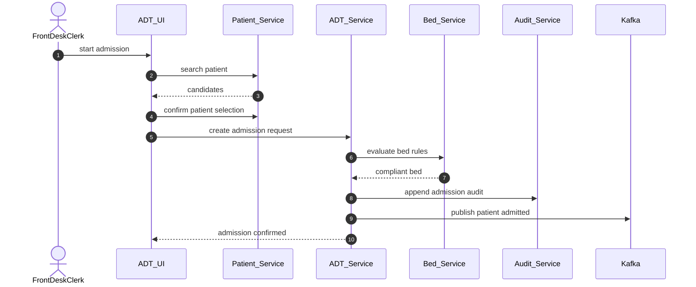
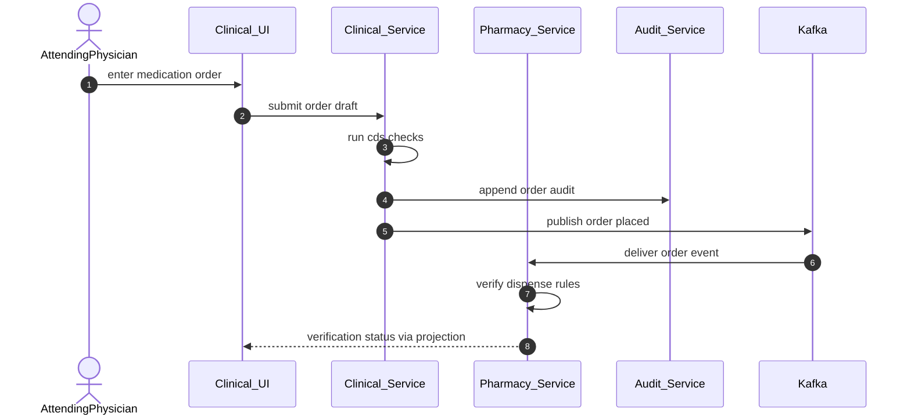
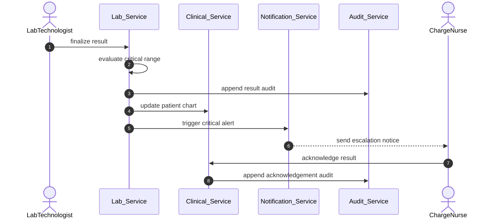
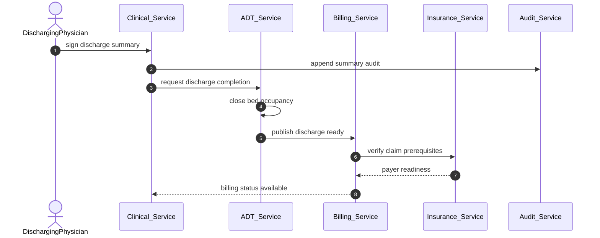

# System Sequence Diagrams

## Purpose
Capture the highest-risk cross-service sequences in the **Hospital Information System** where latency, safety, and auditability matter most.

## Sequence 1 Admit Patient with Identity Resolution and Bed Assignment

**Failure Expectations**
- If Patient Service returns duplicate ambiguity, UI must route to MPI review before admission can proceed.
- If no compliant bed exists, ADT creates a waitlist or override task and returns actionable status.
- Audit write failure is fail-secure for admission commit because admission is PHI-bearing state change.

## Sequence 2 Place Medication Order and Verify in Pharmacy

**Failure Expectations**
- Hard-stop CDS issues keep the order in draft or rejected state.
- Pharmacy verification may lag, but clinician-facing order state must show pending verification.
- Duplicate event delivery must not create duplicate dispense tasks.

## Sequence 3 Finalize Critical Lab Result and Escalate

**Failure Expectations**
- Result persistence must complete before alerting begins.
- If the ordering clinician does not acknowledge within policy SLA, Notification Service escalates to covering provider and charge nurse.
- Corrected critical results create a new notification cycle.

## Sequence 4 Complete Discharge and Trigger Claim Preparation

## Sequence Control Points

| Sequence | Hard Stop | Async Step | Audit Requirement |
|---|---|---|---|
| Admit patient | duplicate unresolved or no compliant bed | notifications and external HL7 | admission creation and override evidence |
| Medication order | CDS rejection or missing signature | pharmacy verification and dispense | order signature and override evidence |
| Critical result | result not finalized | alert fan-out and escalation | result review acknowledgement |
| Discharge | summary unsigned or mandatory tasks incomplete | claim build and notifications | discharge order, summary sign-off, bed release |

## Sequence Design Rules
- Each command boundary has one owning service and one authoritative version number.
- Every cross-service sequence carries `correlation_id`, `causation_id`, actor, facility, and patient context.
- External integrations are never inside the transaction that commits clinical or ADT source-of-truth state.
- Human acknowledgements such as critical result review must be durable state transitions, not just notifications.
