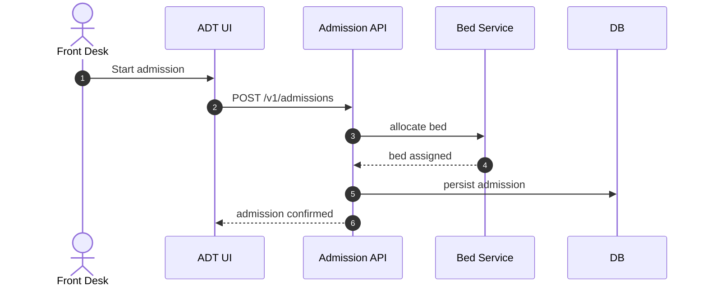
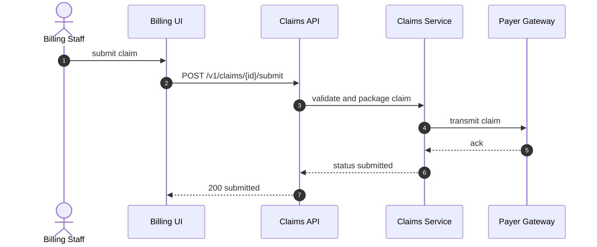

# System Sequence Diagrams

## Admit Patient

```mermaid
sequenceDiagram
    autonumber
    actor Clerk as Front Desk
    participant UI as ADT UI
    participant API as Admission API
    participant Bed as Bed Service
    participant DB as DB

    Clerk->>UI: Start admission
    UI->>API: POST /v1/admissions
    API->>Bed: allocate bed
    Bed-->>API: bed assigned
    API->>DB: persist admission
    API-->>UI: admission confirmed
```

## Submit Insurance Claim

```mermaid
sequenceDiagram
    autonumber
    actor Bill as Billing Staff
    participant UI as Billing UI
    participant API as Claims API
    participant CLM as Claims Service
    participant Payer as Payer Gateway

    Bill->>UI: submit claim
    UI->>API: POST /v1/claims/{id}/submit
    API->>CLM: validate and package claim
    CLM->>Payer: transmit claim
    Payer-->>CLM: ack
    CLM-->>API: status submitted
    API-->>UI: 200 submitted
```
