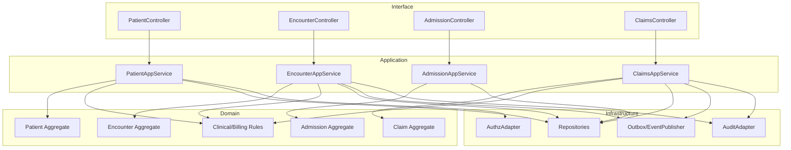

# C4 Code Diagram

```mermaid
flowchart TB
    subgraph Interface
      PatientCtrl[PatientController]
      EncounterCtrl[EncounterController]
      AdmissionCtrl[AdmissionController]
      ClaimsCtrl[ClaimsController]
    end

    subgraph Application
      PatientApp[PatientAppService]
      EncounterApp[EncounterAppService]
      AdmissionApp[AdmissionAppService]
      ClaimsApp[ClaimsAppService]
    end

    subgraph Domain
      PatientAgg[Patient Aggregate]
      EncounterAgg[Encounter Aggregate]
      AdmissionAgg[Admission Aggregate]
      ClaimAgg[Claim Aggregate]
      Rules[Clinical/Billing Rules]
    end

    subgraph Infrastructure
      Repo[Repositories]
      Outbox[Outbox/EventPublisher]
      Audit[AuditAdapter]
      Authz[AuthzAdapter]
    end

    PatientCtrl --> PatientApp --> PatientAgg
    EncounterCtrl --> EncounterApp --> EncounterAgg
    AdmissionCtrl --> AdmissionApp --> AdmissionAgg
    ClaimsCtrl --> ClaimsApp --> ClaimAgg

    PatientApp --> Rules
    EncounterApp --> Rules
    ClaimsApp --> Rules

    PatientApp --> Repo
    EncounterApp --> Repo
    AdmissionApp --> Repo
    ClaimsApp --> Repo

    EncounterApp --> Outbox
    ClaimsApp --> Outbox
    EncounterApp --> Audit
    ClaimsApp --> Audit
    PatientApp --> Authz
```
