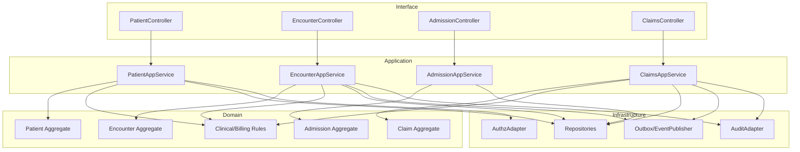
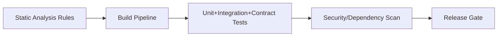

# C4 Code Diagram



---


## Code-Level Architecture Constraints
### Package Rules
- `interface` layer depends on `application`; `application` depends on `domain`; `infrastructure` depends inward only.
- No domain type may import framework-specific HTTP or ORM packages.
- Event schemas are defined in shared contracts package and versioned.

### Build-Time Guardrail Diagram


## File-Specific Implementation Boundaries
This artifact is implementation-focused on **package layering, code-level dependencies, and build gates**. The boundaries below are specific to `implementation/c4-code-diagram.md` and are intentionally not reused as generic filler text.

| Boundary Slice | In Scope for this File | Out of Scope for this File | Implementation Consequence |
|---|---|---|---|
| Build & Test Pipeline | Lint, unit/integration/contract tests and policy checks | Runtime scaling strategy | Release quality evidence with traceability |
| Runtime Service Layer | Endpoint handlers, orchestration, retry/dedupe behavior | CI orchestration internals | Production-safe mutating behavior |
| Operational Readiness | Runbook links, SLO dashboards, pager ownership | Product feature semantics | Day-2 readiness and controlled rollout posture |

## Business Rules to API/Data/Operational Controls (File-Specific)
| Rule Focus | API Enforcement Touchpoint | Data Model/Contract Tie-In | Operational Control |
|---|---|---|---|
| Preconditions for `c4-code-diagram` workflows must be validated before state mutation. | `POST /v1/releases/{service}/promote` with explicit error taxonomy and correlation IDs. | `readiness_matrix, release_evidence, rollout_audits` with strict timestamp, actor, and tenant context fields. | Alert on rule-violation rate and route to owner with SLA-backed response. |
| Mutations must be replay-safe and duplicate-proof. | Idempotency checks on mutation endpoints and async consumers. | Uniqueness keys + immutable evidence rows for side-effect tracking. | Replay runbook with pre/post reconciliation and sign-off checklist. |
| Access to sensitive operations must include least-privilege and evidence. | AuthN/AuthZ middleware + policy decision point reason codes. | Audit/event envelopes include policy version and decision outcome. | Quarterly control review and continuous SIEM correlation for anomalies. |

## Interoperability Assumptions for `c4-code-diagram.md`
- Contract versions are explicitly pinned; backward compatibility is managed per versioned API/event schema.
- External dependencies are treated as failure-prone; timeout/retry budgets and fallback states are documented in this file's scenarios.
- Observability correlation (`tenant_id`, `actor_id`, `correlation_id`) is required for all critical-path operations in this document scope.

### Interoperability and Control Flow
```mermaid
flowchart LR
    A[implementation:c4-code-diagram] --> B[API: POST /v1/releases/{service}/promote]
    B --> C[Data: readiness_matrix, release_evidence, rollout_audits]
    C --> D[Control: Monitoring + Audit + Runbook]
    D --> E[Recovery/Verification Loop]
```

## Compliance and Security Posture for this Artifact
- Evidence produced by this workflow/design artifact is audit-consumable (who/what/when/why) and linked to incident/postmortem records.
- Sensitive data exposure is minimized using role-scoped access and redaction guidance relevant to `c4-code-diagram.md`.
- Operational controls for this file include detection, containment, recovery, and verification steps with named ownership.
