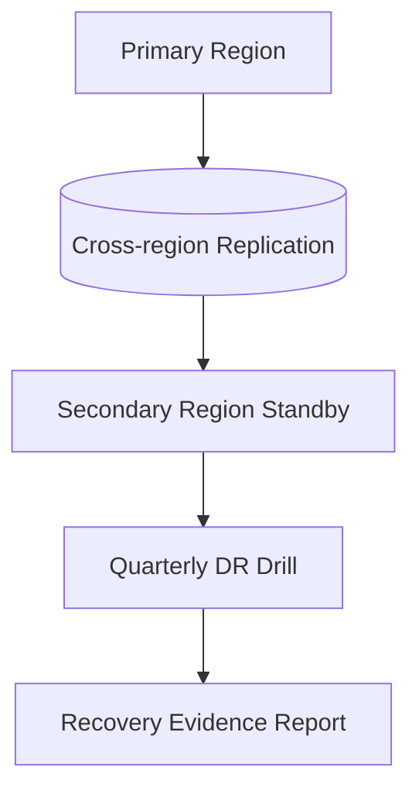

# Cloud Architecture

## Purpose
Define the cloud architecture artifacts for the **Hospital Information System** with implementation-ready detail.

## Domain Context
- Domain: Hospital
- Core entities: Patient, Encounter, Admission, Clinical Order, Medication Administration, Care Plan, Discharge Summary
- Primary workflows: patient registration and identity resolution, admission-transfer-discharge, order placement and fulfillment, care documentation and handoff, discharge and follow-up coordination

## Key Design Decisions
- Enforce idempotency and correlation IDs for all mutating operations.
- Persist immutable audit events for critical lifecycle transitions.
- Separate online transaction paths from async reconciliation/repair paths.

## Reliability and Compliance
- Define SLOs and error budgets for user-facing operations.
- Include RBAC, least-privilege service identities, and full audit trails.
- Provide runbooks for degraded mode, replay, and backfill operations.

## Infrastructure Emphasis
- Multi-environment topology (dev/stage/prod) with promotion gates.
- Network segmentation, private service communication, and WAF boundaries.
- Backup, disaster recovery, and key rotation procedures.

---

## Cloud Implementation Depth
### Environment Segmentation
- Dedicated accounts/projects per environment with SCP/policy guardrails.
- Private subnets for data plane; egress controlled through inspected gateways.
- Secrets are managed by centralized vault/KMS with rotation and access policy attestations.

### Disaster Recovery Topology

## File-Specific Implementation Boundaries
This artifact is implementation-focused on **region/account topology, DR posture, and platform controls**. The boundaries below are specific to `infrastructure/cloud-architecture.md` and are intentionally not reused as generic filler text.

| Boundary Slice | In Scope for this File | Out of Scope for this File | Implementation Consequence |
|---|---|---|---|
| Network Security Layer | WAF, segmentation, service mesh identity, egress control | Application business logic | Zero-trust communications and least privilege |
| Compute & Orchestration Layer | Workload placement, autoscaling, rollout topology | Data model design | Availability and fault isolation under load |
| Data Protection Layer | Backups, encryption, replication, key lifecycle | Clinical workflow definition | Recoverability and confidentiality controls |

## Business Rules to API/Data/Operational Controls (File-Specific)
| Rule Focus | API Enforcement Touchpoint | Data Model/Contract Tie-In | Operational Control |
|---|---|---|---|
| Preconditions for `cloud-architecture` workflows must be validated before state mutation. | `POST /v1/platform/drills/{region}/execute` with explicit error taxonomy and correlation IDs. | `network_policies, dr_snapshots, key_rotation_log` with strict timestamp, actor, and tenant context fields. | Alert on rule-violation rate and route to owner with SLA-backed response. |
| Mutations must be replay-safe and duplicate-proof. | Idempotency checks on mutation endpoints and async consumers. | Uniqueness keys + immutable evidence rows for side-effect tracking. | Replay runbook with pre/post reconciliation and sign-off checklist. |
| Access to sensitive operations must include least-privilege and evidence. | AuthN/AuthZ middleware + policy decision point reason codes. | Audit/event envelopes include policy version and decision outcome. | Quarterly control review and continuous SIEM correlation for anomalies. |

## Interoperability Assumptions for `cloud-architecture.md`
- Contract versions are explicitly pinned; backward compatibility is managed per versioned API/event schema.
- External dependencies are treated as failure-prone; timeout/retry budgets and fallback states are documented in this file's scenarios.
- Observability correlation (`tenant_id`, `actor_id`, `correlation_id`) is required for all critical-path operations in this document scope.

## Compliance and Security Posture for this Artifact
- Evidence produced by this workflow/design artifact is audit-consumable (who/what/when/why) and linked to incident/postmortem records.
- Sensitive data exposure is minimized using role-scoped access and redaction guidance relevant to `cloud-architecture.md`.
- Operational controls for this file include detection, containment, recovery, and verification steps with named ownership.
