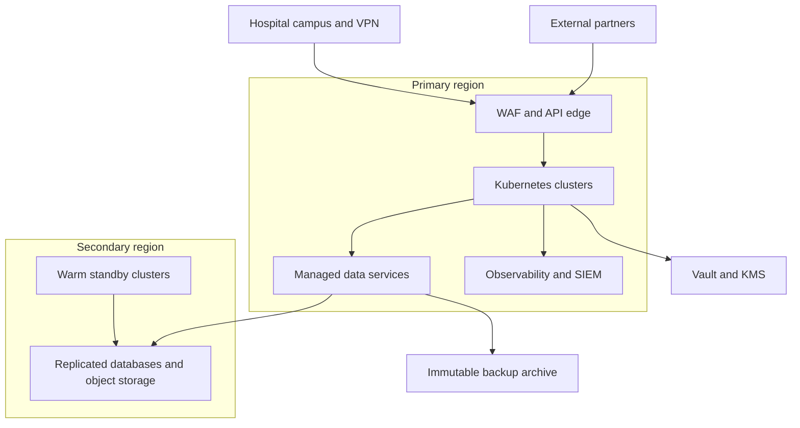
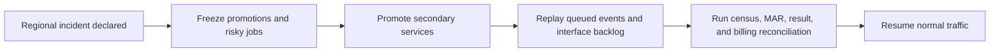

# Cloud Architecture

## Purpose
Define the production cloud architecture for the **Hospital Information System** with controls suitable for regulated healthcare workloads, zero-trust networking, and disaster recovery.

## Target Platform Topology

## Environment Strategy

| Environment | Purpose | Isolation Pattern |
|---|---|---|
| Developer sandbox | Service development and local integration | Separate cloud account or project, synthetic data only |
| Integration | Contract tests with shared dependencies | Isolated namespace and non-production keys |
| Staging | Production-like validation, migration rehearsal, DR drill | Separate account, masked PHI, production topology |
| Production | Live hospital operations | Dedicated account, private connectivity, break-glass admin only |
| DR rehearsal | Recovery automation verification | Secondary region with replay-safe test data |

## Workload Placement
- **Edge tier** hosts WAF, API gateway, ingress controllers, and DDoS protection.
- **Application tier** hosts domain services, FHIR adapter, integration engine, async workers, and observability agents.
- **Data tier** hosts PostgreSQL clusters, Redis, Kafka, Elasticsearch or OpenSearch, and object storage with private endpoints.
- **Security tier** hosts Vault, KMS integration, certificate authority, and audit archive.

## Managed Services and Guardrails

| Capability | Preferred Service Pattern | Guardrail |
|---|---|---|
| Kubernetes | Managed Kubernetes with private API endpoint | Node pools split by workload criticality and trust zone |
| PostgreSQL | Multi-AZ managed cluster per service group | PITR enabled, TLS required, read replicas for analytics only |
| Kafka | Managed Kafka or self-managed in isolated nodes | Schema registry, topic ACLs, replication factor 3 |
| Object storage | S3 compatible buckets with versioning and WORM | Bucket per data class, lifecycle to cold archive |
| Secrets | Vault with dynamic DB credentials | No long-lived static secrets in CI or workloads |
| Key management | Cloud KMS backed by HSM | Key rotation every 90 days or on incident |
| Logging and SIEM | Centralized logging with private ingestion | PHI redaction at source and immutable audit copies |

## Resilience Design
- Primary region runs active workloads across multiple availability zones.
- Secondary region maintains warm standby platform services and asynchronous replicas of databases and object storage.
- Kafka topics are mirrored to secondary region for replay after regional outage.
- Backups are copied to immutable archive with separate account ownership.
- DR cutover must support Patient, ADT, Clinical, Pharmacy, Lab, Radiology, Billing, Insurance, FHIR adapter, and audit services within the stated RTO.

## PHI Protection Controls
- Private connectivity from hospital sites uses VPN or dedicated link termination in the edge tier.
- No public IPs on application or data nodes.
- Object stores holding DICOM, scanned documents, or consent forms use bucket policies that deny download outside approved service roles.
- Database snapshots and backups are encrypted with customer-managed keys.
- Access to production consoles requires privileged access management, MFA, and session recording.

## Disaster Recovery Workflow

## Infrastructure Evidence Requirements
- Quarterly DR drill with signed evidence for failover timing and reconciliation results.
- Monthly restore test for each critical database and object archive class.
- Automated inventory of public endpoints, certificate expiry, KMS key rotation, and unencrypted resource drift.
- Security and compliance dashboards must show backup health, replication lag, failed login anomalies, and Vault lease expiry.

