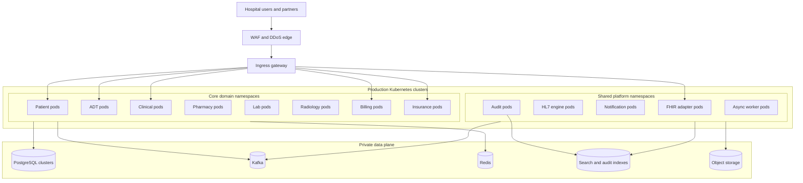
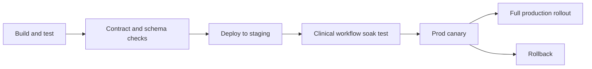

# Deployment Diagram

## Production Deployment Topology

## Namespace and Workload Segmentation

| Namespace Group | Typical Workloads | Special Controls |
|---|---|---|
| `his-core-*` | Patient, ADT, Clinical, Billing, Insurance | Highest priority classes, strict network policy |
| `his-dept-*` | Pharmacy, Lab, Radiology, OT | Department-specific connectors and queue limits |
| `his-integration-*` | FHIR adapter, HL7 engine, partner adapters | Egress allowlists and replay tooling |
| `his-platform-*` | Audit, notifications, search projectors, observability agents | Access limited to platform team roles |

## Release Strategy

## Deployment Rules
- Gateway, FHIR adapter, and stateless APIs use canary rollout with automatic rollback on SLO burn.
- High-risk clinical services require staged rollout during non-peak hours with clinical operations sign-off.
- Schema migrations must be backward compatible for one release window and executed before traffic shift.
- Worker images and consumer groups are rolled separately from API pods so replay or backlog processing can be paused independently.
- Blue or green environment is retained for fast rollback of edge and integration components.

## Capacity and Availability Targets

| Service Group | Minimum Replicas | Surge Strategy |
|---|---|---|
| Patient and ADT | 3 | HPA on CPU, RPS, and queue depth |
| Clinical and Pharmacy | 3 | HPA plus manual surge during peak med pass windows |
| Lab and Radiology | 2 | HPA on inbound order and result event lag |
| Billing and Insurance | 2 | batch window scaling for claim cycles |
| Audit and Notification | 2 | scale on event lag and notification queue depth |

## Deployment Evidence Checklist
- Proven build provenance and signed images.
- Unit, integration, contract, migration, and security tests green.
- Synthetic clinical journey tests pass for registration, admit, order, med admin, result, discharge, and claim generation.
- Dashboards and alerts updated for changed services.
- Rollback command, database compatibility note, and incident commander contact attached to release ticket.

