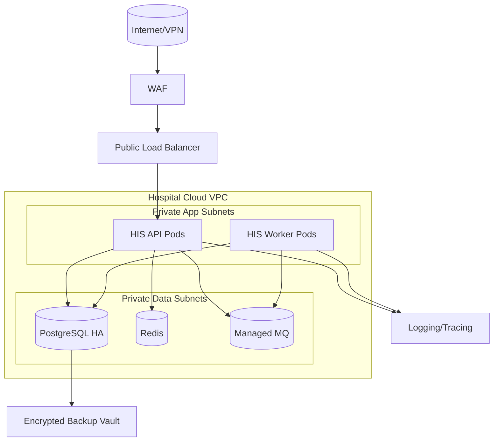
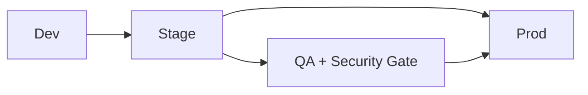

# Deployment Diagram

## Production Topology


## Environment Promotion


---


## Deployment Engineering Notes
### Progressive Delivery
- Blue/green for gateway and stateless APIs; canary for high-risk clinical modules.
- Database migrations separated from app rollout with explicit compatibility windows.
- Rollback playbook includes config, image, and schema safeguards.

## File-Specific Implementation Boundaries
This artifact is implementation-focused on **progressive rollout topology and rollback guardrails**. The boundaries below are specific to `infrastructure/deployment-diagram.md` and are intentionally not reused as generic filler text.

| Boundary Slice | In Scope for this File | Out of Scope for this File | Implementation Consequence |
|---|---|---|---|
| Network Security Layer | WAF, segmentation, service mesh identity, egress control | Application business logic | Zero-trust communications and least privilege |
| Compute & Orchestration Layer | Workload placement, autoscaling, rollout topology | Data model design | Availability and fault isolation under load |
| Data Protection Layer | Backups, encryption, replication, key lifecycle | Clinical workflow definition | Recoverability and confidentiality controls |

## Business Rules to API/Data/Operational Controls (File-Specific)
| Rule Focus | API Enforcement Touchpoint | Data Model/Contract Tie-In | Operational Control |
|---|---|---|---|
| Preconditions for `deployment-diagram` workflows must be validated before state mutation. | `POST /v1/platform/drills/{region}/execute` with explicit error taxonomy and correlation IDs. | `network_policies, dr_snapshots, key_rotation_log` with strict timestamp, actor, and tenant context fields. | Alert on rule-violation rate and route to owner with SLA-backed response. |
| Mutations must be replay-safe and duplicate-proof. | Idempotency checks on mutation endpoints and async consumers. | Uniqueness keys + immutable evidence rows for side-effect tracking. | Replay runbook with pre/post reconciliation and sign-off checklist. |
| Access to sensitive operations must include least-privilege and evidence. | AuthN/AuthZ middleware + policy decision point reason codes. | Audit/event envelopes include policy version and decision outcome. | Quarterly control review and continuous SIEM correlation for anomalies. |

## Interoperability Assumptions for `deployment-diagram.md`
- Contract versions are explicitly pinned; backward compatibility is managed per versioned API/event schema.
- External dependencies are treated as failure-prone; timeout/retry budgets and fallback states are documented in this file's scenarios.
- Observability correlation (`tenant_id`, `actor_id`, `correlation_id`) is required for all critical-path operations in this document scope.

### Interoperability and Control Flow
```mermaid
flowchart LR
    A[infrastructure:deployment-diagram] --> B[API: POST /v1/platform/drills/{region}/execute]
    B --> C[Data: network_policies, dr_snapshots, key_rotation_log]
    C --> D[Control: Monitoring + Audit + Runbook]
    D --> E[Recovery/Verification Loop]
```

## Compliance and Security Posture for this Artifact
- Evidence produced by this workflow/design artifact is audit-consumable (who/what/when/why) and linked to incident/postmortem records.
- Sensitive data exposure is minimized using role-scoped access and redaction guidance relevant to `deployment-diagram.md`.
- Operational controls for this file include detection, containment, recovery, and verification steps with named ownership.
