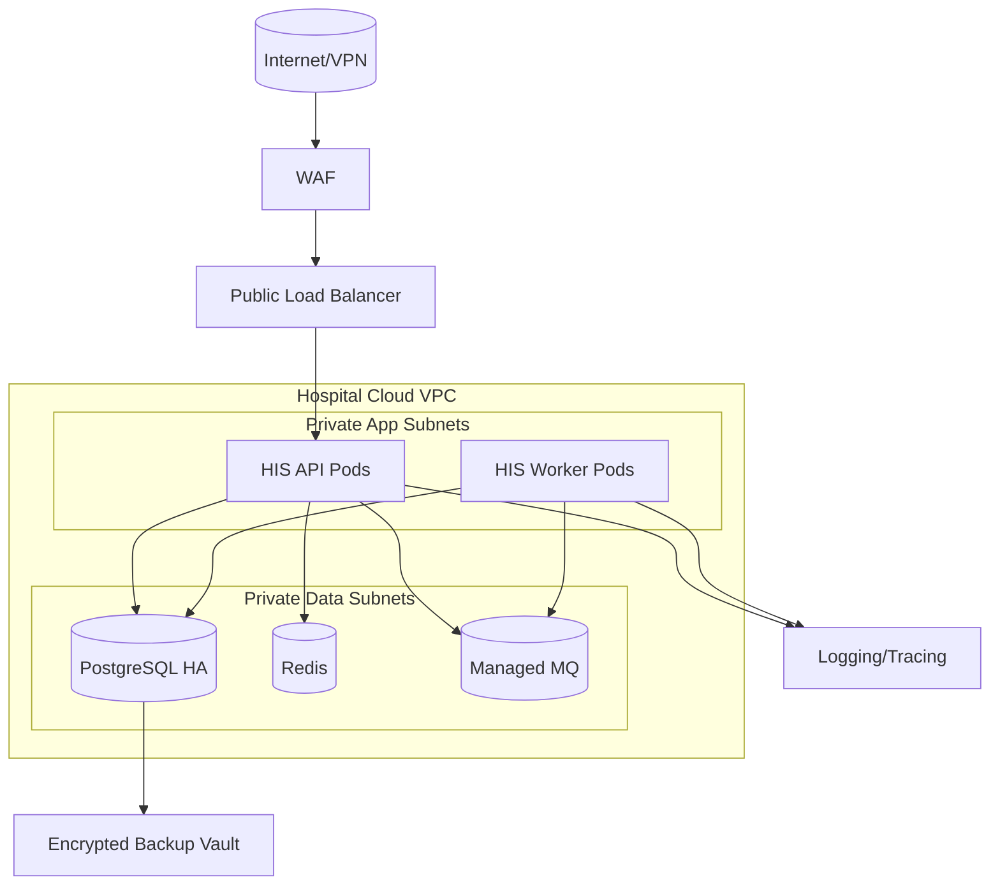
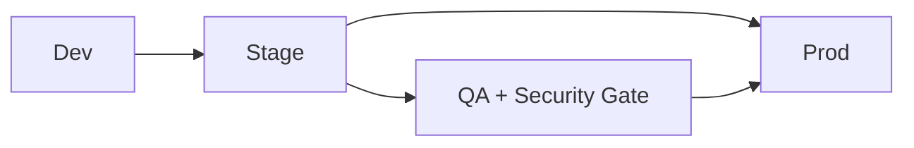

# Deployment Diagram

## Production Topology

```mermaid
flowchart TB
    Internet[(Internet/VPN)] --> WAF[WAF]
    WAF --> LB[Public Load Balancer]

    subgraph VPC[Hospital Cloud VPC]
      subgraph App[Private App Subnets]
        API[HIS API Pods]
        Worker[HIS Worker Pods]
      end

      subgraph Data[Private Data Subnets]
        DB[(PostgreSQL HA)]
        Redis[(Redis)]
        MQ[(Managed MQ)]
      end
    end

    LB --> API
    API --> DB
    API --> Redis
    API --> MQ
    Worker --> DB
    Worker --> MQ

    API --> Observability[Logging/Tracing]
    Worker --> Observability
    DB --> Backup[Encrypted Backup Vault]
```

## Environment Promotion

```mermaid
flowchart LR
    Dev --> Stage --> Prod
    Stage --> Gate[QA + Security Gate]
    Gate --> Prod
```
