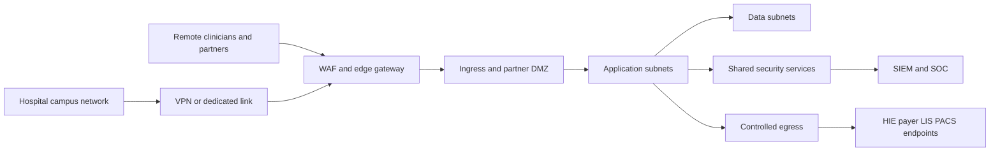

# Network Infrastructure

## Purpose
Define the network topology and zero-trust controls required to run the **Hospital Information System** securely across hospital campuses, cloud workloads, and external healthcare partners.

## Network Zones

## Segmentation Model

| Zone | Contents | Allowed Inbound | Allowed Outbound |
|---|---|---|---|
| Campus | workstations, bedside devices, print servers | hospital managed devices only | VPN or private link to edge |
| DMZ | ingress gateway, partner termination, reverse proxies | HTTPS from approved clients and partners | mTLS to application subnets |
| Application | Kubernetes worker nodes and service mesh | traffic only from ingress, mesh gateways, and approved jobs | private endpoints to data, Vault, observability, controlled egress |
| Data | PostgreSQL, Kafka, Redis, object storage, search | service identities from application zone only | backup replication and monitoring only |
| Shared security | Vault, PAM, certificate services, SIEM collectors | admin via bastion and PAM | audit export and alerting channels |

## Zero-Trust Rules
- All service-to-service calls use mTLS with workload identity and explicit authorization policies.
- Network policies deny all east-west traffic by default. Each service declares only required dependencies.
- Administrative access is through hardened bastion or PAM session broker with just-in-time approval.
- Production egress is allowlisted by hostname and port for payers, HIE, LIS, PACS, SMS or email providers, and package mirrors.
- Partner interfaces terminate in the DMZ or dedicated integration namespace, never directly inside domain namespaces.

## Connectivity Requirements by Integration

| Integration | Protocol | Connectivity Pattern | Special Control |
|---|---|---|---|
| LIS and PACS | HL7 v2 over MLLP or vendor VPN | dedicated partner tunnel into integration zone | message journaling and IP allowlist |
| External EHR and HIE | HTTPS FHIR | outbound private or public edge with mTLS where supported | OAuth client credentials and rate limits |
| Payer APIs and clearinghouse | HTTPS or SFTP | outbound via controlled egress NAT | payload encryption and retry queue |
| Pharmacy wholesaler or formulary feeds | HTTPS or file feed | outbound scheduled jobs from integration zone | checksum verification |
| SMS and email | HTTPS | outbound via notification service only | no PHI in message body unless policy approved |

## Internal DNS and Certificate Strategy
- Private DNS zones resolve services, databases, and partner endpoints.
- Short-lived service certificates are issued by cert-manager integrated with Vault PKI.
- Certificate rotation must be automatic and observable before expiry.
- Mutual TLS is required for all mesh traffic and recommended for partner APIs that support it.

## Network Monitoring and Incident Response
- Flow logs are retained and searchable by source identity, destination, protocol, and zone.
- IDS or anomaly monitoring flags unusual lateral movement, denied egress, and repeated authentication failure.
- Critical alerts include partner interface down, mTLS certificate failure, DNS misrouting, and Kafka broker partition isolation.
- Network incidents affecting clinical workflows page both platform operations and the clinical liaison.

## Required Firewall and Policy Outcomes
1. Internet traffic reaches only the WAF or API edge.
2. No workstation may connect directly to databases or Kafka.
3. Domain services may not call each other through public endpoints.
4. Only FHIR adapter and integration engine may communicate with external clinical systems unless exception approved.
5. Audit and SIEM pipelines must remain reachable even during partial application outages.

