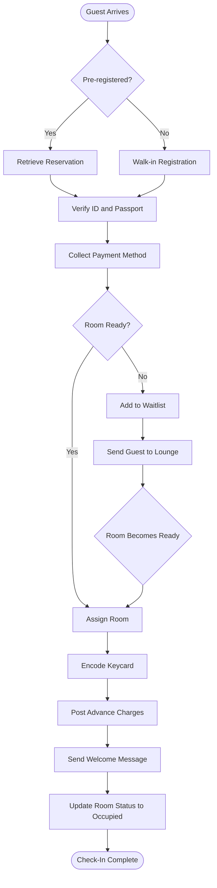
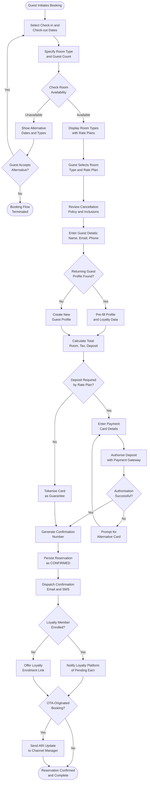
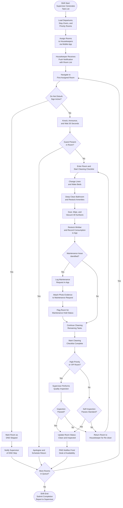

# Activity Diagrams

## Guest Check-In Process

The check-in activity begins the moment a guest arrives at the property and concludes when the guest is in possession of an encoded keycard with their folio open and their room status set to OCCUPIED. The process has two major branch points: whether the guest has a pre-existing reservation, and whether a clean and inspected room is immediately available. Pre-registered guests with a ready room complete check-in in the minimum number of steps. Walk-ins require inline reservation creation. Guests who arrive before their room is ready are placed on a room-ready waitlist and directed to hotel amenities while housekeeping finalises the room. Advance charges including resort fees and early check-in surcharges are posted immediately upon room assignment before the keycard is encoded.

---

## Reservation Booking Flow

The reservation booking flow covers all paths by which a new reservation enters the HPMS: direct guest booking via the web or mobile engine, agent-assisted creation at the front desk, and OTA-originated bookings via the channel manager integration. The critical branch points are room availability, deposit requirement, and loyalty membership status. The flow terminates in a confirmed reservation record with a unique confirmation number, a dispatched confirmation message, and—for OTA bookings—an inventory decrement pushed back to the originating channel. Pre-credited loyalty point notifications are issued for enrolled members. Waitlist handling accommodates the case where the preferred room type is temporarily sold out.

---

## Housekeeping Workflow

The housekeeping workflow begins at shift start when the supervisor generates the day's task list, incorporating departures, stay-overs requiring service, and rooms flagged for deep cleaning or post-maintenance inspection. Tasks are distributed to individual housekeepers via the mobile application. The workflow handles the common interruptions in daily room cleaning: Do Not Disturb requests, guest presence, maintenance issues discovered during cleaning, and quality inspection failures requiring re-cleaning. The critical output of the workflow is the CLEAN and INSPECTED room status update that makes a room eligible for assignment in the HPMS. High-priority rooms — those with arriving VIPs, loyalty members, or waitlisted guests — are flagged for expedited supervisor inspection.

---

## Night Audit Process

The night audit is the most consequential and complex daily process in the HPMS. It closes the financial day, posts all room and tax charges, processes no-shows, reviews advance deposit forfeiture, generates the management reporting suite, executes the system date rollover, and creates an integrity-verified backup. The process is gated: each phase must complete successfully before the next can begin, and the trial balance must be explicitly approved before automated charge posting commences. The date rollover is an atomic operation with automatic rollback on failure. Report distribution and rate plan activation for the new business day are the final steps before the audit is marked complete.

```mermaid
flowchart TD
    A([Night Auditor Logs In\nto Audit Console]) --> B[Run Pre-Audit\nSystem Health Check]
    B --> C{All Cashier\nShifts Closed?}
    C -->|No| D[Alert Supervisors\nto Close Open Shifts]
    D --> C
    C -->|Yes| E{Unposted Batch\nTransactions Exist?}
    E -->|Yes| F[Resolve Unposted\nTransactions Manually]
    F --> E
    E -->|No| G[Execute Trial\nBalance Calculation]
    G --> H{Trial Balance\nReconciled?}
    H -->|No| I[Identify Variance\nin Transaction Log]
    I --> J[Post Manual\nCorrection Entries]
    J --> G
    H -->|Yes| K[Night Auditor Approves\nTrial Balance]
    K --> L[Post Automated Room\nand Tax Charges to\nAll In-House Folios]
    L --> M{All Folios\nPosted Successfully?}
    M -->|No| N[Review Posting\nExceptions Report]
    N --> O[Manually Post\nFailed Folios]
    O --> M
    M -->|Yes| P[Process No-Show\nReservations]
    P --> Q{No-Show Policy:\nCharge or Cancel?}
    Q -->|Charge Fee| R[Post No-Show Fee\nto Card on File]
    Q -->|Cancel Only| S[Cancel Reservation\nand Release Inventory]
    R --> T[Review Advance\nDeposit Forfeiture Cases]
    S --> T
    T --> U{Forfeiture\nAuthorised?}
    U -->|Yes| V[Transfer Deposit\nto Revenue Account]
    U -->|No| W[Retain Deposit\non Pending Ledger]
    V --> X[Generate End-of-Day\nManagement Reports]
    W --> X
    X --> Y[Occupancy and\nRevPAR Report]
    Y --> Z[Daily Revenue\nSummary by Department]
    Z --> AA[AR Aging and\nDeposit Ledger Report]
    AA --> AB[Night Auditor Reviews\nReport Metrics for Anomalies]
    AB --> AC{Anomalies\nDetected?}
    AC -->|Yes| AD[Document Anomaly\nand Flag for GM Review]
    AD --> AE[Execute System\nDate Rollover]
    AC -->|No| AE
    AE --> AF{Rollover\nSuccessful?}
    AF -->|No| AG[Automatic Rollback\nand Alert IT Operations]
    AG --> AE
    AF -->|Yes| AH[Create Encrypted\nDatabase Backup]
    AH --> AI{Backup Checksum\nVerified?}
    AI -->|No| AJ[Retry Backup Up\nto Three Times]
    AJ --> AI
    AI -->|Yes| AK[Distribute Reports\nto Management via Email]
    AK --> AL[Activate Next-Day\nRate Plans and Restrictions]
    AL --> AM([Audit Complete:\nNew Business Day Active])
```

---

## Process Descriptions

### Guest Check-In Process

The check-in activity is governed by two primary decision points that determine the total duration and complexity of the interaction. The first decision—whether the guest has a pre-existing reservation—branches the flow between a fast-path reservation retrieval and a slower walk-in registration. Walk-in registration requires the front desk agent to manually enter all guest data, select a room type and rate, and process a full payment authorisation before proceeding. For pre-registered guests, the system retrieves the confirmed reservation automatically.

The second critical decision—room readiness—determines whether the guest can proceed immediately to room assignment or must wait. A room is only eligible for assignment when its housekeeping status is CLEAN and its inspection flag is INSPECTED. If no eligible room exists, the guest is placed on the room-ready waitlist and directed to hotel amenities. The HPMS monitors room status changes in real time; as soon as a room transitions to CLEAN/INSPECTED, front desk staff receive an alert and the check-in flow resumes.

Business rules triggered at key steps: Room assignment validates maximum occupancy and maintenance block absence before confirming. Keycard encoding is blocked until room assignment is confirmed in the system. The advance charge posting step applies the configured resort fee (BR-010 resort fee rule), early check-in surcharge (BR-012, if arrival is before the property's check-in time), and any package inclusions from the rate plan. The welcome message is dispatched via the guest's preferred channel—SMS for domestic guests, email for international guests, or push notification for mobile app users who have opted in.

Performance benchmarks: For a pre-registered guest with a ready room, end-to-end check-in should complete in under 3 minutes. Keycard encoding must complete within 5 seconds. Room assignment lock acquisition must occur within 200 milliseconds to maintain throughput during peak arrival periods with concurrent front desk sessions.

### Reservation Booking Flow

The reservation booking flow handles three distinct origin paths: direct web or mobile booking by the guest, agent-assisted booking at the front desk, and automated inbound booking from an OTA channel. Despite their different entry points, all three paths converge at the availability check and rate plan selection steps.

The availability check applies channel-specific allotment controls before displaying room options, ensuring that OTA bookings do not exceed the allotted block for that channel, and that direct bookings benefit from the full unallocated inventory. Rate plan eligibility is evaluated based on the booking channel, the advance booking date, the guest's loyalty tier, and any active corporate rate code.

The deposit determination branch is central to the flow. Advance Purchase rates require full prepayment; Standard BAR rates require card guarantee only (no immediate charge); Package rates may require a partial deposit. Failed payment authorisation triggers a retry loop limited to three attempts before the session terminates. The session timeout window for the booking engine is 20 minutes to prevent inventory hold conflicts for other guests browsing simultaneously.

The OTA-originated path bypasses the guest-facing UI entirely. The channel manager delivers inbound reservation messages in OTA XML format; the HPMS validates the payload schema, maps OTA room type codes to internal room type codes, confirms allotment availability, and creates the reservation before returning an acknowledgement. The inventory decrement is then pushed back to the channel manager to prevent overselling.

### Housekeeping Workflow

The housekeeping workflow is the operational pipeline that transforms a departed or service-required room into a CLEAN and INSPECTED room eligible for reassignment. The supervisor's task assignment at shift start incorporates three categories of work: departure rooms (highest priority, required before same-day arrivals can check in), stay-over rooms (routine daily service), and special-category rooms (post-maintenance inspections, deep-cleans following long-stay departures, VIP arrivals).

The Do Not Disturb branch represents a significant operational constraint. When the DND indicator is active, housekeeping must skip the room, notify the supervisor, and attempt the room later in the shift. If the DND remains active throughout the housekeeping window, the guest's preference is documented and the room is flagged for a limited-service offering (fresh towels left outside the door) in compliance with the property's service recovery policy.

The maintenance issue branch is critical for inventory integrity. When a housekeeper identifies a defect (broken fixture, damaged furniture, plumbing issue), they log a maintenance request in the mobile app with a description, severity classification, and photographic evidence. The room is automatically placed in an OUT-OF-ORDER status in the HPMS, removing it from the assignable inventory pool. Front desk staff are immediately notified of the inventory reduction. The maintenance request is routed to the relevant engineering team through the HPMS-to-CMMS integration.

Quality inspection for high-priority rooms enforces a two-person quality gate: the housekeeper completes the room and updates their checklist, and then the supervisor performs an independent inspection from a standardised checklist covering 32 room quality criteria. Inspection failure returns the room to the housekeeper's queue with specific re-work instructions. Only after supervisor inspection approval does the room transition to INSPECTED status and become available for assignment.

### Night Audit Process

The night audit is a gated sequential process designed to be both comprehensive and recoverable. Each phase produces an artefact—the pre-audit checklist confirmation, the trial balance report, the posting completion report, the no-show processing summary, the full report suite, the rollover confirmation, and the backup verification—that must be approved or verified before the next phase begins.

The trial balance phase is the most technically sensitive. The HPMS calculates the expected balance across all revenue accounts (rooms, F&B, spa, other), settlement accounts (cash, card, direct bill), and liability accounts (advance deposits, deferred revenue). Any variance between the expected and actual total indicates an unresolved transaction—a missing payment posting, a charge reversal that was not paired with a corresponding debit, or a currency conversion rounding accumulation. The auditor must resolve all variances above the configured tolerance threshold (typically USD 0.01) before proceeding.

The automated room charge posting phase iterates through every reservation in IN-HOUSE status and posts the nightly room charge plus all applicable taxes (room rate × (1 + tax rate combination for the room type and locality)). The posting engine uses the rate plan's pricing rules for long-stay discounts, weekly rates, and package component splits. Posting failures on individual folios are isolated and do not halt the posting of other folios—the exception report collects all failures for manual review.

The date rollover is an atomic database transaction. The HPMS increments the business date counter, updates all open reservations' current night count, applies any rate plan overrides that take effect on the new date, and activates any channel distribution restrictions scheduled for the new day. Rollover failure (disk full, database lock timeout, network partition) triggers an automatic rollback to the pre-rollover snapshot and an immediate alert to the IT on-call team. The Night Auditor cannot retry the rollover without IT confirmation that the root cause has been addressed.

The backup and verification step uses a SHA-256 checksum to validate the integrity of the backup file against the source database snapshot. The backup file is written to a primary backup destination and replicated to a secondary off-site destination before the audit is marked complete. Backup retention policy requires daily backups to be kept for 30 days, weekly backups for 12 months, and monthly backups indefinitely in cold storage.

---

## Business Rules Triggered per Activity

Each activity diagram has specific business rules activated at decision points. The following tables cross-reference the key decision nodes in each diagram with the business rules they enforce.

### Check-In Business Rules

| Activity Step | Business Rule | Rule Description | Impact of Rule Violation |
|---|---|---|---|
| Room Readiness Check | BR-010 | Room must be CLEAN and INSPECTED before assignment | Guest added to waitlist; check-in delayed |
| Payment Authorisation | BR-011 | Pre-auth amount equals estimated folio plus incidental hold | Check-in refused if authorisation fails and no alternative provided |
| Advance Charge Posting | BR-012 | Early check-in fee applied if arrival is before 15:00 property time | Charge missing from folio; revenue leakage |
| Keycard Encoding | BR-014 | Keycard validity period must match reservation departure date exactly | Guest locked out at wrong time or keycard valid beyond stay |
| Welcome Message Dispatch | BR-015 | Welcome message must be dispatched within 2 minutes of IN-HOUSE status set | Guest experience degradation; no SLA breach if within 5 minutes |

### Reservation Booking Business Rules

| Activity Step | Business Rule | Rule Description | Impact of Rule Violation |
|---|---|---|---|
| Availability Check | BR-004 | Maximum room occupancy per room type must not be exceeded | Overbooking; property reputation and operational risk |
| Rate Plan Selection | BR-005 | Channel-specific rate restrictions must be applied | Rate plan sold on ineligible channel; rate integrity violation |
| Deposit Calculation | BR-002 | Deposit percentage is defined per rate plan configuration | Incorrect deposit collected; financial reconciliation error |
| Confirmation Dispatch | BR-016 | Confirmation email must be dispatched within 30 seconds of confirmation | Guest experience degradation; potential re-inquiry volume |
| Loyalty Notification | BR-006 | Loyalty earn notification to platform must occur within same transaction | Points not pre-registered; loyalty programme discrepancy |

### Housekeeping Business Rules

| Activity Step | Business Rule | Rule Description | Impact of Rule Violation |
|---|---|---|---|
| DND Handling | BR-025 | DND rooms must be logged and attempted later in shift before escalation | Room not serviced; guest complaint |
| Minibar Recording | BR-026 | All minibar consumption must be recorded in app before room status update | Revenue leakage from unposted charges |
| Maintenance Flagging | BR-027 | Rooms with safety defects must be placed in OUT-OF-ORDER immediately | Guest assigned to defective room; safety and liability risk |
| Inspection Gate | BR-028 | VIP and loyalty tier rooms require supervisor inspection before INSPECTED status | Quality standard not enforced for high-value guests |
| Status Update Timing | BR-029 | Room status update must occur within 5 minutes of checklist completion | Front desk working with stale inventory data; room assigned late |

### Night Audit Business Rules

| Activity Step | Business Rule | Rule Description | Impact of Rule Violation |
|---|---|---|---|
| Pre-Audit Validation | BR-040 | All cashier shifts must be closed before audit commencement | Charges may post to wrong business date |
| Trial Balance Approval | BR-042 | Date rollover cannot proceed until trial balance is approved | Audit incomplete; financial data integrity at risk |
| Room Charge Posting | BR-040 | Every IN-HOUSE folio must receive nightly room and tax charges | Revenue not recognised; folio balance incorrect at checkout |
| No-Show Processing | BR-041 | No-show fee or cancellation must be applied per rate plan policy | Policy not enforced; revenue loss or guest dispute |
| Backup Verification | BR-043 | Backup checksum must be verified before audit is marked complete | Backup unreliable; disaster recovery risk |

---

## Activity Timing and Performance Standards

The following performance standards apply to each activity diagram, defining the maximum acceptable elapsed time for each process end-to-end and for key individual steps within the process.

| Process | End-to-End Target | Critical Path Step | Critical Path Target |
|---|---|---|---|
| Guest Check-In (standard) | Under 4 minutes for pre-registered guest with ready room | Room assignment lock acquisition | Under 200 milliseconds |
| Guest Check-In (walk-in) | Under 8 minutes | Full reservation creation and payment authorisation | Under 90 seconds |
| Reservation Booking (direct web) | Under 3 minutes for guest self-service | Availability query response | Under 1.5 seconds |
| Reservation Booking (OTA inbound) | Under 30 seconds from OTA message receipt to acknowledgement | Inventory lock and reservation persist | Under 5 seconds |
| Housekeeping — Standard Room | 20–35 minutes per room | Checklist completion and status update | Under 2 minutes |
| Housekeeping — Departure Room | 25–45 minutes per room | Full clean and supervisor inspection | Under 60 minutes from checkout |
| Night Audit — Full Cycle | Under 45 minutes for 300-room property | Automated room charge posting for all in-house folios | Under 3 minutes |
| Night Audit — Date Rollover | Under 60 seconds | Atomic database transaction | Under 30 seconds |

---

## Error Recovery and Fallback Procedures

Each activity diagram contains implicit or explicit error paths. The following documents the recovery procedure for critical failure scenarios that the activity flows encounter.

**Check-In: Keycard Encoder Failure**
If the keycard encoder hardware fails during the encoding step, front desk staff activate the manual key encoding procedure: a secondary encoder at a different workstation is used, or a temporary paper key record is issued with physical key handoff and the digital keycard is encoded as soon as the hardware is restored. The reservation is flagged with a KEYCARD-PENDING status visible to the supervisor.

**Reservation Booking: Payment Gateway Timeout**
If the payment gateway does not respond within 8 seconds, the booking engine retries once. If the retry also times out, the booking session is preserved in a PAYMENT-PENDING state for 15 minutes. The guest is informed that the booking is being processed and instructed to check their email for confirmation. A background retry job attempts the authorisation up to three more times with 2-minute intervals.

**Housekeeping: Mobile App Connectivity Loss**
If a housekeeper's mobile device loses network connectivity mid-shift, the app operates in offline mode, storing all status updates locally. When connectivity is restored, updates synchronise automatically with the HPMS. The supervisor is notified if any housekeeper has been offline for more than 10 minutes so manual status checks can be performed.

**Night Audit: Trial Balance Cannot Be Reconciled**
If the trial balance variance cannot be resolved within 60 minutes of the audit start time, the Night Auditor and Duty Manager jointly decide whether to proceed with the audit under a documented variance exception or defer the audit. Deferral holds the business date open until the variance is resolved. Room charges are not posted until the trial balance is approved; guests who check out on a deferred audit day are manually charged their nightly rate by the front desk agent.
