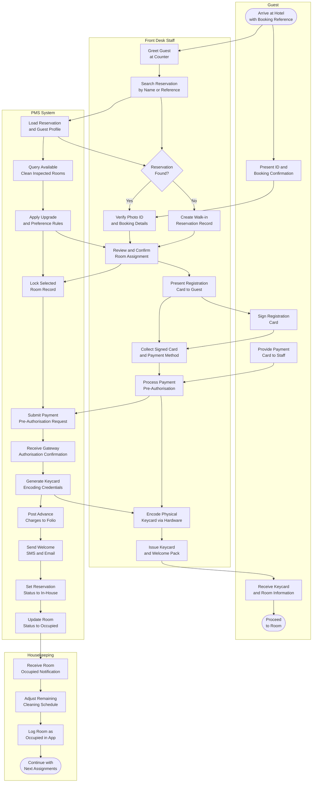
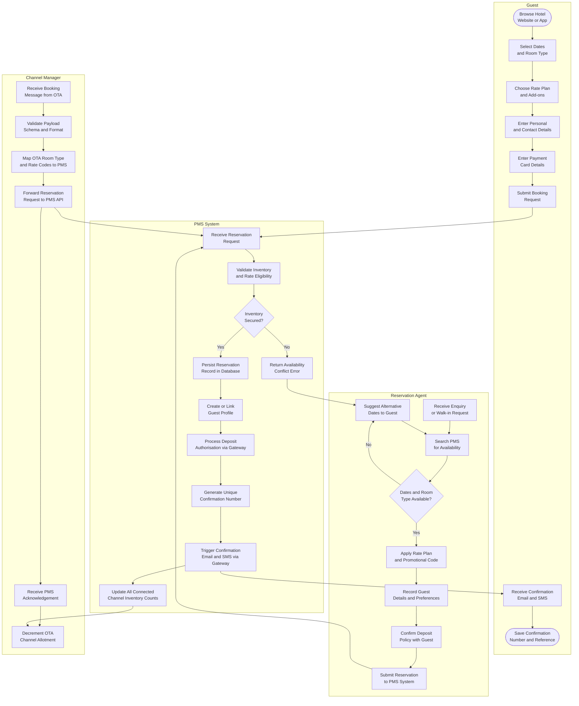
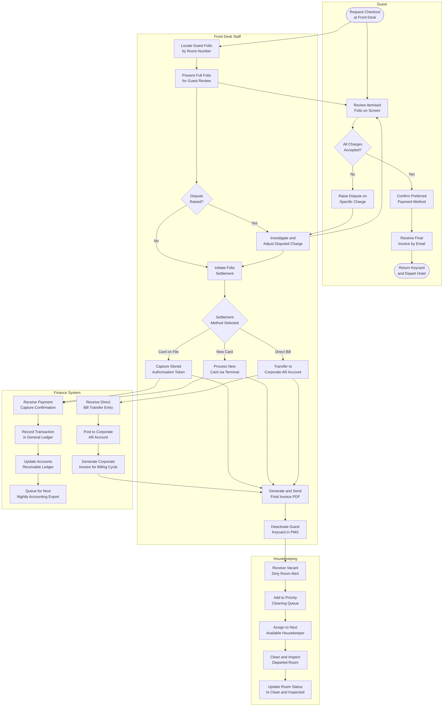

# BPMN Swimlane Diagram

## Check-In Process Swimlane

The check-in swimlane captures the collaborative handoffs between four lanes — Guest, Front Desk Staff, PMS System, and Housekeeping — from the moment the guest arrives at the property through to room occupancy confirmation and housekeeping notification. Each lane shows the steps executed by that participant; cross-lane arrows represent messages, triggers, or data transfers between participants.

---

## Reservation Creation Swimlane

The reservation creation swimlane shows the parallel paths through which a reservation enters the HPMS: a guest booking directly via the web or mobile engine, a reservation agent assisting by phone or at the desk, and an OTA channel forwarding an externally originated booking. All paths converge at the PMS System lane where inventory is confirmed and the reservation record is created. The channel manager lane handles the OTA-specific message transformation before the booking reaches the HPMS.

---

## Checkout and Settlement Swimlane

The checkout swimlane covers the settlement of the guest's folio from the moment they request checkout through to room status update and financial export. Four lanes participate: Guest (reviews and approves folio), Front Desk Staff (mediates the settlement), Finance System (records the financial entries), and Housekeeping (receives the room departure notification). Dispute handling introduces a branch within the Front Desk lane before settlement proceeds. Corporate direct bill is shown as an alternative settlement path alongside card capture.

---

## Lane Descriptions

| Lane | Role | Responsibilities in Process | Systems Used |
|---|---|---|---|
| Guest | Primary service recipient | Provides identification, reviews folio, approves charges, provides payment method, receives confirmation and keycard | Hotel website, mobile app, self-service kiosk, physical interactions at front desk |
| Front Desk Staff | Operational mediator and transaction executor | Retrieves reservation, verifies identity, assigns room, collects and processes payment, encodes keycard, resolves disputes, issues invoices | HPMS desktop client, keycard encoder hardware, integrated payment terminal, document scanner |
| PMS System | Central transaction and inventory engine | Loads records, checks availability, locks inventory, processes authorisations, generates confirmation numbers, posts charges, sends notifications, updates statuses | HPMS application server, payment gateway API, keycard SDK, SMS/email gateway API, loyalty platform API |
| Housekeeping | Room preparation and status management | Receives departure and occupation notifications, adjusts cleaning schedules, cleans and inspects rooms, updates room status in mobile app | HPMS housekeeping mobile app, supervisor dashboard |
| Reservation Agent | Assisted booking channel mediator | Assists guests with availability queries, rate selection, and reservation creation; handles complex group and corporate bookings | HPMS reservation console, rate management screen, availability calendar |
| Channel Manager | OTA integration middleware | Receives OTA booking messages, validates and maps codes, forwards to HPMS, receives acknowledgements, updates OTA channel inventory | Channel manager platform (SiteMinder, RateGain), HTNG/OTA XML API endpoints |
| Finance System | Financial record and export layer | Records payment transactions in GL, manages AR ledger, generates corporate invoices, queues nightly export batches | Oracle Financials / SAP, SFTP integration with HPMS, AR management module |

---

## Process Narrative

### Check-In Process Narrative

The check-in process involves the closest choreography of any HPMS workflow, requiring near-simultaneous coordination between the Guest, Front Desk Staff, and PMS System lanes, with a downstream notification to Housekeeping at conclusion. The process opens when the guest physically arrives at the property and presents their booking reference at the front desk.

Front Desk Staff initiates the reservation search within seconds of greeting the guest. The cross-lane message to the PMS System triggers the retrieval of the full reservation record and guest profile, including loyalty tier, prior stay notes, upgrade eligibility, and any special requests flagged by the reservations team. The system responds with the reservation status and the result feeds the staff member's decision on whether the reservation is found. If no reservation exists, the agent creates a walk-in booking inline without interrupting the guest interaction flow.

Room assignment involves a bidirectional exchange between Front Desk Staff and the PMS System: the system applies optimisation rules and presents the most appropriate available room, the staff member confirms or overrides, and the system immediately acquires an exclusive lock on the chosen room to prevent concurrent double-assignment. This lock acquisition and confirmation cycle must complete within 500 milliseconds to avoid visible delay in the check-in interaction.

The payment pre-authorisation step involves the guest providing their card in the Guest lane, which triggers the staff's processing action in the Front Desk lane, which in turn triggers the authorisation request in the PMS System lane. The system submits the request to the payment gateway, receives the authorisation code, and stores the token—this entire cycle typically completes within 3 seconds, keeping the check-in interaction fluid.

Keycard encoding is the final system-dependent step before the keycard is physically handed to the guest. The PMS System generates the encoding credentials and transmits them to the keycard hardware system; the encoding completes in under 5 seconds. The Front Desk Staff then hands the encoded keycard to the guest, completing the physical handoff. The downstream notification to Housekeeping occurs automatically as the PMS sets the room to OCCUPIED status, updating the housekeepers' priority cleaning schedule for end-of-day planning.

### Reservation Creation Narrative

The reservation creation process handles three distinct origin paths that merge into a single PMS transaction flow. Direct bookings from the Guest lane follow the web or mobile booking engine path, where the guest self-serves through availability selection, rate plan choice, and payment entry without any staff involvement. The PMS System receives the booking request directly, validates inventory and rate eligibility, processes the deposit authorisation if required, and generates the confirmation number. The confirmation is dispatched back to the guest via the SMS/email gateway before the channel inventory update is triggered.

The Reservation Agent lane is engaged for telephone bookings, email enquiries, and walk-in guests who prefer assisted booking. The agent accesses the HPMS reservation console, searches availability on behalf of the guest, applies any applicable corporate rate codes, and collects the guest's personal and payment details. The agent's reservation submission enters the PMS System at the same validation layer as the direct booking—the reservation creation process is channel-agnostic from the system's perspective.

The Channel Manager lane handles OTA-originated bookings through a pipeline of schema validation, code mapping, and HPMS API forwarding. The channel manager transforms the OTA platform's native booking format into the standardised OTA XML schema that the HPMS expects, maps the OTA room type identifier to the corresponding HPMS room category code, and submits the transformed request. The HPMS processes the booking identically to a direct booking from an inventory and rate perspective, then returns a confirmation acknowledgement that the channel manager relays back to the OTA platform. The final step in the Channel Manager lane—decrementing the OTA channel's allotment—is triggered by the HPMS sending an inventory update following successful reservation creation, ensuring the OTA's displayed availability accurately reflects the reduced count.

### Checkout and Settlement Narrative

The checkout swimlane begins when the guest initiates the departure process and concludes when the room is turned over to Housekeeping and the financial data has been forwarded to the Finance System. The Guest and Front Desk Staff lanes are tightly coupled in the early folio review and dispute resolution phases; the Finance System and Housekeeping lanes receive information from the settlement and keycard deactivation steps respectively.

Folio review is a collaborative step between the Guest lane and the Front Desk Staff lane. The front desk agent retrieves the full folio and presents it to the guest; the guest reviews it and either accepts the charges or raises a dispute. Dispute resolution keeps the interaction within the Front Desk Staff lane: the agent investigates the charge, contacts the originating department if needed, posts a correction credit with manager authorisation if warranted, and then re-presents the updated folio to the guest for approval. This loop may repeat if multiple disputes are raised but is constrained by a time limit and escalation path to the Duty Manager.

Settlement method selection branches the process across three concurrent downstream paths. Card-on-file capture and new card processing both feed into the Finance System via the payment capture confirmation message. Corporate direct bill transfer bypasses the payment gateway entirely and routes a ledger transfer message directly to the Finance System's AR module, where a corporate invoice is generated for the next billing cycle. All three paths converge on the final invoice generation step in the Front Desk Staff lane.

Keycard deactivation — the final step in the Front Desk Staff lane — triggers the critical handoff to the Housekeeping lane. The moment the PMS marks the room as VACANT-DIRTY and sends the departure notification, the Housekeeping lane activates: the room is added to the priority cleaning queue, assigned to the next available housekeeper, and tracked through cleaning and inspection until it reaches CLEAN and INSPECTED status, ready for the next arrival.

---

## Key Decision Points

| Decision | Location in Process | Criteria | Outcome A | Outcome B |
|---|---|---|---|---|
| Reservation Found | Check-In — Front Desk Staff lane | Reservation exists in CONFIRMED or DUE-IN status for the current date | Proceed with identity verification and room assignment | Create walk-in reservation record with walk-in rate and full payment requirement |
| Room Ready | Check-In — PMS System lane | At least one room matching the booked type is in CLEAN and INSPECTED status | Proceed to room lock and assignment | Add guest to room-ready waitlist; direct to amenities; send push alert when ready |
| Deposit Required | Reservation — PMS System lane | Rate plan configuration includes a deposit requirement | Process deposit authorisation or charge via payment gateway | Tokenise card as guarantee only with no immediate charge |
| Inventory Secured | Reservation — PMS System lane | Optimistic lock acquired on available room-date combination | Persist reservation record and generate confirmation number | Return availability conflict error and trigger alternative date suggestion flow |
| All Cashier Shifts Closed | Night Audit — PMS System | All open cashier shift IDs for current business date have a CLOSED status | Proceed to trial balance calculation | Alert shift supervisors via HPMS notification to close outstanding shifts |
| Trial Balance Reconciled | Night Audit — Night Auditor | Calculated debit total equals credit total within accepted variance threshold of USD 0.01 | Approve trial balance and proceed to automated room charge posting | Investigate variance source; post correction entries; re-run trial balance |
| No-Show Policy | Night Audit — PMS System | Rate plan's no-show fee rule is configured and card guarantee exists on reservation | Post no-show fee to card on file and mark reservation NO-SHOW | Cancel reservation without charge and release room inventory |
| Charge Accepted | Checkout — Guest lane | Guest reviews all folio line items and confirms they are correct | Proceed to settlement method selection | Dispute raised; trigger charge investigation and possible credit adjustment |
| Settlement Method | Checkout — Front Desk Staff lane | Guest or corporate account specifies preferred tender | Card capture (on-file token or new card presented) | Corporate direct bill transfer to AR account |
| DND Active | Housekeeping — Housekeeper lane | Do Not Disturb sign on door handle or electronic DND indicator active in room | Skip room, notify supervisor, attempt return later in shift | Proceed with knock-and-announce entry sequence |
| Inspection Passed | Housekeeping — Supervisor lane | Room quality checklist scored above minimum threshold on all 32 inspection criteria | Update room status to CLEAN and INSPECTED; notify front desk | Return room to housekeeper's queue with re-work instructions for failed criteria |
| Backup Verified | Night Audit — PMS System | SHA-256 checksum of backup file matches source snapshot checksum | Mark audit as complete and distribute reports to management | Retry backup up to three times; raise BACKUP-FAILED critical alert to IT Operations |
