# Hotel Property Management System — Business Rules

## Enforceable Rules

---

**BR-001 — Overbooking Policy**

*Category:* Reservation / Revenue Management

*Trigger:* Fires at the moment a new reservation is created or an OTA sync attempts to INSERT a booking for a given room type on a given date.

*Condition:* The number of confirmed and checked-in reservations for `room_type_id` on any night within the requested date range must not exceed `RoomType.total_rooms × (1 + overbooking_limit_pct / 100)`. The computed ceiling is always rounded down to the nearest whole room.

*Action:*
1. If confirmed count < overbooking ceiling — allow booking; decrement available inventory in the channel manager.
2. If confirmed count = overbooking ceiling but count < total_rooms + waitlist_cap — add reservation with `status = 'WAITLISTED'` and notify the revenue manager via alert.
3. If confirmed count ≥ total_rooms + waitlist_cap — reject the booking with error code `ROOM_TYPE_UNAVAILABLE` and return the next available date to the caller.
4. The revenue manager dashboard displays a live overbooking heat-map. An automated email is dispatched when any room type reaches 95% of its overbooking ceiling.

*Waitlist trigger:* Waitlist is activated when confirmed count exceeds `total_rooms` and is within the overbooking ceiling. The waitlist is processed FIFO by `created_at`. When a cancellation frees inventory the first WAITLISTED reservation is automatically promoted to CONFIRMED and the guest is notified within 15 minutes.

*Sell Percentage Cap:* Per property policy, `overbooking_limit_pct` is configured by room type category as follows: STANDARD — up to 10%, SUPERIOR/DELUXE — up to 8%, SUITE and above — 0% (no overbooking permitted for premium inventory).

*Override:* General Manager or Revenue Manager may temporarily raise `overbooking_limit_pct` for a specific date range via the Revenue Control Panel. The override requires a written justification stored against the room type's audit log and automatically expires after 72 hours unless renewed.

*Example:* A property has 40 Standard King rooms. `overbooking_limit_pct = 10`. The ceiling is `floor(40 × 1.10) = 44`. On Friday night, 43 Standard King reservations are confirmed. Booking #44 is accepted. Booking #45 is rejected with `ROOM_TYPE_UNAVAILABLE`. If a cancellation comes in reducing confirmed count to 43, the first waitlisted reservation is promoted.

---

**BR-002 — Cancellation Policy**

*Category:* Reservation / Billing

*Trigger:* Fires when `Reservation.status` transitions to `CANCELLED` or `NO_SHOW`.

*Condition:* The applicable penalty tier is determined by two factors: (a) the `RatePlan.cancellation_penalty_type` attached to the reservation, and (b) the elapsed time between the cancellation timestamp and the `check_in_date` at 15:00 local property time.

*Action:*
- **NONE** — No penalty. Folio is closed with zero balance. Deposit, if any, is refunded within 5–7 business days.
- **ONE_NIGHT** — A folio charge of one room-night at the booked rate (excluding taxes) is posted to the folio automatically. If a deposit was collected that exceeds one night, the surplus is refunded.
- **FULL_STAY** — The entire stay value is forfeited. A charge for `(check_out_date − check_in_date) × rate` is posted. No refund is issued.

Free-cancellation window evaluation:
```
cancellation_deadline = check_in_date 15:00 local time − RatePlan.free_cancellation_hours
if cancellation_at < cancellation_deadline → no penalty (regardless of plan type)
else → apply RatePlan.cancellation_penalty_type
```

Non-refundable rates (`rate_type = 'NON_REFUNDABLE'`) have `free_cancellation_hours = 0` and `cancellation_penalty_type = 'FULL_STAY'`, making the charge immediate upon any cancellation.

*Override:* Front Desk Manager or above may waive a penalty by selecting a `WAIVED_BY_MANAGER` reason code. The waiver creates a `VOID` FolioCharge referencing the penalty charge, and the override is recorded in the audit log with the manager's identity and stated reason. Waivers ≥ 2 nights in value require Director of Rooms approval.

*Example:* A guest books a Flexible rate with a 48-hour free-cancellation window. Check-in is Monday at 15:00. The cancellation deadline is Saturday at 15:00. The guest cancels on Saturday at 16:30 — one hour and thirty minutes past the deadline. A one-night penalty is posted to the folio. The guest's card on file is charged. If the guest had cancelled on Saturday at 14:00, no penalty would apply.

---

**BR-003 — Rate Parity Rules**

*Category:* Revenue Management / Distribution

*Trigger:* Fires during rate-plan activation, during any rate-plan price update, and hourly via the rate-parity monitoring job that compares live OTA rates against the current BAR (Best Available Rate).

*Condition:* For every room type and every date, the rate published on any OTA channel must be ≥ the current BAR rate for the equivalent room type and date. The BAR rate is defined as the lowest non-promotional, non-restricted rate available directly on the hotel's booking engine.

*Action:*
1. **Activation check** — When a rate plan with `source_channel` including any OTA code is activated, the system validates that the `base_modifier_pct` does not produce a rate below BAR. If it does, activation is blocked with error `RATE_PARITY_VIOLATION`.
2. **Real-time monitoring** — The channel manager adapter polls OTA rate feeds hourly. If a discrepancy ≥ 1% of BAR is detected, the revenue manager receives a parity alert with the violating channel, room type, date, and the delta amount.
3. **Auto-correction** — If `RatePlan.rate_type = 'OTA'` and the mapped plan's effective rate is lower than BAR due to a recent BAR reduction, the channel manager pushes an updated rate to the OTA within 2 hours.

*Exceptions:* Member-only rates and loyalty redemption rates distributed exclusively on the property's direct channels are exempt from parity checks. Last-minute opaque rates (sold without property name disclosure) are subject to separate parity rules defined in the OTA contract.

*Override:* Rate parity cannot be overridden unilaterally. Any rate parity exception requires written approval from the Director of Revenue and must reference the specific OTA contract clause permitting the deviation. The exception is logged with an expiry date.

*Example:* The BAR rate for a Deluxe Ocean View room on 14 December is USD 320. Booking.com is displaying USD 299 for the same room type and date. The parity monitor flags a USD 21 (6.6%) violation. An alert is sent to the revenue manager. The channel manager pushes a corrected rate of USD 320 to Booking.com within the 2-hour SLA.

---

**BR-004 — Housekeeping SLAs**

*Category:* Housekeeping / Operations

*Trigger:* Fires when a `Reservation.status` transitions to `CHECKED_OUT`, which auto-generates a `HousekeepingTask` with `task_type = 'CHECKOUT_CLEAN'`.

*Condition:*
- Standard rooms: The room must reach `housekeeping_status = 'CLEAN'` within 3 hours of the checkout event timestamp.
- VIP rooms (where the departing or arriving `Guest.vip_flag = TRUE`): The room must reach `housekeeping_status = 'INSPECTED'` (supervisor sign-off required) within 3 hours of the checkout event timestamp.
- Early check-in requests: If the arriving guest has requested early check-in, the SLA is escalated to HIGH priority and the target completion time is the requested check-in time or 3 hours from checkout, whichever is earlier.

*SLA computation:*
```
HousekeepingTask.sla_deadline = checkout_event_timestamp + INTERVAL '3 hours'
```
A background job runs every 15 minutes and sets `sla_breached = TRUE` on any task where `completed_at IS NULL AND now() > sla_deadline`.

*Action:*
- **0–2 hours**: Normal operational flow. Task visible on housekeeping supervisor dashboard.
- **2 hours post-checkout (warning threshold)**: If task status is still PENDING or ASSIGNED, the floor supervisor receives a push notification.
- **3 hours post-checkout (SLA breach)**: The task is flagged as breached. Housekeeping manager and Front Desk Manager are notified. Room remains blocked from new check-in assignment until task reaches CLEAN or INSPECTED.
- **Breach report**: SLA breach data feeds the monthly housekeeping KPI report used for staff performance reviews.

*Override:* Housekeeping Manager may manually mark a task INSPECTED with an explanation note. The manual override is audit-logged. Patterns of manual overrides trigger a QA review.

*Example:* Guest in Room 512 (VIP flag set) checks out at 10:45. A CHECKOUT_CLEAN task of priority VIP is created with `sla_deadline = 13:45`. At 13:00, the task is IN_PROGRESS. At 13:45, status is COMPLETED but not yet INSPECTED. `sla_breached` is set TRUE. The housekeeping manager is alerted. At 13:55, the floor supervisor inspects and sets status to INSPECTED, resolving the breach notification.

---

**BR-005 — Folio Posting Rules**

*Category:* Billing / Finance

*Trigger:* Fires on any attempt to create, modify, or delete a `FolioCharge` record.

*Condition:*
- **Real-time posting**: Charges from POS outlets (F&B, spa, parking) are posted immediately via the POS integration adapter. The charge appears on the guest's in-room TV folio view within 60 seconds of transaction completion.
- **Night audit posting**: Room-rate charges, package inclusions, and recurring fees are posted by the night audit batch job. The audit runs daily between 00:00 and 02:00 local property time. Room-rate charges carry `is_night_audit_charge = TRUE`.
- **Settled folio protection**: A `FolioCharge` cannot be inserted against a `Folio` with `status = 'SETTLED'` or `status = 'VOID'`. The insert trigger raises exception `FOLIO_CLOSED`.
- **No deletion**: Direct `DELETE` operations on `FolioCharge` are blocked by a DDL-level trigger. The only permitted correction path is inserting a new charge with `charge_type = 'VOID'` that references the original via `void_of_charge_id`, accompanied by a non-empty `void_reason`.
- **Void authorisation**: Voids of amounts ≥ USD 500 require a Manager-level actor. The actor identity is validated against the `staff_roles` table before the void INSERT is accepted.

*Night Audit Consolidation:* The night audit procedure executes the following steps in order: (1) post room-rate charges for all active in-house reservations, (2) post tax charges, (3) post package charges, (4) attempt payment collection for due balances, (5) flag no-show reservations and post penalty charges, (6) recalculate folio balances, (7) generate the night audit report and archive it to the document store.

*Override:* A Void charge with `void_reason = 'MANAGER_ADJUSTMENT'` constitutes the override path. Director of Finance approval is required for voids > USD 2,000, enforced by a two-step authorisation flow in the billing module.

*Example:* A guest orders room service at 23:15. The F&B POS posts a charge of USD 85 to Folio #FLO-2089 in real time. At 01:30 during night audit, a room-rate charge of USD 320 is posted for the current night. At 08:00, the front desk agent discovers the room service charge was posted to the wrong folio. The agent creates a VOID charge (−USD 85) on Folio #FLO-2089 with reason "Posted to wrong folio — see FLO-2091" and posts a new charge of USD 85 to Folio #FLO-2091.

---

**BR-006 — Check-In ID Requirements**

*Category:* Reservation / Compliance

*Trigger:* Fires when the front desk initiates the check-in workflow for a reservation, transitioning status from `CONFIRMED` to `CHECKED_IN`.

*Condition:*
- **All guests**: A government-issued photo ID must be presented and visually verified. The staff member records `Guest.id_type` and stores the masked `id_number_masked` (last four digits only).
- **Foreign nationals** (where `Guest.nationality ≠ property_country_code`): A passport scan is mandatory. The scan is uploaded to the encrypted document vault and the reference UUID is stored in `Guest.id_scan_reference`. The scan must be legible (enforced by an OCR confidence check ≥ 85% on the document fields).
- **Minors** (where `Guest.date_of_birth` indicates age < 18): A parent or legal guardian must be present and their ID must be verified. The guardian's `guest_id` is linked in the `reservation_companions` table with role `GUARDIAN`. Unaccompanied minors are not permitted to check in without prior written authorisation from the property manager.
- **Groups**: For group reservations, the group organiser's ID is verified once. Individual guests within the block must each present ID unless a blanket waiver has been signed into the group contract.

*Action:* If any required ID document is absent or fails verification, the check-in workflow is blocked and the reservation remains in `CONFIRMED` status. The front desk receives an error message specifying which requirement was not met. The duty manager is notified if a guest disputes the ID requirement.

*Override:* The Duty Manager may approve a temporary check-in without ID scan in exceptional circumstances (e.g., documented loss of passport while in country). The override is logged with the duty manager's identity, a written explanation, and a follow-up task is created requiring the document within 24 hours.

*Example:* A guest from Germany (nationality = "DE") checks in at a hotel with property_country_code = "TH". The front desk agent scans the guest's German passport. The OCR check returns 92% confidence. The scan is stored in the vault. `id_scan_reference` is populated on the guest profile. Check-in proceeds. If the OCR returned 60% confidence (poor scan quality), the system prompts the agent to rescan before allowing continuation.

---

**BR-007 — No-Show Policy**

*Category:* Reservation / Billing

*Trigger:* Fires at 18:00 local property time for each date when there are reservations with `status = 'CONFIRMED'` and `check_in_date = today` and `guaranteed = FALSE`. Separately fires at 23:59 local property time for the same date for guaranteed reservations.

*Condition:*
- **Non-guaranteed reservation**: If not checked in by 18:00 and no extension has been communicated, the reservation is marked `NO_SHOW`. The room is released back to inventory. No financial penalty is applied (the guest never provided payment authorisation).
- **Guaranteed reservation**: If not checked in by 23:59, the reservation is marked `NO_SHOW`. A charge of one room-night + applicable taxes is automatically posted to the Folio and collected from the authorised payment method on file.

*Action:*
1. Night audit job scans all `CONFIRMED` reservations for `check_in_date = audit_date`.
2. Non-guaranteed reservations past 18:00 → status set to `NO_SHOW`. Room inventory released. Guest notification email sent.
3. Guaranteed reservations at 23:59 → status set to `NO_SHOW`. Folio charge posted: `one_night_rate + tax`. Payment capture attempted. If payment fails, folio enters `DISPUTED` status and the credit department is notified.
4. OTA-sourced no-shows are reported back to the channel manager, which notifies the OTA platform. Commission is not owed on verified no-shows (subject to OTA contract terms).

*Override:* Front Desk Manager may revert a no-show to `CONFIRMED` if the guest arrives after the cut-off and the room is still available. If the room has been reassigned, the reservation may be walked to an equivalent or upgraded room type. No-show charges already posted require a void with `MANAGER_ADJUSTMENT` reason if the guest has a valid reason for late arrival.

*Example:* A guest books a guaranteed reservation for arrival on Wednesday. At 23:59 Wednesday, the guest has not checked in. The night audit flags the reservation as `NO_SHOW`. A charge of USD 320 (one night) + USD 32 (10% occupancy tax) = USD 352 is posted to the folio and collected from the Visa card on file. At 01:15 Thursday, the guest arrives and explains a flight delay. The Front Desk Manager voids the no-show charge, reactivates the reservation as `CHECKED_IN`, and assigns an available room.

---

**BR-008 — Group Booking Rules**

*Category:* Reservation / Sales / Finance

*Trigger:* Fires when a group contract block is created (10+ rooms), when a deposit deadline is reached, when a release date passes, or when attrition thresholds are evaluated.

*Condition:*
- **Minimum block size**: Group contract rates and policies apply to blocks of 10 or more rooms for the same dates.
- **Deposit requirement**: 50% of the total contracted room revenue (calculated at the group rate × total rooms × nights) is due within 14 days of contract signature. If the deposit is not received within the grace period, the block is automatically released back to inventory and the sales team is notified.
- **Attrition clause**: Group contracts include an attrition clause. If the group picks up less than 80% of the contracted block by the release date, the attrition penalty is calculated as `(contracted_rooms × 0.80 − actual_pickup_rooms) × one_night_group_rate`. The penalty is invoiced to the group organiser.
- **Release date**: Unsold rooms from the group block are released back to open inventory 21 days before the first check-in date (configurable per contract). After release, the rooms are bookable at standard rates.
- **Rooming list deadline**: A complete rooming list (one guest name per room) must be submitted 7 days before the first check-in date. Incomplete rooming lists block the group check-in workflow with a warning.
- **Master folio**: Group bookings may designate a master folio for room-and-tax charges, with individual folios for incidentals. The sales contract defines which charge categories route to which folio.

*Action:*
- On block creation: Generate group contract record, compute deposit amount, schedule deadline alert.
- On deposit receipt: Mark block as `DEPOSIT_RECEIVED`; rooms become confirmed in inventory.
- On release date: Auto-release unsold rooms; send inventory update to channel manager.
- On attrition evaluation (release date + 1 day): Compute actual vs. contracted pickup; if attrition triggered, generate invoice.

*Override:* Director of Sales may extend deposit deadlines up to 7 additional days once per contract. Attrition waivers require GM approval and documentation of force-majeure or extenuating circumstances.

*Example:* A corporate client books a block of 25 Deluxe rooms for 3 nights at a group rate of USD 280/night. Total contracted value = 25 × 3 × 280 = USD 21,000. Required deposit = USD 10,500, due within 14 days. Release date is set 21 days before check-in. On release date, 18 rooms have been picked up (72% < 80% attrition threshold). Attrition penalty = (25 × 0.80 − 18) × USD 280 = (20 − 18) × USD 280 = USD 560, invoiced to the corporate account.

---

## Rule Evaluation Pipeline

The following flowchart illustrates the sequencing of business rule evaluations across the four major operational touchpoints: new booking, check-in, checkout, and night audit.

```mermaid
flowchart TD
    subgraph BOOKING ["Booking Flow"]
        B1([New Booking Request]) --> B2{BR-001\nOverbooking Check}
        B2 -->|Within ceiling| B3{BR-003\nRate Parity Check}
        B2 -->|At ceiling| B4[Add to Waitlist]
        B2 -->|Exceeds cap| B5[Reject — UNAVAILABLE]
        B3 -->|Parity OK| B6{BR-008\nGroup Contract?}
        B3 -->|Parity Violation| B7[Block Rate Activation]
        B6 -->|Yes ≥10 rooms| B8[Validate Deposit Schedule\n& Attrition Clause]
        B6 -->|No| B9{BR-002\nCapture Cancellation Policy}
        B8 --> B9
        B9 --> B10[Reservation CONFIRMED\nChannel Manager Updated]
    end

    subgraph CHECKIN ["Check-In Flow"]
        CI1([Agent Initiates Check-In]) --> CI2{BR-006\nID Verification}
        CI2 -->|ID Missing / Failed| CI3[Block Check-In\nNotify Duty Manager]
        CI2 -->|ID Verified| CI4{Guaranteed\nReservation?}
        CI4 -->|Yes| CI5[Confirm Payment\nMethod Active]
        CI4 -->|No| CI6{BR-001\nRoom Available?}
        CI5 --> CI6
        CI6 -->|Room Ready — CLEAN| CI7[Assign Room\nUpdate Status → CHECKED_IN]
        CI6 -->|Room Not Ready| CI8[Offer Luggage\nStorage + Wait Alert]
        CI7 --> CI9[Open Folio\nSet Credit Limit]
    end

    subgraph CHECKOUT ["Checkout Flow"]
        CO1([Agent Initiates Checkout]) --> CO2[Present Folio\nto Guest]
        CO2 --> CO3{Balance = 0?}
        CO3 -->|No| CO4{BR-005\nSettle Outstanding\nCharges}
        CO4 -->|Payment Success| CO5[Folio → SETTLED]
        CO4 -->|Payment Fail| CO6[Folio → DISPUTED\nCredit Dept. Alert]
        CO3 -->|Yes| CO5
        CO5 --> CO7[Reservation → CHECKED_OUT]
        CO7 --> CO8{BR-004\nGenerate Housekeeping\nTask with SLA}
        CO8 --> CO9{VIP Guest?}
        CO9 -->|Yes| CO10[Priority VIP\nInspection Required]
        CO9 -->|No| CO11[Priority STANDARD\n3-Hour SLA]
    end

    subgraph NIGHTAUDIT ["Night Audit Flow"]
        NA1([Night Audit Starts 00:00]) --> NA2{BR-005\nPost Room-Rate\nCharges}
        NA2 --> NA3[Post Tax Charges]
        NA3 --> NA4[Post Package\nInclusions]
        NA4 --> NA5{BR-007\nNo-Show Check\nGuaranteed Reservations}
        NA5 -->|No-Show| NA6[Post One-Night\nPenalty Charge]
        NA5 -->|Checked In| NA7[Continue]
        NA6 --> NA8{BR-002\nCancellation Penalty\nDue Today?}
        NA7 --> NA8
        NA8 -->|Penalty Due| NA9[Post Penalty\nCharge to Folio]
        NA8 -->|None Due| NA10[Recalculate\nFolio Balances]
        NA9 --> NA10
        NA10 --> NA11{BR-001\nWaitlist Promotions\nAvailable?}
        NA11 -->|Yes| NA12[Promote WAITLISTED\n→ CONFIRMED\nNotify Guest]
        NA11 -->|No| NA13[Generate Night\nAudit Report]
        NA12 --> NA13
        NA13 --> NA14([Audit Complete — Archive Report])
    end
```



---

## Exception and Override Handling

### Manager Override Workflow

Certain business rules permit authorised staff to override system decisions. All overrides follow a structured three-step workflow:

1. **Request**: The front-desk agent or system flags a rule conflict and presents the override option to a qualified manager. Override options are only presented to users whose `staff_roles` entry includes the required override permission level.
2. **Authorisation**: The manager authenticates using their credentials (username + PIN or biometric on mobile device). The system records the manager's `staff_id`, their role, the timestamp, and the rule being overridden.
3. **Justification**: The manager selects a reason code from a predefined list and may append a free-text note. The reason code and note are stored in the associated entity's audit record and in the centralised `override_log` table.

Override permission levels by role:

| Override Action | Minimum Role Required |
|---|---|
| Waive cancellation penalty (≤ 1 night) | Front Desk Manager |
| Waive cancellation penalty (> 1 night) | Director of Rooms |
| Void folio charge (≤ USD 500) | Front Desk Manager |
| Void folio charge (USD 500 – USD 2,000) | Director of Finance |
| Void folio charge (> USD 2,000) | General Manager |
| Check-in without complete ID | Duty Manager |
| Extend group deposit deadline | Director of Sales |
| Raise overbooking limit | General Manager or Revenue Manager |
| Waive group attrition penalty | General Manager |
| Rate parity exception | Director of Revenue (written) |

### Audit Trail for Exceptions

Every override action produces an immutable record in the `override_log` table with the following fields:

| Column | Description |
|---|---|
| override_id | UUID primary key |
| rule_code | Business rule code (e.g., "BR-002") |
| entity_type | The entity affected (e.g., "Reservation", "FolioCharge") |
| entity_id | UUID of the affected record |
| override_by | staff_id of the authorising manager |
| override_at | Exact timestamp (TIMESTAMP WITH TIME ZONE) |
| reason_code | Enumerated reason from the approved list |
| reason_note | Free-text justification (up to 1,000 characters) |
| ip_address | Origin IP address of the session for security audit |
| parent_override_id | For multi-level approvals, references the first approval |

The `override_log` table is append-only. No `UPDATE` or `DELETE` is permitted. It is retained for a minimum of 7 years in compliance with financial record-keeping requirements.

Override reports are reviewed weekly by the General Manager and monthly by the Internal Audit function. Unusual patterns (e.g., a single manager with > 10 overrides in a week) trigger an automated flag to the Compliance Officer.

### Escalation Paths

Rule conflicts that cannot be resolved at the front-desk level follow a defined escalation ladder:

```
Level 1 — Front Desk Agent        → Cannot perform override; presents issue to supervisor
Level 2 — Front Desk Supervisor   → Limited override authority (warn-level rules only)
Level 3 — Front Desk Manager      → Financial overrides up to USD 500; cancellation waivers ≤ 1 night
Level 4 — Duty Manager            → Operational decisions (ID exceptions, no-show reversals)
Level 5 — Director of Rooms       → Policy exceptions, high-value cancellation waivers
Level 6 — General Manager         → Overbooking limits, attrition waivers, final authority
Level 7 — Corporate / Ownership   → Systemic policy changes requiring contract amendment
```

Escalation is triggered automatically when:
- A Level 3 override is attempted by a Level 2 user (system blocks and alerts Level 3).
- A Director-level override has been used more than 3 times in 7 days for the same rule (escalated to General Manager for review).
- Any override involves a VIP guest (parallel notification to Guest Relations Manager regardless of level).

### System-Enforced vs Soft Warnings

Business rules are classified into two enforcement tiers:

**Hard Blocks (System-Enforced)**
The system will not permit the operation to proceed without an explicit override from a qualified manager. These rules protect financial integrity and legal compliance:
- BR-001: Exceeding overbooking ceiling beyond the configured limit
- BR-002: Attempting to delete a FolioCharge (never permitted, even with override)
- BR-003: Activating a rate plan with a confirmed parity violation
- BR-005: Inserting a charge against a SETTLED or VOID folio
- BR-006: Completing check-in without ID verification for foreign nationals

**Soft Warnings (Advisory)**
The system displays a prominent warning dialog and requires the agent to acknowledge before proceeding. No manager override is required, but the acknowledgement is logged:
- BR-001: Booking approaches the overbooking ceiling (within 2 rooms of cap)
- BR-004: Assigning a room that has not yet reached CLEAN status
- BR-006: Missing secondary companion ID for a group member (non-blocking if organiser ID is verified)
- BR-007: Checking in a guest after 18:00 on the original arrival date (potential no-show reversal)
- BR-008: Accepting a late rooming list submission fewer than 7 days before check-in

Soft warnings are configurable by the property manager via the System Configuration module. A property may escalate any soft warning to a hard block to match stricter local compliance requirements. Downgrading a hard block to a soft warning requires written approval from the corporate operations team and is recorded in the system configuration audit log.
