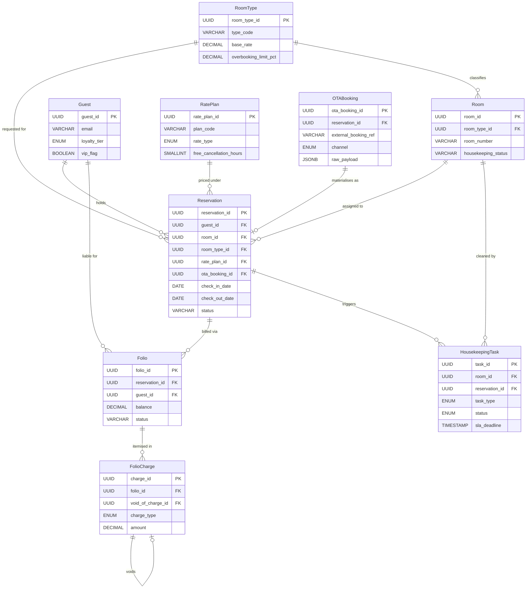

# Hotel Property Management System — Data Dictionary

## Core Entities

---

### Reservation

The central booking record that ties a guest to specific room nights, rate plans, and financial obligations. A reservation moves through a defined lifecycle from inquiry through checkout.

| Attribute | Type | Constraints | Description |
|-----------|------|-------------|-------------|
| reservation_id | UUID | PK, NOT NULL | Immutable surrogate key generated at creation |
| confirmation_number | VARCHAR(20) | UNIQUE, NOT NULL | Human-readable reference shown to guests (e.g., HTLF-20240815-0032) |
| guest_id | UUID | FK → Guest.guest_id, NOT NULL | Primary guest responsible for the folio |
| room_id | UUID | FK → Room.room_id, NULLABLE | Assigned room; NULL until room assignment is confirmed |
| room_type_id | UUID | FK → RoomType.room_type_id, NOT NULL | Requested room category at time of booking |
| rate_plan_id | UUID | FK → RatePlan.rate_plan_id, NOT NULL | Rate plan governing nightly pricing and policy |
| check_in_date | DATE | NOT NULL | Arrival date in the property's local timezone |
| check_out_date | DATE | NOT NULL, CHECK (check_out_date > check_in_date) | Departure date; must be strictly after check-in date |
| adults | SMALLINT | NOT NULL, CHECK (adults >= 1) | Number of adult occupants |
| children | SMALLINT | NOT NULL DEFAULT 0, CHECK (children >= 0) | Number of child occupants |
| status | ENUM('INQUIRED','CONFIRMED','WAITLISTED','CHECKED_IN','CHECKED_OUT','CANCELLED','NO_SHOW') | NOT NULL DEFAULT 'CONFIRMED' | Current lifecycle state of the reservation |
| source_channel | ENUM('DIRECT','OTA_EXPEDIA','OTA_BOOKING','OTA_AIRBNB','GDS','PHONE','WALK_IN','GROUP') | NOT NULL | Channel through which the booking originated |
| ota_booking_id | UUID | FK → OTABooking.ota_booking_id, NULLABLE | Reference to OTA sync record when source is an OTA channel |
| special_requests | TEXT | NULLABLE | Free-text guest requests (e.g., high floor, feather-free) |
| guaranteed | BOOLEAN | NOT NULL DEFAULT FALSE | TRUE if a valid payment method guarantees past 18:00 hold |
| group_block_id | UUID | NULLABLE | References group contract block when part of a group booking |
| cancellation_reason | VARCHAR(500) | NULLABLE | Populated when status transitions to CANCELLED or NO_SHOW |
| cancelled_at | TIMESTAMP WITH TIME ZONE | NULLABLE | Exact timestamp of cancellation for SLA and penalty calculation |
| created_at | TIMESTAMP WITH TIME ZONE | NOT NULL DEFAULT now() | Record creation timestamp (audit) |
| updated_at | TIMESTAMP WITH TIME ZONE | NOT NULL DEFAULT now() | Last modification timestamp; updated via trigger |
| created_by | UUID | NOT NULL | Staff or system identity that created the record |
| deleted_at | TIMESTAMP WITH TIME ZONE | NULLABLE | Soft-delete marker; NULL means active |

---

### Room

A physical bookable unit within the property. Rooms carry real-time availability and housekeeping state alongside their physical attributes.

| Attribute | Type | Constraints | Description |
|-----------|------|-------------|-------------|
| room_id | UUID | PK, NOT NULL | Immutable surrogate key |
| room_number | VARCHAR(10) | UNIQUE, NOT NULL | Property-visible identifier (e.g., "204", "PH-01") |
| room_type_id | UUID | FK → RoomType.room_type_id, NOT NULL | Category this room belongs to |
| floor | SMALLINT | NOT NULL, CHECK (floor >= 0) | Physical floor level; 0 for ground floor |
| building_wing | VARCHAR(50) | NULLABLE | Wing or tower designation for large properties |
| max_occupancy | SMALLINT | NOT NULL, CHECK (max_occupancy >= 1) | Hard cap on total occupants including children |
| square_meters | DECIMAL(6,2) | NOT NULL, CHECK (square_meters > 0) | Room area in square metres |
| bed_configuration | VARCHAR(100) | NOT NULL | Human-readable description (e.g., "1 King + 1 Sofa Bed") |
| connecting_room_id | UUID | FK → Room.room_id, NULLABLE | Self-referential link for connecting room pairs |
| view_type | ENUM('OCEAN','GARDEN','CITY','POOL','COURTYARD','NONE') | NOT NULL DEFAULT 'NONE' | Primary view category |
| accessibility_features | JSONB | NOT NULL DEFAULT '[]' | Array of accessibility flags (e.g., ["roll_in_shower","grab_bars"]) |
| housekeeping_status | ENUM('DIRTY','CLEANING','INSPECTED','CLEAN','OUT_OF_ORDER','OUT_OF_SERVICE') | NOT NULL DEFAULT 'DIRTY' | Live status updated by housekeeping mobile app |
| maintenance_notes | TEXT | NULLABLE | Engineering notes visible to operations only |
| is_smoking | BOOLEAN | NOT NULL DEFAULT FALSE | Designated smoking room flag |
| is_active | BOOLEAN | NOT NULL DEFAULT TRUE | FALSE removes room from availability calendar |
| created_at | TIMESTAMP WITH TIME ZONE | NOT NULL DEFAULT now() | Audit creation timestamp |
| updated_at | TIMESTAMP WITH TIME ZONE | NOT NULL DEFAULT now() | Audit modification timestamp |
| created_by | UUID | NOT NULL | Staff identity that onboarded this room |

---

### RoomType

A product category defining a class of rooms that share pricing, configuration, and policy attributes. Inventory is tracked at this level for rate-plan availability calculations.

| Attribute | Type | Constraints | Description |
|-----------|------|-------------|-------------|
| room_type_id | UUID | PK, NOT NULL | Immutable surrogate key |
| type_code | VARCHAR(20) | UNIQUE, NOT NULL | Short code used in channel manager and GDS (e.g., "STDKNG","DLXOCN") |
| type_name | VARCHAR(100) | NOT NULL | Displayed product name (e.g., "Deluxe Ocean View King") |
| category | ENUM('STANDARD','SUPERIOR','DELUXE','JUNIOR_SUITE','SUITE','VILLA','PENTHOUSE') | NOT NULL | Tier used for overbooking walk logic |
| total_rooms | SMALLINT | NOT NULL, CHECK (total_rooms > 0) | Physical inventory count for this type |
| base_rate | DECIMAL(10,2) | NOT NULL, CHECK (base_rate >= 0) | Published rack rate in property base currency |
| extra_adult_charge | DECIMAL(10,2) | NOT NULL DEFAULT 0.00 | Per-night surcharge for each adult beyond base occupancy |
| extra_child_charge | DECIMAL(10,2) | NOT NULL DEFAULT 0.00 | Per-night surcharge for each child beyond base occupancy |
| default_max_adults | SMALLINT | NOT NULL, CHECK (default_max_adults >= 1) | Adults included in base rate |
| default_max_children | SMALLINT | NOT NULL DEFAULT 0 | Children included in base rate |
| amenities | JSONB | NOT NULL DEFAULT '{}' | Structured amenities map (e.g., {"wifi":true,"minibar":true}) |
| thumbnail_url | VARCHAR(500) | NULLABLE | Primary marketing image URL |
| description | TEXT | NOT NULL | Marketing copy shown on booking engine |
| overbooking_limit_pct | DECIMAL(5,2) | NOT NULL DEFAULT 0.00, CHECK (overbooking_limit_pct BETWEEN 0 AND 20) | Maximum percentage above physical inventory (see BR-001) |
| created_at | TIMESTAMP WITH TIME ZONE | NOT NULL DEFAULT now() | Audit creation timestamp |
| updated_at | TIMESTAMP WITH TIME ZONE | NOT NULL DEFAULT now() | Audit modification timestamp |
| created_by | UUID | NOT NULL | Staff identity that created this room type |

---

### Guest

The individual whose identity is verified at check-in. One guest may hold multiple reservations across time. PII fields are subject to GDPR data-masking and right-to-erasure requirements.

| Attribute | Type | Constraints | Description |
|-----------|------|-------------|-------------|
| guest_id | UUID | PK, NOT NULL | Immutable surrogate key |
| profile_number | VARCHAR(20) | UNIQUE, NOT NULL | Human-readable CRM reference (e.g., "GST-000041723") |
| title | ENUM('MR','MRS','MS','DR','PROF','OTHER') | NULLABLE | Salutation for printed correspondence |
| first_name | VARCHAR(100) | NOT NULL | Given name; stored in plaintext for operational use |
| last_name | VARCHAR(100) | NOT NULL | Family name; stored in plaintext for operational use |
| email | VARCHAR(254) | UNIQUE, NOT NULL | Primary communication address; validated RFC 5321 format |
| phone_primary | VARCHAR(30) | NULLABLE | Primary phone in E.164 format (e.g., +66812345678) |
| phone_secondary | VARCHAR(30) | NULLABLE | Secondary contact number in E.164 format |
| nationality | CHAR(2) | NULLABLE | ISO 3166-1 alpha-2 country code |
| date_of_birth | DATE | NULLABLE | Used to verify minor status and for loyalty birthday promotions |
| id_type | ENUM('PASSPORT','NATIONAL_ID','DRIVERS_LICENSE','OTHER') | NULLABLE | Government-issued document type used at check-in |
| id_number_masked | VARCHAR(50) | NULLABLE | Masked identifier (e.g., "****1234") stored post-verification |
| id_scan_reference | UUID | NULLABLE | Reference to encrypted document in secure blob storage |
| loyalty_tier | ENUM('NONE','SILVER','GOLD','PLATINUM','DIAMOND') | NOT NULL DEFAULT 'NONE' | Loyalty programme tier driving rate and upgrade eligibility |
| loyalty_points | INTEGER | NOT NULL DEFAULT 0, CHECK (loyalty_points >= 0) | Accumulated unredeemed points balance |
| gdpr_consent | BOOLEAN | NOT NULL DEFAULT FALSE | Explicit marketing consent flag per GDPR Article 6 |
| gdpr_consent_at | TIMESTAMP WITH TIME ZONE | NULLABLE | Timestamp of last consent action |
| anonymised_at | TIMESTAMP WITH TIME ZONE | NULLABLE | Set when right-to-erasure request processed; PII fields zeroed |
| vip_flag | BOOLEAN | NOT NULL DEFAULT FALSE | Triggers housekeeping inspector sign-off requirement |
| preferred_language | CHAR(5) | NOT NULL DEFAULT 'en' | BCP 47 language tag for guest-facing communications |
| created_at | TIMESTAMP WITH TIME ZONE | NOT NULL DEFAULT now() | Audit creation timestamp |
| updated_at | TIMESTAMP WITH TIME ZONE | NOT NULL DEFAULT now() | Audit modification timestamp |
| created_by | UUID | NOT NULL | Staff or booking-engine identity that created the profile |
| deleted_at | TIMESTAMP WITH TIME ZONE | NULLABLE | Soft-delete marker |

---

### Folio

An itemised financial account associated with a single reservation stay. All monetary transactions are posted against a folio. A reservation may have multiple folios (e.g., main folio + incidentals folio).

| Attribute | Type | Constraints | Description |
|-----------|------|-------------|-------------|
| folio_id | UUID | PK, NOT NULL | Immutable surrogate key |
| reservation_id | UUID | FK → Reservation.reservation_id, NOT NULL | Parent reservation |
| guest_id | UUID | FK → Guest.guest_id, NOT NULL | Responsible party; may differ from reservation guest for group splits |
| folio_type | ENUM('MAIN','INCIDENTALS','MASTER','CITY_LEDGER') | NOT NULL DEFAULT 'MAIN' | Classification affecting billing and export logic |
| currency_code | CHAR(3) | NOT NULL DEFAULT 'USD' | ISO 4217 currency for all charges on this folio |
| status | ENUM('OPEN','PENDING_PAYMENT','SETTLED','DISPUTED','VOID') | NOT NULL DEFAULT 'OPEN' | Folio lifecycle state |
| balance | DECIMAL(12,2) | NOT NULL DEFAULT 0.00 | Running total recomputed by trigger after each charge posting |
| credit_limit | DECIMAL(12,2) | NULLABLE | Maximum balance before payment is required |
| payment_method_token | VARCHAR(255) | NULLABLE | Tokenised card reference from PCI-compliant vault (no raw PAN) |
| settled_at | TIMESTAMP WITH TIME ZONE | NULLABLE | Timestamp when balance was brought to zero |
| invoice_number | VARCHAR(30) | UNIQUE, NULLABLE | Assigned at settlement; formatted for tax authority submission |
| tax_registration_number | VARCHAR(50) | NULLABLE | Guest or corporate VAT/GST number for tax invoices |
| notes | TEXT | NULLABLE | Front-desk notes visible in billing panel |
| created_at | TIMESTAMP WITH TIME ZONE | NOT NULL DEFAULT now() | Audit creation timestamp |
| updated_at | TIMESTAMP WITH TIME ZONE | NOT NULL DEFAULT now() | Audit modification timestamp |
| created_by | UUID | NOT NULL | Staff or automated process that opened the folio |

---

### FolioCharge

An individual line item posted to a folio. Immutable once posted; corrections are made via offsetting void charges, never by editing existing rows.

| Attribute | Type | Constraints | Description |
|-----------|------|-------------|-------------|
| charge_id | UUID | PK, NOT NULL | Immutable surrogate key |
| folio_id | UUID | FK → Folio.folio_id, NOT NULL | Parent folio |
| charge_type | ENUM('ROOM_RATE','FOOD_BEVERAGE','SPA','MINIBAR','LAUNDRY','TELEPHONE','PARKING','TAX','FEE','PAYMENT','ADJUSTMENT','VOID') | NOT NULL | Classification for reporting and revenue centres |
| description | VARCHAR(255) | NOT NULL | Human-readable line-item description |
| quantity | DECIMAL(10,3) | NOT NULL DEFAULT 1.000, CHECK (quantity > 0) | Units consumed (e.g., 1.000 for a meal, 2.000 for two nights) |
| unit_price | DECIMAL(10,2) | NOT NULL | Price per unit in folio currency |
| amount | DECIMAL(12,2) | NOT NULL | Computed total (quantity × unit_price); stored for immutability |
| tax_amount | DECIMAL(10,2) | NOT NULL DEFAULT 0.00 | Tax component included in amount |
| tax_code | VARCHAR(20) | NULLABLE | Tax rule code applied (e.g., "VAT_10", "OCCUPANCY_TAX") |
| revenue_center_id | UUID | NULLABLE | References revenue centre for departmental P&L allocation |
| posted_at | TIMESTAMP WITH TIME ZONE | NOT NULL DEFAULT now() | Exact post timestamp; used for night audit boundary detection |
| posted_by | UUID | NOT NULL | Staff or automated process identity |
| void_of_charge_id | UUID | FK → FolioCharge.charge_id, NULLABLE | Self-referential link: this charge voids the referenced charge |
| void_reason | VARCHAR(500) | NULLABLE | Mandatory when charge_type = 'VOID' |
| outlet_reference | VARCHAR(100) | NULLABLE | POS transaction ID or external system reference |
| is_night_audit_charge | BOOLEAN | NOT NULL DEFAULT FALSE | TRUE for charges auto-posted during nightly batch run |

---

### RatePlan

A pricing product that defines how nightly rates are computed, what cancellation and deposit rules apply, and which distribution channels may sell it.

| Attribute | Type | Constraints | Description |
|-----------|------|-------------|-------------|
| rate_plan_id | UUID | PK, NOT NULL | Immutable surrogate key |
| plan_code | VARCHAR(30) | UNIQUE, NOT NULL | Channel manager and GDS code (e.g., "BAR","FLEX30","NREF14") |
| plan_name | VARCHAR(150) | NOT NULL | Displayed name on booking engine and OTA listings |
| rate_type | ENUM('BAR','PACKAGE','PROMOTIONAL','CORPORATE','GROUP','OTA','NON_REFUNDABLE','ADVANCE_PURCHASE') | NOT NULL | Controls eligibility rules and parity enforcement (BR-003) |
| base_modifier_pct | DECIMAL(6,3) | NOT NULL DEFAULT 0.000 | Percentage adjustment applied on top of room type base_rate |
| min_length_of_stay | SMALLINT | NOT NULL DEFAULT 1, CHECK (min_length_of_stay >= 1) | Minimum nights required for this rate to be bookable |
| max_length_of_stay | SMALLINT | NULLABLE | Maximum nights allowed; NULL means unrestricted |
| advance_purchase_days | SMALLINT | NULLABLE | Minimum days in advance the booking must be made |
| free_cancellation_hours | SMALLINT | NOT NULL DEFAULT 0 | Hours before check-in within which cancellation is fee-free |
| cancellation_penalty_type | ENUM('NONE','ONE_NIGHT','FULL_STAY') | NOT NULL DEFAULT 'NONE' | Penalty tier applied after free-cancellation window expires |
| deposit_required_pct | DECIMAL(5,2) | NOT NULL DEFAULT 0.00 | Percentage of total stay collected at booking |
| includes_breakfast | BOOLEAN | NOT NULL DEFAULT FALSE | Whether rate includes daily breakfast |
| includes_dinner | BOOLEAN | NOT NULL DEFAULT FALSE | Whether rate includes daily dinner |
| eligible_channels | JSONB | NOT NULL DEFAULT '["DIRECT"]' | Array of channel codes allowed to sell this rate |
| valid_from | DATE | NOT NULL | First date this rate plan is bookable |
| valid_to | DATE | NULLABLE | Last date this rate plan is bookable; NULL means open-ended |
| is_active | BOOLEAN | NOT NULL DEFAULT TRUE | Deactivation flag without deletion |
| created_at | TIMESTAMP WITH TIME ZONE | NOT NULL DEFAULT now() | Audit creation timestamp |
| updated_at | TIMESTAMP WITH TIME ZONE | NOT NULL DEFAULT now() | Audit modification timestamp |
| created_by | UUID | NOT NULL | Revenue manager identity that created this plan |

---

### HousekeepingTask

A unit of work assigned to housekeeping staff for a specific room. Tasks are auto-generated on checkout and can be manually created for maintenance-related cleaning.

| Attribute | Type | Constraints | Description |
|-----------|------|-------------|-------------|
| task_id | UUID | PK, NOT NULL | Immutable surrogate key |
| room_id | UUID | FK → Room.room_id, NOT NULL | Target room for this task |
| reservation_id | UUID | FK → Reservation.reservation_id, NULLABLE | Source reservation triggering the task; NULL for ad-hoc tasks |
| task_type | ENUM('CHECKOUT_CLEAN','STAYOVER_REFRESH','DEEP_CLEAN','TURNDOWN','INSPECTION','LINEN_CHANGE','MAINTENANCE_PREP') | NOT NULL | Governs checklist template and SLA timer |
| priority | ENUM('STANDARD','HIGH','VIP','URGENT') | NOT NULL DEFAULT 'STANDARD' | Influences scheduling order in housekeeping mobile app |
| assigned_to | UUID | NULLABLE | FK → Staff.staff_id; NULL if unassigned |
| assigned_at | TIMESTAMP WITH TIME ZONE | NULLABLE | Timestamp when task was assigned to an attendant |
| started_at | TIMESTAMP WITH TIME ZONE | NULLABLE | When attendant tapped "Start" in mobile app |
| completed_at | TIMESTAMP WITH TIME ZONE | NULLABLE | When attendant tapped "Complete" |
| inspected_at | TIMESTAMP WITH TIME ZONE | NULLABLE | When supervisor confirmed room INSPECTED status |
| inspected_by | UUID | NULLABLE | FK → Staff.staff_id for inspector (required for VIP rooms per BR-004) |
| status | ENUM('PENDING','ASSIGNED','IN_PROGRESS','COMPLETED','INSPECTED','CANCELLED') | NOT NULL DEFAULT 'PENDING' | Current task lifecycle state |
| checklist_snapshot | JSONB | NULLABLE | Point-in-time snapshot of completed checklist items |
| notes | TEXT | NULLABLE | Attendant or supervisor notes about the room condition |
| sla_deadline | TIMESTAMP WITH TIME ZONE | NULLABLE | Computed deadline (checkout_time + 3 hours per BR-004) |
| sla_breached | BOOLEAN | NOT NULL DEFAULT FALSE | Set TRUE by background job when completed_at > sla_deadline |
| created_at | TIMESTAMP WITH TIME ZONE | NOT NULL DEFAULT now() | Audit creation timestamp |
| updated_at | TIMESTAMP WITH TIME ZONE | NOT NULL DEFAULT now() | Audit modification timestamp |
| created_by | UUID | NOT NULL | System or staff identity that generated the task |

---

### OTABooking

A synchronisation record capturing the raw payload received from an OTA channel manager or direct API integration. Serves as an idempotency buffer and audit log for external bookings.

| Attribute | Type | Constraints | Description |
|-----------|------|-------------|-------------|
| ota_booking_id | UUID | PK, NOT NULL | Surrogate key generated internally on receipt |
| external_booking_ref | VARCHAR(100) | NOT NULL | OTA's own booking reference number |
| channel | ENUM('EXPEDIA','BOOKING_COM','AIRBNB','AGODA','HOTELS_COM','TRIP_COM','DIRECT_API') | NOT NULL | Source OTA channel |
| external_channel_ref | VARCHAR(100) | NULLABLE | Channel manager's internal reference |
| ota_rate_code | VARCHAR(50) | NULLABLE | Rate code as published on the OTA platform |
| ota_room_code | VARCHAR(50) | NOT NULL | OTA's product code mapped to a local RoomType |
| reservation_id | UUID | FK → Reservation.reservation_id, NULLABLE | Linked internal reservation; NULL until mapping succeeds |
| mapping_status | ENUM('PENDING','MAPPED','FAILED','DUPLICATE') | NOT NULL DEFAULT 'PENDING' | Processing state of the inbound OTA message |
| action | ENUM('NEW','MODIFY','CANCEL') | NOT NULL | Type of OTA event received |
| raw_payload | JSONB | NOT NULL | Complete unmodified payload from the OTA for audit and replay |
| received_at | TIMESTAMP WITH TIME ZONE | NOT NULL DEFAULT now() | Timestamp of payload receipt at the channel manager adapter |
| processed_at | TIMESTAMP WITH TIME ZONE | NULLABLE | Timestamp when mapping to internal reservation completed |
| failure_reason | VARCHAR(1000) | NULLABLE | Error description when mapping_status = 'FAILED' |
| ota_commission_pct | DECIMAL(5,2) | NULLABLE | Commission percentage disclosed in the OTA payload |
| guest_name_ota | VARCHAR(200) | NULLABLE | Guest name as received from OTA; may differ from matched Guest record |
| check_in_date | DATE | NOT NULL | Arrival date as provided by OTA |
| check_out_date | DATE | NOT NULL, CHECK (check_out_date > check_in_date) | Departure date as provided by OTA |
| adults | SMALLINT | NOT NULL DEFAULT 1 | Adult count from OTA payload |
| total_ota_amount | DECIMAL(12,2) | NULLABLE | Total booking value in the OTA-quoted currency |
| ota_currency | CHAR(3) | NULLABLE | ISO 4217 currency of OTA-quoted amount |

---

## Canonical Relationship Diagram

The following entity-relationship diagram captures all core entities and the primary foreign-key relationships enforced at the database layer. Optional relationships are shown with `o|` notation.

---

## Data Quality Controls

### Field Validation Rules

**Reservation**
- `check_out_date > check_in_date` enforced by a `CHECK` constraint; the application layer additionally validates a minimum 1-night stay before submitting.
- `adults >= 1` — a reservation with zero adults is semantically invalid; the constraint prevents orphaned records.
- `status` transitions are guarded by a PostgreSQL trigger that rejects illegal state jumps (e.g., `CHECKED_OUT` → `CONFIRMED`).
- `confirmation_number` is generated by a sequence-backed function using property code + date + sequence; the UNIQUE constraint catches race conditions under concurrent load.

**Room**
- `housekeeping_status` changes are validated against an allowed-transition matrix in the application service before the UPDATE is issued. Direct SQL writes outside the service must pass review.
- `room_number` must match the pattern `[A-Z0-9]{1,2}-?[0-9]{2,4}` (enforced via `CHECK (room_number ~ '^[A-Z0-9]{1,2}-?[0-9]{2,4}$')`).
- `square_meters` must be positive and practically capped at 5000 via a `CHECK` constraint.

**Guest**
- `email` is validated at the application layer against RFC 5321 and normalised to lowercase before storage; the database `UNIQUE` constraint operates on the normalised value.
- `phone_primary` and `phone_secondary` are validated by the application layer against the libphonenumber E.164 specification.
- `date_of_birth` must be in the past and plausibly human (`CHECK (date_of_birth BETWEEN '1900-01-01' AND CURRENT_DATE - INTERVAL '1 day')`).
- `loyalty_points` cannot decrease below zero; adjustments are made via a dedicated ledger function that validates the resulting balance before committing.

**FolioCharge**
- `amount` is derived from `quantity * unit_price` and stored; a `BEFORE INSERT` trigger validates that the stored amount matches the computed value within a 0.01 rounding tolerance.
- `void_reason` is mandatory (`NOT NULL`) when `charge_type = 'VOID'`, enforced by a trigger.
- `posted_at` is set by the database server clock, not the client clock, to prevent manipulation.
- No `UPDATE` or `DELETE` on `FolioCharge` is permitted outside the dedicated void-charge stored procedure.

**RatePlan**
- `valid_to >= valid_from` when both are populated, enforced by `CHECK`.
- `base_modifier_pct` is bounded to `[-50.000, 100.000]` to prevent accidental free-room promotions.
- `deposit_required_pct` must be between 0.00 and 100.00.

### Referential Integrity Constraints

All foreign keys use `ON DELETE RESTRICT` by default to prevent orphaned child records. The following exceptions apply:

| Child Table | FK Column | Policy | Rationale |
|---|---|---|---|
| Reservation | room_id | SET NULL | Room can be unassigned without invalidating the booking |
| HousekeepingTask | reservation_id | SET NULL | Ad-hoc tasks exist without a source reservation |
| OTABooking | reservation_id | SET NULL | Failed-mapping OTA payloads are retained for reprocessing |
| FolioCharge | void_of_charge_id | RESTRICT | A voidable charge must always exist when referenced |

Cascading deletes are prohibited across the entire schema. Hard deletes are reserved for GDPR erasure procedures executed by the data-privacy service under controlled conditions.

### Business Rule Constraints

- `check_out_date > check_in_date` — encoded as a `CHECK` constraint on `Reservation`; also validated in the channel manager adapter before OTA payloads are ingested.
- `RoomType.overbooking_limit_pct BETWEEN 0 AND 20` — the overbooking ceiling is capped at 20% by schema constraint, reflecting the maximum allowable under the property's walk-cost policy.
- Group block reservations (`group_block_id IS NOT NULL`) require a corresponding deposit record before `status` may leave `CONFIRMED`; enforced via trigger.
- A `Folio` with `status = 'SETTLED'` cannot accept new `FolioCharge` records; the insert trigger checks parent folio status and raises an exception.

### Soft-Delete Patterns

Tables that support soft-delete carry a `deleted_at TIMESTAMP WITH TIME ZONE` column (nullable). The application layer filters all standard queries with `WHERE deleted_at IS NULL`. Hard deletes are blocked by a trigger that rewrites the `DELETE` as a `deleted_at = now()` update.

Entities with soft-delete support: `Reservation`, `Guest`, `RoomType`.

A scheduled job runs nightly to permanently purge soft-deleted `Guest` records older than 90 days, subject to the absence of linked active reservations. Purge events are written to the `gdpr_erasure_log` audit table before row removal.

### Audit Fields

Every table carries at minimum:

| Column | Type | Description |
|---|---|---|
| created_at | TIMESTAMP WITH TIME ZONE | Set once on INSERT via `DEFAULT now()`; never updated |
| updated_at | TIMESTAMP WITH TIME ZONE | Maintained by an `AFTER UPDATE` trigger |
| created_by | UUID | Authenticated actor (staff ID or service account UUID) captured from the application session context |

High-sensitivity tables (`Folio`, `FolioCharge`, `Reservation`, `Guest`) additionally write to an append-only `audit_log` table capturing old and new row images on every change, with the actor identity and originating IP address.

### Data Masking for PCI and GDPR Fields

**PCI DSS Scope**
- No raw PANs (Primary Account Numbers) are stored at any point. The `Folio.payment_method_token` column stores only an opaque token from the PCI-compliant vault provider (e.g., Stripe, Adyen).
- The token column is encrypted at rest using AES-256 column-level encryption via PostgreSQL's `pgcrypto` extension.
- Application-layer logs are scrubbed of any card-related fields before writing to the log aggregator.

**GDPR Scope**
- `Guest.id_number_masked` stores only the masked representation (last four digits visible); the full scan reference points to an encrypted blob outside the relational database.
- `Guest.email` and `Guest.phone_primary` are tagged in the schema with a `COMMENT` marker (`'pii:email'`, `'pii:phone'`) consumed by the data-catalogue tool to enforce access policies.
- When a right-to-erasure request is processed, the data-privacy service executes the `anonymise_guest(guest_id)` stored procedure which overwrites PII fields with deterministic anonymised values, sets `anonymised_at`, and removes the `id_scan_reference` blob.
- Data exports for analytics use a view (`v_guest_analytics`) that applies `COALESCE` masking on PII columns, replacing names and contact details with anonymised tokens.
