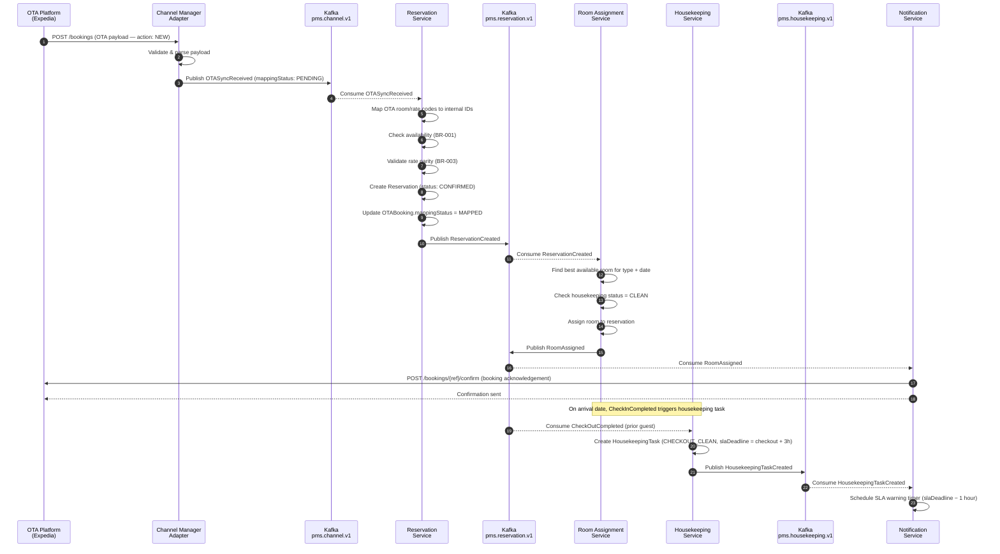
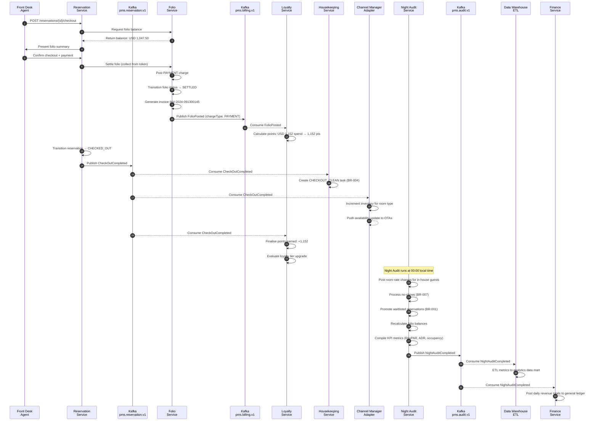
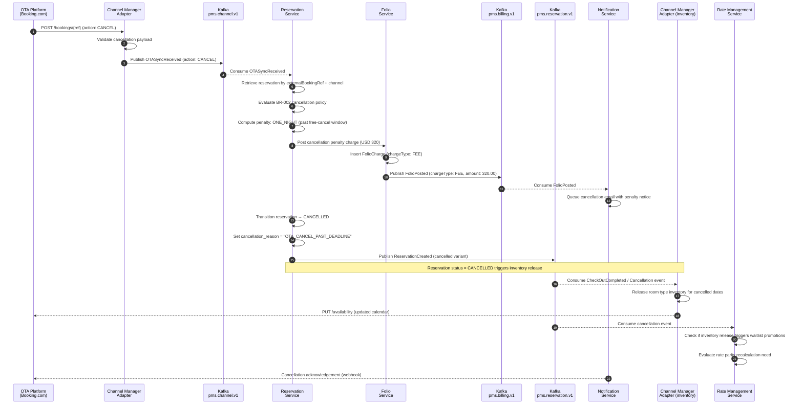

# Hotel Property Management System — Event Catalog

## Contract Conventions

### Event Envelope Schema

Every event published by any service in the Hotel PMS platform conforms to a standardised envelope. The envelope separates infrastructure-level metadata from domain-specific payload, enabling consumers to route, filter, and process events without deserialising the inner payload unless needed.

```json
{
  "eventId": "uuid-v4",
  "eventType": "reservation.ReservationCreated",
  "aggregateId": "uuid-v4",
  "aggregateType": "Reservation",
  "occurredAt": "2024-08-15T14:32:00.000Z",
  "version": "1.0.0",
  "correlationId": "uuid-v4",
  "causationId": "uuid-v4",
  "traceId": "hex-string-32",
  "producerService": "reservation-service",
  "tenantId": "property-uuid",
  "payload": { }
}
```

| Field | Type | Description |
|---|---|---|
| eventId | UUID v4 | Globally unique identifier for this event instance. Used as idempotency key by consumers |
| eventType | String | Fully qualified event name in `[domain].[EntityVerb]` format |
| aggregateId | UUID v4 | ID of the domain aggregate that produced the event |
| aggregateType | String | Class name of the aggregate (e.g., "Reservation", "Room") |
| occurredAt | ISO 8601 UTC | Timestamp when the state change occurred in the domain; NOT the publish timestamp |
| version | Semver string | Schema version of the payload; consumers check this to route to the correct deserialiser |
| correlationId | UUID v4 | Shared ID threaded through all events that belong to the same business transaction |
| causationId | UUID v4 | eventId of the event that directly caused this event (for causation chains) |
| traceId | Hex string | Distributed tracing ID (OpenTelemetry W3C trace context) |
| producerService | String | Service name identifier for debugging and routing |
| tenantId | UUID v4 | Property identifier enabling multi-tenant event segregation |
| payload | JSON object | Domain-specific data; schema versioned independently per eventType |

### Versioning Strategy

Event schemas follow **semantic versioning** (`MAJOR.MINOR.PATCH`) applied to the payload schema:

- **PATCH** (e.g., 1.0.0 → 1.0.1): Bug fix to a field description or non-functional metadata addition. No consumer impact.
- **MINOR** (e.g., 1.0.0 → 1.1.0): Backward-compatible addition of optional fields. Consumers built for 1.0.x will safely ignore new fields. No breaking change.
- **MAJOR** (e.g., 1.0.0 → 2.0.0): Breaking change — field renamed, removed, type changed, or semantic meaning altered. A new topic version is introduced (e.g., `pms.reservation.v2`). Both versions run in parallel during the deprecation window (minimum 60 days). Consumers have 60 days to migrate before the v1 topic is decommissioned.

Backward compatibility rules:
- Never remove a required field in a MINOR version.
- Never change the type of an existing field in a MINOR version.
- Adding a new required field always constitutes a MAJOR version bump.
- Enum values may be added in a MINOR version (consumers must handle unknown enum values gracefully).

### Transport: Apache Kafka and SNS/SQS

**Intra-domain / service-to-service (Kafka)**
Apache Kafka is the primary event bus for all domain events within the Hotel PMS platform. Topics are partitioned by `aggregateId` to guarantee ordering of events for the same aggregate.

Topic naming pattern: `pms.[domain].[v{N}]`

| Domain | Kafka Topic |
|---|---|
| Reservation | `pms.reservation.v1` |
| Housekeeping | `pms.housekeeping.v1` |
| Billing / Folio | `pms.billing.v1` |
| Channel / OTA | `pms.channel.v1` |
| Night Audit | `pms.audit.v1` |

Kafka cluster configuration:
- Replication factor: 3 (across 3 availability zones)
- Minimum ISR (In-Sync Replicas): 2
- Producer `acks = all` to prevent data loss
- Consumer group offsets committed after successful processing (at-least-once delivery)

**Cross-service / external (SNS/SQS)**
For communication with services outside the PMS core (e.g., CRM, loyalty engine, payment gateway webhooks), Amazon SNS fan-out with SQS subscriber queues is used. Each consuming service subscribes to the SNS topic and processes events from its own SQS queue with a configured Dead Letter Queue (DLQ) for failed processing.

### Schema Registry

All event payload schemas are registered in **Confluent Schema Registry** (Avro and JSON Schema formats supported). The registry enforces compatibility rules aligned with the versioning strategy:

- Default compatibility: `BACKWARD` (consumers on v1.x can read v1.x+1 events).
- MAJOR version bumps: registered under a new subject name with `FULL` compatibility on the new subject.
- All services must register schemas before deploying a producer. CI pipelines include a schema compatibility check step that fails the build if an incompatible schema change is detected.

### Naming Convention

Event types follow the pattern: `[domain].[EntityPastTenseVerb]`

```
domain       = lowercase, hyphen-separated domain name (e.g., "reservation", "housekeeping")
Entity       = PascalCase aggregate entity name
PastTenseVerb = PascalCase action in simple past tense
```

Examples:
- `reservation.ReservationCreated`
- `reservation.CheckInCompleted`
- `housekeeping.HousekeepingTaskCreated`
- `billing.FolioPosted`
- `channel.OTASyncReceived`
- `audit.NightAuditCompleted`

---

## Domain Events

---

**ReservationCreated**

*Topic:* `pms.reservation.v1`

*Producer:* `reservation-service`

*Consumers:* `room-assignment-service`, `folio-service`, `channel-manager-adapter`, `crm-service`, `notification-service`, `loyalty-service`

*Payload:*
```json
{
  "reservationId": "uuid-v4",
  "confirmationNumber": "HTLF-20240815-0032",
  "guestId": "uuid-v4",
  "roomTypeId": "uuid-v4",
  "roomTypeCode": "DLXOCN",
  "ratePlanId": "uuid-v4",
  "ratePlanCode": "BAR",
  "checkInDate": "2024-09-10",
  "checkOutDate": "2024-09-13",
  "nights": 3,
  "adults": 2,
  "children": 0,
  "totalAmount": 960.00,
  "currency": "USD",
  "sourceChannel": "DIRECT",
  "guaranteed": true,
  "specialRequests": "High floor preferred",
  "otaBookingId": null,
  "groupBlockId": null,
  "status": "CONFIRMED"
}
```

*Business Significance:* This event is the starting point of the guest stay lifecycle. It triggers room availability decrement in the channel manager, folio pre-creation, and the first guest communication (confirmation email). The loyalty service captures the booking for future points award eligibility. The CRM service updates the guest's stay history and may trigger loyalty tier re-evaluation.

*Idempotency Key:* `eventId` — consumers use `eventId` to deduplicate in case of Kafka redelivery. The `reservation-service` also publishes with `confirmationNumber` as a secondary business idempotency key checked by the channel-manager-adapter before sending availability updates to OTAs.

*Retention:* 14 days on the Kafka topic; archived to cold storage (S3 Parquet) indefinitely for analytics and compliance.

---

**CheckInCompleted**

*Topic:* `pms.reservation.v1`

*Producer:* `reservation-service`

*Consumers:* `folio-service`, `room-assignment-service`, `housekeeping-service`, `notification-service`, `access-control-service`, `crm-service`

*Payload:*
```json
{
  "reservationId": "uuid-v4",
  "confirmationNumber": "HTLF-20240815-0032",
  "guestId": "uuid-v4",
  "roomId": "uuid-v4",
  "roomNumber": "512",
  "checkedInAt": "2024-09-10T14:47:00.000Z",
  "checkedInBy": "staff-uuid",
  "idVerified": true,
  "idType": "PASSPORT",
  "idNumberMasked": "****1234",
  "companionCount": 1,
  "folioId": "uuid-v4",
  "creditLimitSet": 1500.00,
  "currency": "USD",
  "vipGuest": false
}
```

*Business Significance:* Signals the physical arrival of the guest. The `access-control-service` activates keycard access for the assigned room. The `folio-service` transitions the folio to OPEN and applies the configured credit limit. The `notification-service` sends a welcome SMS and in-room technology activation request. The `housekeeping-service` marks the room as occupied and removes any pending stayover tasks from the queue until the next morning.

*Idempotency Key:* `eventId`. The `access-control-service` additionally uses `reservationId + roomId` to prevent duplicate keycard activations.

*Retention:* 14 days on the Kafka topic; archived to cold storage indefinitely.

---

**RoomAssigned**

*Topic:* `pms.reservation.v1`

*Producer:* `room-assignment-service`

*Consumers:* `reservation-service`, `housekeeping-service`, `notification-service`, `in-room-technology-service`

*Payload:*
```json
{
  "reservationId": "uuid-v4",
  "confirmationNumber": "HTLF-20240815-0032",
  "guestId": "uuid-v4",
  "previousRoomId": null,
  "assignedRoomId": "uuid-v4",
  "roomNumber": "512",
  "roomTypeId": "uuid-v4",
  "roomTypeCode": "DLXOCN",
  "floor": 5,
  "buildingWing": "OCEAN",
  "assignedAt": "2024-09-09T18:00:00.000Z",
  "assignedBy": "staff-uuid",
  "isUpgrade": false,
  "upgradeReason": null,
  "housekeepingStatus": "CLEAN"
}
```

*Business Significance:* Confirms that a specific physical room has been allocated to a reservation. If `isUpgrade = true`, the guest communications service sends a complimentary upgrade notification email. The `housekeeping-service` verifies the room is in CLEAN status; if not, it raises an advisory alert to the front desk before allowing the assignment to be finalised. The `in-room-technology-service` pre-configures welcome screen personalisation with the guest's preferred language and name.

*Idempotency Key:* `eventId`. The `reservation-service` also gates on `reservationId` to ensure at most one assigned room per reservation at any time.

*Retention:* 14 days on topic; archived to cold storage.

---

**FolioPosted**

*Topic:* `pms.billing.v1`

*Producer:* `folio-service`

*Consumers:* `notification-service`, `revenue-reporting-service`, `tax-service`, `pos-integration-adapter`, `loyalty-service`

*Payload:*
```json
{
  "chargeId": "uuid-v4",
  "folioId": "uuid-v4",
  "reservationId": "uuid-v4",
  "guestId": "uuid-v4",
  "chargeType": "FOOD_BEVERAGE",
  "description": "In-Room Dining — Dinner for 2",
  "quantity": 1.0,
  "unitPrice": 125.00,
  "amount": 125.00,
  "taxAmount": 12.50,
  "taxCode": "VAT_10",
  "currency": "USD",
  "revenueCenter": "IN_ROOM_DINING",
  "postedAt": "2024-09-11T20:35:00.000Z",
  "postedBy": "pos-system-uuid",
  "outletReference": "POS-TXN-88432",
  "isNightAuditCharge": false,
  "folioBalance": 252.50
}
```

*Business Significance:* Provides a real-time feed of all revenue events for departmental P&L reporting, tax calculation, and loyalty points accrual. The `tax-service` checks the `taxCode` and validates the tax amount is correctly computed; discrepancies raise a reconciliation alert. The `loyalty-service` accrues eligible spend toward the guest's points balance when `chargeType` is in the eligible earn categories. The `notification-service` triggers an in-room TV folio update within 60 seconds.

*Idempotency Key:* `chargeId`. Consumers use `chargeId` to prevent double processing. The POS adapter includes `outletReference` as a secondary key for cross-system reconciliation.

*Retention:* 30 days on the Kafka topic (extended for billing compliance); archived to cold storage for 7 years per financial record-keeping requirements.

---

**CheckOutCompleted**

*Topic:* `pms.reservation.v1`

*Producer:* `reservation-service`

*Consumers:* `folio-service`, `housekeeping-service`, `room-assignment-service`, `channel-manager-adapter`, `notification-service`, `crm-service`, `loyalty-service`, `access-control-service`

*Payload:*
```json
{
  "reservationId": "uuid-v4",
  "confirmationNumber": "HTLF-20240815-0032",
  "guestId": "uuid-v4",
  "roomId": "uuid-v4",
  "roomNumber": "512",
  "checkedOutAt": "2024-09-13T11:02:00.000Z",
  "checkedOutBy": "staff-uuid",
  "folioId": "uuid-v4",
  "totalCharges": 1047.50,
  "totalTax": 104.75,
  "totalPaid": 1152.25,
  "settlementMethod": "CREDIT_CARD_TOKEN",
  "currency": "USD",
  "invoiceNumber": "INV-2024-091300145",
  "loyaltyPointsEarned": 1152,
  "nights": 3,
  "wasVipGuest": false
}
```

*Business Significance:* The most downstream event in the stay lifecycle. It triggers the largest fan-out of any single event in the platform. `folio-service` seals the folio and generates the tax invoice. `housekeeping-service` creates a `CHECKOUT_CLEAN` task per BR-004. `room-assignment-service` marks the room as unassigned and available. `channel-manager-adapter` increments available inventory for the vacated room type. `access-control-service` deactivates keycard access. `loyalty-service` finalises points earned for the stay. `crm-service` updates the guest's cumulative lifetime value and initiates a post-stay survey dispatch.

*Idempotency Key:* `eventId`. Downstream services additionally gate on `reservationId` transitioning to `CHECKED_OUT` status exactly once.

*Retention:* 14 days on topic; archived to cold storage indefinitely.

---

**HousekeepingTaskCreated**

*Topic:* `pms.housekeeping.v1`

*Producer:* `housekeeping-service`

*Consumers:* `housekeeping-mobile-app`, `room-assignment-service`, `notification-service`

*Payload:*
```json
{
  "taskId": "uuid-v4",
  "roomId": "uuid-v4",
  "roomNumber": "512",
  "floor": 5,
  "buildingWing": "OCEAN",
  "reservationId": "uuid-v4",
  "taskType": "CHECKOUT_CLEAN",
  "priority": "STANDARD",
  "vipGuest": false,
  "inspectionRequired": false,
  "slaDeadline": "2024-09-13T14:02:00.000Z",
  "checklistTemplateId": "uuid-v4",
  "createdAt": "2024-09-13T11:02:00.000Z",
  "createdBy": "reservation-service",
  "specialInstructions": null
}
```

*Business Significance:* Drives the real-time housekeeping operations workflow. The `housekeeping-mobile-app` receives push notifications with new tasks ordered by priority and floor proximity. The `room-assignment-service` subscribes to track which rooms are unavailable for check-in due to pending housekeeping. The `notification-service` subscribes to set SLA warning timers per BR-004: a floor supervisor alert fires 1 hour before the `slaDeadline` if the task is not yet COMPLETED.

*Idempotency Key:* `taskId`. The mobile app deduplicates by `taskId` when handling potential Kafka redelivery.

*Retention:* 7 days on topic; archived to cold storage for 90 days for operational analytics.

---

**OTASyncReceived**

*Topic:* `pms.channel.v1`

*Producer:* `channel-manager-adapter`

*Consumers:* `reservation-service`, `rate-management-service`, `inventory-service`, `audit-service`

*Payload:*
```json
{
  "otaBookingId": "uuid-v4",
  "externalBookingRef": "EXP-7823904",
  "channel": "EXPEDIA",
  "externalChannelRef": "CM-REF-00192",
  "action": "NEW",
  "otaRoomCode": "DLXOCN",
  "otaRateCode": "EXP-FLEX",
  "guestNameOta": "John Smith",
  "checkInDate": "2024-09-10",
  "checkOutDate": "2024-09-13",
  "adults": 2,
  "children": 0,
  "totalOtaAmount": 880.00,
  "otaCurrency": "USD",
  "otaCommissionPct": 15.00,
  "receivedAt": "2024-08-15T09:14:32.000Z",
  "rawPayloadRef": "s3://pms-ota-payloads/2024/08/15/EXP-7823904.json",
  "mappingStatus": "PENDING"
}
```

*Business Significance:* The ingestion point for all externally-originated bookings. The `reservation-service` consumes this event to create or update an internal `Reservation` record. The `rate-management-service` checks the `otaRateCode` and `totalOtaAmount` against current BAR to detect parity violations per BR-003. The `inventory-service` updates the availability calendar to reflect the OTA commitment. The `audit-service` archives the `rawPayloadRef` for regulatory and dispute resolution purposes. For `action = CANCEL`, the event triggers the cancellation workflow including penalty evaluation per BR-002.

*Idempotency Key:* `otaBookingId`. The `reservation-service` also checks `externalBookingRef + channel` as a composite business key to prevent duplicate reservation creation in case of OTA retransmissions.

*Retention:* 30 days on topic (extended for OTA reconciliation); raw payload archived in S3 for 7 years.

---

**NightAuditCompleted**

*Topic:* `pms.audit.v1`

*Producer:* `night-audit-service`

*Consumers:* `folio-service`, `revenue-reporting-service`, `finance-service`, `channel-manager-adapter`, `notification-service`, `data-warehouse-etl`

*Payload:*
```json
{
  "auditId": "uuid-v4",
  "auditDate": "2024-09-12",
  "propertyId": "uuid-v4",
  "startedAt": "2024-09-13T00:00:00.000Z",
  "completedAt": "2024-09-13T01:47:23.000Z",
  "durationSeconds": 6443,
  "roomNightsProcessed": 127,
  "totalRoomRevenue": 40640.00,
  "totalFbRevenue": 8320.00,
  "totalOtherRevenue": 2140.00,
  "totalTaxCollected": 5110.00,
  "totalGrossRevenue": 51100.00,
  "occupancyRate": 0.8387,
  "averageDailyRate": 320.00,
  "revPAR": 268.39,
  "noShowsProcessed": 2,
  "noShowPenaltiesPosted": 640.00,
  "waitlistPromotions": 1,
  "foliosSettled": 14,
  "currency": "USD",
  "reportReference": "s3://pms-night-audit/2024/09/12/audit-report.pdf",
  "status": "COMPLETED"
}
```

*Business Significance:* The definitive close-of-day record for financial reconciliation. The `finance-service` uses this event to post daily revenue totals to the general ledger. The `revenue-reporting-service` updates the live RevPAR, ADR, and occupancy KPI dashboards. The `channel-manager-adapter` refreshes availability and rate calendars for the next selling window. The `data-warehouse-etl` extracts the aggregate metrics into the property analytics data mart. If `status = 'FAILED'`, the `notification-service` pages the night audit manager immediately for manual intervention.

*Idempotency Key:* `auditId`. Consumers additionally gate on `auditDate + propertyId` as the business key to prevent double-posting of revenue figures.

*Retention:* 30 days on topic; archived to cold storage for 7 years per financial record-keeping requirements.

---

## Publish and Consumption Sequence

The following sequence diagrams illustrate the three most significant event flows in the Hotel PMS platform.

### Flow 1: Booking Creation Through Room Assignment to Housekeeping Task

This flow covers the path from an incoming OTA booking through internal reservation creation, automatic room pre-assignment, and the creation of a housekeeping preparation task for the arrival date.



---

### Flow 2: Checkout Through Folio Settlement to Night Audit

This flow illustrates the complete financial closure path from guest checkout through folio settlement, post-stay loyalty award, and the subsequent night audit run.



---

### Flow 3: OTA Cancellation Through Penalty Evaluation and Inventory Release

This flow covers the scenario where an OTA sends a cancellation, triggering penalty evaluation, folio charge posting, and availability restoration.



---

## Operational SLOs

Service Level Objectives define the maximum acceptable latency from the moment a domain event occurs to the moment it is published to Kafka, and from publication to completion of downstream consumer processing. These SLOs are monitored via Kafka consumer-lag dashboards and distributed tracing in Grafana.

### Per-Event SLO Table

| Event | Max Publish Lag | Max Consumer Lag | At-Least-Once | Exactly-Once | DLQ Retry Policy |
|---|---|---|---|---|---|
| ReservationCreated | 500 ms | 5 s | ✅ Required | ❌ Not required (idempotent consumers) | 3 retries, 30 s backoff, then DLQ |
| CheckInCompleted | 300 ms | 3 s | ✅ Required | ✅ Required (keycard activation) | 5 retries, 10 s backoff, then DLQ + alert |
| RoomAssigned | 500 ms | 5 s | ✅ Required | ❌ Not required | 3 retries, 30 s backoff, then DLQ |
| FolioPosted | 200 ms | 2 s | ✅ Required | ✅ Required (financial posting) | 5 retries, 5 s backoff, then DLQ + alert |
| CheckOutCompleted | 500 ms | 5 s | ✅ Required | ✅ Required (folio settlement) | 5 retries, 10 s backoff, then DLQ + alert |
| HousekeepingTaskCreated | 1 s | 10 s | ✅ Required | ❌ Not required | 3 retries, 30 s backoff, then DLQ |
| OTASyncReceived | 1 s | 15 s | ✅ Required | ❌ Not required (business-key dedup) | 3 retries, 60 s backoff, then DLQ |
| NightAuditCompleted | 5 s | 60 s | ✅ Required | ✅ Required (GL posting) | 3 retries, 120 s backoff, then DLQ + page |

### SLO Definitions

- **Max Publish Lag**: Maximum acceptable time between the domain state change occurring (business event) and the event message being confirmed as written to the Kafka partition (producer `acks = all` acknowledged). Monitored via producer metrics `record-send-rate` and `request-latency-avg`.
- **Max Consumer Lag**: Maximum acceptable time for a consumer group to process a newly published message end-to-end, including all downstream side effects (database writes, API calls, secondary events). Monitored via Kafka consumer group lag metric `records-lag-max` per partition.
- **At-Least-Once Delivery**: All events in this catalog are delivered at-least-once. Consumers must implement idempotency using the event's designated idempotency key to handle duplicate deliveries safely.
- **Exactly-Once**: Selected events where duplicate processing would cause unrecoverable financial or operational harm are designated as requiring exactly-once consumer semantics. Consumers achieving this use Kafka transactions or database-level idempotency tables that guarantee a given `eventId` is processed exactly once.

### SLO Breach Alerting

Breaches of the SLOs above trigger the following alerting tiers:

| Severity | Condition | Response |
|---|---|---|
| P1 — Critical | `FolioPosted` or `NightAuditCompleted` consumer lag > 5× SLO | PagerDuty page to on-call engineer; incident channel created automatically |
| P2 — High | `CheckInCompleted` or `CheckOutCompleted` consumer lag > 3× SLO | Slack alert to #ops-hotel-pms; acknowledge within 15 minutes |
| P3 — Medium | Any event consumer lag > 2× SLO for > 5 minutes | Slack alert to #ops-hotel-pms; acknowledge within 30 minutes |
| P4 — Low | Any event DLQ receives > 5 messages in 1 hour | Slack notification to #ops-hotel-pms-dlq; review within 2 hours |

All SLO metrics are tracked in the operational SLO dashboard in Grafana under the `hotel-pms-events` namespace. Monthly SLO compliance reports are generated automatically and shared with engineering leadership. The target SLO compliance rate is 99.9% (excluding scheduled maintenance windows).

### Dead Letter Queue Policy

Messages that exhaust all retry attempts are routed to a per-topic DLQ with the naming convention `pms.[domain].v1.dlq`. DLQ messages retain the full original envelope including all headers. The on-call engineer is responsible for:

1. Inspecting the failure reason (stored in the Kafka message header `x-failure-reason`).
2. Determining if the failure is transient (retry) or permanent (data issue requiring correction).
3. For transient failures: replaying the message from DLQ after the root cause is resolved.
4. For permanent failures: routing to the dead-letter archive bucket (`s3://pms-dlq-archive/`) and creating a remediation ticket in the issue tracker.

DLQ messages are retained for 30 days before automatic expiry. Financial-domain DLQ messages (`pms.billing.v1.dlq`) are retained for 90 days and require sign-off from the Finance team before archival.
