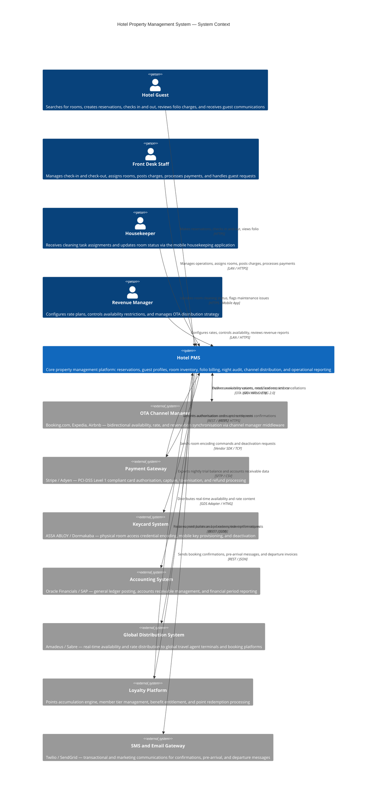

# System Context Diagram

## Overview

The Hotel Property Management System occupies the centre of a constellation of integrated platforms, human actors, and external services that together deliver the complete hotel operations ecosystem. The system context view defines the HPMS's position relative to everything that surrounds it: who interacts with it directly, which external systems it depends on or supplies data to, and what data flows across each boundary.

The HPMS is the property-level system of record for reservations, guest profiles, room inventory, operational financials, and channel distribution. It does not stand alone; its value is amplified by eight external systems that extend its capabilities into areas such as global payment processing, physical access control, online travel distribution, travel agent connectivity, financial consolidation, guest loyalty, and communications delivery. Each of these external integrations is governed by a defined protocol, a data schema, and an exchange frequency that together form the integration architecture of the property.

Four human actor types interact with the HPMS directly. Hotel guests interact primarily through digital self-service channels and, at the property, through staff-mediated interactions. Front desk staff, housekeepers, and revenue managers each interact through specialised interfaces—desktop client, mobile application, and management console respectively—that are scoped to their operational responsibilities. No actor has universal system access; the HPMS enforces role-based access controls at every interaction boundary.

The scope of this context diagram is limited to the primary external integrations that are operationally significant for day-to-day hotel management. Secondary integrations such as building management systems, CCTV analytics, and concierge services are out of scope for this analysis and are managed through separate integration layers.

## C4 Context Diagram

## External Systems Table

| System | Provider Examples | Integration Type | Data Exchanged | Frequency |
|---|---|---|---|---|
| OTA Channel Manager | SiteMinder, Cloudbeds Channel Manager, RateGain | Bidirectional API (OTA XML / HTNG 2.0) | Availability counts, rates, restrictions (outbound); reservations, modifications, cancellations (inbound) | Real-time delta sync on inventory change; full refresh every 24 hours |
| Payment Gateway | Stripe, Adyen, Worldpay, Shift4 | Bidirectional REST / HTTPS | Card authorisation requests, capture requests, refunds (outbound); authorisation codes, settlement confirmations (inbound) | Per-transaction, real-time |
| Keycard System | ASSA ABLOY VingCard, Dormakaba, Salto Systems | Outbound SDK / TCP | Room number, guest name, check-in and check-out dates, access permission profile, door group codes (outbound); encoding success confirmation (inbound) | Per check-in and check-out event |
| Accounting System | Oracle Hospitality OPERA Finance, SAP S/4HANA, Sage Intacct | Outbound SFTP batch | Nightly trial balance, department revenue summary, accounts receivable ledger entries, advance deposit movements | Nightly after night audit completion |
| Global Distribution System | Amadeus CRS, Sabre SynXis, Travelport | Outbound via GDS adapter | Real-time room availability, published rates, rate plan descriptions, hotel content | Real-time availability; content updates on change |
| Loyalty Platform | Oracle OPERA Loyalty, Amadeus iHotelier Loyalty, proprietary | Bidirectional REST / JSON | Check-in events, stay completion data, earned points posting (outbound); member tier and balance queries, redemption authorisations (inbound) | Per-transaction (check-in, check-out) and nightly batch |
| SMS and Email Gateway | Twilio, SendGrid, Mailgun, MessageBird | Outbound REST / JSON | Booking confirmation messages, pre-arrival welcome communications, post-checkout invoices, promotional messages | Per-trigger (on reservation creation, check-in, check-out) |

## Data Flow Descriptions

**Guest to HPMS — Reservation and Stay Management**
Hotel guests interact with the HPMS through the web booking engine and mobile application. The primary data flows in this direction include reservation creation requests (carrying guest personal details, selected dates, room type, rate plan, and payment information), reservation modification and cancellation requests, folio viewing requests (returning an itemised list of all posted charges), and check-in initiation requests for pre-registered guests using mobile check-in. All guest-facing interactions occur over HTTPS with TLS 1.3 encryption. Guest personal data transmitted through these channels is subject to GDPR and CCPA compliance obligations, including data minimisation and purpose limitation.

**Front Desk Staff to HPMS — Operational Transactions**
Front desk staff drive the highest volume of inbound data flows into the HPMS. Check-in transactions carry the confirmed reservation reference, verified guest ID details, assigned room number, payment authorisation token, and any special instructions recorded during the check-in interview. Charge posting events carry the charge code, quantity, unit price, and description. Payment transactions carry the tender type, amount, and gateway reference. Room assignment events carry the selected room number and any upgrade or accessibility override reasons. All front-desk interactions are performed over the property's internal LAN through the HPMS desktop client, with HTTPS encryption applied at the application layer.

**HPMS to OTA Channel Manager — Availability, Rates, and Inventory**
The HPMS pushes ARI (Availability, Rates, and Inventory) updates to the OTA Channel Manager in real time as inventory events occur. Each outbound ARI message contains: the property code, room type code, rate plan code, a date range, available room count after channel allotment, applicable rate per occupancy level, and any restriction flags (stop sell, closed to arrival, minimum stay, maximum stay, advance booking window). This data flow follows the OTA XML schema as defined by the OpenTravel Alliance and the HTNG 2.0 standard for hotel-to-channel communications. The channel manager middleware transforms these messages and distributes them to each connected OTA platform in the platform's native format.

**OTA Channel Manager to HPMS — Inbound Reservations and Modifications**
When a guest books, modifies, or cancels a reservation on an OTA platform, the channel manager forwards the event to the HPMS via an inbound message. New reservation messages carry the OTA confirmation number, guest name and contact details, booked room type, rate plan code, arrival and departure dates, number of guests, special requests, and payment guarantee information (card details as token or masked reference). Modification messages carry the changed fields only. Cancellation messages carry the original reservation reference and the cancellation reason code. The HPMS processes these inbound events and responds with an acknowledgement carrying the internal confirmation number, which the channel manager relays back to the OTA for reconciliation.

**HPMS to Payment Gateway — Transaction Processing**
Every card transaction initiated through the HPMS is routed to the Payment Gateway via a secured, mutually authenticated REST/HTTPS connection. Pre-authorisation requests carry the tokenised card reference, hold amount, currency code, and reservation reference. Capture requests carry the pre-auth reference, final settlement amount, and itemised settlement description. Refund requests carry the original transaction reference and the refund amount. The Payment Gateway returns an authorisation code, transaction reference, masked card data (last four digits and card brand), and response code for each completed operation. The HPMS never stores raw card numbers; it stores only the PCI-compliant token issued by the gateway on first card registration.

**HPMS to Keycard System — Access Credential Encoding**
At check-in, the HPMS generates an encoding command and transmits it to the keycard system via the hardware vendor's SDK over a local TCP connection. The encoding payload includes: the room number, connected room numbers (for adjoining rooms), guest name (for audit label), check-in date and time, check-out date and time, key level (guest key versus staff master), door group access (e.g., pool, gym, parking), and an expiry timestamp. The keycard system acknowledges successful encoding with a key serial number. At check-out or key deactivation, the HPMS sends a remote deactivation command carrying the key serial number and room number; the keycard system voids the credential at the lock level on the next door interaction.

**HPMS to Accounting System — Financial Exports**
Following the successful completion of each night audit, the HPMS generates and transmits a structured financial export to the Accounting System. The export package includes: the daily trial balance showing debits and credits per account code, a department revenue breakdown (rooms, F&B, spa, parking, other), a nightly accounts receivable movement report showing new invoices, payments received, and outstanding balances per account, and an advance deposit ledger showing deposits received, forfeited, and applied during the period. Files are transmitted via SFTP as fixed-format CSV documents using a pre-defined schema agreed between the hotel's IT and finance teams. The Accounting System imports these files through an automated ingestion workflow that maps the PMS account codes to the ERP chart of accounts.

**HPMS to Loyalty Platform — Points and Member Interactions**
The HPMS communicates with the Loyalty Platform at three points in the guest lifecycle. At reservation creation, the HPMS posts a pre-stay earn registration event carrying the reservation reference, member ID, eligible stay dates, and estimated points to be earned. At check-in, the HPMS posts a check-in event to initiate in-stay benefit entitlements such as complimentary breakfast or room upgrades. At checkout and folio settlement, the HPMS posts the final earn event containing the settled folio amount, a breakdown of eligible versus ineligible charges, and the resulting points calculation. The Loyalty Platform responds with a points confirmation and the updated member balance, which the HPMS stores on the guest profile. Redemption requests (e.g., redeeming points against the folio) flow from the HPMS to the Loyalty Platform and return a redemption authorisation that the HPMS applies as a folio credit.

## Integration Protocols

**OTA XML and HTNG 2.0**
The primary standard governing hotel-to-channel and hotel-to-GDS data exchange is the OpenTravel Alliance OTA XML specification, supported by the Hotel Technology Next Generation (HTNG) 2.0 messaging framework. OTA XML messages are SOAP-based XML documents encapsulating availability, rate, and reservation payloads. HTNG 2.0 extends this with a REST/JSON transport option for channel manager integrations. All messages are schema-validated against the OTA XML XSD before transmission and on receipt. The HPMS implements message versioning to maintain backward compatibility with channel managers that have not yet adopted the latest schema revision. Retry logic with exponential back-off is applied for all outbound OTA XML transmissions; failed messages are queued in an outbound message store with configurable retry limits.

Key message types in use:
- OTA_HotelAvailNotifRQ / RS: Real-time availability notification from HPMS to channel
- OTA_HotelRatePlanNotifRQ / RS: Rate plan and pricing update from HPMS to channel
- OTA_HotelResNotifRQ / RS: Inbound reservation notification from OTA to HPMS
- OTA_CancelRQ / RS: Cancellation request and response
- OTA_HotelDescriptiveContentNotifRQ / RS: Hotel content updates (room descriptions, photos)

**REST/HTTPS for Payment Gateway**
All payment processing integrations use RESTful HTTPS APIs with OAuth 2.0 client credentials flow for machine-to-machine authentication. The HPMS implements the Payment Gateway's hosted fields or tokenisation SDK to ensure that raw card data never traverses the HPMS application layer; only the resulting payment token is transmitted. API versioning is pinned in the HPMS configuration to ensure that gateway API updates do not break integration without planned testing and upgrade. Webhook listeners on the HPMS receive asynchronous payment event notifications (e.g., delayed authorisation responses, chargeback notifications) from the gateway. All HTTPS communication requires TLS 1.2 minimum; TLS 1.3 is enforced where the gateway supports it.

**Vendor SDK for Keycard System**
Keycard system integration uses the hardware vendor's proprietary SDK, installed on the HPMS application server and communicating with the keycard encoding workstation over a local area network TCP connection. The SDK abstracts the low-level encoding protocol and exposes a function library for key creation, key deactivation, audit trail query, and encoder status check. The HPMS calls SDK functions synchronously during the check-in workflow; the SDK must respond within 5 seconds or the HPMS displays an encoding timeout error. The keycard SDK is version-pinned and tested against each HPMS software update to prevent breaking changes from vendor SDK updates. Mobile key provisioning (for compatible hotels using the mobile key feature) uses the keycard vendor's cloud API via REST/HTTPS instead of the local SDK, enabling remote key issuance before the guest arrives at the property.

**SFTP/CSV for Accounting System**
Financial data exports to the Accounting System use Secure File Transfer Protocol (SFTP) with SSH key-based authentication. The HPMS writes structured CSV files to a dedicated SFTP staging directory following each successful night audit. File naming conventions include the property code, report type, and business date in the filename (e.g., PROP001_TRIALBALANCE_20250602.csv) to enable automated ingestion by the Accounting System's file listener. Each CSV file includes a header row with column definitions, a data section with one record per account or transaction, and a footer row with the record count and total amounts for integrity verification. Files are retained in the SFTP staging directory for 90 days before archival, providing a reconciliation window for finance teams.

## Security Boundary Notes

The HPMS operates within a layered security architecture that governs data protection, access control, and inter-system trust at every boundary crossing.

**Network Segmentation**: The HPMS application servers reside within the hotel's property management DMZ, isolated from the guest Wi-Fi network, the in-room entertainment network, and the corporate LAN. Integration with external systems occurs through dedicated firewall rules that whitelist specific IP ranges for the Payment Gateway, OTA Channel Manager, and Loyalty Platform endpoints. Internal integrations (keycard SDK, POS integration) communicate over a segregated operations VLAN.

**Authentication and Authorisation**: Human actor authentication uses username and password credentials with mandatory multi-factor authentication (TOTP or hardware token) for all roles with financial write access (Front Desk Staff, Night Auditor, Revenue Manager). System-to-system authentication uses OAuth 2.0 client credentials for REST APIs and SSH key pairs for SFTP connections. API keys and client secrets are stored in the HPMS secrets management vault and are never embedded in source code or configuration files.

**Data Encryption**: All data in transit between the HPMS and external systems is encrypted using TLS 1.2 or higher. All data at rest in the HPMS database is encrypted using AES-256 at the storage layer. Backup files transmitted to cloud storage are additionally encrypted with a property-specific key managed in the HPMS key management service.

**PCI-DSS Compliance**: The HPMS maintains PCI-DSS Level 1 Service Provider compliance for its payment processing integration. Cardholder data is never stored in the HPMS database; only PCI-compliant payment tokens issued by the gateway are retained. The payment terminal hardware is PCI PTS-certified. Quarterly penetration tests and annual PCI QSA assessments validate the compliance posture of the payment integration boundary.

**Personal Data Boundary**: Guest personal data (name, email, phone number, passport details, payment tokens) is stored within the HPMS database in a dedicated PII schema with column-level encryption for the most sensitive fields. Access to PII data fields is audited, and data retention policies enforce automatic pseudonymisation of guest records that have been inactive for more than 36 months, in accordance with GDPR Article 5 data minimisation principles.

**Audit Logging**: Every write operation performed through the HPMS—whether by a human actor, an automated process, or an inbound API integration—produces an immutable audit log entry. Audit logs are shipped in real time to a centralised log management platform external to the HPMS for tamper-proof storage, retention for a minimum of 7 years, and Security Operations Centre (SOC) monitoring.

## Key Integration Patterns

**Synchronous Request-Response**: Used for time-critical operations where the caller must wait for a result before proceeding. Examples include payment gateway authorisation and capture (the check-in workflow cannot proceed until the gateway responds), and keycard encoding confirmations (the keycard cannot be handed to the guest until encoding is confirmed). These interactions implement circuit-breaker patterns to handle gateway unavailability gracefully without hanging the front-desk interaction.

**Asynchronous Event-Driven**: Used for integrations where an immediate response is not required by the calling process. Accounting System exports are asynchronous batch file transfers; the HPMS writes the export file and the accounting system picks it up on its own schedule. Loyalty Platform point postings at checkout are asynchronous; the folio settlement completes immediately and the loyalty posting occurs within the same transaction but the response is not blocking. Confirmation emails and SMS dispatches are asynchronous; the HPMS queues the message with the gateway and the delivery confirmation is received asynchronously via webhook.

**Bidirectional Streaming**: Used for OTA channel synchronisation where both sides push data to the other. The HPMS pushes ARI updates outbound continuously as inventory changes occur. The OTA channel pushes reservation and modification messages inbound as guests book. A message queue with retry and dead-letter handling manages burst volumes during high-demand periods such as promotional events or peak booking seasons.

**Webhook and Push Notification**: The Payment Gateway delivers asynchronous settlement confirmations, chargeback notifications, and dispute alerts via webhooks to a registered HPMS endpoint. The Loyalty Platform delivers redemption authorisations and tier upgrade notifications via webhook. The HPMS maintains a webhook listener service with TLS certificate pinning for each registered external webhook source.

## Monitoring and Observability

The HPMS and its integrations require comprehensive monitoring to ensure operational continuity in a 24/7 hotel environment. The following observability layers are implemented:

**Integration Health Dashboards**: A real-time dashboard in the HPMS operations console displays the current status of each external system integration: payment gateway reachability and response time, OTA channel sync lag (time since last successful sync per channel), keycard system connectivity, loyalty platform API response time, and SMS/email gateway delivery rate. Any integration degradation triggers an alert to the Duty Manager.

**Transaction Tracing**: Every inbound and outbound transaction carries a unique correlation ID that is passed through all integration hops. This enables end-to-end tracing of a booking confirmation from OTA channel message receipt through HPMS reservation creation to confirmation email dispatch, with timing data at each step. Correlation IDs are indexed in the centralised log platform for rapid incident investigation.

**Circuit Breakers**: Each external API integration implements a circuit breaker that tracks consecutive failure rates. If a gateway or external system returns errors for more than five consecutive requests within a 60-second window, the circuit breaker trips and all subsequent calls short-circuit with a graceful fallback. Circuit breaker state (closed, open, half-open) is visible on the integration health dashboard and triggers an alert when any circuit opens.

**SLA Thresholds**: The following response time SLAs are monitored in real time with alerting on breach:

| Integration | Expected Response Time | Alert Threshold | Action on Breach |
|---|---|---|---|
| Payment Gateway | Under 3 seconds | Over 5 seconds | Alert Duty Manager; activate offline terminal fallback |
| OTA Channel Manager | Under 10 seconds | Over 30 seconds | Alert Revenue Manager; queue sync for retry |
| Keycard System SDK | Under 5 seconds | Over 10 seconds | Alert Front Desk Manager; manual key encoding fallback |
| Loyalty Platform | Under 2 seconds | Over 5 seconds | Alert IT Operations; retry with back-off |
| SMS and Email Gateway | Under 5 seconds for queuing | Over 15 seconds | Alert IT Operations; check gateway status |
| Accounting SFTP Export | Under 15 minutes | Over 45 minutes | Alert Finance Manager; investigate SFTP connectivity |

## Deployment Context

The HPMS is deployed as a multi-tier application within the hotel's on-premises data room or as a cloud-hosted SaaS instance depending on the property configuration. The following deployment context applies to the integration architecture:

**On-Premises Deployment**: The HPMS application server, database server, and backup appliance are hosted in the hotel's server room. External integrations use the hotel's internet uplink. A redundant failover internet connection ensures that payment gateway and OTA channel integrations remain available even during primary ISP outages. The keycard SDK communicates over the local LAN and is unaffected by internet connectivity.

**SaaS/Cloud Deployment**: The HPMS is hosted in the cloud provider's data centre (AWS, Azure, or GCP depending on the software vendor). All external integrations communicate over the internet. The property's on-premises keycard encoder communicates with the cloud-hosted HPMS via an encrypted outbound connector agent installed on the front desk workstation, avoiding inbound firewall rules.

**High Availability**: The HPMS database operates in an active-passive replica configuration with automatic failover within 30 seconds. The application tier runs across multiple availability zones with load balancing. A planned maintenance window of 90 minutes per month is reserved for system updates, scheduled during the lowest-traffic window (typically 04:00–05:30 local time following the night audit completion and before the morning arrival rush).

**Disaster Recovery**: The RPO (Recovery Point Objective) for the HPMS is 4 hours, supported by the nightly backup plus continuous replication to the secondary database replica. The RTO (Recovery Time Objective) is 2 hours, supported by the active-passive failover configuration and documented runbook. Reservation and financial data recovery is treated as the highest priority; the HPMS will restore reservation and folio records before restoring historical reporting data.
