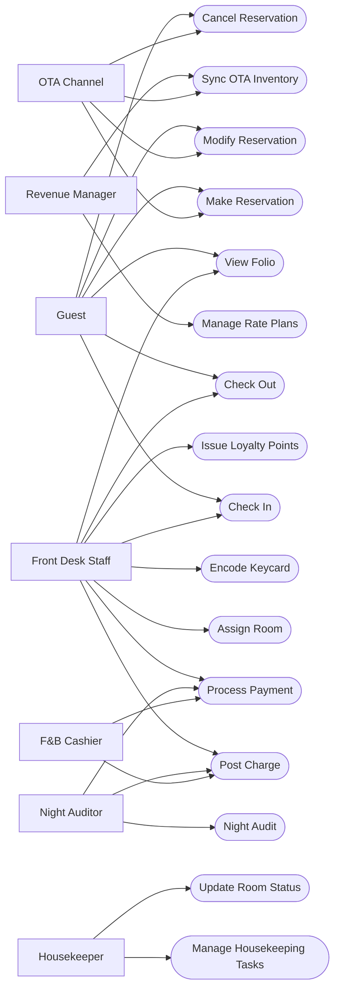

# Use Case Diagram

## Overview

The Hotel Property Management System (HPMS) operates as the operational backbone of a hotel property, unifying every guest-facing transaction and back-office process within a single authoritative platform. The system boundary drawn for this use case model encompasses the full spectrum of property operations: pre-arrival reservation management, real-time room inventory control, check-in and check-out processing, folio billing and payment settlement, housekeeping coordination, night audit and financial close, dynamic rate plan management, and bidirectional synchronisation with online distribution channels.

Seven distinct actors interact with the HPMS, spanning six human roles and one automated system integration. Each actor's engagement with the system is governed by a role-based access control model that precisely limits which use cases an actor may initiate, modify, or observe. A hotel guest can initiate reservations and view their own folio but cannot access housekeeping workflows or rate plan management. A revenue manager can configure rates and push availability updates to OTA channels but cannot directly post charges to a guest folio. This intentional separation of concerns ensures operational integrity and regulatory compliance across all hotel departments.

Sixteen use cases define the core functionality of the HPMS. These range from high-frequency transactional operations—such as Post Charge and Update Room Status, which may occur hundreds of times daily—to orchestrated multi-step processes such as Night Audit and Check In, which involve coordination across multiple actors and integrated external systems. Several use cases involve both human actors and automated system interactions simultaneously: Make Reservation can be initiated by a guest directly or by the OTA Channel integration, while Check Out involves both Front Desk Staff and an automated settlement sequence with the Payment Gateway.

The system boundary explicitly excludes: multi-property Central Reservation Systems, payroll and HR management, physical plant maintenance execution, procurement and inventory management for F&B outlets, guest Wi-Fi and in-room entertainment systems, and corporate financial consolidation. These systems receive data from the HPMS through scheduled exports and versioned API integrations but are managed and maintained as independent platforms. The HPMS serves as the system of record for all property-level operational and financial data within the defined boundary.

## Actors

The HPMS recognises seven actors whose operational contexts, interaction patterns, and system access profiles are described in full below.

**Guest** represents the hotel's primary customer and the ultimate beneficiary of all system services. Guests interact with the HPMS through a public-facing web booking engine, a branded mobile application, on-property self-service kiosks, and through the mediated assistance of front desk staff. The guest actor spans the entire stay lifecycle: before arrival (creating, modifying, and cancelling reservations and selecting room preferences), during the stay (reviewing folio charges, disputing incorrect postings, requesting service adjustments), and at departure (initiating checkout, approving the final settlement, and receiving invoices). When guests book through OTA platforms such as Booking.com or Expedia, the OTA Channel actor serves as their proxy for reservation creation and modification use cases, acting on their behalf via automated API integrations.

**Front Desk Staff** represents hotel receptionists, front desk agents, and duty managers who operate the HPMS desktop client from front-of-house workstations. This actor initiates the highest density of transactional use cases in the system: check-in processing, check-out and settlement, room assignment, keycard encoding, manual charge posting, payment processing, folio management, and loyalty point issuance. Front desk staff hold write access to guest profiles, reservations, room assignments, and folios, while being restricted from night audit and rate management functions reserved for specialist roles. In agent-assisted scenarios, front desk staff act as mediators between guest intent and system execution, translating verbal preferences and requests into structured PMS transactions.

**Housekeeper** represents housekeeping attendants and supervisors who interact with the HPMS exclusively through a mobile application designed for field use on tablets or smartphones. The housekeeper actor's scope is narrowly focused on room-level operational management: receiving task assignments from supervisors, updating cleaning statuses room by room, recording minibar consumption quantities, flagging maintenance defects with photographic evidence, and marking rooms as inspected and ready for reassignment. Housekeepers have no access to reservation records, folio charges, or financial transactions—their role-based permissions are scoped strictly to room-level status fields and task management. The housekeeping supervisor variant of this actor has additional access to task assignment, shift management, and quality inspection workflows.

**Revenue Manager** occupies a strategic planning role rather than a transactional operational one. Revenue managers interact with the HPMS Rate Plan Management module and the Channel Distribution console to configure pricing structures, set yield controls (minimum length of stay, stop-sell restrictions, closed-to-arrival flags, advance purchase windows), and manage the inventory and rate content published to OTA and GDS partners. The Revenue Manager actor initiates the Manage Rate Plans and Sync OTA Inventory use cases and holds read access to all reservation, occupancy, and revenue analytics dashboards. Write access is deliberately confined to rate configuration and channel management modules, preventing inadvertent modification of in-house guest records or financial postings.

**OTA Channel** represents the automated API integration layer through which Online Travel Agency platforms—Booking.com, Expedia, Hotels.com, Agoda, Airbnb, and similar—exchange data bidirectionally with the HPMS. Unlike all other actors, OTA Channel is a non-human system actor representing a category of software integrations rather than an individual. It initiates Make Reservation when a guest completes a booking on an OTA website, initiates Modify Reservation and Cancel Reservation when the guest amends or cancels via the OTA platform, and participates in Sync OTA Inventory by consuming availability and rate updates pushed from the HPMS or triggered by the Revenue Manager. Integration is asynchronous and message-driven, governed by HTNG 2.0 and OTA XML standards, with event-driven webhook delivery and idempotent retry logic.

**Night Auditor** holds the most elevated and consequential permission set in the system. Often a senior front desk agent assigned to the overnight shift, the night auditor executes the daily financial close: running the trial balance, posting automated room and tax charges to all in-house folios, processing no-show reservations per policy, reviewing advance deposit forfeiture cases, generating the full suite of management reports, rolling the system forward to the next business date, and triggering the automated database backup and verification sequence. The Night Audit use case is restricted exclusively to this role and cannot be initiated by any other actor. Night auditors also retain access to manual charge posting and payment processing for any unresolved in-day transactions that remain open at audit initiation time.

**F&B Cashier** represents food and beverage outlet cashiers who operate POS terminals in the hotel's restaurant, bar, room service dispatch, and poolside café. F&B cashiers interact with the HPMS through a POS integration that allows charges to be posted directly to guest room folios without accessing the full PMS client. This integration preserves outlet workflow speed while maintaining real-time folio accuracy. The F&B Cashier actor initiates Post Charge (via POS-to-PMS API integration) and Process Payment when a guest settles their outlet bill at the counter by cash, card, or room charge. F&B cashiers have no visibility into reservation records, room assignments, or financial audit functions—their system interaction is strictly scoped to folio charge posting and payment collection at the outlet level.

## Use Case Diagram

## Actor Descriptions

| Actor | Role | System Interactions | Preconditions |
|---|---|---|---|
| Guest | Primary hotel customer; manages own reservation lifecycle and stay experience | Web booking engine, mobile app, self-service kiosk, front desk (mediated) | Valid email and phone number; accepted terms and conditions; payment method for deposit-requiring reservations |
| Front Desk Staff | Operational executor of all guest-facing PMS transactions and primary system operator | PMS desktop client, keycard encoder hardware, integrated payment terminal, document scanner | Active HPMS account with Front Desk role; active operational shift; property on the current business date |
| Housekeeper | Manages room cleaning lifecycle, housekeeping status updates, and consumable reporting | HPMS mobile application (iOS and Android), housekeeping supervisor web console | Assigned to an active housekeeping shift; task list loaded for current business day |
| Revenue Manager | Governs pricing strategy, rate plan lifecycle, and OTA channel distribution controls | PMS rate management module, channel distribution dashboard, revenue analytics | Revenue Manager role with rate plan write permission; OTA channel API credentials active and mapped |
| OTA Channel | Automated API integration representing external booking platform connectivity | HTNG/OTA XML REST and SOAP endpoints, webhook receivers, availability feed consumers | API credentials provisioned; room type and rate plan code mappings configured; channel in active status |
| Night Auditor | Executes daily financial close, room charge posting, no-show processing, and date rollover | Night Audit module, report generator, email distribution engine, backup management console | Night Auditor or Property Manager role; all cashier shifts closed; no unposted batch transactions |
| F&B Cashier | Posts food and beverage charges to guest folios and processes outlet-level payments | POS terminal (Oracle Simphony / Infrasys / Agilysys), folio posting API, payment terminal | Active POS session linked to HPMS property via API integration; target guest has an open room account |

## Use Case Summary Table

| Use Case | Primary Actor | Secondary Actor | Priority | Complexity |
|---|---|---|---|---|
| Make Reservation | Guest | Front Desk Staff, OTA Channel | Critical | High |
| Modify Reservation | Guest | Front Desk Staff, OTA Channel | High | Medium |
| Cancel Reservation | Guest | Front Desk Staff, OTA Channel | High | Medium |
| Check In | Front Desk Staff | Guest, Keycard System | Critical | High |
| Check Out | Front Desk Staff | Guest, Payment Gateway | Critical | High |
| Assign Room | Front Desk Staff | Housekeeper, System | High | Medium |
| Encode Keycard | Front Desk Staff | Keycard System | High | Low |
| Post Charge | Front Desk Staff | F&B Cashier, Night Auditor | High | Low |
| Process Payment | Front Desk Staff | Night Auditor, Payment Gateway | Critical | High |
| View Folio | Guest | Front Desk Staff | Medium | Low |
| Night Audit | Night Auditor | System (automated) | Critical | Very High |
| Manage Housekeeping Tasks | Housekeeper | Supervisor, System | High | Medium |
| Update Room Status | Housekeeper | Front Desk Staff, System | High | Low |
| Manage Rate Plans | Revenue Manager | System | High | Medium |
| Sync OTA Inventory | Revenue Manager | OTA Channel, System | High | High |
| Issue Loyalty Points | Front Desk Staff | Loyalty Platform, Guest | Medium | Medium |

## Use Case Relationships

Several use cases are connected through UML include, extend, and generalisation relationships that refine the functional model beyond the primary actor-to-use-case associations shown in the diagram above.

**Include Relationships**: The Check In use case includes Assign Room as a mandatory embedded step—a specific room number must be confirmed before check-in can complete. Check In also includes Encode Keycard, since physical or digital access credentials must be issued for every checked-in guest without exception. The Check Out use case includes Process Payment because folio settlement is non-optional in the checkout sequence; a folio with an outstanding balance cannot transition to the CHECKED-OUT status. Make Reservation includes Process Payment when the applicable rate plan enforces a deposit policy, embedding the deposit authorisation or full pre-payment within the reservation creation flow.

**Extend Relationships**: Make Reservation is extended by Issue Loyalty Points when the booking guest is an enrolled loyalty programme member, inserting a pre-stay point registration step that notifies the Loyalty Platform of the pending earn event. Check Out is extended by Issue Loyalty Points to credit stay-based earning at departure, calculated against eligible charges on the settled folio. Check In is extended by Post Charge when advance charges apply at the point of arrival—early check-in surcharges, daily resort fees, or package components included in the selected rate plan are posted to the newly opened folio during the check-in workflow. Manage Rate Plans is extended by Sync OTA Inventory whenever a rate plan configuration change requires immediate propagation to connected distribution channels.

**Generalisation Relationships**: Make Reservation, Modify Reservation, and Cancel Reservation share a common Reservation Management base behaviour that encapsulates: guest identity validation, reservation record retrieval, availability re-verification, audit trail entry creation, and automated notification dispatch. Post Charge and Process Payment both inherit from a Folio Transaction base use case that enforces posting sequence rules, real-time balance integrity validation, PCI-compliant transaction handling, and cashier session reconciliation.

**Concurrency Constraints**: The Assign Room use case implements a distributed optimistic lock on room inventory records, preventing double-assignment during simultaneous check-in sessions at multi-terminal front desk environments. The Night Audit use case acquires a property-level exclusive write lock during the date-rollover phase, temporarily blocking all transactional write operations from other actors. OTA sync operations are serialised per channel to prevent conflicting inventory count updates when multiple rate plan changes trigger simultaneous sync events.

## System Boundary Notes

The HPMS system boundary is drawn at the property level, encompassing all software components, data stores, and integration adapters necessary to operate a single hotel property's core operational and financial functions.

**Within Boundary**: Reservation lifecycle engine (create, hold, waitlist, confirm, modify, cancel, no-show processing), guest profile and CRM data management, room inventory and status control engine, rate plan and restriction management, folio and billing engine (charge posting, tax computation, invoice generation), payment orchestration layer (tokenised authorisation and capture), night audit and date-roll engine, housekeeping task dispatch and mobile status management, keycard system integration via vendor SDK, loyalty point issuance and redemption via API, OTA and GDS channel distribution management, and the full suite of operational and management reporting.

**Excluded from Boundary**: Central Reservation System for multi-property portfolio management, HR and payroll systems, physical maintenance execution and CMMS work orders, F&B procurement and inventory management, guest Wi-Fi and in-room entertainment management, corporate financial consolidation and statutory accounting reporting, and travel agent commission settlement.

**Integration Touch Points**: Seven external systems are integrated through well-defined, version-controlled APIs and file transfer protocols. OTA Channel Manager exchanges availability and reservations via HTNG 2.0 and OTA XML standards. Payment Gateway processes tokenised card transactions via REST over mutually authenticated HTTPS. Keycard System receives encoding commands through the hardware vendor's SDK. Accounting System receives nightly trial balance and AR exports via SFTP in structured CSV format. GDS distributes availability through a protocol adapter layer. Loyalty Platform exchanges point events and redemption requests via REST/JSON. SMS and Email Gateway delivers guest communications via REST/JSON.

**Role-Based Access Enforcement**: RBAC policies strictly partition actor capabilities within the system. Front Desk Staff cannot access the Night Audit module or the rate management console. Housekeepers are limited to room-status and task fields within the mobile application. OTA Channel API credentials are scoped solely to reservation and availability operations. F&B Cashier access is restricted to folio charge posting and payment collection through the POS integration layer. Revenue Manager write access is confined to rate plans, restrictions, and channel distribution settings, with no write access to guest records or financial transactions.

## Actors and Goals Matrix

Each actor enters the system with one or more primary goals. The matrix below maps each actor to their operational goals and the use cases that serve those goals.

| Actor | Primary Goal | Supporting Goals | Use Cases Serving Primary Goal | Use Cases Serving Supporting Goals |
|---|---|---|---|---|
| Guest | Secure accommodation and enjoy a seamless stay | Manage costs, earn loyalty rewards, have accurate billing | Make Reservation, Check In, Check Out | Modify Reservation, Cancel Reservation, View Folio, Issue Loyalty Points |
| Front Desk Staff | Process guest arrivals and departures efficiently and accurately | Maintain folio accuracy, resolve disputes, maximise upsell | Check In, Check Out, Assign Room | Post Charge, Process Payment, View Folio, Encode Keycard, Issue Loyalty Points |
| Housekeeper | Prepare rooms to occupancy-ready standard within shift window | Report defects promptly, complete service efficiently | Manage Housekeeping Tasks, Update Room Status | — |
| Revenue Manager | Maximise room revenue and occupancy across all channels | Maintain rate parity, optimise channel mix | Manage Rate Plans, Sync OTA Inventory | — |
| OTA Channel | Deliver accurate reservation data and receive up-to-date availability | Avoid overselling, maintain booking reliability | Make Reservation, Modify Reservation, Cancel Reservation | Sync OTA Inventory |
| Night Auditor | Close the financial day accurately and without unresolved exceptions | Ensure data integrity, distribute actionable reports | Night Audit | Post Charge, Process Payment |
| F&B Cashier | Post outlet charges accurately to guest folios in real time | Process payments efficiently at the outlet level | Post Charge, Process Payment | — |

## Use Case Elaboration

Brief domain-level descriptions of each use case expand on the diagram associations and clarify the operational context.

**Make Reservation**: The process of creating a new confirmed guest booking with a specific room type, rate plan, date range, and payment guarantee. This is the entry point for all guest stays and the foundational transaction in the HPMS. It may originate from the hotel's direct channels or be forwarded from an OTA or GDS via the channel integration layer.

**Modify Reservation**: Any change to an existing confirmed reservation including date changes, room type changes, rate plan amendments, occupancy updates, or special request additions. Modifications must re-validate availability and may trigger repricing or deposit recalculation. OTA-originated modifications arrive via the same channel integration as original bookings.

**Cancel Reservation**: The termination of a confirmed reservation before check-in. Cancellation must apply the rate plan's cancellation policy to determine whether a penalty applies, release room inventory to the available pool, and notify the guest and any relevant channel of the cancellation.

**Check In**: The process of transitioning a confirmed reservation to in-house status by verifying the guest's identity, assigning a specific room, collecting a payment guarantee, encoding access credentials, posting advance charges, and opening the guest's folio. Check-in is the most operationally complex front-desk transaction.

**Check Out**: The process of settling the guest's folio in full, generating and delivering the final invoice, transitioning the reservation to checked-out status, returning the room to the housekeeping queue, and posting earned loyalty points. Check-out closes the financial record for the stay.

**Assign Room**: The targeted allocation of a specific room number to a confirmed reservation, subject to room status, type compatibility, occupancy limits, and any accessibility or preference requirements. Room assignment may be performed in advance or at the point of check-in.

**Encode Keycard**: The electronic programming of a physical key card or mobile key to grant access to an assigned room and applicable shared amenity areas for the duration of the guest's stay. Encoding interfaces with the hardware keycard system via vendor SDK.

**Post Charge**: The recording of any non-room-rate charge against an open guest folio including food and beverage, spa, laundry, parking, telephone, and resort fees. Charges must be linked to active charge codes with associated revenue accounts and tax classes.

**Process Payment**: The application of a payment against an outstanding folio balance using a supported tender type. Payment processing interfaces with the payment gateway for card transactions and applies strict PCI-DSS requirements on all card data handling.

**View Folio**: The retrieval and display of a guest's full itemised account including all posted charges, credits, adjustments, and payments. Guests can view their folio through self-service digital channels; staff can view any folio through the PMS desktop client.

**Night Audit**: The comprehensive end-of-day financial close process that reconciles all transactions, posts automated room charges, processes no-shows, generates reports, and advances the system business date. This use case is the most computationally intensive and operationally critical in the HPMS.

**Manage Housekeeping Tasks**: The assignment, tracking, and completion management of room cleaning and servicing tasks across the housekeeping team. Tasks are generated from reservation departure and stay-over data and distributed via the mobile housekeeping application.

**Update Room Status**: The real-time update of a room's operational status in the HPMS inventory engine. Status transitions (Occupied → Vacant-Dirty → Cleaning → Clean → Inspected) directly control room assignment eligibility and are the primary output of the housekeeping workflow.

**Manage Rate Plans**: The creation, configuration, modification, and lifecycle management of pricing structures used to calculate room rates for direct and channel bookings. Rate plans include base rates, derived rates, package rates, corporate rates, and loyalty member rates.

**Sync OTA Inventory**: The transmission of current availability counts, applicable rates, and active restrictions from the HPMS to connected OTA channels. Sync events are triggered in real time on inventory changes or manually by the revenue manager for targeted refreshes.

**Issue Loyalty Points**: The calculation and posting of earned loyalty points to a member's account on the loyalty platform following a qualifying transaction—reservation creation, check-in, or stay completion. Points calculations are based on the eligible charges on the settled folio and the member's current earning tier.

## Frequency and Volume Estimates

Understanding the operational volume of each use case provides context for system performance and capacity planning requirements.

| Use Case | Typical Daily Frequency | Peak Concurrency | Triggering Event |
|---|---|---|---|
| Make Reservation | 20–200 per property | 50 concurrent sessions | Guest self-service, OTA inbound, agent-assisted |
| Modify Reservation | 5–30 per property | 10 concurrent sessions | Guest request, OTA modification message |
| Cancel Reservation | 3–20 per property | 5 concurrent sessions | Guest request, OTA cancellation, no-show processing |
| Check In | Equals daily arrivals (10–200) | 5–10 concurrent sessions | Guest arrival, pre-check-in mobile |
| Check Out | Equals daily departures (10–200) | 5–10 concurrent sessions | Guest request, express mobile checkout |
| Assign Room | Equals daily arrivals plus reassignments | 10 concurrent sessions | Part of check-in flow |
| Encode Keycard | Equals check-ins plus duplicate key requests | 3–5 concurrent | Part of check-in flow |
| Post Charge | 50–500 per property | 20 concurrent sessions | POS integration, staff manual posting |
| Process Payment | 20–200 per property | 10 concurrent sessions | Checkout, deposit collection, outlet payment |
| View Folio | 10–100 per property | 20 concurrent sessions | Guest self-service, staff review |
| Night Audit | Once per property per day | 1 session (exclusive lock) | Scheduled or manual trigger post-midnight |
| Manage Housekeeping Tasks | 1–3 per shift | 5 concurrent housekeepers | Shift start, reassignment |
| Update Room Status | 50–500 per day | 30 concurrent mobile sessions | Housekeeper completes room |
| Manage Rate Plans | 1–10 per day | 2 concurrent | Revenue manager strategy session |
| Sync OTA Inventory | 50–200 automated triggers per day | 1 per channel (serialised) | Inventory change event, manual trigger |
| Issue Loyalty Points | Equals loyalty member check-ins and checkouts | 5 concurrent API calls | Check-in and checkout events |
