# Hotel Property Management System — C4 Component Diagram: ReservationService

## Table of Contents
1. [Component Overview](#1-component-overview)
2. [C4 Component Diagram](#2-c4-component-diagram)
3. [Component Responsibilities](#3-component-responsibilities)
4. [Data Flow Through Components](#4-data-flow-through-components)
5. [External Dependencies](#5-external-dependencies)
6. [Component-Level Error Handling](#6-component-level-error-handling)
7. [Circuit Breaker Strategy](#7-circuit-breaker-strategy)
8. [Caching Strategy](#8-caching-strategy)
9. [Deployment Considerations](#9-deployment-considerations)

---

## 1. Component Overview

The ReservationService is a Spring Boot microservice that forms the core of the HPMS bounded context responsible for all reservation lifecycle operations. It is deployed as a containerised workload (Docker on Kubernetes) behind the Kong API Gateway and communicates with other services via REST (synchronous) and Kafka (asynchronous).

The service is designed around a hexagonal architecture (Ports and Adapters) with a Domain-Driven Design aggregate model at its core. The `Reservation` aggregate is the single consistency boundary — all state mutations pass through the application service, which enforces invariants before delegating to the repository.

### Key Architectural Characteristics

| Characteristic | Decision |
|---|---|
| Architecture Style | Hexagonal (Ports and Adapters) |
| Domain Model | DDD Aggregates — `Reservation` as the root |
| Persistence | PostgreSQL with optimistic locking |
| Caching | Redis for availability counts (read-heavy path) |
| Async Messaging | Kafka with Transactional Outbox pattern |
| Availability Check | Cache-first, DB fallback |
| Rate Resolution | Remote call to RatePlanService with local fallback |
| Observability | Micrometer metrics → Prometheus, structured JSON logs, OpenTelemetry traces |

---

## 2. C4 Component Diagram

```mermaid
C4Component
  title Component Diagram for ReservationService

  Container(webApp, "Web Application", "React / TypeScript", "Hotel staff UI — front desk, reservations, housekeeping")
  Container(mobileApp, "Mobile App", "React Native", "Housekeeping and maintenance staff mobile interface")
  Container(apiGateway, "API Gateway", "Kong", "TLS termination, JWT validation, rate limiting, request routing")
  Container(otaChannelManager, "OTA / Channel Manager", "External System", "Booking.com, Expedia, GDS — delivers booking webhooks")

  Container_Boundary(reservationService, "ReservationService — Spring Boot 3") {
    Component(reservationController, "ReservationController", "Spring MVC @RestController", "HTTP boundary: deserialises requests, enforces auth scopes, serialises responses. Handles check-in, check-out, create, modify, cancel, search endpoints.")
    Component(otaBookingMapper, "OTABookingMapper", "Spring @Component", "Anti-corruption layer: maps OTA channel payloads to internal domain commands. Validates HMAC-SHA256 webhook signatures. Resolves external room/rate codes to internal IDs via channel mapping tables.")
    Component(reservationAppService, "ReservationApplicationService", "Spring @Service", "Orchestration layer: coordinates use-case flows (create, modify, cancel, check-in, check-out). Owns transaction boundaries. Calls availability, rate, validator, repository, and event publisher.")
    Component(availabilityEngine, "AvailabilityEngine", "Spring @Component", "Real-time availability checker. Applies BR-001 (min stay), BR-002 (CTA/CTD restrictions), and BR-003 (max booking horizon). Uses cache-first strategy. Atomically decrements Redis counters on booking.")
    Component(ratePlanResolver, "RatePlanResolver", "Spring @Component", "Resolves the best applicable rate plan and nightly rate breakdown for a given query. Calls RatePlanService via Feign client with local cache fallback. Applies promotions and corporate negotiated rates.")
    Component(businessRuleValidator, "ReservationValidator", "Spring @Component", "Stateless business rule engine. Evaluates ordered chain of BusinessRule implementations against a command and current reservation state. Returns a ValidationResult with all violations.")
    Component(reservationRepository, "ReservationRepository", "Spring Data JPA @Repository", "PostgreSQL persistence for the Reservation aggregate. Implements optimistic locking via @Version. Provides finder methods for search, availability fallback, and audit queries.")
    Component(inventoryCache, "InventoryCache", "Spring @Component + Redis", "Redis-backed availability counter store. Keys: hpms:inv:{propertyId}:{roomTypeId}:{date}. Uses DECRBY for atomic booking and INCRBY for cancellation. Falls through to DB on cache miss with lazy warm-up.")
    Component(eventPublisher, "EventPublisher", "Spring @Component + Kafka", "Publishes domain events using Transactional Outbox pattern. Writes events to outbox table in same DB transaction, then background OutboxRelayScheduler polls and forwards to Kafka.")
  }

  ContainerDb(reservationDb, "Reservation DB", "PostgreSQL 15", "Stores reservations, outbox events, and channel mapping tables. Primary DB with read replica for reporting queries.")
  ContainerDb(redisCache, "Inventory Cache", "Redis 7 (Cluster)", "Per-property, per-room-type, per-date availability counters. Also stores rate plan cache entries and idempotency keys.")
  Container(ratePlanService, "RatePlanService", "Spring Boot Microservice", "Manages rate plans, nightly rates, restrictions, and promotions. Authoritative source for pricing data.")
  Container(folioService, "FolioService", "Spring Boot Microservice", "Financial folio and billing service. Opens folio on check-in, closes on check-out.")
  Container(eventBus, "Event Bus", "Apache Kafka", "Durable, ordered event log. Topics: reservation.created, reservation.modified, reservation.cancelled, checkin.completed, checkout.completed")
  Container(notificationService, "NotificationService", "Spring Boot Microservice", "Consumes reservation events to send email/SMS confirmations to guests.")
  Container(housekeepingService, "HousekeepingService", "Spring Boot Microservice", "Consumes check-in/check-out events to create room cleaning tasks.")

  Rel(webApp, apiGateway, "HTTPS REST", "JWT Bearer token")
  Rel(mobileApp, apiGateway, "HTTPS REST", "JWT Bearer token")
  Rel(otaChannelManager, apiGateway, "HTTPS POST /v1/channels/{code}/bookings", "HMAC-SHA256 signed")

  Rel(apiGateway, reservationController, "HTTP/1.1", "mTLS over service mesh")
  Rel(apiGateway, otaBookingMapper, "HTTP/1.1 — OTA webhook route", "mTLS over service mesh")

  Rel(reservationController, reservationAppService, "Delegates commands")
  Rel(otaBookingMapper, reservationAppService, "Mapped CreateReservationCommand")

  Rel(reservationAppService, availabilityEngine, "checkAvailability(query)")
  Rel(reservationAppService, ratePlanResolver, "resolveBestRate(query)")
  Rel(reservationAppService, businessRuleValidator, "validate(command, reservation)")
  Rel(reservationAppService, reservationRepository, "save() / findById()")
  Rel(reservationAppService, eventPublisher, "publishReservationCreated(event)")
  Rel(reservationAppService, folioService, "POST /internal/folios (check-in/out)", "Feign + circuit breaker")
  Rel(reservationAppService, ratePlanService, "GET /internal/rates", "Feign + circuit breaker")

  Rel(availabilityEngine, inventoryCache, "get/decrement/increment counts")
  Rel(availabilityEngine, reservationRepository, "fallback: count conflicting reservations")

  Rel(ratePlanResolver, ratePlanService, "GET /internal/rate-plans/{code}/rates", "Feign + circuit breaker")
  Rel(ratePlanResolver, redisCache, "Cache rate plan entries (TTL 15 min)")

  Rel(reservationRepository, reservationDb, "JDBC / JPA")
  Rel(inventoryCache, redisCache, "RESP protocol")
  Rel(eventPublisher, reservationDb, "Outbox table insert (same transaction)")
  Rel(eventPublisher, eventBus, "Kafka producer — OutboxRelayScheduler")

  Rel(eventBus, notificationService, "reservation.created consumer")
  Rel(eventBus, housekeepingService, "checkin.completed / checkout.completed consumer")
```



---

## 3. Component Responsibilities

### 3.1 ReservationController

**Purpose:** HTTP boundary adapter. Decouples the HTTP protocol from the domain logic.

**Input Interface:**
- `POST /v1/reservations` → `CreateReservationRequest` (JSON)
- `GET /v1/reservations/{id}` → path variable UUID
- `PUT /v1/reservations/{id}` → `UpdateReservationRequest` (JSON)
- `DELETE /v1/reservations/{id}` → query params (reason, reasonNote)
- `POST /v1/reservations/{id}/check-in` → `CheckInRequest` (JSON)
- `POST /v1/reservations/{id}/check-out` → `CheckOutRequest` (JSON)
- `GET /v1/reservations` → query parameters (filter, pagination)

**Output Interface:**
- Serialises domain objects to JSON response payloads
- Maps domain exceptions to HTTP status codes and RFC 7807 Problem Details

**Responsibilities:**
1. Deserialise and validate request structure (Bean Validation `@Valid`)
2. Enforce JWT scope via `@PreAuthorize("hasAuthority('hotel:write')")` annotations
3. Extract `Idempotency-Key` header and pass to application service
4. Translate `DomainException` subtypes to appropriate HTTP status codes via `@ControllerAdvice`
5. Set `HATEOAS _links` in responses

**Patterns Used:** Adapter (Hexagonal Architecture), `@RestControllerAdvice` for centralised exception mapping

**Does Not:** Contain business logic, access the database, or publish events.

---

### 3.2 OTABookingMapper

**Purpose:** Anti-Corruption Layer (ACL) that isolates the domain model from the volatility of external OTA payload formats.

**Input Interface:**
- Raw JSON string from OTA/channel manager HTTP POST
- HMAC-SHA256 signature header values
- Channel code string identifying the source OTA

**Output Interface:**
- `CreateReservationCommand` (canonical internal domain command)
- `ModifyReservationCommand` or `CancelReservationCommand` for modification/cancellation webhooks

**Responsibilities:**
1. Validate HMAC-SHA256 signature against the channel's registered shared secret from Vault
2. Apply replay-attack prevention (reject if timestamp drift > 300 seconds)
3. Map external room type codes to internal `roomTypeId` UUIDs using `RoomTypeMappingRegistry`
4. Map external rate plan codes to internal `ratePlanCode` using `ChannelRateMappingRepository`
5. Resolve or create a guest profile from OTA guest data
6. Normalise date formats, currency codes, and guest nationality codes to internal standards
7. Record the `channelReservationId` on the command for idempotency and channel reference

**Patterns Used:** Anti-Corruption Layer (DDD), Mapper, Strategy (per-channel mapping strategy loaded by `channelCode`)

**Channel-Specific Strategies:** `OTABookingMappingStrategy`, `ExpediaMappingStrategy`, `DirectWebMappingStrategy`, extensible via Spring `@Qualifier`

---

### 3.3 ReservationApplicationService

**Purpose:** Application-layer orchestrator for all reservation use cases. Owns the transaction boundary and enforces the sequencing of domain operations.

**Input Interface:**
- Command objects: `CreateReservationCommand`, `ModifyReservationCommand`, `CancelReservationCommand`, `CheckInCommand`, `CheckOutCommand`

**Output Interface:**
- Domain aggregates (`Reservation`) or result DTOs (`CheckInResult`, `CheckOutResult`)
- Raises typed domain exceptions on failure

**Responsibilities by Use Case:**

*Create Reservation:*
1. Validate command via `ReservationValidator`
2. Check availability via `AvailabilityEngine` (throws `RoomNotAvailableException` on failure)
3. Resolve rate via `RatePlanResolver`
4. Build `Reservation` aggregate with resolved pricing
5. Persist via `ReservationRepository` (atomically with outbox event)
6. Decrement inventory cache via `AvailabilityEngine.blockRooms()`
7. Publish `ReservationCreatedEvent`

*Check-In:*
1. Load reservation, validate state (must be `CONFIRMED`)
2. Validate check-in request via `ReservationValidator`
3. Assign room and update reservation state to `CHECKED_IN`
4. Call `FolioService.openFolio()` via Feign client
5. Persist reservation state change
6. Publish `CheckInCompletedEvent`

*Check-Out:*
1. Load reservation, validate state (must be `CHECKED_IN`)
2. Call `FolioService.closeFolio()` — triggers late charge posting, payment capture, invoice generation
3. Update reservation state to `CHECKED_OUT`
4. Persist and publish `CheckOutCompletedEvent`

**Patterns Used:** Application Service (DDD), Unit of Work (Spring `@Transactional`), Command pattern, Saga (check-out flow involving FolioService)

---

### 3.4 AvailabilityEngine

**Purpose:** Determines whether a specific room type is available for a given stay period at a given property. Applies all operational restrictions before confirming availability.

**Input Interface:**
```
AvailabilityQuery {
    propertyId: UUID
    roomTypeId: UUID
    checkIn: LocalDate
    checkOut: LocalDate
    requestedCount: int  // typically 1
}
```

**Output Interface:**
```
AvailabilityResult {
    available: boolean
    availableCount: int
    restrictionViolations: List<RestrictionViolation>
}
```

**Availability Check Algorithm:**
```
for each night in [checkIn, checkOut):
    count = inventoryCache.getAvailableCount(propertyId, roomTypeId, night)
    if count == null:                           // cache miss
        count = reservationRepository.countAvailable(...)  // DB fallback
        inventoryCache.set(propertyId, roomTypeId, night, count)
    if count < requestedCount:
        return AvailabilityResult(available=false)

apply RestrictionRuleEngine:
    BR-001: if stayLength < minStay → violation
    BR-002: if checkIn in closedToArrivalDates → violation
    BR-002: if checkOut in closedToDepartureDates → violation

if any violations → return AvailabilityResult(available=false, violations)
return AvailabilityResult(available=true, count)
```

**Room Block Algorithm:** On booking, uses Redis `DECRBY` per night in a Lua script to ensure atomicity:
```lua
for i = 1, nightCount do
    local key = "hpms:inv:" .. propertyId .. ":" .. roomTypeId .. ":" .. date[i]
    local remaining = redis.call("DECRBY", key, count)
    if remaining < 0 then
        redis.call("INCRBY", key, count)  -- rollback
        return -1  -- signals failure
    end
end
return 1  -- signals success
```

**Patterns Used:** Cache-Aside, Atomic Redis counters, Strategy (restriction rules), Template Method (cache-first then DB)

---

### 3.5 RatePlanResolver

**Purpose:** Resolves the best available rate plan and computes a full nightly rate breakdown for a reservation quote or booking.

**Input Interface:**
```
RateQuery {
    propertyId: UUID
    roomTypeId: UUID
    checkIn: LocalDate
    checkOut: LocalDate
    channelCode: String
    ratePlanCode: String  // optional — if null, resolve best available
    corporateId: UUID     // optional
    promotionCode: String // optional
    adults: int
}
```

**Output Interface:**
```
ResolvedRate {
    ratePlanCode: String
    ratePlanName: String
    nightlyBreakdown: List<NightlyRate>  // one entry per night
    totalRoomRevenueCents: long
    inclusions: List<Inclusion>
    cancellationPolicy: CancellationPolicy
}
```

**Rate Resolution Precedence:**
1. Explicit `ratePlanCode` from request (direct booking)
2. Corporate negotiated rate (matched by `corporateId` and blackout date check)
3. Promotion code rate (validated against usage limits and date range)
4. Best Available Rate (lowest unrestricted public rate)

**Caching:** Rate plan metadata (rate plan definitions, inclusions, cancellation policies) is cached in Redis with a 15-minute TTL. Nightly rate values are cached with a 5-minute TTL (to reflect yield management adjustments). The cache key is `hpms:rate:{propertyId}:{roomTypeId}:{ratePlanCode}:{checkIn}:{checkOut}`.

**External Dependency:** Calls `RatePlanService` via Feign with Resilience4j circuit breaker. On open circuit, falls back to last-cached rates and logs a degradation metric.

**Patterns Used:** Chain of Responsibility (rate precedence), Strategy (corporate vs promotion vs BAR), Decorator (promotion applied on top of base rate), Cache-Aside

---

### 3.6 ReservationValidator

**Purpose:** Stateless business rule engine. Evaluated before any state-mutating command is executed by the application service.

**Input Interface:**
- Command object (e.g., `CreateReservationCommand`)
- Current `Reservation` aggregate state (for modify/cancel/check-in validation)

**Output Interface:**
```
ValidationResult {
    valid: boolean
    violations: List<ValidationError>  // empty on success
}
```

**Rule Chain (ordered, all rules evaluated, violations accumulated):**

| Rule ID | Rule | Command(s) Applied |
|---|---|---|
| BR-001 | Minimum stay enforcement | Create, Modify |
| BR-002 | Advance booking horizon | Create |
| BR-003 | Guarantee required within penalty window | Create, Modify |
| BR-004 | Arrival date must be today or future | Create |
| BR-005 | Check-out must be after check-in | Create, Modify |
| BR-006 | Room type max occupancy not exceeded | Create, Modify |
| BR-007 | Reservation must be in CONFIRMED state for check-in | CheckIn |
| BR-008 | Cannot cancel CHECKED_IN or CHECKED_OUT reservation | Cancel |

**Extension:** New rules are added by implementing the `BusinessRule` interface and annotating with `@Component`. The validator auto-wires all `BusinessRule` beans and sorts by `@Order`.

**Patterns Used:** Chain of Responsibility, Specification, Plugin (Spring-injected rule list)

---

### 3.7 ReservationRepository

**Purpose:** PostgreSQL persistence for the `Reservation` aggregate root. Implements the Repository pattern (DDD) — the aggregate is the unit of consistency.

**Input Interface:** Aggregate objects and typed query parameters.

**Output Interface:** `Reservation` aggregates, `Optional<Reservation>`, `Page<ReservationSummary>`.

**Key Design Decisions:**
- **Optimistic Locking:** `@Version` field on `Reservation` entity prevents concurrent modification (e.g., two front-desk agents trying to check-in the same reservation simultaneously). Concurrent write throws `OptimisticLockException`, translated to `409 Conflict`.
- **Write Projection vs. Read Projection:** Write operations use the full `Reservation` aggregate (JPA entity). List/search queries use a lightweight `ReservationSummary` projection to avoid loading the full object graph.
- **Outbox Integration:** The repository's `save()` method also inserts into the `outbox` table in the same `@Transactional` scope, ensuring event publication is never lost even on application crash.
- **Read Replica:** Search queries (`findByPropertyAndDateRange`, `findByGuestId`) are routed to the PostgreSQL read replica via Spring's `@Transactional(readOnly = true)` and a `RoutingDataSource`.

**Patterns Used:** Repository (DDD), CQRS-lite (separate query projections), Read Replica routing

---

### 3.8 InventoryCache

**Purpose:** Sub-millisecond availability count lookups and atomic decrement/increment operations backed by Redis Cluster.

**Cache Key Schema:**
```
hpms:inv:{propertyId}:{roomTypeId}:{YYYY-MM-DD}
→ Integer (number of available rooms of this type on this night)
```

**Operations:**
- `GET` — O(1) lookup. Returns `null` on cache miss (triggers DB fallback and lazy set).
- `DECRBY count` — Atomically decrements. Wrapped in Lua script for multi-night atomic block.
- `INCRBY count` — Atomically increments on cancellation or release.
- `SET with TTL` — Written on cache miss warm-up (TTL: 86400 seconds / 1 day).
- `DEL` — Cache invalidation when property inventory is reconfigured.

**Warm-Up Strategy:** On application startup, the `InventoryWarmUpTask` (a Spring `ApplicationRunner`) pre-loads availability counts for all properties for the next 90 days. This prevents a cold-cache thundering herd on service restart.

**Serialisation:** Integer values only (no complex objects), stored as plain Redis strings for maximum performance.

**Patterns Used:** Cache-Aside, Atomic counters, Lua scripting for multi-key atomicity

---

### 3.9 EventPublisher

**Purpose:** Guarantees at-least-once delivery of domain events to Kafka, even across application crashes, using the Transactional Outbox pattern.

**Transactional Outbox Flow:**
```
1. Application service opens @Transactional scope
2. Reservation is written to reservation table
3. Event is written to outbox table (same transaction)
4. Transaction commits atomically
5. OutboxRelayScheduler (separate thread, every 500ms):
   a. SELECT * FROM outbox WHERE status = 'PENDING' ORDER BY created_at LIMIT 50
   b. For each event: kafkaTemplate.send(topic, key, payload)
   c. On kafka ack: UPDATE outbox SET status = 'SENT'
   d. On kafka error: leave status = 'PENDING' (will retry)
```

**Event Schema (Avro, simplified):**
```json
{
  "eventId": "uuid",
  "eventType": "reservation.created",
  "aggregateId": "uuid (reservationId)",
  "aggregateType": "Reservation",
  "occurredAt": "ISO 8601 UTC",
  "version": 1,
  "payload": { "...event-specific fields..." }
}
```

**Kafka Topics:**
- `reservation.created` — partition key: `propertyId` (ensures ordering per property)
- `reservation.modified` — partition key: `reservationId`
- `reservation.cancelled` — partition key: `reservationId`
- `checkin.completed` — partition key: `propertyId`
- `checkout.completed` — partition key: `propertyId`

**Patterns Used:** Transactional Outbox, Publisher-Subscriber, Idempotency (event includes `eventId` for consumer deduplication)

---

## 4. Data Flow Through Components

### 4.1 New OTA Booking — End-to-End Component Flow

The following walkthrough traces a new booking from an OTA (e.g., Booking.com) through every component in the ReservationService.

**Step 1 — OTA Webhook Received (OTABookingMapper)**
- OTA posts JSON payload to `POST /v1/channels/OTA_BOOKING/bookings`
- Kong API Gateway routes to `OTABookingMapper` endpoint
- `OTABookingMapper` extracts `X-HPMS-Timestamp` and `X-HPMS-Signature` headers
- Validates HMAC-SHA256 signature using the OTA's shared secret from Vault
- Checks timestamp drift (rejects if > 300 seconds)
- Looks up `channelReservationId` in `idempotency_keys` table — if already processed, returns 202 immediately (idempotent replay)
- Resolves `propertyExternalCode` → `propertyId` from `ChannelPropertyMapping` table
- Resolves `roomTypeExternalCode` → `roomTypeId` from `ChannelRoomTypeMapping` table
- Resolves `ratePlanExternalCode` → `ratePlanCode` from `ChannelRatePlanMapping` table
- Builds `CreateReservationCommand` with canonical internal values
- Delegates to `ReservationApplicationService.createReservation(command)`

**Step 2 — Validation (ReservationValidator)**
- `ReservationApplicationService` invokes `ReservationValidator.validateCreate(command)`
- Rule chain evaluates:
  - BR-004: arrival date is today or future ✓
  - BR-005: checkOut > checkIn ✓
  - BR-001: stay length ≥ minimum stay for room type and dates ✓
  - BR-002: checkIn is within booking horizon ✓
  - BR-003: guarantee type satisfies policy for rate plan ✓
  - BR-006: adults + children ≤ roomType.maxOccupancy ✓
- Returns `ValidationResult(valid=true)`
- On failure: application service throws `ReservationValidationException`, mapped to `422` by controller advice

**Step 3 — Availability Check (AvailabilityEngine + InventoryCache)**
- `ReservationApplicationService` calls `availabilityEngine.checkAvailability(query)`
- `AvailabilityEngine` iterates nights in stay range
- For night 1: `inventoryCache.getAvailableCount(propertyId, roomTypeId, date)` → returns 3 (cache hit)
- For night 2: cache miss → `reservationRepository.countAvailable()` DB fallback → returns 2 → written to cache
- `RestrictionRuleEngine` checks CTA/CTD restrictions → no violations
- Returns `AvailabilityResult(available=true, count=2)`
- On failure: application service throws `RoomNotAvailableException`, mapped to `409` by controller advice

**Step 4 — Rate Resolution (RatePlanResolver)**
- `ReservationApplicationService` calls `ratePlanResolver.resolveBestRate(rateQuery)`
- `RatePlanResolver` checks Redis cache: `hpms:rate:{propertyId}:{roomTypeId}:BAR:{checkIn}:{checkOut}` → cache miss
- Calls `RatePlanService` via Feign: `GET /internal/rate-plans/BAR/rates?propertyId=...&roomTypeId=...`
- Receives nightly rate breakdown
- Writes to Redis cache with 5-minute TTL
- Constructs `ResolvedRate` with nightly breakdown, inclusions, and cancellation policy
- Returns to application service

**Step 5 — Aggregate Construction and Persistence (ReservationRepository)**
- `ReservationApplicationService` builds `Reservation` aggregate:
  - Generates `reservationId` (UUID v4) and `confirmationNumber` (HPMS-{year}-{6-digit-seq})
  - Sets status to `CONFIRMED`
  - Attaches pricing breakdown from `ResolvedRate`
  - Sets `version = 0` for optimistic locking
- Opens `@Transactional` scope
- Calls `reservationRepository.save(reservation)` → INSERT into `reservations` table
- Calls `outboxRepository.save(ReservationCreatedEvent)` → INSERT into `outbox` table
- Both writes committed atomically

**Step 6 — Inventory Lock (InventoryCache)**
- After successful DB commit, `availabilityEngine.blockRooms()` executes Lua script
- Atomically `DECRBY 1` for each night in stay range in Redis
- If any night reaches < 0 (race condition), the script rolls back all decrements and returns failure signal
- On success: inventory is locked in cache until check-out or cancellation

**Step 7 — Event Publication (EventPublisher)**
- `OutboxRelayScheduler` (running every 500ms) picks up the pending outbox entry
- Calls `kafkaTemplate.send("reservation.created", propertyId, eventPayload)` with partition key = `propertyId`
- On Kafka acknowledgement: UPDATE outbox entry to `SENT`
- On Kafka failure: entry remains `PENDING`, retried on next scheduler tick

**Step 8 — Response Return**
- `ReservationApplicationService` returns the saved `Reservation` aggregate
- `ReservationController` maps to `ReservationResponse` DTO with `_links` section
- HTTP `201 Created` response with `confirmationNumber` and pricing
- `OTABookingMapper` (for OTA channel path): maps to `OTAConfirmationPayload` and returns `202 Accepted`

### 4.2 Cancellation Data Flow

1. `DELETE /v1/reservations/{id}?reason=GUEST_REQUEST` → `ReservationController`
2. `ReservationValidator.validateCancellation()` — checks BR-008 (not already checked out)
3. `ReservationRepository.findById()` — loads aggregate, checks optimistic lock version
4. Cancellation penalty calculated from rate plan `CancellationPolicy`
5. `ReservationRepository.save()` + outbox INSERT for `ReservationCancelledEvent`
6. `AvailabilityEngine.releaseRooms()` — `INCRBY 1` per night in Redis
7. Outbox relay publishes to `reservation.cancelled` topic
8. `NotificationService` consumer sends cancellation email to guest
9. OTA channel integration service (if `channelCode != DIRECT`) posts cancellation back to OTA

---

## 5. External Dependencies

| Dependency | Type | Protocol | Timeout | Fallback Behaviour |
|---|---|---|---|---|
| **PostgreSQL** (primary) | Infrastructure | JDBC | 30s connection, 5s query | Fail fast — no local fallback for writes |
| **PostgreSQL** (read replica) | Infrastructure | JDBC | 5s query | Route to primary on replica failure |
| **Redis Cluster** | Infrastructure | RESP | 100ms | DB fallback for availability reads; degrade gracefully |
| **Kafka** (via Outbox) | Infrastructure | Kafka Producer | Async | Outbox ensures persistence; events delivered on recovery |
| **RatePlanService** | Internal service | HTTP/REST | 2s | Return last-cached rate; log degradation metric |
| **FolioService** | Internal service | HTTP/REST | 5s | Fail check-in/out — hard dependency |
| **Vault** (secrets) | Infrastructure | HTTPS | 1s | Cached secrets (5 min TTL in-process) |

---

## 6. Component-Level Error Handling

### 6.1 Global Exception Hierarchy

```
HpmsException (base)
├── DomainException
│   ├── ReservationNotFoundException       → 404
│   ├── RoomNotAvailableException          → 409
│   ├── ReservationValidationException     → 422 (includes violation list)
│   ├── InvalidStateTransitionException    → 422
│   └── DuplicateReservationException      → 409
├── InfrastructureException
│   ├── CacheUnavailableException          → logged, fallback to DB
│   ├── ExternalServiceException           → 502
│   └── OptimisticLockException            → 409 (retry instruction in response)
└── SecurityException
    ├── InvalidSignatureException          → 401
    └── ReplayAttackException              → 401
```

### 6.2 Per-Component Error Strategy

**ReservationController:**
- `@RestControllerAdvice` catches all exceptions and maps to RFC 7807 Problem Details
- Sets `traceId` from MDC (populated by OpenTelemetry filter)
- Logs at WARN for 4xx, ERROR for 5xx

**ReservationApplicationService:**
- Catches `OptimisticLockException` from repository, wraps in `DuplicateModificationException` with a client-readable message suggesting retry
- Rolls back transaction on any unchecked exception
- Does NOT catch-and-swallow — all failures propagate to controller advice

**AvailabilityEngine:**
- On `CacheUnavailableException` (Redis down): logs at ERROR, increments `cache.fallback.count` metric, proceeds with DB query
- DB fallback query is read-consistent (uses `@Transactional(readOnly = true)`)
- On DB fallback timeout: throws `RoomNotAvailableException` conservatively (fail safe — never double-book)

**RatePlanResolver:**
- On `FeignException` from RatePlanService: Resilience4j circuit breaker opens after 5 failures in 10s window
- Open circuit: returns last-cached rate with a `degraded: true` flag in `ResolvedRate`
- Application service logs degradation metric; reservation still proceeds with cached rate

**InventoryCache:**
- On Redis connection failure: throws `CacheUnavailableException` — caller (AvailabilityEngine) handles
- Lua script failure (e.g., inventory < 0): returns `-1` signal; `AvailabilityEngine` throws `RoomNotAvailableException`

**EventPublisher / OutboxRelayScheduler:**
- Kafka send failure: event remains `PENDING` in outbox; retried on next scheduler tick (500ms)
- After 10 consecutive failures: circuit breaker trips, scheduler backs off to 30-second interval
- Dead letter: after 24 hours still `PENDING`, event moved to `outbox_dead_letter` table and alerts fired

**ReservationRepository:**
- `OptimisticLockException` on `save()`: propagated to application service, returned as `409`
- Connection pool exhaustion: Hikari throws `SQLException`; mapped to `503 Service Unavailable`
- Query timeout: `QueryTimeoutException`; mapped to `503` with `Retry-After: 5` header

---

## 7. Circuit Breaker Strategy

All outbound HTTP calls from ReservationService use Resilience4j circuit breakers. Each downstream dependency has an independently configured circuit breaker.

### 7.1 RatePlanService Circuit Breaker

```yaml
resilience4j:
  circuitbreaker:
    instances:
      ratePlanService:
        registerHealthIndicator: true
        slidingWindowType: COUNT_BASED
        slidingWindowSize: 10
        minimumNumberOfCalls: 5
        failureRateThreshold: 50          # open circuit if >50% fail in last 10 calls
        waitDurationInOpenState: 30s
        permittedNumberOfCallsInHalfOpenState: 3
        automaticTransitionFromOpenToHalfOpenEnabled: true
        recordExceptions:
          - feign.FeignException
          - java.util.concurrent.TimeoutException
        ignoreExceptions:
          - feign.FeignException$NotFound   # 404 is a valid response, not a failure
```

**Fallback:** Return last Redis-cached rate. If no cache entry exists and circuit is open, return a `RATE_UNAVAILABLE` signal — application service blocks the booking with a user-friendly message.

### 7.2 FolioService Circuit Breaker

```yaml
resilience4j:
  circuitbreaker:
    instances:
      folioService:
        slidingWindowSize: 10
        failureRateThreshold: 40
        waitDurationInOpenState: 60s      # longer window — folio ops are critical
        recordExceptions:
          - feign.FeignException
          - java.net.SocketTimeoutException
```

**Fallback for Check-In:** If FolioService circuit is open, check-in is blocked and returns `503` with a "temporary system issue" message. Check-in requires an open folio — there is no safe degraded path.

**Fallback for Check-Out:** Same — check-out is blocked. Front desk must wait for FolioService recovery. This is acceptable — check-out without billing settlement is not safe.

### 7.3 Redis Circuit Breaker (Retry-only, no circuit breaker)

Redis connectivity issues use Lettuce's built-in reconnection. AvailabilityEngine catches `RedisConnectionException` and falls through to DB. A Redis-specific Resilience4j retry with 3 attempts (100ms interval) is applied before falling through.

### 7.4 Retry Policies

```yaml
resilience4j:
  retry:
    instances:
      ratePlanService:
        maxAttempts: 3
        waitDuration: 500ms
        enableExponentialBackoff: true
        exponentialBackoffMultiplier: 2   # 500ms → 1000ms → 2000ms
        retryExceptions:
          - feign.RetryableException
          - java.net.SocketTimeoutException
        ignoreExceptions:
          - feign.FeignException$BadRequest
          - feign.FeignException$NotFound
```

---

## 8. Caching Strategy

### 8.1 Inventory Counts (InventoryCache)

| Attribute | Value |
|---|---|
| **Cache** | Redis Cluster |
| **Key Pattern** | `hpms:inv:{propertyId}:{roomTypeId}:{YYYY-MM-DD}` |
| **Value Type** | Integer (remaining count) |
| **TTL** | 86400 seconds (1 day) |
| **Write Strategy** | Write-through on booking (DECRBY), lazy-set on cache miss |
| **Invalidation** | Explicit DELETE on inventory reconfiguration, TTL-based expiry |
| **Consistency** | Eventual — counts may lag DB by up to 1 DB polling cycle on Redis restart |
| **Warm-Up** | ApplicationRunner pre-loads next 90 days on startup |

### 8.2 Rate Plan Data (RatePlanResolver)

| Attribute | Value |
|---|---|
| **Cache** | Redis Cluster |
| **Key Pattern** | `hpms:rate:{propertyId}:{roomTypeId}:{ratePlanCode}:{checkIn}:{checkOut}` |
| **Value Type** | Serialised `ResolvedRate` JSON (compressed with GZIP for >1KB values) |
| **TTL** | Rate definitions: 15 minutes. Nightly rates: 5 minutes |
| **Write Strategy** | Cache-aside (write on miss) |
| **Invalidation** | Explicit by RatePlanService when rates are updated (sends invalidation event to `rate.updated` Kafka topic, consumed by RatePlanResolver to delete cache keys) |

### 8.3 Idempotency Keys (PaymentIntegrationAdapter / OTABookingMapper)

| Attribute | Value |
|---|---|
| **Cache** | Redis |
| **Key Pattern** | `hpms:idem:{idempotencyKey}` |
| **Value Type** | Serialised response JSON |
| **TTL** | 86400 seconds (24 hours) |
| **Write Strategy** | SET NX (set if not exists — atomic first-write wins) |

### 8.4 JWT Validation Cache

JWT public keys from the Identity Service are cached in-process using a `LoadingCache` (Caffeine) with a 5-minute TTL. This avoids per-request JWKS endpoint calls while remaining responsive to key rotation.

---

## 9. Deployment Considerations

### 9.1 Container Configuration

```yaml
# ReservationService — Kubernetes Deployment (excerpt)
resources:
  requests:
    cpu: "500m"
    memory: "512Mi"
  limits:
    cpu: "2000m"
    memory: "1Gi"

readinessProbe:
  httpGet:
    path: /actuator/health/readiness
    port: 8080
  initialDelaySeconds: 20
  periodSeconds: 10
  failureThreshold: 3

livenessProbe:
  httpGet:
    path: /actuator/health/liveness
    port: 8080
  initialDelaySeconds: 30
  periodSeconds: 15
```

### 9.2 Horizontal Scaling

The service is stateless (all state in PostgreSQL and Redis). Kubernetes HPA scales based on CPU utilisation (target 60%) and custom Prometheus metric `http_server_requests_active` (target 200 active requests per pod).

**Minimum replicas:** 2 (for HA)
**Maximum replicas:** 10

### 9.3 Database Connection Pooling

HikariCP connection pool: `minimum-idle=5`, `maximum-pool-size=20` per pod. With 10 pods maximum, peak DB connections = 200. PostgreSQL max_connections set to 300 (headroom for admin connections).

### 9.4 Graceful Shutdown

On `SIGTERM`, Spring Boot initiates graceful shutdown:
1. Sets readiness probe to FAIL (Kubernetes stops routing new traffic)
2. Waits for in-flight requests to complete (30-second timeout)
3. Flushes any pending outbox events
4. Closes DB connection pool
5. Exits

### 9.5 Secrets Management

All secrets (DB credentials, Redis password, Vault token, Kafka SASL credentials) are injected as Kubernetes secrets mounted as environment variables. Vault dynamic secrets are used for PostgreSQL credentials with 24-hour TTL and automatic rotation.

### 9.6 Observability

- **Metrics:** Micrometer → Prometheus scrape. Key metrics: `reservation.created.total` (counter), `availability.check.duration` (histogram), `cache.hit.ratio` (gauge), `circuit.breaker.state` (gauge per CB instance).
- **Tracing:** OpenTelemetry auto-instrumentation. All inbound requests, DB queries, Kafka publishes, and Feign calls are traced. Trace IDs propagated via `traceparent` header.
- **Logging:** Structured JSON (Logback + Logstash encoder). MDC fields: `traceId`, `spanId`, `reservationId`, `propertyId`, `userId`. Shipped to Elasticsearch via Fluent Bit DaemonSet.
- **Health Checks:** `/actuator/health` exposes liveness (JVM alive), readiness (DB+Redis+Kafka reachable), and custom `InventoryCacheHealthIndicator`.
