# Hotel Property Management System — Detailed Class Diagram

## Design Principles

The HPMS domain model is structured according to Domain-Driven Design (DDD) principles, ensuring
that every class represents a clearly bounded concept within hotel operations. The six principles
below guide every structural decision across the hierarchy.

### 1. Domain-Driven Design with Aggregate Roots

`Property`, `Reservation`, `Guest`, and `Folio` serve as aggregate roots — consistency boundaries
through which all mutations to child objects must pass. External services access child entities only
through their root. `RoomAllocation` records are created and read via `Reservation`; `FolioCharge`
records are posted only through `Folio`. Cross-aggregate references use UUIDs rather than object
references, keeping each aggregate independently loadable and preventing unwanted entanglement.

### 2. Encapsulation of Business Logic

Business rules live on the entities that own the data. `Reservation.calculateTotalAmount()` sums
allocations, applies rate-plan inclusions, adds taxes, and processes loyalty discounts — it is not
delegated to a service class. `RatePlan.getRate()` applies weekday/weekend modifiers, occupancy
adjustments, and promotional overrides from its own rate matrix. This makes the model
self-documenting and reduces the risk of logic scattered across service layers.

### 3. Immutability of Financial Records

`FolioCharge` entries are immutable once posted. Corrections are made through void-and-repost
compensating entries rather than updates. The `voidedAt` timestamp and `voidReason` field mark a
charge as logically deleted without physically removing the row. This pattern aligns with hotel
accounting standards (USALI) and simplifies fiscal period reconciliation.

### 4. Temporal Integrity and Timezone Awareness

Date fields on `Reservation`, `RoomAllocation`, and `RatePlan` use `LocalDate` (date without time
component) rather than `DateTime`. Hotel operations are defined by calendar days in the property's
timezone. A guest checking in at 14:00 and checking out at 11:00 the following day occupies one
calendar night. `Property.timezone` stores the IANA identifier (e.g., `Asia/Kolkata`,
`America/New_York`) used to resolve all day boundaries at the application layer.

### 5. Multi-Property Architecture

Every property-scoped entity carries a `propertyId` foreign key. This single-database,
multi-tenant design supports hotel chains under one installation while maintaining clean data
isolation. Authorization middleware uses `propertyId` to enforce cross-property data boundaries.
The `Property` aggregate provides the authoritative listing of rooms, room types, rate plans, and
reservations within its scope.

### 6. Soft Deletion and GDPR Compliance

Entities holding personally identifiable information (`Guest`) carry a `deletedAt` soft-delete
field. On erasure, PII fields are pseudonymised while UUIDs and financial record links are
preserved. Reservations and folios are never deleted — they are cancelled or voided through
state transitions — ensuring complete audit trails for financial and tax reporting.

---

## Full Domain Class Diagram

```mermaid
classDiagram
    direction TB

    class Property {
        +UUID id
        +String name
        +String code
        +AddressJson address
        +Integer starRating
        +String timezone
        +String currency
        +ContactInfo contactInfo
        +PropertySettings settings
        +DateTime createdAt
        +DateTime updatedAt
        +getRooms() List~Room~
        +getReservations(date LocalDate) List~Reservation~
        +generateReport(type ReportType) Report
    }

    class Reservation {
        +UUID id
        +String confirmationNumber
        +UUID propertyId
        +Guest guest
        +List~RoomAllocation~ roomAllocations
        +RatePlan ratePlan
        +LocalDate checkInDate
        +LocalDate checkOutDate
        +ReservationStatus status
        +Integer adults
        +Integer children
        +String specialRequests
        +ReservationSource source
        +Decimal totalAmount
        +String currency
        +DateTime createdAt
        +DateTime modifiedAt
        +DateTime cancelledAt
        +String cancelReason
        +confirm() void
        +cancel(reason String) void
        +modify(changes ReservationChanges) void
        +checkIn() void
        +checkOut() void
        +calculateTotalAmount() Decimal
    }

    class RoomAllocation {
        +UUID id
        +UUID reservationId
        +UUID roomId
        +String ratePlanCode
        +Decimal pricePerNight
        +LocalDate checkInDate
        +LocalDate checkOutDate
        +DateTime createdAt
        +getNumberOfNights() Integer
        +getTotalPrice() Decimal
    }

    class Room {
        +UUID id
        +UUID propertyId
        +UUID roomTypeId
        +String roomNumber
        +Integer floor
        +RoomStatus status
        +List~String~ features
        +UUID currentGuestId
        +DateTime createdAt
        +DateTime updatedAt
        +assign(guestId UUID) void
        +release() void
        +markDirty() void
        +markClean() void
        +markInspected() void
        +putOutOfOrder(reason String) void
    }

    class RoomType {
        +UUID id
        +UUID propertyId
        +String code
        +String name
        +Integer maxOccupancy
        +BedConfiguration bedConfiguration
        +List~String~ amenities
        +Decimal baseRate
        +DateTime createdAt
        +DateTime updatedAt
        +getAvailableRooms(from LocalDate, to LocalDate) List~Room~
        +calculateRate(ratePlan RatePlan, date LocalDate) Decimal
    }

    class Guest {
        +UUID id
        +String firstName
        +String lastName
        +String email
        +String phone
        +AddressJson address
        +IdType idType
        +String idNumber
        +String nationality
        +UUID loyaltyAccountId
        +GuestPreferences preferences
        +DateTime createdAt
        +DateTime updatedAt
        +DateTime deletedAt
        +getFullName() String
        +getReservationHistory() List~Reservation~
        +applyPreferences(reservation Reservation) void
    }

    class Folio {
        +UUID id
        +UUID reservationId
        +UUID guestId
        +UUID propertyId
        +FolioStatus status
        +String currency
        +List~FolioCharge~ charges
        +List~Payment~ payments
        +Decimal balance
        +DateTime createdAt
        +DateTime updatedAt
        +DateTime closedAt
        +postCharge(charge FolioCharge) void
        +postPayment(payment Payment) void
        +calculateBalance() Decimal
        +close() void
        +split(chargeIds List~UUID~) Folio
        +generateInvoice() Invoice
    }

    class FolioCharge {
        +UUID id
        +UUID folioId
        +ChargeType chargeType
        +String description
        +Decimal amount
        +Decimal taxAmount
        +Integer quantity
        +DateTime postedAt
        +UUID postedBy
        +DateTime voidedAt
        +String voidReason
        +UUID referenceId
        +void(reason String) void
        +applyTax(taxRate Decimal) Decimal
        +getNet() Decimal
    }

    class RatePlan {
        +UUID id
        +UUID propertyId
        +String code
        +String name
        +RatePlanType type
        +LocalDate startDate
        +LocalDate endDate
        +RateRestrictions restrictions
        +BoardBasis boardBasis
        +CancellationPolicy cancellationPolicy
        +RateMatrix rateMatrix
        +Boolean isActive
        +DateTime createdAt
        +DateTime updatedAt
        +getRate(roomType RoomType, date LocalDate) Decimal
        +isAvailable(checkIn LocalDate, checkOut LocalDate) Boolean
        +applyRestriction(reservation Reservation) ValidationResult
    }

    class HousekeepingTask {
        +UUID id
        +UUID roomId
        +UUID propertyId
        +TaskType type
        +TaskPriority priority
        +UUID assignedTo
        +HousekeepingStatus status
        +DateTime scheduledTime
        +DateTime startedAt
        +DateTime completedAt
        +String notes
        +DateTime createdAt
        +assign(staffId UUID) void
        +start() void
        +complete(notes String) void
        +escalate(reason String) void
    }

    class OTABooking {
        +UUID id
        +String otaName
        +String otaReservationId
        +UUID propertyId
        +String channel
        +JsonB rawPayload
        +UUID mappedReservationId
        +OTABookingStatus status
        +DateTime receivedAt
        +DateTime processedAt
        +map() ReservationData
        +process() Reservation
        +acknowledge(confirmation String) void
        +reject(reason String) void
    }

    class LoyaltyAccount {
        +UUID id
        +UUID guestId
        +LoyaltyTier tier
        +Integer points
        +Integer lifetimePoints
        +DateTime enrolledAt
        +DateTime expiryDate
        +DateTime createdAt
        +DateTime updatedAt
        +earnPoints(amount Decimal, rule String) Integer
        +redeemPoints(points Integer) Boolean
        +upgradeTier() LoyaltyTier
        +getBalance() Integer
    }

    %% Composition relationships — Property as root
    Property "1" *-- "1..*" Room : contains
    Property "1" *-- "1..*" RoomType : defines
    Property "1" *-- "1..*" RatePlan : offers
    Property "1" *-- "0..*" Reservation : hosts

    %% Reservation compositions and associations
    Reservation "1" *-- "1..*" RoomAllocation : includes
    Reservation "1" --> "1" Guest : made by
    Reservation "1" --> "1" RatePlan : priced with
    Reservation "1" *-- "1" Folio : billed via

    %% Room associations
    RoomAllocation "1" --> "1" Room : occupies
    Room "1" --> "1" RoomType : instance of

    %% Folio composition
    Folio "1" *-- "0..*" FolioCharge : contains

    %% Guest — Loyalty
    Guest "1" -- "0..1" LoyaltyAccount : enrolled in

    %% OTA associations
    OTABooking "0..*" --> "1" Property : received by
    OTABooking "1" --> "0..1" Reservation : maps to

    %% Housekeeping associations
    HousekeepingTask "0..*" --> "1" Room : services
    HousekeepingTask "0..*" --> "1" Property : scoped to
```

---

## Class Descriptions

### Property

`Property` is the top-level aggregate root for a single hotel establishment. It anchors all
operational data: rooms, room types, rate plans, and reservations are all scoped to a property.
The `code` field is a short alphanumeric string (e.g., `BLR01`, `NYC-DOWN`) used in confirmation
numbers, report headers, and channel manager identifiers.

`address` is stored as a structured JSON object with `street`, `city`, `state`, `country`, and
`postalCode` sub-fields to accommodate international address formats. `settings` is a flexible
JSON blob for property-specific operational parameters: auto-room-assignment flag, default
check-in and check-out times, late-checkout surcharge amount, maximum room-hold duration, and
night-audit schedule (cron expression). `generateReport(type)` dispatches to the reporting
subsystem with the property's timezone context, ensuring all occupancy and revenue figures are
computed against the property's local calendar day rather than UTC.

### Reservation

`Reservation` is the central booking aggregate. `confirmationNumber` is generated at confirmation
time — not at inquiry — and follows the format `{PROPERTY_CODE}-{YEAR}-{SEQ}` (e.g.,
`BLR01-2024-004872`). The sequence is property-scoped so the number stays short enough to fit on
printed registration cards and welcome slates.

`status` drives the reservation lifecycle state machine documented separately. `source` captures
the booking channel for revenue attribution: `DIRECT_WEB`, `DIRECT_PHONE`, `OTA_BOOKING`,
`OTA_EXPEDIA`, `GDS_AMADEUS`, `GDS_SABRE`, `WALK_IN`, `CORPORATE`. `calculateTotalAmount()` is a
deterministic pure function: it sums `RoomAllocation.getTotalPrice()` across all allocations, adds
board-basis inclusions valued from the rate plan, applies applicable tax rules, and subtracts any
loyalty redemption discounts. The result is snapshotted in `totalAmount` on confirmation and
recalculated on every subsequent modification event.

### RoomAllocation

`RoomAllocation` is the join entity that ties a specific physical `Room` to a `Reservation` for a
date range. Multi-room reservations produce one allocation record per room. The `ratePlanCode` is
denormalised from the rate plan to support split reservations where different rooms in the same
booking may be priced under different rate codes — common in group bookings where some rooms are
on contracted corporate rates and others on public rates.

`pricePerNight` is a price snapshot captured at allocation creation time and never updated. This
protects the guest from retrospective rate changes. `getNumberOfNights()` computes the calendar-day
difference between `checkOutDate` and `checkInDate`. `getTotalPrice()` multiplies `pricePerNight`
by the number of nights.

### Room

`Room` represents one bookable unit within the property's physical inventory. `roomNumber` is a
string, not an integer, to accommodate alphanumeric numbering schemes: `G01`, `PH1`, `101A`,
`VILLA-3`. `floor` is stored as an integer for elevator-optimised housekeeping routing and
floor-level availability searches.

`status` follows the Room Status Lifecycle state machine. `features` is a list of physical
attributes used by the room-assignment algorithm to match guest preferences: `OCEAN_VIEW`,
`CITY_VIEW`, `BALCONY`, `CONNECTING_DOOR`, `ACCESSIBLE`, `SMOKING`, `CORNER_ROOM`,
`HIGH_FLOOR`. `putOutOfOrder(reason)` validates the reason string, triggers creation of a
`MAINTENANCE`-type `HousekeepingTask` at `HIGH` priority, and transitions `status` to
`OUT_OF_ORDER`, removing the room from all availability searches.

### RoomType

`RoomType` is the category template shared by a group of physically similar rooms. All rooms of
the same type share `maxOccupancy`, `bedConfiguration`, `amenities`, and `baseRate`. Codes follow
a standardised scheme across the property: `STD_SGL`, `STD_DBL`, `DLX_DBL`, `SUP_TWN`,
`JR_STE`, `EXE_STE`, `PENT`.

`bedConfiguration` is a value object: `{"primary":{"type":"KING","count":1},"extra":null}` or
`{"primary":{"type":"TWIN","count":2},"extra":{"type":"SOFA","count":1}}`. `amenities` lists
in-room facilities: `MINIBAR`, `JACUZZI`, `KITCHENETTE`, `SMART_TV`, `NESPRESSO`, `BUTLER`.
`calculateRate(ratePlan, date)` applies the rate plan's room-type entry in the rate matrix, then
overlays day-of-week modifiers, occupancy-based yield adjustments, and date-specific overrides
(e.g., peak season or event pricing).

### Guest

`Guest` is the master profile record for any individual associated with a booking. Deduplication
is enforced on `email` — when an OTA booking arrives for an email already in the system, the
existing profile is linked rather than creating a duplicate.

`idType` captures the document category: `PASSPORT`, `NATIONAL_ID`, `DRIVING_LICENSE`. The
`idNumber` field is encrypted at rest using envelope encryption. `nationality` is an ISO 3166-1
alpha-2 country code required for government foreigner-registration compliance in many jurisdictions.
`preferences` is a structured JSON value object: `{"pillow":"SOFT","floorPreference":"HIGH",
"bedType":"KING","smokingRoom":false,"dietary":["VEGAN"],"specialServices":["NEWSPAPER"]}`.
`applyPreferences()` reads this profile, pre-populates the reservation's `specialRequests`, and
queues appropriate pre-arrival service tasks. `deletedAt` supports GDPR right-to-erasure: on
deletion, PII fields are pseudonymised while the UUID and financial references are preserved.

### Folio

`Folio` is the financial ledger account for a reservation. In standard single-guest bookings there
is one folio per reservation. For corporate bookings where room charges go to the company and
incidentals go to the guest, `split(chargeIds)` creates a second folio containing the specified
charges and transfers them out of the primary folio. Both folios must reach zero balance before the
reservation can transition to `CHECKED_OUT`.

`balance` is a derived field: sum of non-voided charges plus tax minus sum of payments. A zero or
negative balance enables `close()`. A negative balance (credit) triggers a refund workflow.
`generateInvoice()` produces a structured invoice document including property tax registration
numbers, HSN/SAC codes, and GST/VAT breakdowns required by fiscal regulations.

### FolioCharge

`FolioCharge` is an immutable financial event record. `chargeType` categories include:
`ROOM_RATE`, `ROOM_TAX`, `CITY_TAX`, `F_AND_B`, `MINIBAR`, `SPA`, `TELEPHONE`, `LAUNDRY`,
`PARKING`, `EARLY_CHECKIN_FEE`, `LATE_CHECKOUT_FEE`, `CANCELLATION_FEE`, `MISCELLANEOUS`.
`quantity` supports unit-based charges: `3` for three minibar items at the same unit price.

Voiding is non-destructive: `void(reason)` sets `voidedAt` and `voidReason` and posts a
compensating credit entry with `referenceId` pointing to the original charge. `getNet()` returns
`0.00` for voided charges and `(amount + taxAmount) * quantity` for active ones. `applyTax(rate)`
returns the calculated tax amount without mutating the record; tax is recorded only at post time.

### RatePlan

`RatePlan` is the pricing configuration entity. A property may carry dozens of concurrent plans:
public rack rates, best-available rates, early-bird discounts, loyalty-member rates, corporate
contracted rates, and OTA net rates. `type` is one of `PUBLIC_RACK`, `BAR`, `CORPORATE`,
`PACKAGE`, `PROMOTIONAL`, `LOYALTY_MEMBER`, `WHOLESALE`, `OPAQUE`.

`rateMatrix` is a nested JSON structure: `{"STD_DBL":{"weekday":8500,"weekend":10500,
"overrides":{"2024-12-31":15000}}}`. `restrictions` encodes availability rules:
`{"minStay":2,"maxStay":14,"closedToArrival":["SUNDAY"],"advancePurchase":7}`. `boardBasis`
determines included meals: `ROOM_ONLY`, `BED_AND_BREAKFAST`, `HALF_BOARD`, `FULL_BOARD`.
`cancellationPolicy` specifies free-cancellation windows, penalty rates, and non-refundable flags
as a structured JSON document.

### HousekeepingTask

`HousekeepingTask` models a discrete cleaning or inspection work order. `type` values:
`CHECKOUT_SERVICE` (full room reset after departure), `STAYOVER_SERVICE` (daily light refresh),
`TURNDOWN` (evening service), `DEEP_CLEAN`, `INSPECTION` (quality verification), `MAINTENANCE`.
`priority` is `LOW`, `NORMAL`, `HIGH`, or `URGENT`.

SLA enforcement: tasks not started within 30 minutes of `scheduledTime` are auto-elevated to
`HIGH`; tasks not started within 60 minutes are elevated to `URGENT` and trigger supervisor
notification. `complete(notes)` requires a non-empty `notes` string (inspector sign-off) and
triggers the room's `markClean()` transition if the task type is a cleaning service.

### OTABooking

`OTABooking` records an inbound booking message from an Online Travel Agency channel. `rawPayload`
stores the verbatim message — OTA XML, Booking.com JSON, or Expedia API response — enabling
replay and debugging without relying on the OTA's own history. `otaReservationId` is the booking
reference number from the OTA's own system, used for deduplication and acknowledgement.

`map()` transforms the raw payload into an internal `ReservationData` value object using an
OTA-specific mapper strategy selected at runtime. `process()` calls `ReservationService` to
create the `Reservation` and initialise the `Folio`, then stores the returned reservation UUID in
`mappedReservationId`. Duplicate detection queries for existing `OTABooking` records matching the
same `(otaName, otaReservationId)` composite key before processing.

### LoyaltyAccount

`LoyaltyAccount` maintains the rewards programme ledger for an enrolled guest. `tier` follows a
graduated scheme: `STANDARD` (0–4,999 lifetime points), `SILVER` (5,000–19,999), `GOLD`
(20,000–49,999), `PLATINUM` (50,000+). Tier benefits include complimentary upgrades on
availability, guaranteed late checkout, bonus earn multipliers, and lounge access.

`earnPoints(amount, ruleCode)` applies the tier-specific multiplier (Standard: 1×, Silver: 1.5×,
Gold: 2×, Platinum: 3×) and the booking earn rate (default: 10 points per ₹100 spent) to compute
and credit points, then checks whether the new `lifetimePoints` total crosses a tier threshold via
`upgradeTier()`. `lifetimePoints` never decreases; it is the sole criterion for tier evaluation.
`redeemPoints(n)` validates the current redeemable balance and deducts `n` points, returning
`false` when insufficient.

---

## Design Patterns Applied

### Aggregate Root and Repository (DDD)

`Property`, `Reservation`, `Guest`, and `Folio` are aggregate roots with dedicated repository
interfaces: `PropertyRepository`, `ReservationRepository`, `GuestRepository`, `FolioRepository`.
Child entities within an aggregate (`RoomAllocation`, `FolioCharge`) are loaded and saved only
through their parent root's repository. This enforces aggregate-level consistency — no service
can directly mutate a `FolioCharge` row without going through `FolioRepository`.

### Strategy Pattern for Rate Calculation

`RatePlan.getRate()` delegates pricing computation to a `RateCalculationStrategy` interface with
concrete implementations per plan type: `PublicRateStrategy`, `BarRateStrategy`,
`CorporateRateStrategy`, `PackageRateStrategy`, and `PromotionalRateStrategy`. The strategy is
resolved at runtime from a registry keyed on `RatePlan.type`. Adding a new pricing model requires
only a new strategy class and a registry entry, with no changes to `RatePlan` itself.

### Observer Pattern and Domain Events

Every significant state transition publishes a typed domain event through an in-process event bus.
Events: `ReservationConfirmedEvent`, `GuestCheckedInEvent`, `GuestCheckedOutEvent`,
`ReservationCancelledEvent`, `NoShowRecordedEvent`, `FolioClosedEvent`,
`HousekeepingTaskCompletedEvent`, `RoomStatusChangedEvent`. Downstream services
(`NotificationService`, `LoyaltyService`, `ChannelManagerService`, `ReportingService`) subscribe
to relevant events with no coupling to the emitting entity, enabling independent evolution.

### Factory Method for Reservation Initialisation

`ReservationFactory.create(request)` encapsulates the multi-step initialisation sequence:
generate the confirmation number from property code and a thread-safe sequence, validate rate plan
applicability for the requested dates, create `RoomAllocation` records, initialise the associated
`Folio`, and publish `ReservationConfirmedEvent`. This factory ensures every creation path —
direct booking, OTA import, walk-in, phone reservation — produces a fully consistent aggregate.

### Value Objects for Complex Attributes

`Address`, `BedConfiguration`, `ContactInfo`, `CancellationPolicy`, `RateMatrix`,
`RateRestrictions`, `GuestPreferences`, and `BoardBasis` are implemented as immutable value objects
with no identity of their own. They are compared by structural equality and freely embeddable in
multiple aggregates without coordination concerns. JSON serialisation is handled by dedicated
marshaller classes, keeping value object classes free of persistence annotations.

### Snapshot / Denormalisation for Financial Protection

`RoomAllocation.pricePerNight` and `Reservation.totalAmount` are price snapshots captured at
transaction time and never updated retroactively. `FolioCharge.amount` and `taxAmount` are
similarly immutable once posted. These snapshots protect guests from rate changes after confirmation
and ensure financial reports are consistent regardless of how the source rate data has evolved.

### Null Object Pattern for Loyalty

When a guest has no loyalty account, `Guest.getLoyaltyAccount()` returns a `NullLoyaltyAccount`
singleton rather than `null`. `NullLoyaltyAccount` implements `LoyaltyAccountInterface` with
no-op or zero-value implementations of all methods. This eliminates null-checks throughout the
checkout and points-award flows, reducing conditional complexity in `FolioService` and
`CheckoutOrchestrator`.
