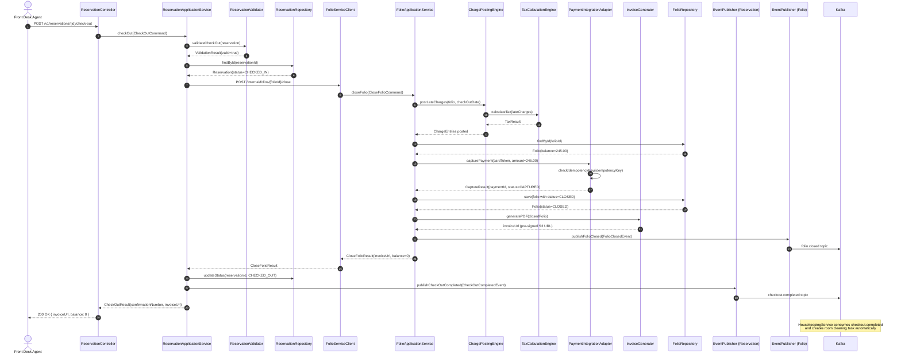

# Hotel Property Management System — Component Diagrams

## Table of Contents
1. [ReservationService Components](#reservationservice-components)
2. [FolioService Components](#folioservice-components)
3. [Inter-Service Communication](#inter-service-communication)
4. [Shared Libraries and Utilities](#shared-libraries-and-utilities)
5. [Checkout Sequence Diagram](#checkout-sequence-diagram)

---

## 1. ReservationService Components

The ReservationService is the core bounded context responsible for the full lifecycle of a hotel reservation — from availability inquiry and booking creation through check-in, modification, and check-out. It owns the canonical reservation state machine and exposes both synchronous REST endpoints and asynchronous event streams.

### 1.1 Component Overview Diagram

```mermaid
classDiagram
    class ReservationController {
        +createReservation(request: CreateReservationRequest) ReservationResponse
        +getReservation(reservationId: UUID) ReservationResponse
        +updateReservation(reservationId: UUID, request: UpdateReservationRequest) ReservationResponse
        +cancelReservation(reservationId: UUID, reason: String) void
        +checkIn(reservationId: UUID, request: CheckInRequest) CheckInResponse
        +checkOut(reservationId: UUID) CheckOutResponse
        +searchReservations(filter: ReservationFilter) PagedResponse~ReservationSummary~
        -authorizationFilter: AuthorizationFilter
        -rateLimiter: RateLimiter
    }

    class ReservationApplicationService {
        +createReservation(command: CreateReservationCommand) Reservation
        +modifyReservation(command: ModifyReservationCommand) Reservation
        +cancelReservation(command: CancelReservationCommand) void
        +performCheckIn(command: CheckInCommand) CheckInResult
        +performCheckOut(command: CheckOutCommand) CheckOutResult
        -availabilityEngine: AvailabilityEngine
        -ratePlanResolver: RatePlanResolver
        -reservationValidator: ReservationValidator
        -reservationRepository: ReservationRepository
        -eventPublisher: EventPublisher
        -folioServiceClient: FolioServiceClient
    }

    class AvailabilityEngine {
        +checkAvailability(query: AvailabilityQuery) AvailabilityResult
        +blockRooms(block: RoomBlock) BlockResult
        +releaseRooms(block: RoomBlock) void
        +getAvailableRoomTypes(propertyId: UUID, checkIn: LocalDate, checkOut: LocalDate) List~RoomTypeAvailability~
        -inventoryCache: InventoryCache
        -reservationRepository: ReservationRepository
        -restrictionRuleEngine: RestrictionRuleEngine
    }

    class RatePlanResolver {
        +resolveBestRate(query: RateQuery) ResolvedRate
        +resolveRatePlan(ratePlanCode: String, query: RateQuery) RatePlan
        +calculateStayTotal(ratePlan: RatePlan, stayDates: DateRange) StayPricing
        -ratePlanRepository: RatePlanRepository
        -promotionEngine: PromotionEngine
        -yieldManagementClient: YieldManagementClient
    }

    class ReservationRepository {
        +save(reservation: Reservation) Reservation
        +findById(reservationId: UUID) Optional~Reservation~
        +findByConfirmationNumber(confirmationNumber: String) Optional~Reservation~
        +findByGuestId(guestId: UUID, pageable: Pageable) Page~Reservation~
        +findByPropertyAndDateRange(propertyId: UUID, start: LocalDate, end: LocalDate) List~Reservation~
        +updateStatus(reservationId: UUID, status: ReservationStatus) void
        -dataSource: DataSource
        -reservationMapper: ReservationMapper
    }

    class InventoryCache {
        +getAvailableCount(propertyId: UUID, roomTypeId: UUID, date: LocalDate) Integer
        +decrementAvailability(propertyId: UUID, roomTypeId: UUID, date: LocalDate, count: Integer) void
        +incrementAvailability(propertyId: UUID, roomTypeId: UUID, date: LocalDate, count: Integer) void
        +invalidate(propertyId: UUID, date: LocalDate) void
        +warmUp(propertyId: UUID, dateRange: DateRange) void
        -redisTemplate: RedisTemplate
        -cacheKeyStrategy: CacheKeyStrategy
        -ttlSeconds: int
    }

    class OTABookingMapper {
        +mapFromOTAPayload(payload: OTAPayload, channelCode: String) CreateReservationCommand
        +mapToOTAConfirmation(reservation: Reservation, channelCode: String) OTAConfirmationPayload
        +validateOTASignature(payload: String, signature: String, secret: String) boolean
        -channelProfileRepository: ChannelProfileRepository
        -guestProfileMapper: GuestProfileMapper
        -roomTypeMappingRegistry: RoomTypeMappingRegistry
    }

    class EventPublisher {
        +publishReservationCreated(event: ReservationCreatedEvent) void
        +publishReservationModified(event: ReservationModifiedEvent) void
        +publishReservationCancelled(event: ReservationCancelledEvent) void
        +publishCheckInCompleted(event: CheckInCompletedEvent) void
        +publishCheckOutCompleted(event: CheckOutCompletedEvent) void
        -kafkaTemplate: KafkaTemplate
        -outboxRepository: OutboxRepository
        -serializationStrategy: EventSerializationStrategy
    }

    class ReservationValidator {
        +validateCreate(command: CreateReservationCommand) ValidationResult
        +validateModification(reservation: Reservation, command: ModifyReservationCommand) ValidationResult
        +validateCancellation(reservation: Reservation, command: CancelReservationCommand) ValidationResult
        +validateCheckIn(reservation: Reservation, request: CheckInRequest) ValidationResult
        -rules: List~BusinessRule~
        -propertyPolicyRepository: PropertyPolicyRepository
    }

    ReservationController --> ReservationApplicationService : delegates to
    ReservationApplicationService --> AvailabilityEngine : queries availability
    ReservationApplicationService --> RatePlanResolver : resolves pricing
    ReservationApplicationService --> ReservationValidator : validates commands
    ReservationApplicationService --> ReservationRepository : persists reservations
    ReservationApplicationService --> EventPublisher : publishes domain events
    AvailabilityEngine --> InventoryCache : reads/writes cache
    AvailabilityEngine --> ReservationRepository : fallback DB query
    OTABookingMapper --> ReservationApplicationService : maps and delegates
```

### 1.2 Component Responsibilities

#### ReservationController
**Responsibility:** HTTP boundary adapter. Translates HTTP requests into application commands/queries, enforces authentication (JWT validation), applies rate limiting, and translates domain responses back to HTTP response codes and JSON payloads.

**Interface:**
- Inbound: `POST /v1/reservations`, `GET /v1/reservations/{id}`, `PUT /v1/reservations/{id}`, `DELETE /v1/reservations/{id}`, `POST /v1/reservations/{id}/check-in`, `POST /v1/reservations/{id}/check-out`
- Outbound: Delegates commands to `ReservationApplicationService`

**Dependencies:** `ReservationApplicationService`, `AuthorizationFilter`, `RateLimiter`, `InputSanitizer`

**Patterns:** Adapter (Hexagonal), OpenAPI-driven contract

---

#### ReservationApplicationService
**Responsibility:** Orchestration layer. Coordinates the business flow for each use case (create, modify, cancel, check-in, check-out). Manages transaction boundaries, assembles domain objects, and ensures all domain invariants are satisfied before persistence.

**Interface:**
- Inbound: Command objects (`CreateReservationCommand`, `ModifyReservationCommand`, etc.)
- Outbound: Returns domain aggregates or result objects; publishes events

**Dependencies:** `AvailabilityEngine`, `RatePlanResolver`, `ReservationValidator`, `ReservationRepository`, `EventPublisher`, `FolioServiceClient`

**Patterns:** Application Service (DDD), Unit of Work, Command pattern

---

#### AvailabilityEngine
**Responsibility:** Determines real-time room availability by combining cached inventory counts with closed/open dates, minimum/maximum stay restrictions, and room block allocations. Applies restriction rules (e.g. closed-to-arrival, minimum-stay) before confirming availability.

**Interface:**
- Inbound: `AvailabilityQuery` (propertyId, roomTypeId, checkIn, checkOut, guestCount)
- Outbound: `AvailabilityResult` (available flag, remaining count, restriction messages)

**Dependencies:** `InventoryCache`, `ReservationRepository` (fallback), `RestrictionRuleEngine`

**Patterns:** Strategy (restriction rules), Template Method (cache-aside)

**Business Rules Applied:**
- BR-001: Minimum stay length enforcement
- BR-002: Closed-to-arrival / closed-to-departure date restrictions
- BR-003: Maximum advance booking window

---

#### RatePlanResolver
**Responsibility:** Determines the best applicable rate plan for a given guest, room type, stay dates, and channel. Calculates nightly rates, applies promotions, negotiated corporate rates, and packages. Produces a complete `StayPricing` breakdown per night.

**Interface:**
- Inbound: `RateQuery` (propertyId, roomTypeId, checkIn, checkOut, channelCode, ratePlanCode, guestProfile)
- Outbound: `ResolvedRate` (ratePlanCode, nightly breakdown, total, inclusions)

**Dependencies:** `RatePlanRepository`, `PromotionEngine`, `YieldManagementClient`

**Patterns:** Strategy (rate selection), Chain of Responsibility (rate precedence), Decorator (promotions layered on base rate)

---

#### ReservationRepository
**Responsibility:** Data access layer for the Reservation aggregate. Implements the Repository pattern over PostgreSQL. Handles optimistic locking via `version` field to prevent concurrent modification races.

**Interface:**
- Inbound: Domain aggregate objects and query parameters
- Outbound: Domain aggregates or `Optional<T>` wrappers

**Dependencies:** PostgreSQL DataSource, `ReservationMapper` (ORM mapping)

**Patterns:** Repository (DDD), Optimistic Locking, Read-through projections for list queries

---

#### InventoryCache
**Responsibility:** Redis-backed read/write cache for per-night, per-room-type availability counts. Provides sub-millisecond availability reads during search traffic spikes. Uses atomic decrement operations to prevent double-booking race conditions. Cache entries expire after 24 hours with lazy warm-up on cache miss.

**Interface:**
- Inbound: `(propertyId, roomTypeId, date)` lookup key
- Outbound: Integer count or decrement/increment confirmation

**Dependencies:** Redis (via `RedisTemplate`), `CacheKeyStrategy`, Background warm-up scheduler

**Patterns:** Cache-aside, Atomic counter (DECRBY/INCRBY), TTL-based expiry

---

#### OTABookingMapper
**Responsibility:** Anti-corruption layer between OTA channel payloads (OTA/XML, channel manager JSON, GDS formats) and the internal domain model. Validates HMAC-SHA256 webhook signatures, maps external room type codes and rate plan codes to internal identifiers using channel-specific mapping tables.

**Interface:**
- Inbound: Raw OTA payload string + channel code + HMAC signature header
- Outbound: `CreateReservationCommand` in canonical domain format

**Dependencies:** `ChannelProfileRepository`, `GuestProfileMapper`, `RoomTypeMappingRegistry`

**Patterns:** Anti-Corruption Layer (DDD), Mapper, Strategy (per-channel mapping)

---

#### EventPublisher
**Responsibility:** Publishes domain events to Kafka topics using the Transactional Outbox pattern to guarantee at-least-once delivery even during service failures. Events are first written to the `outbox` table within the same transaction as the domain change, then a background relay process polls and forwards to Kafka.

**Interface:**
- Inbound: Typed domain event objects
- Outbound: Kafka topics (`reservation.created`, `reservation.modified`, `reservation.cancelled`, `checkin.completed`, `checkout.completed`)

**Dependencies:** `KafkaTemplate`, `OutboxRepository`, `EventSerializationStrategy` (Avro/JSON)

**Patterns:** Transactional Outbox, Publisher-Subscriber, Event Sourcing (event log as audit trail)

---

#### ReservationValidator
**Responsibility:** Enforces business rule validation before any state-mutating command is executed. Rules are loaded from property policy configuration and can be extended without modifying the orchestration service.

**Interface:**
- Inbound: Command object + current domain state
- Outbound: `ValidationResult` (valid flag + list of `ValidationError`)

**Dependencies:** `PropertyPolicyRepository`, pluggable `BusinessRule` implementations

**Business Rules Enforced:**
- **BR-001 – Minimum Stay:** Rejects reservations where `checkOut - checkIn < minimumStayNights` for the given room type and date range.
- **BR-002 – Advance Booking Window:** Rejects reservations where booking date is beyond the maximum booking horizon (configurable per property, default 540 days).
- **BR-003 – Guarantee Policy:** Enforces that a valid credit card or deposit is captured for reservations within the cancellation penalty window.

**Patterns:** Chain of Responsibility (ordered rule chain), Specification pattern

---

## 2. FolioService Components

The FolioService owns the financial ledger for each guest stay. It receives charge posting commands from downstream services (POS, Spa, Parking), runs the nightly audit batch, handles payment collection, and generates VAT-compliant invoices.

### 2.1 Component Overview Diagram

```mermaid
classDiagram
    class FolioController {
        +getFolio(folioId: UUID) FolioResponse
        +postCharge(folioId: UUID, request: PostChargeRequest) ChargeResponse
        +voidCharge(folioId: UUID, chargeId: UUID, reason: String) void
        +postPayment(folioId: UUID, request: PostPaymentRequest) PaymentResponse
        +closeFolio(folioId: UUID, request: CloseFolioRequest) CloseResult
        +getInvoice(folioId: UUID, format: InvoiceFormat) Resource
        -authFilter: AuthorizationFilter
    }

    class FolioApplicationService {
        +openFolio(command: OpenFolioCommand) Folio
        +postCharge(command: PostChargeCommand) ChargeEntry
        +voidCharge(command: VoidChargeCommand) void
        +applyPayment(command: ApplyPaymentCommand) PaymentEntry
        +closeFolio(command: CloseFolioCommand) ClosedFolio
        +runNightAudit(propertyId: UUID, auditDate: LocalDate) NightAuditResult
        -chargePostingEngine: ChargePostingEngine
        -taxCalculationEngine: TaxCalculationEngine
        -paymentIntegrationAdapter: PaymentIntegrationAdapter
        -invoiceGenerator: InvoiceGenerator
        -folioRepository: FolioRepository
        -eventPublisher: EventPublisher
    }

    class ChargePostingEngine {
        +postRoomCharge(folio: Folio, date: LocalDate, ratePlan: RatePlan) ChargeEntry
        +postDepartmentCharge(folio: Folio, charge: DepartmentCharge) ChargeEntry
        +postPackageCharge(folio: Folio, packageCharge: PackageCharge) List~ChargeEntry~
        +voidCharge(folio: Folio, chargeId: UUID, reason: String) VoidEntry
        +transferCharge(fromFolio: UUID, toFolio: UUID, chargeId: UUID) ChargeEntry
        -chargeCodeRepository: ChargeCodeRepository
        -taxCalculationEngine: TaxCalculationEngine
    }

    class TaxCalculationEngine {
        +calculateTax(charge: ChargeEntry, jurisdiction: TaxJurisdiction) TaxResult
        +applyExemptions(result: TaxResult, exemptions: List~TaxExemption~) TaxResult
        +recalculateFolioTax(folio: Folio) void
        -taxRuleRepository: TaxRuleRepository
        -exemptionRegistry: ExemptionRegistry
        -taxJurisdictionResolver: TaxJurisdictionResolver
    }

    class PaymentIntegrationAdapter {
        +authorizeCard(request: CardAuthorizationRequest) AuthorizationResult
        +capturePayment(authorizationId: String, amount: Money) CaptureResult
        +refundPayment(paymentId: String, amount: Money, reason: String) RefundResult
        +tokenizeCard(cardData: CardData) CardToken
        +voidAuthorization(authorizationId: String) void
        -gatewayClient: PaymentGatewayClient
        -circuitBreaker: CircuitBreaker
        -idempotencyKeyStore: IdempotencyKeyStore
    }

    class InvoiceGenerator {
        +generatePDF(folio: ClosedFolio, template: InvoiceTemplate) byte[]
        +generateXML(folio: ClosedFolio) String
        +emailInvoice(folio: ClosedFolio, recipientEmail: String) void
        -templateEngine: TemplateEngine
        -pdfRenderer: PDFRenderer
        -storageClient: StorageClient
    }

    class FolioRepository {
        +save(folio: Folio) Folio
        +findById(folioId: UUID) Optional~Folio~
        +findByReservationId(reservationId: UUID) Optional~Folio~
        +findOpenFoliosByProperty(propertyId: UUID) List~Folio~
        +findByStatusAndAuditDate(status: FolioStatus, auditDate: LocalDate) List~Folio~
        -dataSource: DataSource
    }

    class NightAuditProcessor {
        +runAudit(propertyId: UUID, auditDate: LocalDate) NightAuditResult
        +postRoomCharges(stayingReservations: List~Reservation~, auditDate: LocalDate) int
        +postNoShowCharges(noShowReservations: List~Reservation~, auditDate: LocalDate) int
        +rollForwardDate(propertyId: UUID) void
        +generateAuditReport(result: NightAuditResult) AuditReport
        -chargePostingEngine: ChargePostingEngine
        -reservationServiceClient: ReservationServiceClient
        -folioRepository: FolioRepository
    }

    class EventPublisher {
        +publishFolioOpened(event: FolioOpenedEvent) void
        +publishChargePo sted(event: ChargePostedEvent) void
        +publishPaymentApplied(event: PaymentAppliedEvent) void
        +publishFolioClosed(event: FolioClosedEvent) void
        +publishNightAuditCompleted(event: NightAuditCompletedEvent) void
        -kafkaTemplate: KafkaTemplate
        -outboxRepository: OutboxRepository
    }

    FolioController --> FolioApplicationService : delegates to
    FolioApplicationService --> ChargePostingEngine : posts charges
    FolioApplicationService --> TaxCalculationEngine : calculates tax
    FolioApplicationService --> PaymentIntegrationAdapter : processes payments
    FolioApplicationService --> InvoiceGenerator : generates invoices
    FolioApplicationService --> FolioRepository : persists folio state
    FolioApplicationService --> EventPublisher : publishes events
    ChargePostingEngine --> TaxCalculationEngine : requests tax calculation
    NightAuditProcessor --> ChargePostingEngine : batch charge posting
    NightAuditProcessor --> FolioRepository : reads open folios
```

### 2.2 Component Responsibilities

#### FolioController
**Responsibility:** HTTP boundary for all folio and billing operations. Validates JWT scopes (`revenue:write` for charge posting, `hotel:read` for folio retrieval), enforces idempotency key headers on charge and payment mutations, and streams PDF invoice responses directly from storage.

**Dependencies:** `FolioApplicationService`, `AuthorizationFilter`, `IdempotencyFilter`

---

#### FolioApplicationService
**Responsibility:** Orchestrates the folio lifecycle. Coordinates charge posting with tax calculation, delegates payment processing to the adapter, assembles the close-folio workflow (verify zero balance or collect settlement), and triggers invoice generation post-close.

**Patterns:** Application Service (DDD), Saga (for multi-step close-folio workflow)

---

#### ChargePostingEngine
**Responsibility:** Core financial ledger engine. Applies charge entries to a folio's running balance in real time. Handles charge codes (room rate, F&B, minibar, spa, parking, miscellaneous), voids, and inter-folio transfers. Automatically triggers tax calculation for each charge.

**Department charge codes follow USALI (Uniform System of Accounts for the Lodging Industry) classifications.**

**Dependencies:** `ChargeCodeRepository`, `TaxCalculationEngine`

---

#### TaxCalculationEngine
**Responsibility:** Multi-jurisdiction tax calculation supporting city tax, VAT/GST, occupancy tax, tourism levy, and service charges. Tax rules are loaded per property based on registered tax jurisdictions. Supports per-guest tax exemptions (e.g., diplomatic, government) with audit trail.

**Supported Jurisdictions (examples):** UK (20% VAT + city levy), EU countries, US state/city occupancy tax, UAE VAT.

**Dependencies:** `TaxRuleRepository`, `ExemptionRegistry`, `TaxJurisdictionResolver`

---

#### PaymentIntegrationAdapter
**Responsibility:** Abstracts all interactions with the payment gateway (Stripe, Adyen, or property-configured gateway). Implements idempotency via stored idempotency keys to prevent duplicate charges on retries. Uses a circuit breaker to fail fast during gateway outages and queue offline transactions for retry.

**PCI-DSS Consideration:** Raw card data is never persisted. The adapter calls the gateway's tokenization endpoint before any charge operations.

**Dependencies:** `PaymentGatewayClient` (HTTP), `CircuitBreaker` (Resilience4j), `IdempotencyKeyStore` (Redis)

---

#### InvoiceGenerator
**Responsibility:** Produces PDF and XML invoices from closed folios using Thymeleaf templates. Stores generated PDFs in object storage (S3-compatible) and returns a pre-signed URL. Supports multiple invoice templates (guest invoice, company invoice, group invoice). Automatically emails invoice to the guest's registered email address upon folio close.

**Dependencies:** Thymeleaf `TemplateEngine`, `PDFRenderer` (wkhtmltopdf/iText), `StorageClient` (S3)

---

#### FolioRepository
**Responsibility:** PostgreSQL persistence for Folio aggregates with full charge/payment line-item history. Implements append-only charge entry model (charges are never deleted, only voided with compensating entries) to preserve the complete audit trail.

---

#### NightAuditProcessor
**Responsibility:** Batch processor that runs once per property per business day (typically 11 PM–2 AM). Posts room charges for all in-house reservations, posts no-show charges for guaranteed no-shows, performs date roll-forward, and produces the nightly audit report.

**Trigger:** Scheduled via Quartz or triggered manually by front desk manager.

**Dependencies:** `ChargePostingEngine`, `ReservationServiceClient` (internal HTTP), `FolioRepository`

---

## 3. Inter-Service Communication

Services communicate via two channels:

### 3.1 Synchronous (REST over HTTP)
Internal service-to-service calls use HTTP/1.1 with mTLS over the service mesh (Istio). Calls are made using a typed `FeignClient` with Resilience4j circuit breakers and retry policies.

| Caller | Callee | Operation |
|---|---|---|
| ReservationService | FolioService | Open folio on check-in |
| ReservationService | FolioService | Close folio on check-out |
| ReservationService | RatePlanService | Fetch nightly rates |
| NightAuditProcessor | ReservationService | Fetch in-house reservations |
| HousekeepingService | ReservationService | Fetch departures / arrivals |

### 3.2 Asynchronous (Kafka Events)
Domain events are published to Kafka topics. Consumers are decoupled and can process events independently.

| Topic | Producer | Consumers |
|---|---|---|
| `reservation.created` | ReservationService | FolioService, NotificationService, HousekeepingService |
| `reservation.cancelled` | ReservationService | FolioService, NotificationService, ChannelManagerService |
| `checkin.completed` | ReservationService | HousekeepingService, NotificationService |
| `checkout.completed` | ReservationService | FolioService, HousekeepingService |
| `folio.charged` | FolioService | ReportingService |
| `folio.closed` | FolioService | AccountingService, ReportingService |
| `night_audit.completed` | FolioService | ReportingService, ChannelManagerService |

---

## 4. Shared Libraries and Utilities

### 4.1 `hpms-common-domain`
Shared value objects used across services: `Money`, `DateRange`, `Address`, `PersonName`, `PhoneNumber`, `EmailAddress`. These are immutable value objects with built-in validation and do not carry identity.

### 4.2 `hpms-security`
JWT parsing and validation utilities, scope enforcement annotations (`@RequiresScope("hotel:write")`), and HMAC-SHA256 signature verification helper for OTA webhooks.

### 4.3 `hpms-events`
Avro schemas and generated Java/TypeScript classes for all domain events published to Kafka. Version-controlled with backward-compatible evolution rules (new optional fields only).

### 4.4 `hpms-outbox`
Transactional outbox implementation (Spring component) that can be embedded in any service. Provides `OutboxRepository` and the background `OutboxRelayScheduler` that polls the outbox table and forwards pending events to Kafka.

### 4.5 `hpms-resilience`
Standardised Resilience4j configuration beans: circuit breaker with 50% failure threshold / 30s open window, retry with exponential backoff (3 attempts, 500ms–4s), bulkhead (thread pool isolation per downstream service).

---

## 5. Checkout Sequence Diagram

The following sequence diagram illustrates the collaboration between all components during a guest checkout initiated from the front desk UI.

