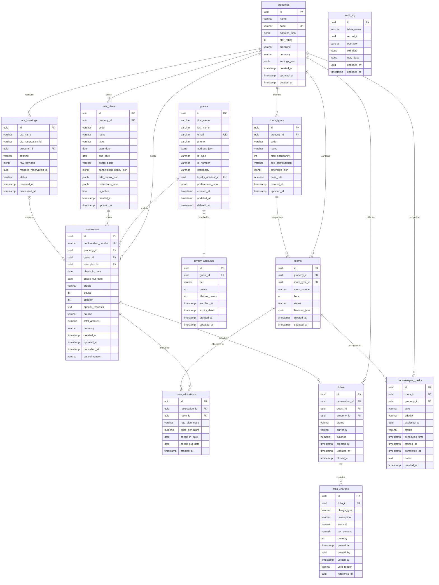

# Hotel Property Management System — Entity Relationship Diagram and Database Schema

## Schema Design Principles

The HPMS database schema is designed for operational correctness, auditability, and long-term
scalability across multi-property hotel chains. The following principles govern every design
decision in the schema.

**UUIDs as Primary Keys.** All tables use `UUID` primary keys generated by the application layer
(`gen_random_uuid()`). UUIDs eliminate the risk of ID enumeration attacks, decouple key generation
from the database, and support future data sharding across nodes. Composite natural keys (e.g.,
property code + confirmation sequence) are maintained as unique constraints on top of the UUID PK.

**JSONB for Flexible Attributes.** Fields that vary significantly between property configurations
— such as `address_json`, `settings_json`, `amenities_json`, `rate_matrix_json`, and `raw_payload`
— are stored as `JSONB`. PostgreSQL's JSONB type supports indexing on specific JSON paths
(`jsonb_path_ops` GIN index), partial document queries, and schema-less extension without
migrations when new property-specific settings are added.

**Soft Deletes with `deleted_at`.** Entities holding PII (`guests`) use a `deleted_at` timestamp
for soft deletion. Operational entities (`reservations`, `folios`) are never deleted; they are
cancelled or voided through status transitions. Hard deletes are forbidden in the application layer.

**Enum Types.** All status, type, and classification fields are modelled as PostgreSQL `ENUM`
types rather than unconstrained `VARCHAR` columns. ENUMs enforce valid values at the database
level, improve storage efficiency (stored as 4-byte integers internally), and self-document the
schema for new developers.

**Temporal Columns.** Every table carries `created_at` and `updated_at` timestamps maintained by
PostgreSQL triggers. Financial and operational tables additionally carry domain-specific temporal
fields (`cancelled_at`, `closed_at`, `checked_in_at`) to support time-series reporting without
joining to the audit log.

**Row-Level Audit Log.** A single `audit_log` table captures every `INSERT`, `UPDATE`, and
`DELETE` across all core tables via a generic trigger function. Old and new data are stored as
`JSONB` snapshots, enabling point-in-time reconstruction of any record. The audit log is
append-only — no application role has `UPDATE` or `DELETE` on `audit_log`.

**Partitioning for Scale.** High-volume tables (`reservations`, `folio_charges`) are partitioned
to keep individual partition sizes manageable as the property count and booking history grows.

---

## Entity Relationship Diagram



---

## Table Definitions

```sql
-- =============================================================================
-- ENUM TYPE DEFINITIONS
-- =============================================================================

CREATE TYPE room_status_enum AS ENUM (
    'AVAILABLE', 'OCCUPIED', 'DIRTY', 'CLEANING',
    'CLEAN', 'INSPECTED', 'OUT_OF_ORDER', 'MAINTENANCE'
);

CREATE TYPE reservation_status_enum AS ENUM (
    'INQUIRY', 'TENTATIVE', 'WAITLISTED', 'CONFIRMED',
    'CHECKED_IN', 'CHECKED_OUT', 'CANCELLED', 'NO_SHOW'
);

CREATE TYPE reservation_source_enum AS ENUM (
    'DIRECT_WEB', 'DIRECT_PHONE', 'OTA_BOOKING', 'OTA_EXPEDIA',
    'OTA_AGODA', 'OTA_MAKEMYTRIP', 'GDS_AMADEUS', 'GDS_SABRE',
    'WALK_IN', 'CORPORATE', 'GROUP'
);

CREATE TYPE folio_status_enum AS ENUM (
    'OPEN', 'PENDING_PAYMENT', 'PAID',
    'CLOSED', 'DISPUTED', 'ADJUSTED', 'VOIDED'
);

CREATE TYPE charge_type_enum AS ENUM (
    'ROOM_RATE', 'ROOM_TAX', 'CITY_TAX', 'SERVICE_CHARGE',
    'F_AND_B', 'MINIBAR', 'SPA', 'TELEPHONE',
    'LAUNDRY', 'PARKING', 'EARLY_CHECKIN_FEE',
    'LATE_CHECKOUT_FEE', 'CANCELLATION_FEE',
    'NO_SHOW_FEE', 'MISCELLANEOUS', 'CREDIT_ADJUSTMENT'
);

CREATE TYPE rate_plan_type_enum AS ENUM (
    'PUBLIC_RACK', 'BAR', 'CORPORATE', 'PACKAGE',
    'PROMOTIONAL', 'LOYALTY_MEMBER', 'WHOLESALE', 'OPAQUE'
);

CREATE TYPE board_basis_enum AS ENUM (
    'ROOM_ONLY', 'BED_AND_BREAKFAST', 'HALF_BOARD', 'FULL_BOARD', 'ALL_INCLUSIVE'
);

CREATE TYPE housekeeping_task_type_enum AS ENUM (
    'CHECKOUT_SERVICE', 'STAYOVER_SERVICE', 'TURNDOWN',
    'DEEP_CLEAN', 'INSPECTION', 'MAINTENANCE'
);

CREATE TYPE housekeeping_priority_enum AS ENUM (
    'LOW', 'NORMAL', 'HIGH', 'URGENT'
);

CREATE TYPE housekeeping_status_enum AS ENUM (
    'CREATED', 'ASSIGNED', 'IN_PROGRESS',
    'COMPLETED', 'VERIFIED', 'FAILED', 'ESCALATED'
);

CREATE TYPE ota_booking_status_enum AS ENUM (
    'RECEIVED', 'PROCESSING', 'PROCESSED',
    'REJECTED', 'DUPLICATE', 'FAILED'
);

CREATE TYPE loyalty_tier_enum AS ENUM (
    'STANDARD', 'SILVER', 'GOLD', 'PLATINUM'
);

CREATE TYPE id_type_enum AS ENUM (
    'PASSPORT', 'NATIONAL_ID', 'DRIVING_LICENSE', 'AADHAR', 'PAN', 'OTHER'
);

CREATE TYPE audit_operation_enum AS ENUM (
    'INSERT', 'UPDATE', 'DELETE'
);

-- =============================================================================
-- properties
-- =============================================================================

CREATE TABLE properties (
    id              UUID            PRIMARY KEY DEFAULT gen_random_uuid(),
    name            VARCHAR(255)    NOT NULL,
    code            VARCHAR(20)     NOT NULL,
    address_json    JSONB           NOT NULL,
    star_rating     SMALLINT        NOT NULL CHECK (star_rating BETWEEN 1 AND 5),
    timezone        VARCHAR(64)     NOT NULL,   -- IANA identifier e.g. 'Asia/Kolkata'
    currency        CHAR(3)         NOT NULL,   -- ISO 4217 e.g. 'INR', 'USD'
    contact_info    JSONB           NOT NULL DEFAULT '{}',
    settings_json   JSONB           NOT NULL DEFAULT '{}',
    created_at      TIMESTAMPTZ     NOT NULL DEFAULT NOW(),
    updated_at      TIMESTAMPTZ     NOT NULL DEFAULT NOW(),
    deleted_at      TIMESTAMPTZ,
    CONSTRAINT uq_properties_code UNIQUE (code)
);

COMMENT ON TABLE  properties                IS 'Master record for each hotel property in the chain.';
COMMENT ON COLUMN properties.code           IS 'Short alphanumeric identifier used in confirmation numbers and reports.';
COMMENT ON COLUMN properties.settings_json  IS 'Property-level operational config: checkInTime, checkOutTime, noShowDeadline, skipInspection, disputeWindowDays, etc.';

-- =============================================================================
-- room_types
-- =============================================================================

CREATE TABLE room_types (
    id                  UUID            PRIMARY KEY DEFAULT gen_random_uuid(),
    property_id         UUID            NOT NULL REFERENCES properties (id) ON DELETE RESTRICT,
    code                VARCHAR(20)     NOT NULL,   -- e.g. STD_DBL, JR_STE, PENT
    name                VARCHAR(100)    NOT NULL,
    max_occupancy       SMALLINT        NOT NULL CHECK (max_occupancy > 0),
    bed_configuration   JSONB           NOT NULL,
    amenities_json      JSONB           NOT NULL DEFAULT '[]',
    base_rate           NUMERIC(12, 2)  NOT NULL CHECK (base_rate >= 0),
    created_at          TIMESTAMPTZ     NOT NULL DEFAULT NOW(),
    updated_at          TIMESTAMPTZ     NOT NULL DEFAULT NOW(),
    CONSTRAINT uq_room_types_property_code UNIQUE (property_id, code)
);

COMMENT ON TABLE  room_types                    IS 'Category definitions for groups of physically similar rooms within a property.';
COMMENT ON COLUMN room_types.bed_configuration  IS 'JSON: {"primary":{"type":"KING","count":1},"extra":{"type":"SOFA","count":1}}';
COMMENT ON COLUMN room_types.amenities_json     IS 'Array of amenity codes: ["MINIBAR","JACUZZI","SMART_TV"]';

-- =============================================================================
-- rooms
-- =============================================================================

CREATE TABLE rooms (
    id              UUID                PRIMARY KEY DEFAULT gen_random_uuid(),
    property_id     UUID                NOT NULL REFERENCES properties (id) ON DELETE RESTRICT,
    room_type_id    UUID                NOT NULL REFERENCES room_types (id) ON DELETE RESTRICT,
    room_number     VARCHAR(10)         NOT NULL,
    floor           SMALLINT            NOT NULL,
    status          room_status_enum    NOT NULL DEFAULT 'AVAILABLE',
    features_json   JSONB               NOT NULL DEFAULT '[]',
    created_at      TIMESTAMPTZ         NOT NULL DEFAULT NOW(),
    updated_at      TIMESTAMPTZ         NOT NULL DEFAULT NOW(),
    CONSTRAINT uq_rooms_property_number UNIQUE (property_id, room_number)
);

COMMENT ON TABLE  rooms              IS 'Individual physical bookable units within a property.';
COMMENT ON COLUMN rooms.room_number  IS 'String to support alphanumeric numbering: G01, PH1, 101A.';
COMMENT ON COLUMN rooms.features_json IS 'Physical attributes: ["OCEAN_VIEW","BALCONY","ACCESSIBLE","CORNER_ROOM"].';

-- =============================================================================
-- guests
-- =============================================================================

CREATE TABLE guests (
    id                  UUID            PRIMARY KEY DEFAULT gen_random_uuid(),
    first_name          VARCHAR(100)    NOT NULL,
    last_name           VARCHAR(100)    NOT NULL,
    email               VARCHAR(255)    NOT NULL,
    phone               VARCHAR(30),
    address_json        JSONB           NOT NULL DEFAULT '{}',
    id_type             id_type_enum,
    id_number           TEXT,           -- stored encrypted at application layer
    nationality         CHAR(2),        -- ISO 3166-1 alpha-2
    loyalty_account_id  UUID            REFERENCES loyalty_accounts (id) ON DELETE SET NULL,
    preferences_json    JSONB           NOT NULL DEFAULT '{}',
    created_at          TIMESTAMPTZ     NOT NULL DEFAULT NOW(),
    updated_at          TIMESTAMPTZ     NOT NULL DEFAULT NOW(),
    deleted_at          TIMESTAMPTZ,    -- soft-delete for GDPR erasure
    CONSTRAINT uq_guests_email UNIQUE (email)
);

COMMENT ON TABLE  guests                IS 'Master profile record for each individual guest across all bookings.';
COMMENT ON COLUMN guests.id_number      IS 'Government ID number encrypted at rest using envelope encryption.';
COMMENT ON COLUMN guests.deleted_at     IS 'Soft delete for GDPR right-to-erasure: PII nulled, UUID and financial links preserved.';
COMMENT ON COLUMN guests.preferences_json IS 'Structured preferences: {"pillow":"SOFT","floor":"HIGH","dietary":["VEGAN"]}.';

-- =============================================================================
-- loyalty_accounts
-- NOTE: guests.loyalty_account_id FK references this table;
--       loyalty_accounts.guest_id FK references guests.
--       loyalty_accounts is created first; guests references it as nullable.
-- =============================================================================

CREATE TABLE loyalty_accounts (
    id                  UUID                PRIMARY KEY DEFAULT gen_random_uuid(),
    guest_id            UUID                NOT NULL UNIQUE REFERENCES guests (id) ON DELETE CASCADE,
    tier                loyalty_tier_enum   NOT NULL DEFAULT 'STANDARD',
    points              INTEGER             NOT NULL DEFAULT 0 CHECK (points >= 0),
    lifetime_points     INTEGER             NOT NULL DEFAULT 0 CHECK (lifetime_points >= 0),
    enrolled_at         TIMESTAMPTZ         NOT NULL DEFAULT NOW(),
    expiry_date         TIMESTAMPTZ,
    created_at          TIMESTAMPTZ         NOT NULL DEFAULT NOW(),
    updated_at          TIMESTAMPTZ         NOT NULL DEFAULT NOW()
);

COMMENT ON TABLE  loyalty_accounts              IS 'Rewards programme ledger accounts for enrolled guests.';
COMMENT ON COLUMN loyalty_accounts.points       IS 'Current redeemable points balance (may decrease on redemption or expiry).';
COMMENT ON COLUMN loyalty_accounts.lifetime_points IS 'Running total of all points ever earned; used for tier evaluation only; never decreases.';

-- =============================================================================
-- rate_plans
-- =============================================================================

CREATE TABLE rate_plans (
    id                          UUID                    PRIMARY KEY DEFAULT gen_random_uuid(),
    property_id                 UUID                    NOT NULL REFERENCES properties (id) ON DELETE RESTRICT,
    code                        VARCHAR(30)             NOT NULL,
    name                        VARCHAR(150)            NOT NULL,
    type                        rate_plan_type_enum     NOT NULL,
    start_date                  DATE                    NOT NULL,
    end_date                    DATE                    NOT NULL,
    board_basis                 board_basis_enum        NOT NULL DEFAULT 'ROOM_ONLY',
    cancellation_policy_json    JSONB                   NOT NULL DEFAULT '{}',
    rate_matrix_json            JSONB                   NOT NULL DEFAULT '{}',
    restrictions_json           JSONB                   NOT NULL DEFAULT '{}',
    is_active                   BOOLEAN                 NOT NULL DEFAULT TRUE,
    created_at                  TIMESTAMPTZ             NOT NULL DEFAULT NOW(),
    updated_at                  TIMESTAMPTZ             NOT NULL DEFAULT NOW(),
    CONSTRAINT uq_rate_plans_property_code UNIQUE (property_id, code),
    CONSTRAINT chk_rate_plans_dates CHECK (end_date >= start_date)
);

COMMENT ON TABLE  rate_plans                         IS 'Pricing configuration records for all booking channels and guest segments.';
COMMENT ON COLUMN rate_plans.rate_matrix_json        IS 'Nested JSON: {"STD_DBL":{"weekday":8500,"weekend":10500,"overrides":{"2024-12-31":15000}}}.';
COMMENT ON COLUMN rate_plans.restrictions_json       IS 'Availability rules: {"minStay":2,"maxStay":14,"closedToArrival":["SUNDAY"],"advancePurchase":7}.';
COMMENT ON COLUMN rate_plans.cancellation_policy_json IS 'Policy object: {"freeCancelHours":48,"penaltyType":"FIRST_NIGHT","nonRefundable":false}.';

-- =============================================================================
-- reservations  (range-partitioned by check_in_date for scalability)
-- =============================================================================

CREATE TABLE reservations (
    id                      UUID                        PRIMARY KEY DEFAULT gen_random_uuid(),
    confirmation_number     VARCHAR(30)                 NOT NULL,
    property_id             UUID                        NOT NULL REFERENCES properties (id) ON DELETE RESTRICT,
    guest_id                UUID                        NOT NULL REFERENCES guests (id) ON DELETE RESTRICT,
    rate_plan_id            UUID                        NOT NULL REFERENCES rate_plans (id) ON DELETE RESTRICT,
    check_in_date           DATE                        NOT NULL,
    check_out_date          DATE                        NOT NULL,
    status                  reservation_status_enum     NOT NULL DEFAULT 'INQUIRY',
    adults                  SMALLINT                    NOT NULL DEFAULT 1 CHECK (adults > 0),
    children                SMALLINT                    NOT NULL DEFAULT 0 CHECK (children >= 0),
    special_requests        TEXT,
    source                  reservation_source_enum     NOT NULL,
    total_amount            NUMERIC(12, 2),
    currency                CHAR(3)                     NOT NULL,
    created_at              TIMESTAMPTZ                 NOT NULL DEFAULT NOW(),
    updated_at              TIMESTAMPTZ                 NOT NULL DEFAULT NOW(),
    cancelled_at            TIMESTAMPTZ,
    cancel_reason           TEXT,
    CONSTRAINT uq_reservations_confirmation UNIQUE (confirmation_number),
    CONSTRAINT chk_reservations_dates       CHECK (check_out_date > check_in_date),
    CONSTRAINT chk_reservations_guests      CHECK (adults + children > 0)
) PARTITION BY RANGE (check_in_date);

COMMENT ON TABLE  reservations                     IS 'Central booking aggregate. Partitioned by check_in_date for long-term scalability.';
COMMENT ON COLUMN reservations.confirmation_number IS 'Human-readable unique booking reference: {PROP_CODE}-{YEAR}-{SEQ}.';
COMMENT ON COLUMN reservations.total_amount        IS 'Snapshotted total at confirmation time; not recalculated retroactively.';

-- =============================================================================
-- room_allocations
-- =============================================================================

CREATE TABLE room_allocations (
    id              UUID            PRIMARY KEY DEFAULT gen_random_uuid(),
    reservation_id  UUID            NOT NULL REFERENCES reservations (id) ON DELETE RESTRICT,
    room_id         UUID            NOT NULL REFERENCES rooms (id) ON DELETE RESTRICT,
    rate_plan_code  VARCHAR(30)     NOT NULL,
    price_per_night NUMERIC(12, 2)  NOT NULL CHECK (price_per_night >= 0),
    check_in_date   DATE            NOT NULL,
    check_out_date  DATE            NOT NULL,
    created_at      TIMESTAMPTZ     NOT NULL DEFAULT NOW(),
    CONSTRAINT chk_room_allocations_dates CHECK (check_out_date > check_in_date)
);

COMMENT ON TABLE  room_allocations                 IS 'Links a specific room to a reservation for a date range; one row per room per reservation.';
COMMENT ON COLUMN room_allocations.price_per_night IS 'Snapshot of the nightly rate at allocation time; immutable after creation.';
COMMENT ON COLUMN room_allocations.rate_plan_code  IS 'Denormalised from rate_plans.code to survive rate plan deactivation.';

-- =============================================================================
-- folios
-- =============================================================================

CREATE TABLE folios (
    id              UUID                PRIMARY KEY DEFAULT gen_random_uuid(),
    reservation_id  UUID                NOT NULL REFERENCES reservations (id) ON DELETE RESTRICT,
    guest_id        UUID                NOT NULL REFERENCES guests (id) ON DELETE RESTRICT,
    property_id     UUID                NOT NULL REFERENCES properties (id) ON DELETE RESTRICT,
    status          folio_status_enum   NOT NULL DEFAULT 'OPEN',
    currency        CHAR(3)             NOT NULL,
    balance         NUMERIC(12, 2)      NOT NULL DEFAULT 0.00,
    created_at      TIMESTAMPTZ         NOT NULL DEFAULT NOW(),
    updated_at      TIMESTAMPTZ         NOT NULL DEFAULT NOW(),
    closed_at       TIMESTAMPTZ
);

COMMENT ON TABLE  folios         IS 'Financial ledger account for a reservation; one primary folio per reservation, additional folios on split.';
COMMENT ON COLUMN folios.balance IS 'Derived: sum of non-voided charges - sum of payments. Maintained by application layer trigger.';

-- =============================================================================
-- folio_charges  (range-partitioned by posted_at for historical archiving)
-- =============================================================================

CREATE TABLE folio_charges (
    id              UUID                PRIMARY KEY DEFAULT gen_random_uuid(),
    folio_id        UUID                NOT NULL REFERENCES folios (id) ON DELETE RESTRICT,
    charge_type     charge_type_enum    NOT NULL,
    description     VARCHAR(255)        NOT NULL,
    amount          NUMERIC(12, 2)      NOT NULL,
    tax_amount      NUMERIC(12, 2)      NOT NULL DEFAULT 0.00,
    quantity        SMALLINT            NOT NULL DEFAULT 1 CHECK (quantity > 0),
    posted_at       TIMESTAMPTZ         NOT NULL DEFAULT NOW(),
    posted_by       UUID                NOT NULL,   -- staff member or system UUID
    voided_at       TIMESTAMPTZ,
    void_reason     TEXT,
    reference_id    UUID                            -- points to original charge for void/credit pairs
) PARTITION BY RANGE (posted_at);

COMMENT ON TABLE  folio_charges             IS 'Immutable financial event records. Corrections are void-and-repost. Partitioned by posted_at.';
COMMENT ON COLUMN folio_charges.amount      IS 'Base charge amount before tax.';
COMMENT ON COLUMN folio_charges.reference_id IS 'For CREDIT_ADJUSTMENT entries: UUID of the original folio_charge being compensated.';
COMMENT ON COLUMN folio_charges.voided_at   IS 'Non-NULL indicates logical deletion; physical row is never deleted.';

-- =============================================================================
-- housekeeping_tasks
-- =============================================================================

CREATE TABLE housekeeping_tasks (
    id              UUID                            PRIMARY KEY DEFAULT gen_random_uuid(),
    room_id         UUID                            NOT NULL REFERENCES rooms (id) ON DELETE RESTRICT,
    property_id     UUID                            NOT NULL REFERENCES properties (id) ON DELETE RESTRICT,
    type            housekeeping_task_type_enum     NOT NULL,
    priority        housekeeping_priority_enum      NOT NULL DEFAULT 'NORMAL',
    assigned_to     UUID,                           -- references staff member UUID (external HR module)
    status          housekeeping_status_enum        NOT NULL DEFAULT 'CREATED',
    scheduled_time  TIMESTAMPTZ,
    started_at      TIMESTAMPTZ,
    completed_at    TIMESTAMPTZ,
    notes           TEXT,
    created_at      TIMESTAMPTZ                     NOT NULL DEFAULT NOW()
);

COMMENT ON TABLE  housekeeping_tasks             IS 'Discrete cleaning, inspection, and maintenance work orders for rooms.';
COMMENT ON COLUMN housekeeping_tasks.assigned_to IS 'UUID of staff member from the HR/Staff module; nullable until assigned.';
COMMENT ON COLUMN housekeeping_tasks.notes       IS 'Required on task completion: attendant sign-off notes and quality observations.';

-- =============================================================================
-- ota_bookings
-- =============================================================================

CREATE TABLE ota_bookings (
    id                      UUID                        PRIMARY KEY DEFAULT gen_random_uuid(),
    ota_name                VARCHAR(50)                 NOT NULL,   -- e.g. 'BOOKING_COM', 'EXPEDIA'
    ota_reservation_id      VARCHAR(100)                NOT NULL,
    property_id             UUID                        NOT NULL REFERENCES properties (id) ON DELETE RESTRICT,
    channel                 VARCHAR(50)                 NOT NULL,
    raw_payload             JSONB                       NOT NULL,
    mapped_reservation_id   UUID,                       -- NULL until processed
    status                  ota_booking_status_enum     NOT NULL DEFAULT 'RECEIVED',
    received_at             TIMESTAMPTZ                 NOT NULL DEFAULT NOW(),
    processed_at            TIMESTAMPTZ,
    CONSTRAINT uq_ota_bookings_ota_ref UNIQUE (ota_name, ota_reservation_id)
);

COMMENT ON TABLE  ota_bookings                     IS 'Inbound booking messages from OTA channels. raw_payload enables full message replay.';
COMMENT ON COLUMN ota_bookings.ota_reservation_id  IS 'The OTA own booking reference; combined with ota_name for deduplication.';

-- =============================================================================
-- audit_log
-- =============================================================================

CREATE TABLE audit_log (
    id          UUID                    PRIMARY KEY DEFAULT gen_random_uuid(),
    table_name  VARCHAR(60)             NOT NULL,
    record_id   UUID                    NOT NULL,
    operation   audit_operation_enum    NOT NULL,
    old_data    JSONB,
    new_data    JSONB,
    changed_by  UUID,                   -- application user / service account UUID
    changed_at  TIMESTAMPTZ             NOT NULL DEFAULT NOW()
) PARTITION BY RANGE (changed_at);

COMMENT ON TABLE  audit_log            IS 'Append-only row-level change log for all core tables. Populated by trigger function.';
COMMENT ON COLUMN audit_log.old_data   IS 'Pre-change row snapshot as JSONB; NULL for INSERT operations.';
COMMENT ON COLUMN audit_log.new_data   IS 'Post-change row snapshot as JSONB; NULL for DELETE operations.';
COMMENT ON COLUMN audit_log.changed_by IS 'UUID of the application user who triggered the change; set via session variable.';
```

---

## Indexes

```sql
-- =============================================================================
-- properties
-- =============================================================================
CREATE INDEX idx_properties_code
    ON properties (code)
    WHERE deleted_at IS NULL;

-- =============================================================================
-- rooms
-- =============================================================================
CREATE INDEX idx_rooms_status_property
    ON rooms (property_id, status);

CREATE INDEX idx_rooms_room_type
    ON rooms (room_type_id);

CREATE INDEX idx_rooms_features
    ON rooms USING GIN (features_json jsonb_path_ops);

-- =============================================================================
-- reservations
-- =============================================================================
CREATE INDEX idx_reservations_status_property
    ON reservations (property_id, status);

CREATE INDEX idx_reservations_guest
    ON reservations (guest_id);

CREATE INDEX idx_reservations_check_in
    ON reservations (property_id, check_in_date)
    WHERE status NOT IN ('CANCELLED', 'NO_SHOW');

CREATE INDEX idx_reservations_check_out
    ON reservations (property_id, check_out_date)
    WHERE status = 'CHECKED_IN';

CREATE INDEX idx_reservations_confirmation
    ON reservations (confirmation_number);

-- =============================================================================
-- room_allocations
-- =============================================================================
CREATE INDEX idx_room_allocations_reservation
    ON room_allocations (reservation_id);

CREATE INDEX idx_room_allocations_room_dates
    ON room_allocations (room_id, check_in_date, check_out_date);

-- =============================================================================
-- folios
-- =============================================================================
CREATE INDEX idx_folios_reservation
    ON folios (reservation_id);

CREATE INDEX idx_folios_status_property
    ON folios (property_id, status)
    WHERE status IN ('OPEN', 'PENDING_PAYMENT', 'DISPUTED');

-- =============================================================================
-- folio_charges
-- =============================================================================
CREATE INDEX idx_folio_charges_folio
    ON folio_charges (folio_id);

CREATE INDEX idx_folio_charges_active
    ON folio_charges (folio_id, charge_type)
    WHERE voided_at IS NULL;

CREATE INDEX idx_folio_charges_posted_at
    ON folio_charges (posted_at);

-- =============================================================================
-- housekeeping_tasks
-- =============================================================================
CREATE INDEX idx_hk_tasks_status_assigned
    ON housekeeping_tasks (status, assigned_to)
    WHERE status IN ('ASSIGNED', 'IN_PROGRESS');

CREATE INDEX idx_hk_tasks_property_status
    ON housekeeping_tasks (property_id, status);

CREATE INDEX idx_hk_tasks_room
    ON housekeeping_tasks (room_id)
    WHERE status NOT IN ('VERIFIED');

-- =============================================================================
-- ota_bookings
-- =============================================================================
CREATE INDEX idx_ota_bookings_ota_ref
    ON ota_bookings (ota_name, ota_reservation_id);

CREATE INDEX idx_ota_bookings_property_status
    ON ota_bookings (property_id, status)
    WHERE status IN ('RECEIVED', 'PROCESSING', 'FAILED');

-- =============================================================================
-- guests
-- =============================================================================
CREATE INDEX idx_guests_email
    ON guests (email)
    WHERE deleted_at IS NULL;

CREATE INDEX idx_guests_loyalty
    ON guests (loyalty_account_id)
    WHERE loyalty_account_id IS NOT NULL;

-- =============================================================================
-- audit_log
-- =============================================================================
CREATE INDEX idx_audit_log_record
    ON audit_log (table_name, record_id);

CREATE INDEX idx_audit_log_changed_at
    ON audit_log (changed_at);
```

---

## Constraints and Triggers

```sql
-- =============================================================================
-- UPDATED_AT auto-maintenance trigger
-- =============================================================================

CREATE OR REPLACE FUNCTION fn_set_updated_at()
RETURNS TRIGGER
LANGUAGE plpgsql AS $$
BEGIN
    NEW.updated_at = NOW();
    RETURN NEW;
END;
$$;

-- Apply to every table that has updated_at
DO $$
DECLARE
    t TEXT;
BEGIN
    FOREACH t IN ARRAY ARRAY[
        'properties', 'room_types', 'rooms', 'guests',
        'loyalty_accounts', 'rate_plans', 'folios'
    ]
    LOOP
        EXECUTE format(
            'CREATE TRIGGER trg_%s_set_updated_at
             BEFORE UPDATE ON %I
             FOR EACH ROW EXECUTE FUNCTION fn_set_updated_at();',
            t, t
        );
    END LOOP;
END;
$$;

-- =============================================================================
-- Audit log trigger
-- =============================================================================

CREATE OR REPLACE FUNCTION fn_audit_log()
RETURNS TRIGGER
LANGUAGE plpgsql AS $$
DECLARE
    v_old   JSONB;
    v_new   JSONB;
    v_op    audit_operation_enum;
    v_actor UUID;
BEGIN
    -- Application layer sets this session variable before DML
    v_actor := NULLIF(current_setting('app.current_user_id', TRUE), '')::UUID;

    IF    TG_OP = 'INSERT' THEN v_op := 'INSERT'; v_old := NULL;       v_new := to_jsonb(NEW);
    ELSIF TG_OP = 'UPDATE' THEN v_op := 'UPDATE'; v_old := to_jsonb(OLD); v_new := to_jsonb(NEW);
    ELSIF TG_OP = 'DELETE' THEN v_op := 'DELETE'; v_old := to_jsonb(OLD); v_new := NULL;
    END IF;

    INSERT INTO audit_log (table_name, record_id, operation, old_data, new_data, changed_by)
    VALUES (TG_TABLE_NAME, COALESCE(NEW.id, OLD.id), v_op, v_old, v_new, v_actor);

    RETURN COALESCE(NEW, OLD);
END;
$$;

-- Apply audit trigger to all core tables
DO $$
DECLARE
    t TEXT;
BEGIN
    FOREACH t IN ARRAY ARRAY[
        'properties', 'room_types', 'rooms', 'guests',
        'loyalty_accounts', 'rate_plans', 'reservations',
        'room_allocations', 'folios', 'housekeeping_tasks', 'ota_bookings'
    ]
    LOOP
        EXECUTE format(
            'CREATE TRIGGER trg_%s_audit
             AFTER INSERT OR UPDATE OR DELETE ON %I
             FOR EACH ROW EXECUTE FUNCTION fn_audit_log();',
            t, t
        );
    END LOOP;
END;
$$;

-- =============================================================================
-- Folio balance recalculation trigger
-- =============================================================================

CREATE OR REPLACE FUNCTION fn_recalculate_folio_balance()
RETURNS TRIGGER
LANGUAGE plpgsql AS $$
DECLARE
    v_balance NUMERIC(12, 2);
BEGIN
    SELECT COALESCE(SUM((fc.amount + fc.tax_amount) * fc.quantity), 0.00)
    INTO   v_balance
    FROM   folio_charges fc
    WHERE  fc.folio_id    = COALESCE(NEW.folio_id, OLD.folio_id)
      AND  fc.voided_at   IS NULL;

    -- Subtract payments (stored in a separate payments table, referenced here via view)
    v_balance := v_balance - COALESCE(
        (SELECT SUM(p.amount)
         FROM   folio_payments p
         WHERE  p.folio_id = COALESCE(NEW.folio_id, OLD.folio_id)),
        0.00
    );

    UPDATE folios
    SET    balance = v_balance
    WHERE  id = COALESCE(NEW.folio_id, OLD.folio_id);

    RETURN COALESCE(NEW, OLD);
END;
$$;

CREATE TRIGGER trg_folio_charges_balance
    AFTER INSERT OR UPDATE OF voided_at OR DELETE ON folio_charges
    FOR EACH ROW EXECUTE FUNCTION fn_recalculate_folio_balance();

-- =============================================================================
-- Room status guard: prevent assignment of unavailable rooms
-- =============================================================================

CREATE OR REPLACE FUNCTION fn_validate_room_allocation()
RETURNS TRIGGER
LANGUAGE plpgsql AS $$
DECLARE
    v_status room_status_enum;
BEGIN
    SELECT status INTO v_status FROM rooms WHERE id = NEW.room_id;

    IF v_status NOT IN ('CLEAN', 'INSPECTED', 'AVAILABLE') THEN
        RAISE EXCEPTION
            'Room % has status % and cannot be allocated. Only CLEAN, INSPECTED, or AVAILABLE rooms may be assigned.',
            NEW.room_id, v_status;
    END IF;

    RETURN NEW;
END;
$$;

CREATE TRIGGER trg_room_allocation_guard
    BEFORE INSERT ON room_allocations
    FOR EACH ROW EXECUTE FUNCTION fn_validate_room_allocation();

-- =============================================================================
-- Prevent deletion from audit_log (append-only enforcement)
-- =============================================================================

CREATE OR REPLACE FUNCTION fn_deny_audit_log_delete()
RETURNS TRIGGER
LANGUAGE plpgsql AS $$
BEGIN
    RAISE EXCEPTION 'Deletion from audit_log is not permitted. audit_log is append-only.';
END;
$$;

CREATE TRIGGER trg_audit_log_no_delete
    BEFORE DELETE OR UPDATE ON audit_log
    FOR EACH ROW EXECUTE FUNCTION fn_deny_audit_log_delete();
```

---

## Partitioning Strategy

### Overview

Two high-volume tables, `reservations` and `folio_charges`, are range-partitioned. `audit_log`
is also partitioned to enable efficient archival of historical audit records. Partitioning keeps
query planner statistics accurate, allows targeted index rebuilds on individual partitions, and
makes it possible to archive or drop old data without a full table scan.

### Reservations — Partitioned by `check_in_date` (Annual)

Reservations are partitioned by calendar year of `check_in_date`. This aligns with the primary
access pattern: availability searches, occupancy reports, and the night audit all filter by date
ranges within the current or next year. Old partitions are detached and moved to cold storage
after two years (configurable per the retention policy).

```sql
-- Annual reservation partitions
CREATE TABLE reservations_2023
    PARTITION OF reservations
    FOR VALUES FROM ('2023-01-01') TO ('2024-01-01');

CREATE TABLE reservations_2024
    PARTITION OF reservations
    FOR VALUES FROM ('2024-01-01') TO ('2025-01-01');

CREATE TABLE reservations_2025
    PARTITION OF reservations
    FOR VALUES FROM ('2025-01-01') TO ('2026-01-01');

CREATE TABLE reservations_2026
    PARTITION OF reservations
    FOR VALUES FROM ('2026-01-01') TO ('2027-01-01');

-- Default catch-all partition for future years
CREATE TABLE reservations_future
    PARTITION OF reservations
    FOR VALUES FROM ('2027-01-01') TO (MAXVALUE);
```

### Folio Charges — Partitioned by `posted_at` (Quarterly)

Folio charges are partitioned quarterly because the posting volume is significantly higher than
reservations: a 200-room hotel generates approximately 400–600 charge rows per night (nightly
room rate + tax for each occupied room plus service charges). Quarterly partitions keep each
partition to a manageable 50,000–200,000 rows per property. The night audit query
`WHERE posted_at >= current_date AND posted_at < current_date + 1` hits only the current quarter's
partition.

```sql
-- Quarterly folio_charges partitions (2024 example)
CREATE TABLE folio_charges_2024_q1
    PARTITION OF folio_charges
    FOR VALUES FROM ('2024-01-01 00:00:00+00') TO ('2024-04-01 00:00:00+00');

CREATE TABLE folio_charges_2024_q2
    PARTITION OF folio_charges
    FOR VALUES FROM ('2024-04-01 00:00:00+00') TO ('2024-07-01 00:00:00+00');

CREATE TABLE folio_charges_2024_q3
    PARTITION OF folio_charges
    FOR VALUES FROM ('2024-07-01 00:00:00+00') TO ('2024-10-01 00:00:00+00');

CREATE TABLE folio_charges_2024_q4
    PARTITION OF folio_charges
    FOR VALUES FROM ('2024-10-01 00:00:00+00') TO ('2025-01-01 00:00:00+00');
```

### Audit Log — Partitioned by `changed_at` (Monthly)

The audit log grows at a rate proportional to all write operations across every core table. In a
multi-property deployment, this can generate millions of rows per month. Monthly partitions allow
older audit data to be archived to cold storage (e.g., AWS S3 via `pg_partman` and `pg_cron`)
after a configurable retention window (default: 24 months online, 7 years archived).

```sql
-- Monthly audit_log partitions (rolling window managed by pg_partman)
CREATE TABLE audit_log_2024_01
    PARTITION OF audit_log
    FOR VALUES FROM ('2024-01-01 00:00:00+00') TO ('2024-02-01 00:00:00+00');

CREATE TABLE audit_log_2024_02
    PARTITION OF audit_log
    FOR VALUES FROM ('2024-02-01 00:00:00+00') TO ('2024-03-01 00:00:00+00');

-- ... additional monthly partitions created automatically by pg_partman ...

-- Default partition for current and future months
CREATE TABLE audit_log_current
    PARTITION OF audit_log DEFAULT;
```

### Partition Maintenance Automation

New partitions are pre-created by a scheduled PostgreSQL job managed by `pg_partman`. The job
runs on the first day of each month and creates the partition for three months ahead (rolling
buffer). A separate archival job runs on the first day of each year and detaches partitions
older than the retention window, copies them to cold storage using `COPY TO` + S3 integration,
and drops the partition from the live database. The archival process is reversible: partitions
can be reattached from cold storage within minutes for regulatory audit requests.

```sql
-- pg_partman configuration for automated reservation partition management
SELECT partman.create_parent(
    p_parent_table   => 'public.reservations',
    p_control        => 'check_in_date',
    p_type           => 'range',
    p_interval       => '1 year',
    p_premake        => 2,      -- pre-create 2 future partitions
    p_start_partition => '2024-01-01'
);

-- pg_partman configuration for folio_charges (quarterly)
SELECT partman.create_parent(
    p_parent_table   => 'public.folio_charges',
    p_control        => 'posted_at',
    p_type           => 'range',
    p_interval       => '3 months',
    p_premake        => 2,
    p_start_partition => '2024-01-01'
);
```

### Sub-Partitioning for Large Multi-Property Chains

For chains with 100+ properties generating very high booking volumes, `reservations` can be
sub-partitioned by `property_id` using list partitioning within each annual range partition.
This co-locates all reservation data for a given property within a single sub-partition, enabling
property-scoped queries (the most common access pattern) to target a single physical partition
with no cross-partition scan overhead.

```sql
-- Example: sub-partition reservations_2025 by property (list of property UUIDs)
-- Applied only when a single property's annual reservation count exceeds 100,000 rows
ALTER TABLE reservations_2025
    PARTITION BY LIST (property_id);

CREATE TABLE reservations_2025_property_blr01
    PARTITION OF reservations_2025
    FOR VALUES IN ('a1b2c3d4-e5f6-7890-abcd-ef1234567890');
```
