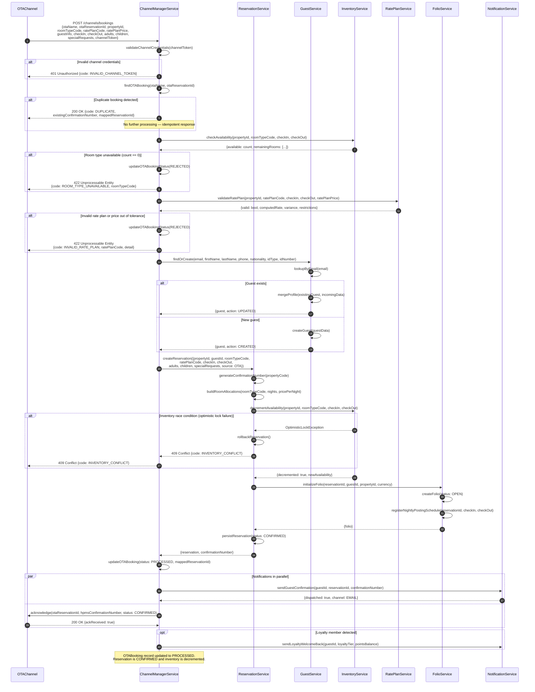
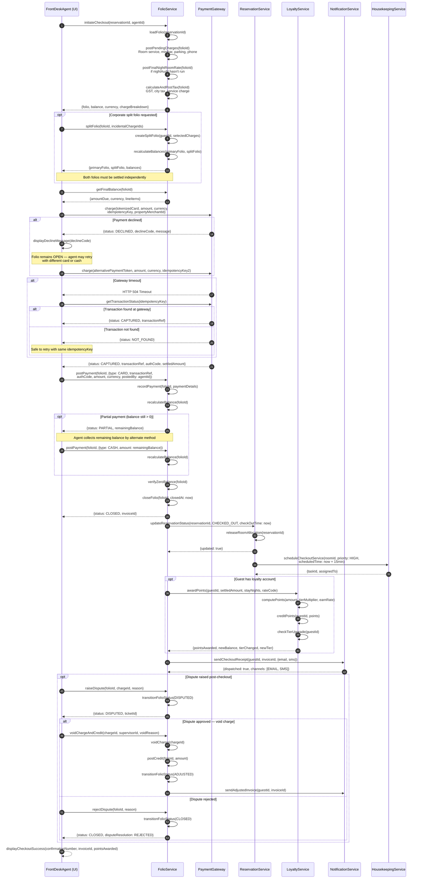
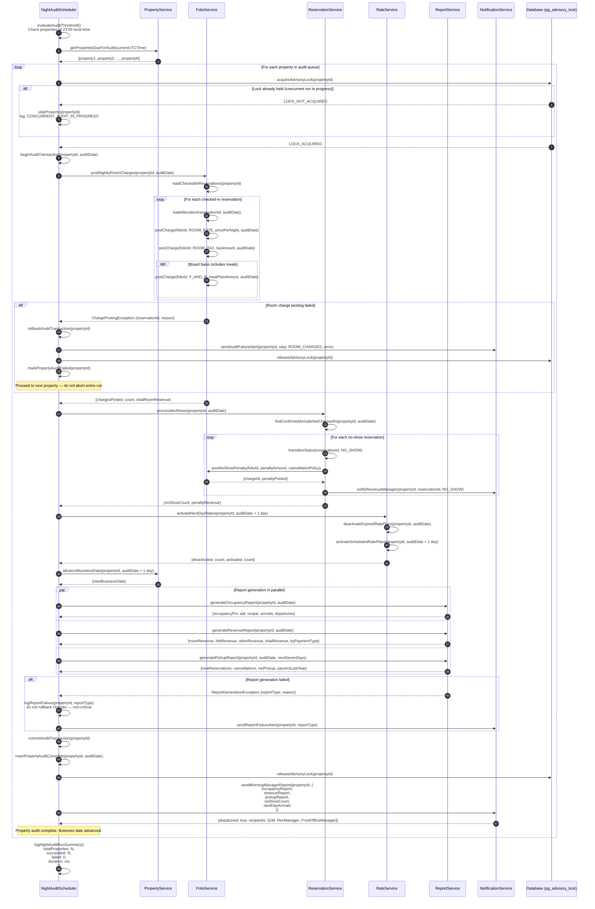

# Hotel Property Management System — Detailed Sequence Diagrams

This document describes the three most operationally critical workflows in the Hotel Property
Management System using detailed sequence diagrams. Each section opens with a thorough prose
description covering the full happy path, all identified error cases, and the business rules
that govern each decision point, followed by a complete Mermaid sequence diagram with
`alt`, `opt`, and `loop` blocks for branching logic.

---

## 1. OTA Booking Receipt

### Description

The OTA Booking Receipt workflow is triggered whenever a booking is submitted through an Online
Travel Agency (OTA) such as Booking.com, Expedia, Agoda, or MakeMyTrip. The message arrives at
the **ChannelManagerService** via a channel-specific adapter — either a real-time push (OTA API
webhook), a scheduled pull (OTA XML feed), or a direct API call from the OTA's connectivity layer.

**Step 1 — Channel authentication and deduplication.**  
The ChannelManagerService first validates the channel's API credentials (API key or OAuth token).
On success it constructs an `OTABooking` record and immediately checks for an existing record
matching the same `(otaName, otaReservationId)` pair. OTAs occasionally re-deliver the same
booking due to network timeouts or retry logic; without duplicate detection, the property would
end up double-booked and the guest would receive two confirmation emails.

**Step 2 — Availability verification.**  
`ReservationService` calls `InventoryService` to check the real-time available count for the
requested room type, property, and date range. Inventory is maintained as a count per
(property, room_type, date) cell and is decremented on each confirmed reservation. If the count
is zero, the booking is rejected immediately with a `ROOM_TYPE_UNAVAILABLE` error code so the
OTA can present alternative dates or room types to the guest.

**Step 3 — Rate plan validation.**  
`RatePlanService` verifies that the rate plan code sent by the OTA is active for the requested
dates and property, that all minimum-stay and advance-purchase restrictions are satisfied, and
that the rate value in the OTA message is within the expected tolerance of the HPMS-computed rate
(to catch mapping or currency errors). If the rate plan is expired, restricted, or the price is
outside tolerance, the booking is rejected with `INVALID_RATE_PLAN`.

**Step 4 — Guest profile management.**  
`GuestService.findOrCreate()` searches for an existing guest profile by email address. If found,
the profile is updated with any new information provided in the OTA message (phone, nationality,
special requests). If not found, a new `Guest` record is created. This step ensures guest
history and loyalty membership are attached to every reservation regardless of booking source.

**Step 5 — Reservation and folio creation.**  
`ReservationService.createReservation()` generates the confirmation number, creates the
`Reservation` aggregate with `CONFIRMED` status, builds `RoomAllocation` records, and calls
`FolioService.initializeFolio()` to open the financial ledger. On folio initialisation, a
nightly room-rate posting schedule is registered for the night-audit process.

**Step 6 — Inventory decrement.**  
`InventoryService.decrementAvailability()` atomically decrements the availability count for each
night of the stay. This operation uses a database-level compare-and-swap to prevent race
conditions when two bookings for the same room type arrive simultaneously.

**Step 7 — Notifications.**  
`NotificationService` dispatches a booking confirmation email to the guest with the HPMS
confirmation number. The ChannelManagerService then acknowledges the booking back to the OTA
channel with both the OTA's reservation ID and the HPMS confirmation number, closing the
acknowledgement loop and preventing the OTA from retrying the delivery.

**Error cases:**
- **Duplicate booking:** An `OTABooking` with the same `(otaName, otaReservationId)` already
  exists. Return the existing HPMS confirmation number to the OTA and mark the incoming message
  as a duplicate without creating a new reservation.
- **Room type unavailable:** Availability count is zero or a pre-existing confirmed reservation
  occupies all rooms of that type. Reject with `422 ROOM_TYPE_UNAVAILABLE`.
- **Invalid rate plan:** Rate plan code is unknown, expired, restricted for the requested dates,
  or the OTA-quoted price is outside the acceptable variance threshold. Reject with
  `422 INVALID_RATE_PLAN`.
- **Guest creation failure:** Email format invalid or ID document validation fails. Reject with
  `400 INVALID_GUEST_DATA`.
- **Inventory race condition:** Two concurrent bookings attempt to decrement below zero. The
  second booking is rolled back and rejected with `409 INVENTORY_CONFLICT`.

---

## 2. Payment Processing at Checkout

### Description

The payment-at-checkout workflow begins when a front-desk agent initiates guest departure from the
Property Management System UI. This is the most financially sensitive workflow in the system; every
step carries strict validation rules and clear rollback semantics to protect both the guest and the
property.

**Step 1 — Finalise charges.**  
`FolioService.finalizeCharges()` performs a late-charge sweep: it posts any room service, minibar,
or parking charges that were recorded against the reservation but not yet formally posted to the
folio. It also triggers the final night's room rate posting if the checkout occurs before the
night-audit scheduler has run.

**Step 2 — Tax calculation.**  
`FolioService.calculateTax()` applies the property's tax configuration to all unprocessed charges:
GST/VAT at applicable slab rates, city tax (where applicable), tourism levy, and service charge.
Tax entries are posted as separate `FolioCharge` records with `chargeType = ROOM_TAX` or
`CITY_TAX`, keeping the base rate and the tax portion individually visible on the invoice.

**Step 3 — Optional folio split.**  
If the guest has a corporate agreement covering room and tax while personal incidentals are
self-paid, the front-desk agent selects the incidental charges and triggers `FolioService.split()`.
This creates a second folio, transfers the selected charges, and updates both folio balances. Both
folios must reach zero balance before the reservation can be checked out.

**Step 4 — Payment collection.**  
The front-desk agent presents the balance to the guest and selects the payment method. For card
payments, the UI sends the tokenised card reference (PCI-compliant token, never the raw PAN) and
the amount to `PaymentGateway.charge()`. The gateway returns a transaction reference and
authorisation code on success.

**Step 5 — Partial payment handling.**  
If the guest tenders less than the full balance (e.g., uses points for part of the bill), a
partial payment is posted. The remaining balance must be settled before `close()` is called.
Multiple payments of different types (cash + card) are supported on a single folio.

**Step 6 — Folio close and reservation update.**  
On full payment, `FolioService.close()` sets `status = CLOSED` and `closedAt` to the current
timestamp. `ReservationService.updateStatus(CHECKED_OUT)` transitions the reservation, triggers
room release, and schedules a `CHECKOUT_SERVICE` housekeeping task at `HIGH` priority.

**Step 7 — Loyalty points award.**  
`LoyaltyService.awardPoints()` calculates the points earned from the stay based on the total
settled amount, tier multiplier, and any promotional earn campaigns active during the stay period.
Points are credited to the `LoyaltyAccount` and an upgrade check is performed.

**Step 8 — Receipt delivery.**  
`NotificationService.sendReceipt()` dispatches a digital invoice via email and, if opted in, an
SMS summary to the guest. The invoice carries the property's GST/VAT registration number, a
sequential fiscal invoice number, and an itemised charge breakdown.

**Error cases:**
- **Payment decline:** The payment gateway returns a decline code. The folio remains `OPEN` for
  retry with an alternative payment method. An error message is surfaced to the front-desk agent.
- **Partial payment:** Posting partial payment leaves a non-zero balance. The folio stays `OPEN`
  until the residual is settled. Multiple payments are accumulated until balance reaches zero.
- **Folio dispute:** After checkout, the guest disputes a charge. The folio transitions to
  `DISPUTED`. A supervisor must review and either void the charge (posting a credit) or reject the
  dispute, then transition the folio back to `CLOSED` or `ADJUSTED`.
- **Gateway timeout:** If the payment gateway call times out, the system checks for a
  pending-transaction record at the gateway before either confirming or reversing. Idempotency
  keys prevent double-charging on retry.

---

## 3. Night Audit Process

### Description

The Night Audit is a scheduled batch process that runs once per hotel calendar day, typically at
23:59 in the property's local timezone. It is the backbone of hotel accounting: it posts nightly
room revenue, advances the business date, processes no-shows, activates next-day rate plans, and
generates the management reports that the General Manager reviews first thing each morning.

**Step 1 — Scheduler trigger.**  
`NightAuditScheduler` is a cron-driven service that queries `PropertyService` for all active
properties that have reached their audit time threshold based on their individual IANA timezones.
A property-level advisory lock (using `pg_advisory_lock` in PostgreSQL) prevents two concurrent
audit runs from executing for the same property.

**Step 2 — Nightly room rate posting.**  
For every reservation currently in `CHECKED_IN` status at the property, `FolioService` posts a
`ROOM_RATE` charge and a corresponding `ROOM_TAX` charge to the active folio. The charge amount
is taken from the `RoomAllocation.pricePerNight` snapshot — not recalculated from the live rate
plan — ensuring consistency with the confirmed booking price. If the property has a board-basis
inclusion (breakfast, half-board), the cost of those inclusions is also posted as a separate
`F_AND_B` charge.

**Step 3 — No-show processing.**  
`ReservationService.processNoShows()` identifies all reservations with `status = CONFIRMED` and
`checkInDate = auditDate` (today) where the guest did not check in before the property's
no-show processing deadline (configurable, default 22:00 local time). These reservations are
transitioned to `NO_SHOW` status. The applicable no-show penalty is calculated from the rate
plan's cancellation policy and posted as a `FolioCharge`. The folio is flagged for review and
a notification is sent to the revenue manager.

**Step 4 — Rate plan activation.**  
`RateService.activateNextDayRates(propertyId, nextDate)` evaluates all rate plans with a
`startDate` equal to `nextDate` and sets `isActive = true`. It simultaneously deactivates rate
plans whose `endDate` equals `auditDate` (today). This ensures that promotional rates, seasonal
rates, and event-based rates transition on the exact calendar day they are scheduled, without
requiring manual intervention.

**Step 5 — Report generation.**  
`ReportService` generates three standard nightly reports:
- **Occupancy Report:** Rooms occupied, rooms available, occupancy percentage, average daily rate
  (ADR), revenue per available room (RevPAR), and arrivals and departures count.
- **Revenue Report:** Breakdown of revenue by department (rooms, food and beverage, spa, other),
  payment method (cash, card, OTA), and rate plan type.
- **Pickup Report:** Reservations created in the prior 24 hours, cancellations in the prior 24
  hours, and the net booking pace versus the same period in the prior year.

**Step 6 — Rollback on failure.**  
If any step within a property's audit run fails, the entire audit transaction for that property
is rolled back to a clean state. The property is flagged with an `AUDIT_FAILED` status and a
critical alert is sent to the system administrator and the property's General Manager. The night
audit for other properties continues unaffected. Failed audits are retried after a configurable
back-off period, and the system can replay individual steps once the root cause is resolved.

**Step 7 — Completion notification.**  
Once all properties have completed their audit, the scheduler posts a summary to
`NotificationService`, which sends each property's management team a formatted morning report
containing the nightly KPIs, the no-show count, and the pickup metrics for the upcoming seven days.

**Business rules:**
- Night audit runs at most once per property per calendar day. A re-run flag must be explicitly
  set by a supervisor to trigger a second pass.
- Room rate posting uses the allocation snapshot price, never the live rate plan.
- No-show processing only applies to reservations that were CONFIRMED on arrival date and remain
  so past the no-show deadline; reservations that were cancelled before audit time are excluded.
- Rate plan activation is idempotent: running it twice produces the same result.
- Reports are generated after all charge postings are committed, ensuring figures are consistent.

